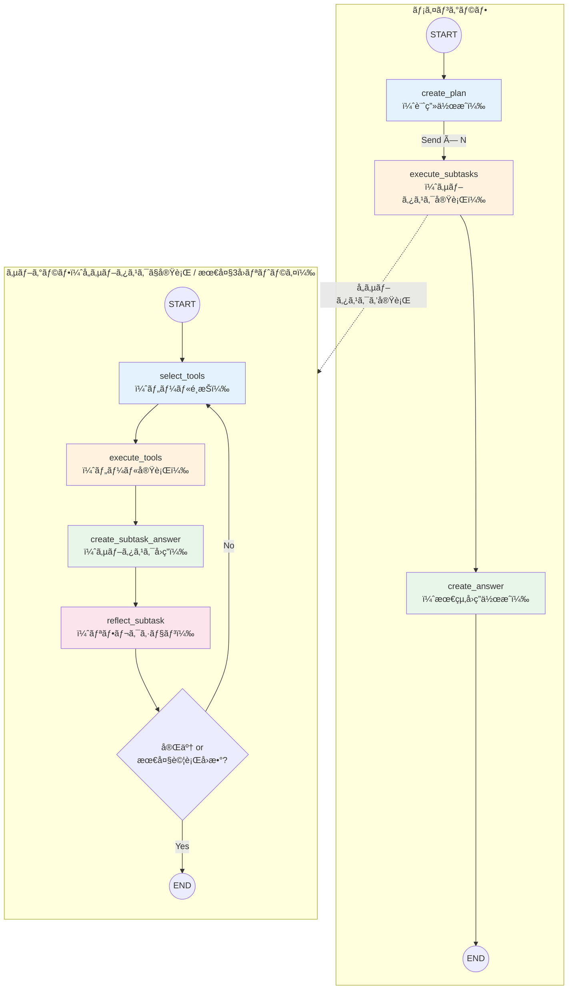
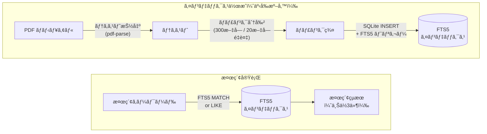
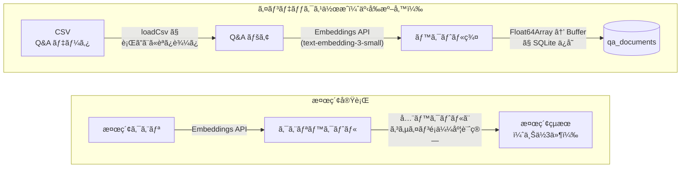
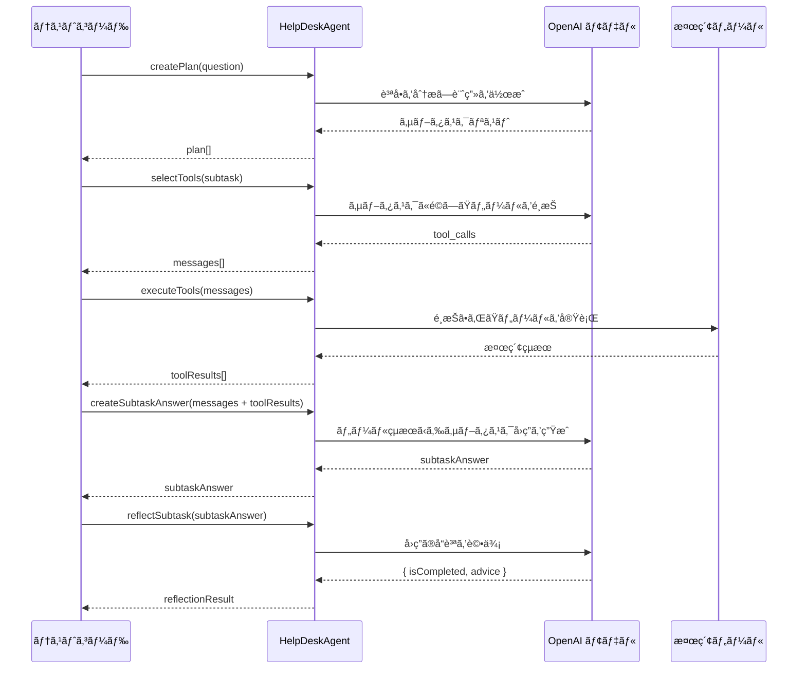
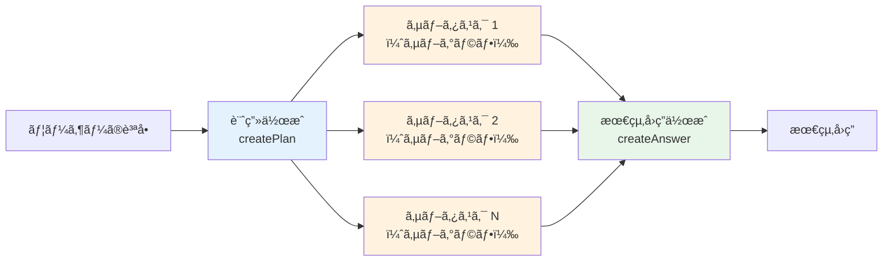
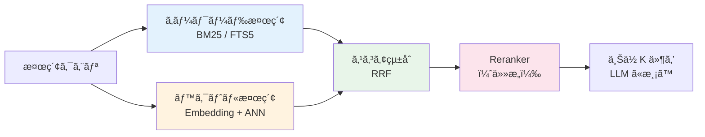

# Chapter 4: ヘルプデスク担当者を支æ´ã™ã‚‹AIエージェントã®å®Ÿè£…

ä¼æ¥­ã®ãƒ˜ãƒ«ãƒ—デスクã§ã¯ã€ãƒ¦ãƒ¼ã‚¶ãƒ¼ã‹ã‚‰ã®å•ã„åˆã‚ã›ã«å¯¾ã—ã¦ãƒãƒ‹ãƒ¥ã‚¢ãƒ«ã‚„éå»ã® QA 事例を調ã¹ãªãŒã‚‰å›ç­”を作æˆã™ã‚‹å¿…è¦ãŒã‚ã‚Šã¾ã™ã€‚ã“ã®ä½œæ¥­ã¯äººæ‰‹ã§è¡Œã†ã¨æ™‚é–“ãŒã‹ã‹ã‚‹ã†ãˆã€æ‹…当者ã®çŸ¥è­˜ã‚„経験ã«ã‚ˆã£ã¦å›ç­”å“質ã«ã°ã‚‰ã¤ããŒç”Ÿã˜ã¾ã™ã€‚

ã“ã®ç« ã§ã¯ã€Chapter 2 ã§å­¦ã‚“ã  AI エージェントã®æ§‹æˆè¦ç´ ï¼ˆè¨ˆç”»ãƒ»ãƒ„ール使用・リフレクション）ã¨ã€Chapter 3 ã§èº«ã«ã¤ã‘㟠LLM API ã®åŸºæœ¬æ“作を組ã¿åˆã‚ã›ã¦ã€ã“ã†ã—ãŸãƒ˜ãƒ«ãƒ—デスク業務を支æ´ã™ã‚‹**ヘルプデスクエージェント**を構築ã—ã¾ã™ã€‚

具体的ã«ã¯ã€æ¶ç©ºã®ã‚·ã‚¹ãƒ†ãƒ ã€ŒXYZ システムã€ã«é–¢ã™ã‚‹å•ã„åˆã‚ã›ã«å¯¾ã—ã€ãƒãƒ‹ãƒ¥ã‚¢ãƒ«ã‚„ QA データベースを検索ã—ãªãŒã‚‰è‡ªå‹•ã§å›ç­”を生æˆã™ã‚‹ã‚¨ãƒ¼ã‚¸ã‚§ãƒ³ãƒˆã‚’実装ã—ã¾ã™ã€‚ワークフローã®åˆ¶å¾¡ã«ã¯ **LangGraph**（LangChain ãŒæä¾›ã™ã‚‹ã‚°ãƒ©ãƒ•ãƒ™ãƒ¼ã‚¹ã®ãƒ¯ãƒ¼ã‚¯ãƒ•ãƒ­ãƒ¼ãƒ•ãƒ¬ãƒ¼ãƒ ãƒ¯ãƒ¼ã‚¯ï¼‰ã‚’使用ã—ã¾ã™ã€‚

:::note ã“ã®ç« ã§å­¦ã¶ã“ã¨

- **LangGraph** ã®ãƒ¡ã‚¤ãƒ³ã‚°ãƒ©ãƒ•ã¨ã‚µãƒ–グラフã«ã‚ˆã‚‹äºŒå±¤æ§‹é€ ã®ãƒ¯ãƒ¼ã‚¯ãƒ•ãƒ­ãƒ¼è¨­è¨ˆ
- **計画（Plan）→ ツールé¸æŠãƒ»å®Ÿè¡Œ → å›ç­”ç”Ÿæˆ â†’ リフレクション**ã®ã‚¨ãƒ¼ã‚¸ã‚§ãƒ³ãƒˆãƒ«ãƒ¼ãƒ—ã®å®Ÿè£…
- **Structured Outputs** を活用ã—ãŸè¨ˆç”»ç«‹æ¡ˆã¨ãƒªãƒ•ãƒ¬ã‚¯ã‚·ãƒ§ãƒ³çµæœã®æ§‹é€ åŒ–
- **Send** ã«ã‚ˆã‚‹ã‚µãƒ–タスクã®ä¸¦åˆ—実行
- エージェントã®å„ステップを個別ã«ãƒ†ã‚¹ãƒˆãƒ»ãƒ‡ãƒãƒƒã‚°ã™ã‚‹æ‰‹æ³•

:::

## 概è¦

### エージェントã®ã‚¢ãƒ¼ã‚­ãƒ†ã‚¯ãƒãƒ£

ã“ã®ãƒ˜ãƒ«ãƒ—デスクエージェントã¯ã€**メイングラフ**ã¨**サブグラフ**ã®äºŒå±¤æ§‹é€ ã§è¨­è¨ˆã•ã‚Œã¦ã„ã¾ã™ã€‚

ãªãœäºŒå±¤æ§‹é€ ã«ã™ã‚‹ã®ã§ã—ょã†ã‹ï¼Ÿãƒ¦ãƒ¼ã‚¶ãƒ¼ã®è³ªå•ã¯ã€ŒäºŒæ®µéšèªè¨¼ã®è¨­å®šæ–¹æ³•ã€ã¨ã€Œãƒãƒƒã‚¯ã‚¢ãƒƒãƒ—通知ã®ä¸å…·åˆã€ã®ã‚ˆã†ã«ã€è¤‡æ•°ã®ãƒˆãƒ”ックをå«ã‚€ã“ã¨ãŒã‚ã‚Šã¾ã™ã€‚ã“れらを 1 ã¤ã®ãƒ•ãƒ­ãƒ¼ã§é€æ¬¡å‡¦ç†ã™ã‚‹ã¨æ™‚é–“ãŒã‹ã‹ã‚Šã¾ã™ãŒã€ç‹¬ç«‹ã—ãŸã‚µãƒ–タスクã«åˆ†è§£ã—ã¦ã‚µãƒ–グラフã§**並列実行**ã™ã‚Œã°ã€å‡¦ç†æ™‚間を大幅ã«çŸ­ç¸®ã§ãã¾ã™ã€‚ã¾ãŸã€å„サブタスク内ã§ãƒªãƒ•ãƒ¬ã‚¯ã‚·ãƒ§ãƒ³ã«ã‚ˆã‚‹è‡ªå·±æ”¹å–„ループをå›ã™ã“ã¨ã§ã€å›ç­”å“質を高ã‚られã¾ã™ã€‚

具体的ã«ã¯ã€ãƒ¡ã‚¤ãƒ³ã‚°ãƒ©ãƒ•ã¯ãƒ¦ãƒ¼ã‚¶ãƒ¼ã®è³ªå•ã‚’å—ã‘å–ã‚Šã€è¨ˆç”»ã‚’ç«‹ã¦ã€ã‚µãƒ–タスクを並列実行ã—ã€æœ€çµ‚å›ç­”を生æˆã—ã¾ã™ã€‚å„サブタスクã¯ã‚µãƒ–グラフ内ã§ã€Œãƒ„ールé¸æŠ → 実行 → å›ç­” → リフレクションã€ã®ãƒ«ãƒ¼ãƒ—を最大 3 å›ã¾ã§ç¹°ã‚Šè¿”ã—ã¾ã™ã€‚


```mermaid
graph TB
    subgraph main["メイングラフ"]
        direction TB
        M_S((START)) --> plan["create_plan<br/>（計画作æˆï¼‰"] -->|"Send × N"| exec["execute_subtasks<br/>（サブタスク実行）"] --> ans["create_answer<br/>（最終å›ç­”作æˆï¼‰"] --> M_E((END))
    end

    exec -.->|å„サブタスクを実行| sub

    subgraph sub["サブグラフ（å„サブタスクã§å®Ÿè¡Œ / 最大3å›ãƒªãƒˆãƒ©ã‚¤ï¼‰"]
        direction TB
        S_S((START)) --> sel["select_tools<br/>（ツールé¸æŠï¼‰"] --> run["execute_tools<br/>（ツール実行）"] --> sa["create_subtask_answer<br/>（サブタスクå›ç­”）"] --> ref["reflect_subtask<br/>（リフレクション）"] --> chk{"完了 or<br/>最大試行å›æ•°?"}
        chk -- No --> sel
        chk -- Yes --> S_E((END))
    end

    style plan fill:#e3f2fd
    style exec fill:#fff3e0
    style ans fill:#e8f5e9
    style sel fill:#e3f2fd
    style run fill:#fff3e0
    style sa fill:#e8f5e9
    style ref fill:#fce4ec
```

### 学習ã®æµã‚Œ

| セクション | 内容 |
| --- | --- |
| 4-1 | XYZ ãƒãƒ‹ãƒ¥ã‚¢ãƒ«ã®å…¨æ–‡æ¤œç´¢ãƒ„ール（FTS5）を実装ã—ã€ã‚­ãƒ¼ãƒ¯ãƒ¼ãƒ‰æ¤œç´¢ã§ãƒãƒ‹ãƒ¥ã‚¢ãƒ«ã‹ã‚‰æƒ…報をå–å¾—ã§ãるよã†ã«ã™ã‚‹ |
| 4-2 | éå»ã® QA データをベクトル検索ã§ãるツール（Embedding + コサインé¡ä¼¼åº¦ï¼‰ã‚’実装ã™ã‚‹ |
| 4-3 | エージェントã®å„ステップ（計画・ツールé¸æŠãƒ»å®Ÿè¡Œãƒ»å›ç­”・リフレクション）を個別ã«å®Ÿè¡Œã—ã€å‹•ä½œã‚’確èªã™ã‚‹ |
| 4-4 | エージェント全体を `runAgent()` ã§ä¸€æ‹¬å®Ÿè¡Œã—ã€ãƒ¦ãƒ¼ã‚¶ãƒ¼ã®è³ªå•ã«å¯¾ã™ã‚‹æœ€çµ‚å›ç­”を生æˆã™ã‚‹ |

:::info å‰ææ¡ä»¶

- 環境変数 `OPENAI_API_KEY` ã« OpenAI ã® API キーãŒè¨­å®šã•ã‚Œã¦ã„ã‚‹ã“ã¨
- `@langchain/langgraph` パッケージãŒã‚¤ãƒ³ã‚¹ãƒˆãƒ¼ãƒ«ã•ã‚Œã¦ã„ã‚‹ã“ã¨ï¼ˆ`pnpm install` ã§è‡ªå‹•ã‚¤ãƒ³ã‚¹ãƒˆãƒ¼ãƒ«ï¼‰
- XYZ ãƒãƒ‹ãƒ¥ã‚¢ãƒ«æ¤œç´¢ãƒ»QA 検索用ã®ã‚¤ãƒ³ãƒ‡ãƒƒã‚¯ã‚¹ DB ãŒä½œæˆæ¸ˆã¿ã§ã‚ã‚‹ã“ã¨ï¼ˆ4-1ã€4-2 ã‚’å‚照）

:::

### サンプルコードã®å®Ÿè¡Œæ–¹æ³•

å„サンプルã¯ã€ãƒªãƒã‚¸ãƒˆãƒªã®ãƒ«ãƒ¼ãƒˆãƒ‡ã‚£ãƒ¬ã‚¯ãƒˆãƒªã‹ã‚‰ä»¥ä¸‹ã®ã‚³ãƒãƒ³ãƒ‰ã§å®Ÿè¡Œã§ãã¾ã™ã€‚

```bash
# ルートディレクトリã§å®Ÿè¡Œï¼ˆpnpm tsx 㯠@ai-suburi/core パッケージ内㧠tsx を実行ã™ã‚‹ã‚¨ã‚¤ãƒªã‚¢ã‚¹ï¼‰
pnpm tsx chapter4/test/<ファイルå>.ts
```

### エージェントã®æ§‹æˆãƒ•ã‚¡ã‚¤ãƒ«

ヘルプデスクエージェントã¯ã€ä»¥ä¸‹ã®ãƒ¢ã‚¸ãƒ¥ãƒ¼ãƒ«ã§æ§‹æˆã•ã‚Œã¦ã„ã¾ã™ã€‚

| ファイル | 役割 |
| --- | --- |
| `chapter4/agent.ts` | `HelpDeskAgent` クラス（メイングラフ・サブグラフã®å®šç¾©ã€å„ステップã®å®Ÿè£…） |
| `chapter4/models.ts` | å‹å®šç¾©ã¨ Zod スキーãƒï¼ˆ`Plan`ã€`ReflectionResult`ã€`ToolResult` ãªã©ï¼‰ |
| `chapter4/prompts.ts` | プロンプトテンプレート（計画・サブタスク実行・リフレクション・最終å›ç­”） |
| `chapter4/configs.ts` | 設定読ã¿è¾¼ã¿ï¼ˆOpenAI API キーã€ãƒ¢ãƒ‡ãƒ«å） |
| `chapter4/custom-logger.ts` | タイムスタンプ付ãカスタムロガー |
| `chapter4/tools/db.ts` | SQLite データベースã®åˆæœŸåŒ–（FTS5 インデックス・QA テーブルã®ä½œæˆï¼‰ |
| `chapter4/tools/search-xyz-manual/` | ãƒãƒ‹ãƒ¥ã‚¢ãƒ«å…¨æ–‡æ¤œç´¢ãƒ„ール（PDF → ãƒãƒ£ãƒ³ã‚¯åˆ†å‰² → FTS5 検索） |
| `chapter4/tools/search-xyz-qa/` | QA ベクトル検索ツール（CSV → Embedding → コサインé¡ä¼¼åº¦æ¤œç´¢ï¼‰ |

#### 設定ファイル (`configs.ts`)

環境変数ã‹ã‚‰ OpenAI API ã®è¨­å®šã‚’読ã¿è¾¼ã‚€ãƒ¢ã‚¸ãƒ¥ãƒ¼ãƒ«ã§ã™ã€‚`OPENAI_API_KEY` ã¯å¿…é ˆã§ã€è¨­å®šã•ã‚Œã¦ã„ãªã„å ´åˆã¯ã‚¨ãƒ©ãƒ¼ã‚’スローã—ã¾ã™ã€‚モデルåã¯ãƒ‡ãƒ•ã‚©ãƒ«ãƒˆã§ `gpt-4o` を使用ã—ã¾ã™ãŒã€`OPENAI_MODEL` 環境変数ã§å¤‰æ›´å¯èƒ½ã§ã™ã€‚

```typescript title="chapter4/configs.ts"
export interface Settings {
  openaiApiKey: string;
  openaiApiBase: string;
  openaiModel: string;
}

export function loadSettings(): Settings {
  const openaiApiKey = process.env.OPENAI_API_KEY;
  const openaiApiBase =
    process.env.OPENAI_API_BASE ?? 'https://api.openai.com/v1';
  const openaiModel = process.env.OPENAI_MODEL ?? 'gpt-4o';

  if (!openaiApiKey) {
    throw new Error('OPENAI_API_KEY environment variable is required');
  }

  return { openaiApiKey, openaiApiBase, openaiModel };
}
```

#### カスタムロガー (`custom-logger.ts`)

エージェントã®å„ステップãŒã©ã®é †åºã§å®Ÿè¡Œã•ã‚ŒãŸã‹ã‚’追跡ã™ã‚‹ãŸã‚ã€ISO 8601 タイムスタンプã¨ãƒ¢ã‚¸ãƒ¥ãƒ¼ãƒ«åを付加ã™ã‚‹ã‚·ãƒ³ãƒ—ルãªãƒ­ã‚¬ãƒ¼ã‚’用æ„ã—ã¦ã„ã¾ã™ã€‚ログレベル（`info` / `debug` / `error`）ã”ã¨ã«ãƒ¡ãƒƒã‚»ãƒ¼ã‚¸ã‚’フォーãƒãƒƒãƒˆã—ã€ãƒ‡ãƒãƒƒã‚°æ™‚ã«å‡¦ç†ã®æµã‚Œã‚’把æ¡ã—ã‚„ã™ãã—ã¾ã™ã€‚

```typescript title="chapter4/custom-logger.ts"
export interface Logger {
  info: (msg: string) => void;
  debug: (msg: string) => void;
  error: (msg: string) => void;
}

export function setupLogger(name: string): Logger {
  const formatMessage = (level: string, msg: string) => {
    const now = new Date().toISOString();
    return `${now} ${level} [${name}] ${msg}`;
  };

  return {
    info: (msg: string) => console.log(formatMessage('INFO', msg)),
    debug: (msg: string) => console.debug(formatMessage('DEBUG', msg)),
    error: (msg: string) => console.error(formatMessage('ERROR', msg)),
  };
}
```

#### å‹å®šç¾©ãƒ»ã‚¹ã‚­ãƒ¼ãƒ (`models.ts`)

エージェントã§ä½¿ç”¨ã™ã‚‹å‹ã¨ Zod スキーãƒã‚’定義ã—ã¾ã™ã€‚

OpenAI ã® **Structured Outputs** ã¯ã€LLM ã®å‡ºåŠ›ã‚’ JSON スキーãƒã«å¾“ã£ãŸæ§‹é€ åŒ–データã¨ã—ã¦å—ã‘å–る機能ã§ã™ã€‚通常ã®è‡ªç”±ãƒ†ã‚­ã‚¹ãƒˆå¿œç­”ã¨ç•°ãªã‚Šã€å‹å®‰å…¨ã«ãƒ¬ã‚¹ãƒãƒ³ã‚¹ã‚’扱ãˆã‚‹ãŸã‚ã€å¾Œç¶šã®å‡¦ç†ã§å®‰å®šã—ã¦å€¤ã‚’å–り出ã›ã¾ã™ã€‚

ã“ã“ã§ã¯ `planSchema`（計画ã®ã‚µãƒ–タスクリスト）㨠`reflectionResultSchema`（リフレクションçµæœã®å®Œäº†åˆ¤å®š + アドãƒã‚¤ã‚¹ï¼‰ã® 2 ã¤ã® Zod スキーãƒã‚’定義ã—ã¾ã™ã€‚ã“れらã®ã‚¹ã‚­ãƒ¼ãƒã¯ `zodResponseFormat` ヘルパー関数（OpenAI Node.js SDK ãŒæ供）を通ã˜ã¦ OpenAI API ã® `response_format` パラメータã«æ¸¡ã•ã‚Œã¾ã™ã€‚SDK ㌠Zod スキーãƒã‚’ JSON Schema ã«è‡ªå‹•å¤‰æ›ã—ã€API レスãƒãƒ³ã‚¹ã®ãƒ‘ースçµæœã‚’å‹ä»˜ãオブジェクトã¨ã—ã¦è¿”ã—ã¦ãã‚Œã¾ã™ã€‚

```typescript title="chapter4/models.ts"
import { z } from 'zod/v4';

/**
 * 検索çµæœã®å‹å®šç¾©
 */
export interface SearchOutput {
  fileName: string;
  content: string;
}

/**
 * 計画ã®Zodスキーãƒï¼ˆStructured Output用）
 */
export const planSchema = z.object({
  subtasks: z
    .array(z.string())
    .describe('å•é¡Œã‚’解決ã™ã‚‹ãŸã‚ã®ã‚µãƒ–タスクリスト'),
});

export type Plan = z.infer<typeof planSchema>;

/**
 * ツール実行çµæœ
 */
export interface ToolResult {
  toolName: string;
  args: string;
  results: SearchOutput[];
}

/**
 * リフレクションçµæœã®Zodスキーãƒï¼ˆStructured Output用）
 */
export const reflectionResultSchema = z.object({
  advice: z.string().describe(
    '評価ãŒNGã®å ´åˆã¯ã€åˆ¥ã®ãƒ„ールを試ã™ã€åˆ¥ã®æ–‡è¨€ã§ãƒ„ールを試ã™ãªã©ã€ãªãœNGãªã®ã‹ã¨ã©ã†ã—ãŸã‚‰æ”¹å–„ã§ãã‚‹ã‹ã‚’考ãˆã‚¢ãƒ‰ãƒã‚¤ã‚¹ã‚’作æˆã—ã¦ãã ã•ã„。' +
      'アドãƒã‚¤ã‚¹ã®å†…容ã¯éå»ã®ã‚¢ãƒ‰ãƒã‚¤ã‚¹ã¨è¨ˆç”»å†…ã®ä»–ã®ã‚µãƒ–タスクã¨é‡è¤‡ã—ãªã„よã†ã«ã—ã¦ãã ã•ã„。' +
      'アドãƒã‚¤ã‚¹ã®å†…容をもã¨ã«ãƒ„ールé¸æŠãƒ»å®Ÿè¡Œã‹ã‚‰ã‚„ã‚Šç›´ã—ã¾ã™ã€‚',
  ),
  isCompleted: z
    .boolean()
    .describe(
      'ツールã®å®Ÿè¡Œçµæœã¨å›ç­”ã‹ã‚‰ã€ã‚µãƒ–タスクã«å¯¾ã—ã¦æ­£ã—ãå›ç­”ã§ãã¦ã„ã‚‹ã‹ã®è©•ä¾¡çµæœ',
    ),
});

export type ReflectionResult = z.infer<typeof reflectionResultSchema>;

/**
 * サブタスクçµæœ
 */
export interface Subtask {
  taskName: string;
  toolResults: ToolResult[][];
  reflectionResults: ReflectionResult[];
  isCompleted: boolean;
  subtaskAnswer: string;
  challengeCount: number;
}

/**
 * エージェント実行çµæœ
 */
export interface AgentResult {
  question: string;
  plan: Plan;
  subtasks: Subtask[];
  answer: string;
}
```

#### プロンプトテンプレート (`prompts.ts`)

エージェントã®å„ステップã§ä½¿ç”¨ã™ã‚‹ãƒ—ロンプトを定義ã—ã¾ã™ã€‚プロンプトã¯ä»¥ä¸‹ã® 4 種é¡ã«åˆ†ã‹ã‚Œã¾ã™ã€‚

| プロンプト | 用途 |
| --- | --- |
| **Planner** | ユーザーã®è³ªå•ã‚’分æã—ã€é‡è¤‡ã®ãªã„最å°é™ã®ã‚µãƒ–タスクリストを作æˆã™ã‚‹ |
| **Subtask（ツール実行）** | サブタスクã«å¯¾ã—ã¦ãƒ„ールをé¸æŠãƒ»å®Ÿè¡Œã—ã€çµæœã‹ã‚‰å›ç­”を作æˆã™ã‚‹ |
| **Subtask（リフレクション）** | サブタスクå›ç­”ã®å“質を評価ã—ã€ä¸å分ãªã‚‰æ”¹å–„ã®ã‚¢ãƒ‰ãƒã‚¤ã‚¹ã‚’生æˆã™ã‚‹ |
| **最終å›ç­”** | 全サブタスクã®çµæœã‚’çµ±åˆã—ã€ãƒ¦ãƒ¼ã‚¶ãƒ¼å‘ã‘ã®ä¸å¯§ãªæœ€çµ‚å›ç­”を作æˆã™ã‚‹ |

`HelpDeskAgentPrompts` クラスã§ãƒ‡ãƒ•ã‚©ãƒ«ãƒˆå€¤ã‚’æŒã¡ã¤ã¤ã€ã‚³ãƒ³ã‚¹ãƒˆãƒ©ã‚¯ã‚¿ã§ã‚«ã‚¹ã‚¿ãƒã‚¤ã‚ºã‚‚å¯èƒ½ãªè¨­è¨ˆã§ã™ã€‚プロンプト内㮠`{question}` ã‚„ `{plan}` ã¯ãƒ—レースホルダーã§ã€å®Ÿè¡Œæ™‚ã«å®Ÿéš›ã®å€¤ã«ç½®æ›ã•ã‚Œã¾ã™ã€‚

```typescript title="chapter4/prompts.ts"
const PLANNER_SYSTEM_PROMPT = `
# 役割
ã‚ãªãŸã¯XYZã¨ã„ã†ã‚·ã‚¹ãƒ†ãƒ ã®ãƒ˜ãƒ«ãƒ—デスク担当者ã§ã™ã€‚
ユーザーã®è³ªå•ã«ç­”ãˆã‚‹ãŸã‚ã«ä»¥ä¸‹ã®æŒ‡ç¤ºã«å¾“ã£ã¦å›ç­”作æˆã®è¨ˆç”»ã‚’ç«‹ã¦ã¦ãã ã•ã„。

# 絶対ã«å®ˆã‚‹ã¹ã制約事項
- サブタスクã¯ã©ã‚“ãªå†…容ã«ã¤ã„ã¦çŸ¥ã‚ŠãŸã„ã®ã‹ã‚’具体的ã‹ã¤è©³ç´°ã«è¨˜è¿°ã™ã‚‹ã“ã¨
- サブタスクã¯åŒã˜å†…容を調査ã—ãªã„よã†ã«é‡è¤‡ãªã構æˆã™ã‚‹ã“ã¨
- å¿…è¦æœ€å°é™ã®ã‚µãƒ–タスクを作æˆã™ã‚‹ã“ã¨

# 例
質å•: Aã¨Bã®é•ã„ã«ã¤ã„ã¦æ•™ãˆã¦
計画:
- Aã¨ã¯ä½•ã‹ã«ã¤ã„ã¦èª¿ã¹ã‚‹
- Bã¨ã¯ä½•ã‹ã«ã¤ã„ã¦èª¿ã¹ã‚‹

`;

const PLANNER_USER_PROMPT = `
{question}
`;

const SUBTASK_SYSTEM_PROMPT = `
ã‚ãªãŸã¯XYZã¨ã„ã†ã‚·ã‚¹ãƒ†ãƒ ã®è³ªå•å¿œç­”ã®ãŸã‚ã«ã‚µãƒ–タスク実行を担当ã™ã‚‹ã‚¨ãƒ¼ã‚¸ã‚§ãƒ³ãƒˆã§ã™ã€‚
å›ç­”ã¾ã§ã®å…¨ä½“ã®æµã‚Œã¯è¨ˆç”»ç«‹æ¡ˆ → サブタスク実行 [ツール実行 → サブタスクå›ç­” → リフレクション] → 最終å›ç­”ã¨ãªã‚Šã¾ã™ã€‚
サブタスクã¯ãƒ¦ãƒ¼ã‚¶ãƒ¼ã®è³ªå•ã«å›ç­”ã™ã‚‹ãŸã‚ã«è€ƒãˆã‚‰ã‚ŒãŸè¨ˆç”»ã®ä¸€ã¤ã§ã™ã€‚
最終的ãªå›ç­”ã¯å…¨ã¦ã®ã‚µãƒ–タスクã®çµæœã‚’組ã¿åˆã‚ã›ã¦åˆ¥ã‚¨ãƒ¼ã‚¸ã‚§ãƒ³ãƒˆãŒä½œæˆã—ã¾ã™ã€‚
ã‚ãªãŸã¯ä»¥ä¸‹ã®1~3ã®ã‚¹ãƒ†ãƒƒãƒ—を指示ã«å¾“ã£ã¦ãã‚Œãれ実行ã—ã¾ã™ã€‚å„ステップã¯æŒ‡ç¤ºãŒã‚ã£ãŸã‚‰å®Ÿè¡Œã—ã€åŒæ™‚ã«è¤‡æ•°ã‚¹ãƒ†ãƒƒãƒ—ã®å®Ÿè¡Œã¯è¡Œã‚ãªã„ã§ãã ã•ã„。
ãªãŠãƒªãƒ•ãƒ¬ã‚¯ã‚·ãƒ§ãƒ³ã®çµæœæ¬¡ç¬¬ã§æ‰€å®šã®å›æ•°ã¾ã§ãƒ„ールé¸æŠãƒ»å®Ÿè¡Œã‚’ç¹°ã‚Šè¿”ã—ã¾ã™ã€‚

1. ツールé¸æŠãƒ»å®Ÿè¡Œ
サブタスクå›ç­”ã®ãŸã‚ã®ãƒ„ールé¸æŠã¨é¸æŠã•ã‚ŒãŸãƒ„ールã®å®Ÿè¡Œã‚’è¡Œã„ã¾ã™ã€‚
2å›ç›®ä»¥é™ã¯ãƒªãƒ•ãƒ¬ã‚¯ã‚·ãƒ§ãƒ³ã®ã‚¢ãƒ‰ãƒã‚¤ã‚¹ã«å¾“ã£ã¦å†å®Ÿè¡Œã—ã¦ãã ã•ã„。

2. サブタスクå›ç­”
ツールã®å®Ÿè¡Œçµæœã¯ã‚ãªãŸã—ã‹è¦³æ¸¬ã§ãã¾ã›ã‚“。
ツールã®å®Ÿè¡Œçµæœã‹ã‚‰å¾—られãŸå›ç­”ã«å¿…è¦ãªã“ã¨ã¯è¨€èªåŒ–ã—ã€æœ€å¾Œã®å›ç­”用エージェントã«å¼•ã継ã’るよã†ã«ã—ã¦ãã ã•ã„。
例ãˆã°ã€æ¦‚è¦ã‚’知るサブタスクãªã‚‰ã°ã€ãƒ„ールã®å®Ÿè¡Œçµæœã‹ã‚‰æ¦‚è¦ã‚’言èªåŒ–ã—ã¦ãã ã•ã„。
手順を知るサブタスクãªã‚‰ã°ã€ãƒ„ールã®å®Ÿè¡Œçµæœã‹ã‚‰æ‰‹é †ã‚’言èªåŒ–ã—ã¦ãã ã•ã„。
å›ç­”ã§ããªã‹ã£ãŸå ´åˆã¯ã€ãã®æ—¨ã‚’言èªåŒ–ã—ã¦ãã ã•ã„。

3. リフレクション
ツールã®å®Ÿè¡Œçµæœã¨å›ç­”ã‹ã‚‰ã€ã‚µãƒ–タスクã«å¯¾ã—ã¦æ­£ã—ãå›ç­”ã§ãã¦ã„ã‚‹ã‹ã‚’評価ã—ã¾ã™ã€‚
å›ç­”ãŒã‚ã‹ã‚‰ãªã„ã€æƒ…å ±ãŒè¦‹ã¤ã‹ã‚‰ãªã„ã¨ã„ã£ãŸå†…容ã®å ´åˆã¯è©•ä¾¡ã‚’NGã«ã—ã€ã‚„ã‚Šç›´ã™ã‚ˆã†ã«ã—ã¦ãã ã•ã„。
評価ãŒNGã®å ´åˆã¯ã€åˆ¥ã®ãƒ„ールを試ã™ã€åˆ¥ã®æ–‡è¨€ã§ãƒ„ールを試ã™ãªã©ã€ãªãœNGãªã®ã‹ã¨ã©ã†ã—ãŸã‚‰æ”¹å–„ã§ãã‚‹ã‹ã‚’考ãˆã‚¢ãƒ‰ãƒã‚¤ã‚¹ã‚’作æˆã—ã¦ãã ã•ã„。
アドãƒã‚¤ã‚¹ã®å†…容ã¯éå»ã®ã‚¢ãƒ‰ãƒã‚¤ã‚¹ã¨è¨ˆç”»å†…ã®ä»–ã®ã‚µãƒ–タスクã¨é‡è¤‡ã—ãªã„よã†ã«ã—ã¦ãã ã•ã„。
アドãƒã‚¤ã‚¹ã®å†…容をもã¨ã«ãƒ„ールé¸æŠãƒ»å®Ÿè¡Œã‹ã‚‰ã‚„ã‚Šç›´ã—ã¾ã™ã€‚
評価ãŒOKã®å ´åˆã¯ã€ã‚µãƒ–タスクå›ç­”を終了ã—ã¾ã™ã€‚

`;

const SUBTASK_TOOL_EXECUTION_USER_PROMPT = `
ユーザーã®å…ƒã®è³ªå•: {question}
å›ç­”ã®ãŸã‚ã®è¨ˆç”»: {plan}
サブタスク: {subtask}

サブタスク実行を開始ã—ã¾ã™ã€‚
1.ツールé¸æŠãƒ»å®Ÿè¡Œ, 2サブタスクå›ç­”を実行ã—ã¦ãã ã•ã„
`;

const SUBTASK_REFLECTION_USER_PROMPT = `
3.リフレクションを開始ã—ã¦ãã ã•ã„
`;

const SUBTASK_RETRY_ANSWER_USER_PROMPT = `
1.ツールé¸æŠãƒ»å®Ÿè¡Œã‚’リフレクションã®çµæœã«å¾“ã£ã¦ã‚„ã‚Šç›´ã—ã¦ãã ã•ã„
`;

const CREATE_LAST_ANSWER_SYSTEM_PROMPT = `
ã‚ãªãŸã¯XYZã¨ã„ã†ã‚·ã‚¹ãƒ†ãƒ ã®ãƒ˜ãƒ«ãƒ—デスクå›ç­”作æˆæ‹…当ã§ã™ã€‚
å›ç­”ã¾ã§ã®å…¨ä½“ã®æµã‚Œã¯è¨ˆç”»ç«‹æ¡ˆ → サブタスク実行 [ツール実行 → サブタスクå›ç­” → リフレクション] → 最終å›ç­”ã¨ãªã‚Šã¾ã™ã€‚
別エージェントãŒä½œæˆã—ãŸã‚µãƒ–タスクã®çµæœã‚’ã‚‚ã¨ã«å›ç­”を作æˆã—ã¦ãã ã•ã„。
å›ç­”を作æˆã™ã‚‹éš›ã¯å¿…ãšä»¥ä¸‹ã®æŒ‡ç¤ºã«å¾“ã£ã¦å›ç­”を作æˆã—ã¦ãã ã•ã„。

- å›ç­”ã¯å®Ÿéš›ã«è³ªå•è€…ãŒèª­ã‚€ã‚‚ã®ã§ã™ã€‚質å•è€…ã®æ„図やç†è§£åº¦ã‚’æ±²ã¿å–ã‚Šã€è³ªå•ã«å¯¾ã—ã¦ä¸å¯§ãªå›ç­”を作æˆã—ã¦ãã ã•ã„
- å›ç­”ã¯èã‹ã‚ŒãŸã“ã¨ã«å¯¾ã—ã¦ç°¡æ½”ã§æ˜ç¢ºã«ã™ã‚‹ã“ã¨ã‚’心ãŒã‘ã¦ãã ã•ã„
- ã‚ãªãŸãŒçŸ¥ã‚Šå¾—ãŸæƒ…å ±ã‹ã‚‰å›ç­”ã—ã€ä¸ç¢ºå®šãªæƒ…報やæ¨æ¸¬ã‚’å«ã‚ãªã„ã§ãã ã•ã„
- 調ã¹ãŸçµæœã‹ã‚‰å›ç­”ãŒã‚ã‹ã‚‰ãªã‹ã£ãŸå ´åˆã¯ã€ãã®æ—¨ã‚’ç´ ç›´ã«å›ç­”ã«å«ã‚ãŸä¸Šã§å¼•ã続ã調査ã™ã‚‹ã“ã¨ã‚’ä¼ãˆã¦ãã ã•ã„
- å›ç­”ã®ä¸­ã§è³ªå•è€…ã«å¯¾ã—ã¦åˆ¥ã®ãƒãƒ¼ãƒ ã«å•ã„åˆã‚ã›ã‚‹ã‚ˆã†ã«ä¿ƒã™ã“ã¨ã¯é¿ã‘ã¦ãã ã•ã„
`;

const CREATE_LAST_ANSWER_USER_PROMPT = `
ユーザーã®è³ªå•: {question}

å›ç­”ã®ãŸã‚ã®è¨ˆç”»ã¨å®Ÿè¡Œçµæœ: {subtask_results}

å›ç­”を作æˆã—ã¦ãã ã•ã„
`;

export class HelpDeskAgentPrompts {
  plannerSystemPrompt: string;
  plannerUserPrompt: string;
  subtaskSystemPrompt: string;
  subtaskToolSelectionUserPrompt: string;
  subtaskReflectionUserPrompt: string;
  subtaskRetryAnswerUserPrompt: string;
  createLastAnswerSystemPrompt: string;
  createLastAnswerUserPrompt: string;

  constructor(
    options: {
      plannerSystemPrompt?: string;
      plannerUserPrompt?: string;
      subtaskSystemPrompt?: string;
      subtaskToolSelectionUserPrompt?: string;
      subtaskReflectionUserPrompt?: string;
      subtaskRetryAnswerUserPrompt?: string;
      createLastAnswerSystemPrompt?: string;
      createLastAnswerUserPrompt?: string;
    } = {},
  ) {
    this.plannerSystemPrompt =
      options.plannerSystemPrompt ?? PLANNER_SYSTEM_PROMPT;
    this.plannerUserPrompt =
      options.plannerUserPrompt ?? PLANNER_USER_PROMPT;
    this.subtaskSystemPrompt =
      options.subtaskSystemPrompt ?? SUBTASK_SYSTEM_PROMPT;
    this.subtaskToolSelectionUserPrompt =
      options.subtaskToolSelectionUserPrompt ??
      SUBTASK_TOOL_EXECUTION_USER_PROMPT;
    this.subtaskReflectionUserPrompt =
      options.subtaskReflectionUserPrompt ?? SUBTASK_REFLECTION_USER_PROMPT;
    this.subtaskRetryAnswerUserPrompt =
      options.subtaskRetryAnswerUserPrompt ??
      SUBTASK_RETRY_ANSWER_USER_PROMPT;
    this.createLastAnswerSystemPrompt =
      options.createLastAnswerSystemPrompt ??
      CREATE_LAST_ANSWER_SYSTEM_PROMPT;
    this.createLastAnswerUserPrompt =
      options.createLastAnswerUserPrompt ?? CREATE_LAST_ANSWER_USER_PROMPT;
  }
}
```

#### HelpDeskAgent クラス (`agent.ts`)

エージェントã®ä¸­æ ¸ã¨ãªã‚‹ã‚¯ãƒ©ã‚¹ã§ã™ã€‚LangGraph ã® `StateGraph` を使ã£ã¦ã€ãƒ¡ã‚¤ãƒ³ã‚°ãƒ©ãƒ•ï¼ˆè¨ˆç”» → サブタスク並列実行 → 最終å›ç­”）ã¨ã‚µãƒ–グラフ（ツールé¸æŠ → 実行 → å›ç­” → リフレクション）を定義ã—ã¦ã„ã¾ã™ã€‚

ã“ã®ã‚³ãƒ¼ãƒ‰ã§ä½¿ã‚ã‚Œã¦ã„ã‚‹ LangGraph ã®ä¸»è¦ãªæ¦‚念を整ç†ã—ã¾ã™ã€‚

| 概念 | èª¬æ˜ |
| --- | --- |
| **`Annotation`** | グラフã®çŠ¶æ…‹ï¼ˆState）ã®å‹ã¨ãƒ‡ãƒ•ã‚©ãƒ«ãƒˆå€¤ã€æ›´æ–°ãƒ«ãƒ¼ãƒ«ï¼ˆreducer）を宣言的ã«å®šç¾©ã™ã‚‹ä»•çµ„ã¿ã§ã™ã€‚`reducer` を指定ã™ã‚‹ã¨ã€ãƒãƒ¼ãƒ‰ã®æˆ»ã‚Šå€¤ãŒæ—¢å­˜ã®çŠ¶æ…‹ã«ã©ã†ãƒãƒ¼ã‚¸ã•ã‚Œã‚‹ã‹ã‚’制御ã§ãã¾ã™ã€‚ãŸã¨ãˆã° `subtaskResults` ã® reducer `(a, b) => [...a, ...b]` ã¯ã€æ–°ã—ã„çµæœã‚’既存ã®é…列ã«è¿½è¨˜ã™ã‚‹å‹•ä½œã‚’定義ã—ã¦ã„ã¾ã™ |
| **`StateGraph`** | 状態をæŒã¤æœ‰å‘グラフを構築ã™ã‚‹ã‚¯ãƒ©ã‚¹ã§ã™ã€‚ãƒãƒ¼ãƒ‰ï¼ˆå‡¦ç†ã‚¹ãƒ†ãƒƒãƒ—）ã¨ã‚¨ãƒƒã‚¸ï¼ˆé·ç§»ï¼‰ã‚’ `addNode` / `addEdge` ã§å®£è¨€ã—ã€`compile()` ã§å®Ÿè¡Œå¯èƒ½ãªã‚°ãƒ©ãƒ•ã«å¤‰æ›ã—ã¾ã™ |
| **`Send`** | æ¡ä»¶ä»˜ãエッジã‹ã‚‰è¤‡æ•°ã®ãƒãƒ¼ãƒ‰ã‚¤ãƒ³ã‚¹ã‚¿ãƒ³ã‚¹ã‚’**å‹•çš„ã«ç”Ÿæˆãƒ»ä¸¦åˆ—実行**ã™ã‚‹ãŸã‚ã®ä»•çµ„ã¿ã§ã™ã€‚計画ã§ç”Ÿæˆã•ã‚ŒãŸã‚µãƒ–タスクã®æ•°ã ã‘ `Send` オブジェクトを返ã™ã“ã¨ã§ã€å„サブタスクãŒä¸¦åˆ—ã«å®Ÿè¡Œã•ã‚Œã¾ã™ |
| **`addConditionalEdges`** | ãƒãƒ¼ãƒ‰ã®å‡ºåŠ›ã«åŸºã¥ã„ã¦æ¬¡ã®é·ç§»å…ˆã‚’å‹•çš„ã«æ±ºå®šã™ã‚‹ã‚¨ãƒƒã‚¸ã§ã™ã€‚リフレクションçµæœã«å¿œã˜ã¦ã€Œãƒªãƒˆãƒ©ã‚¤ã€ã‹ã€Œçµ‚了ã€ã«åˆ†å²ã™ã‚‹åˆ¶å¾¡ãƒ•ãƒ­ãƒ¼ã§ä½¿ç”¨ã—ã¦ã„ã¾ã™ |
| **`convertToOpenAITool`** | `@langchain/core` ãŒæä¾›ã™ã‚‹ãƒ¦ãƒ¼ãƒ†ã‚£ãƒªãƒ†ã‚£ã§ã€LangChain ã®ãƒ„ール定義を OpenAI ã® Function Calling å½¢å¼ã«å¤‰æ›ã—ã¾ã™ã€‚`selectTools()` メソッド内ã§ãƒ„ール一覧を OpenAI API ã«æ¸¡ã™éš›ã«ä½¿ç”¨ã—ã¦ã„ã¾ã™ |

å„メソッドã¯çŠ¶æ…‹ï¼ˆState）をå—ã‘å–ã‚Šã€æ›´æ–°ã•ã‚ŒãŸçŠ¶æ…‹ã‚’è¿”ã™**純粋ãªå‡¦ç†ã‚¹ãƒ†ãƒƒãƒ—**ã¨ã—ã¦è¨­è¨ˆã•ã‚Œã¦ã„ã‚‹ãŸã‚ã€å€‹åˆ¥ã«ãƒ†ã‚¹ãƒˆãƒ»ãƒ‡ãƒãƒƒã‚°ãŒå¯èƒ½ã§ã™ï¼ˆè©³ã—ã㯠4-3 ã§ç¢ºèªã—ã¾ã™ï¼‰ã€‚

ãªãŠã€OpenAI API ã®å‘¼ã³å‡ºã—ã§ã¯ `temperature: 0` 㨠`seed: 0` を指定ã—ã¦ã„ã¾ã™ã€‚`temperature` ã¯ç”Ÿæˆãƒ†ã‚­ã‚¹ãƒˆã®ãƒ©ãƒ³ãƒ€ãƒ æ€§ã‚’制御ã™ã‚‹ãƒ‘ラメータã§ã€0 ã«è¨­å®šã™ã‚‹ã¨ãƒ¢ãƒ‡ãƒ«ãŒæœ€ã‚‚確ç‡ã®é«˜ã„トークンをé¸æŠã™ã‚‹ã‚ˆã†ã«ãªã‚Šã€å‡ºåŠ›ã®å†ç¾æ€§ãŒé«˜ã¾ã‚Šã¾ã™ã€‚`seed` ã¯ãƒ©ãƒ³ãƒ€ãƒ æ€§ã®ã‚·ãƒ¼ãƒ‰å€¤ã§ã€åŒã˜å€¤ã‚’指定ã™ã‚‹ã“ã¨ã§åŒä¸€å…¥åŠ›ã«å¯¾ã—ã¦å¯èƒ½ãªé™ã‚ŠåŒã˜å‡ºåŠ›ã‚’得られã¾ã™ï¼ˆãŸã ã—完全ãªä¸€è‡´ã¯ä¿è¨¼ã•ã‚Œã¾ã›ã‚“）。

```typescript title="chapter4/agent.ts"
import type { StructuredToolInterface } from '@langchain/core/tools';
import { convertToOpenAITool } from '@langchain/core/utils/function_calling';
import { Annotation, END, Send, START, StateGraph } from '@langchain/langgraph';
import OpenAI from 'openai';
import { zodResponseFormat } from 'openai/helpers/zod';
import type { ChatCompletionMessageParam } from 'openai/resources/chat/completions';

import type { Settings } from './configs.js';
import { setupLogger } from './custom-logger.js';
import {
  type AgentResult,
  planSchema,
  type ReflectionResult,
  reflectionResultSchema,
  type SearchOutput,
  type Subtask,
  type ToolResult,
} from './models.js';
import { HelpDeskAgentPrompts } from './prompts.js';

const MAX_CHALLENGE_COUNT = 3;

const logger = setupLogger('agent');

// メイングラフã®çŠ¶æ…‹å®šç¾©
const AgentStateAnnotation = Annotation.Root({
  question: Annotation<string>,
  plan: Annotation<string[]>,
  currentStep: Annotation<number>,
  subtaskResults: Annotation<Subtask[]>({
    reducer: (a: Subtask[], b: Subtask[]) => [...a, ...b],
    default: () => [],
  }),
  lastAnswer: Annotation<string>,
});

export type AgentState = typeof AgentStateAnnotation.State;

// サブグラフã®çŠ¶æ…‹å®šç¾©
const AgentSubGraphStateAnnotation = Annotation.Root({
  question: Annotation<string>,
  plan: Annotation<string[]>,
  subtask: Annotation<string>,
  isCompleted: Annotation<boolean>,
  messages: Annotation<ChatCompletionMessageParam[]>({
    // æ–°ã—ã„値ã§ä¸Šæ›¸ã（accumulateä¸è¦ã®ãŸã‚last write wins）
    reducer: (
      _old: ChatCompletionMessageParam[],
      newVal: ChatCompletionMessageParam[],
    ) => newVal,
    default: () => [],
  }),
  challengeCount: Annotation<number>,
  toolResults: Annotation<ToolResult[][]>({
    reducer: (a: ToolResult[][], b: ToolResult[][]) => [...a, ...b],
    default: () => [],
  }),
  reflectionResults: Annotation<ReflectionResult[]>({
    reducer: (a: ReflectionResult[], b: ReflectionResult[]) => [...a, ...b],
    default: () => [],
  }),
  subtaskAnswer: Annotation<string>,
});

export type AgentSubGraphState = typeof AgentSubGraphStateAnnotation.State;

export class HelpDeskAgent {
  private settings: Settings;
  private tools: StructuredToolInterface[];
  private toolMap: Map<string, StructuredToolInterface>;
  private prompts: HelpDeskAgentPrompts;
  private client: OpenAI;

  constructor(
    settings: Settings,
    tools: StructuredToolInterface[] = [],
    prompts: HelpDeskAgentPrompts = new HelpDeskAgentPrompts(),
  ) {
    this.settings = settings;
    this.tools = tools;
    this.toolMap = new Map(tools.map((tool) => [tool.name, tool]));
    this.prompts = prompts;
    this.client = new OpenAI({ apiKey: this.settings.openaiApiKey });
  }

  /**
   * 計画を作æˆã™ã‚‹
   */
  async createPlan(state: AgentState): Promise<{ plan: string[] }> {
    logger.info('🚀 Starting plan generation process...');

    const systemPrompt = this.prompts.plannerSystemPrompt;
    const userPrompt = this.prompts.plannerUserPrompt.replace(
      '{question}',
      state.question,
    );

    const messages: ChatCompletionMessageParam[] = [
      { role: 'system', content: systemPrompt },
      { role: 'user', content: userPrompt },
    ];
    logger.debug(`Final prompt messages: ${JSON.stringify(messages)}`);

    logger.info('Sending request to OpenAI...');
    const response = await this.client.chat.completions.parse({
      model: this.settings.openaiModel,
      messages,
      response_format: zodResponseFormat(planSchema, 'plan'),
      temperature: 0,
      seed: 0,
    });
    logger.info('✅ Successfully received response from OpenAI.');

    const plan = response.choices[0]?.message.parsed ?? { subtasks: [] };

    logger.info('Plan generation complete!');

    return { plan: plan.subtasks };
  }

  /**
   * ツールをé¸æŠã™ã‚‹
   */
  async selectTools(
    state: AgentSubGraphState,
  ): Promise<{ messages: ChatCompletionMessageParam[] }> {
    logger.info('🚀 Starting tool selection process...');

    // OpenAI対応ã®tool定義ã«å¤‰æ›
    logger.debug('Converting tools for OpenAI format...');
    const openaiTools = this.tools.map((tool) => convertToOpenAITool(tool));

    let messages: ChatCompletionMessageParam[];

    if (state.challengeCount === 0) {
      logger.debug('Creating user prompt for tool selection...');
      const userPrompt = this.prompts.subtaskToolSelectionUserPrompt
        .replace('{question}', state.question)
        .replace('{plan}', JSON.stringify(state.plan))
        .replace('{subtask}', state.subtask);

      messages = [
        { role: 'system', content: this.prompts.subtaskSystemPrompt },
        { role: 'user', content: userPrompt },
      ];
    } else {
      logger.debug('Creating user prompt for tool retry...');

      // リトライã•ã‚ŒãŸå ´åˆã¯éå»ã®å¯¾è©±æƒ…å ±ã«ãƒ—ロンプトを追加ã™ã‚‹
      // NOTE: トークン数節約ã®ãŸã‚éå»ã®æ¤œç´¢çµæœã¯é™¤ã
      // roleãŒtoolã¾ãŸã¯tool_callsã‚’æŒã¤ã‚‚ã®ã¯é™¤ã
      messages = state.messages.filter(
        (message) => message.role !== 'tool' || !('tool_calls' in message),
      );

      const userRetryPrompt = this.prompts.subtaskRetryAnswerUserPrompt;
      messages.push({ role: 'user', content: userRetryPrompt });
    }

    logger.info('Sending request to OpenAI...');
    const response = await this.client.chat.completions.create({
      model: this.settings.openaiModel,
      messages,
      tools: openaiTools,
      temperature: 0,
      seed: 0,
    });
    logger.info('✅ Successfully received response from OpenAI.');

    const selectChoice = response.choices[0];
    const toolCalls = selectChoice?.message.tool_calls;
    if (!toolCalls || toolCalls.length === 0) {
      // モデルãŒãƒ„ールを呼ã°ãšã«ãƒ†ã‚­ã‚¹ãƒˆã§å¿œç­”ã—ãŸå ´åˆ
      logger.info('No tool calls returned, using text response as fallback.');
      const textContent = selectChoice?.message.content ?? '';
      messages.push({ role: 'assistant', content: textContent });
      return { messages };
    }

    const aiMessage: ChatCompletionMessageParam = {
      role: 'assistant',
      tool_calls: toolCalls,
    };

    logger.info('Tool selection complete!');
    messages.push(aiMessage);

    return { messages };
  }

  /**
   * ツールを実行ã™ã‚‹
   */
  async executeTools(state: AgentSubGraphState): Promise<{
    messages: ChatCompletionMessageParam[];
    toolResults: ToolResult[][];
  }> {
    logger.info('🚀 Starting tool execution process...');
    const messages = [...state.messages];

    const lastMessage = messages[messages.length - 1];
    const toolCalls =
      lastMessage?.role === 'assistant' && 'tool_calls' in lastMessage
        ? lastMessage.tool_calls
        : null;

    if (!toolCalls || toolCalls.length === 0) {
      // selectToolsã§ãƒ„ールãŒé¸æŠã•ã‚Œãªã‹ã£ãŸå ´åˆã¯ã‚¹ã‚­ãƒƒãƒ—
      logger.info('No tool calls found, skipping tool execution.');
      return { messages, toolResults: [[]] };
    }

    const toolResults: ToolResult[] = [];

    for (const toolCall of toolCalls) {
      if (toolCall.type !== 'function') {
        continue;
      }
      const toolName: string = toolCall.function.name;
      const toolArgs: string = toolCall.function.arguments;

      const tool = this.toolMap.get(toolName);
      if (!tool) {
        throw new Error(`Tool not found: ${toolName}`);
      }
      const toolResult: SearchOutput[] = await tool.invoke(
        JSON.parse(toolArgs),
      );

      toolResults.push({
        toolName,
        args: toolArgs,
        results: toolResult,
      });

      messages.push({
        role: 'tool',
        content: JSON.stringify(toolResult),
        tool_call_id: toolCall.id,
      });
    }
    logger.info('Tool execution complete!');
    return { messages, toolResults: [toolResults] };
  }

  /**
   * サブタスクå›ç­”を作æˆã™ã‚‹
   */
  async createSubtaskAnswer(state: AgentSubGraphState): Promise<{
    messages: ChatCompletionMessageParam[];
    subtaskAnswer: string;
  }> {
    logger.info('🚀 Starting subtask answer creation process...');
    const messages = [...state.messages];

    logger.info('Sending request to OpenAI...');
    const response = await this.client.chat.completions.create({
      model: this.settings.openaiModel,
      messages,
      temperature: 0,
      seed: 0,
    });
    logger.info('✅ Successfully received response from OpenAI.');

    const subtaskAnswer = response.choices[0]?.message.content ?? '';

    const aiMessage: ChatCompletionMessageParam = {
      role: 'assistant',
      content: subtaskAnswer,
    };
    messages.push(aiMessage);

    logger.info('Subtask answer creation complete!');

    return { messages, subtaskAnswer };
  }

  /**
   * サブタスクå›ç­”を内çœã™ã‚‹
   */
  async reflectSubtask(state: AgentSubGraphState): Promise<{
    messages: ChatCompletionMessageParam[];
    reflectionResults: ReflectionResult[];
    challengeCount: number;
    isCompleted: boolean;
    subtaskAnswer?: string;
  }> {
    logger.info('🚀 Starting reflection process...');
    const messages = [...state.messages];

    const userPrompt = this.prompts.subtaskReflectionUserPrompt;
    messages.push({ role: 'user', content: userPrompt });

    logger.info('Sending request to OpenAI...');
    const response = await this.client.chat.completions.parse({
      model: this.settings.openaiModel,
      messages,
      response_format: zodResponseFormat(
        reflectionResultSchema,
        'reflection_result',
      ),
      temperature: 0,
      seed: 0,
    });
    logger.info('✅ Successfully received response from OpenAI.');

    const reflectionResult = response.choices[0]?.message.parsed ?? {
      advice: '',
      isCompleted: false,
    };

    messages.push({
      role: 'assistant',
      content: JSON.stringify(reflectionResult),
    });

    const updateState: {
      messages: ChatCompletionMessageParam[];
      reflectionResults: ReflectionResult[];
      challengeCount: number;
      isCompleted: boolean;
      subtaskAnswer?: string;
    } = {
      messages,
      reflectionResults: [reflectionResult],
      challengeCount: state.challengeCount + 1,
      isCompleted: reflectionResult.isCompleted,
    };

    if (
      updateState.challengeCount >= MAX_CHALLENGE_COUNT &&
      !reflectionResult.isCompleted
    ) {
      updateState.subtaskAnswer = `${state.subtask}ã®å›ç­”ãŒè¦‹ã¤ã‹ã‚Šã¾ã›ã‚“ã§ã—ãŸã€‚`;
    }

    logger.info('Reflection complete!');
    return updateState;
  }

  /**
   * 最終å›ç­”を作æˆã™ã‚‹
   */
  async createAnswer(state: AgentState): Promise<{ lastAnswer: string }> {
    logger.info('🚀 Starting final answer creation process...');
    const systemPrompt = this.prompts.createLastAnswerSystemPrompt;

    // サブタスクçµæœã®ã†ã¡ã‚¿ã‚¹ã‚¯å†…容ã¨å›ç­”ã®ã¿ã‚’å–å¾—
    const subtaskResults = state.subtaskResults.map((result) => [
      result.taskName,
      result.subtaskAnswer,
    ]);
    const userPrompt = this.prompts.createLastAnswerUserPrompt
      .replace('{question}', state.question)
      .replace('{subtask_results}', JSON.stringify(subtaskResults));

    const messages: ChatCompletionMessageParam[] = [
      { role: 'system', content: systemPrompt },
      { role: 'user', content: userPrompt },
    ];

    logger.info('Sending request to OpenAI...');
    const response = await this.client.chat.completions.create({
      model: this.settings.openaiModel,
      messages,
      temperature: 0,
      seed: 0,
    });
    logger.info('✅ Successfully received response from OpenAI.');

    logger.info('Final answer creation complete!');

    return { lastAnswer: response.choices[0]?.message.content ?? '' };
  }

  /**
   * サブタスクをサブグラフã§å®Ÿè¡Œã—ã€çµæœã‚’è¿”ã™
   * @param state - メイングラフã®ç¾åœ¨ã®çŠ¶æ…‹
   * @returns サブタスク実行çµæœã®é…列
   */
  private async executeSubgraph(state: AgentState) {
    const subgraph = this.createSubgraph();

    const result = await subgraph.invoke({
      question: state.question,
      plan: state.plan,
      subtask: state.plan[state.currentStep] ?? '',
      isCompleted: false,
      challengeCount: 0,
    });

    const subtaskResult: Subtask = {
      taskName: result.subtask,
      toolResults: result.toolResults,
      reflectionResults: result.reflectionResults,
      isCompleted: result.isCompleted,
      subtaskAnswer: result.subtaskAnswer,
      challengeCount: result.challengeCount,
    };

    return { subtaskResults: [subtaskResult] };
  }

  /**
   * 計画内ã®å„サブタスクを並列実行ã™ã‚‹ãŸã‚ã®Sendリストを生æˆã™ã‚‹
   * @param state - メイングラフã®ç¾åœ¨ã®çŠ¶æ…‹
   * @returns å„サブタスクã«å¯¾å¿œã™ã‚‹Sendオブジェクトã®é…列
   */
  private shouldContinueExecSubtasks(state: AgentState): Send[] {
    return state.plan.map(
      (_, idx) =>
        new Send('execute_subtasks', {
          question: state.question,
          plan: state.plan,
          currentStep: idx,
        }),
    );
  }

  /**
   * サブタスクã®å®Ÿè¡Œãƒ•ãƒ­ãƒ¼ã‚’継続ã™ã‚‹ã‹çµ‚了ã™ã‚‹ã‹åˆ¤å®šã™ã‚‹
   * @param state - サブグラフã®ç¾åœ¨ã®çŠ¶æ…‹
   * @returns 継続ã™ã‚‹å ´åˆã¯'continue'ã€çµ‚了ã™ã‚‹å ´åˆã¯'end'
   */
  private shouldContinueExecSubtaskFlow(
    state: AgentSubGraphState,
  ): 'end' | 'continue' {
    if (state.isCompleted || state.challengeCount >= MAX_CHALLENGE_COUNT) {
      return 'end';
    }
    return 'continue';
  }

  /**
   * サブグラフを作æˆã™ã‚‹
   */
  private createSubgraph() {
    // メソッドãƒã‚§ãƒ¼ãƒ³ã§ãƒãƒ¼ãƒ‰ã¨ã‚¨ãƒƒã‚¸ã‚’追加（å‹æ¨è«–ã®ãŸã‚）
    return new StateGraph(AgentSubGraphStateAnnotation)
      .addNode('select_tools', (state) => this.selectTools(state))
      .addNode('execute_tools', (state) => this.executeTools(state))
      .addNode('create_subtask_answer', (state) =>
        this.createSubtaskAnswer(state),
      )
      .addNode('reflect_subtask', (state) => this.reflectSubtask(state))
      .addEdge(START, 'select_tools')
      .addEdge('select_tools', 'execute_tools')
      .addEdge('execute_tools', 'create_subtask_answer')
      .addEdge('create_subtask_answer', 'reflect_subtask')
      .addConditionalEdges(
        'reflect_subtask',
        (state) => this.shouldContinueExecSubtaskFlow(state),
        { continue: 'select_tools', end: END },
      )
      .compile();
  }

  /**
   * エージェントã®ãƒ¡ã‚¤ãƒ³ã‚°ãƒ©ãƒ•ã‚’作æˆã™ã‚‹
   */
  createGraph() {
    // メソッドãƒã‚§ãƒ¼ãƒ³ã§ãƒãƒ¼ãƒ‰ã¨ã‚¨ãƒƒã‚¸ã‚’追加（å‹æ¨è«–ã®ãŸã‚）
    return new StateGraph(AgentStateAnnotation)
      .addNode('create_plan', (state) => this.createPlan(state))
      .addNode('execute_subtasks', (state) => this.executeSubgraph(state))
      .addNode('create_answer', (state) => this.createAnswer(state))
      .addEdge(START, 'create_plan')
      .addConditionalEdges('create_plan', (state) =>
        this.shouldContinueExecSubtasks(state),
      )
      .addEdge('execute_subtasks', 'create_answer')
      .addEdge('create_answer', END)
      .compile();
  }

  /**
   * エージェントを実行ã™ã‚‹
   */
  async runAgent(question: string): Promise<AgentResult> {
    const app = this.createGraph();
    const result = await app.invoke({
      question,
      currentStep: 0,
    });

    return {
      question,
      plan: { subtasks: result.plan },
      subtasks: result.subtaskResults,
      answer: result.lastAnswer,
    };
  }
}
```

## 4-1. ãƒãƒ‹ãƒ¥ã‚¢ãƒ«æ¤œç´¢ãƒ„ールã®å®Ÿè£…

エージェント㌠XYZ システムã®ãƒãƒ‹ãƒ¥ã‚¢ãƒ«ã‹ã‚‰æƒ…報をå–å¾—ã™ã‚‹ãŸã‚ã®æ¤œç´¢ãƒ„ールを実装ã—ã¾ã™ã€‚PDF å½¢å¼ã®ãƒãƒ‹ãƒ¥ã‚¢ãƒ«ã‚’ãƒãƒ£ãƒ³ã‚¯åˆ†å‰²ã—ã€SQLite ã® **FTS5**（Full-Text Search 5）を使ã£ãŸå…¨æ–‡æ¤œç´¢ã§ã‚­ãƒ¼ãƒ¯ãƒ¼ãƒ‰ã«ä¸€è‡´ã™ã‚‹ãƒ‰ã‚­ãƒ¥ãƒ¡ãƒ³ãƒˆã‚’å–å¾—ã—ã¾ã™ã€‚

### ãªãœå…¨æ–‡æ¤œç´¢ã‚’使ã†ã®ã‹ï¼Ÿ

ãƒãƒ‹ãƒ¥ã‚¢ãƒ«ã«ã¯ã€Œã‚¨ãƒ©ãƒ¼ã‚³ãƒ¼ãƒ‰ E-1001ã€ã‚„「二段éšèªè¨¼ã€ã®ã‚ˆã†ãªå›ºæœ‰åè©ãƒ»æŠ€è¡“用èªãŒå¤šãå«ã¾ã‚Œã¾ã™ã€‚ã“ã†ã—ãŸæ­£ç¢ºãªã‚­ãƒ¼ãƒ¯ãƒ¼ãƒ‰ã‚’å«ã‚€ãƒ‰ã‚­ãƒ¥ãƒ¡ãƒ³ãƒˆã‚’検索ã™ã‚‹ã«ã¯ã€ãƒ™ã‚¯ãƒˆãƒ«æ¤œç´¢ã‚ˆã‚Šã‚‚全文検索ã®ã»ã†ãŒé©ã—ã¦ã„ã¾ã™ã€‚一方ã€ã€Œãƒ­ã‚°ã‚¤ãƒ³ã§ããªãã¦å›°ã£ã¦ã„ã‚‹ã€ã®ã‚ˆã†ãªè‡ªç„¶è¨€èªã®è³ªå•ã«ã¯ã€æ¬¡ã® 4-2 ã§å®Ÿè£…ã™ã‚‹ãƒ™ã‚¯ãƒˆãƒ«æ¤œç´¢ãŒæœ‰åŠ¹ã§ã™ã€‚

### ãƒãƒ‹ãƒ¥ã‚¢ãƒ«æ¤œç´¢ã®ãƒ‡ãƒ¼ã‚¿ãƒ•ãƒ­ãƒ¼

ãƒãƒ‹ãƒ¥ã‚¢ãƒ«æ¤œç´¢ãƒ„ールã¯ã€äº‹å‰ã«ã‚¤ãƒ³ãƒ‡ãƒƒã‚¯ã‚¹ã‚’作æˆã—ã¦ãŠãã€æ¤œç´¢æ™‚ã«ã¯ãã®ã‚¤ãƒ³ãƒ‡ãƒƒã‚¯ã‚¹ã‚’å‚ç…§ã—ã¾ã™ã€‚


```mermaid
flowchart TB
    subgraph idx["インデックス作æˆï¼ˆäº‹å‰æº–備）"]
        direction LR
        A["PDF ãƒãƒ‹ãƒ¥ã‚¢ãƒ«"] -->|"テキスト抽出<br/>(pdf-parse)"| B["テキスト"]
        B -->|"ãƒãƒ£ãƒ³ã‚¯åˆ†å‰²<br/>(300文字 / 20文字é‡è¤‡)"| C["ãƒãƒ£ãƒ³ã‚¯ç¾¤"]
        C -->|"SQLite INSERT<br/>+ FTS5 トリガー"| D[("FTS5<br/>インデックス")]
    end
    subgraph src["検索実行"]
        direction LR
        E["検索キーワード"] -->|"FTS5 MATCH<br/>or LIKE"| F[("FTS5<br/>インデックス")]
        F --> G["検索çµæœ<br/>（上ä½3件）"]
    end
    idx ~~~ src
```

### データベースåˆæœŸåŒ– (`tools/db.ts`)

ãƒãƒ‹ãƒ¥ã‚¢ãƒ«æ¤œç´¢ã¨ QA 検索ã§å…±ç”¨ã™ã‚‹ SQLite データベースをåˆæœŸåŒ–ã™ã‚‹ãƒ¢ã‚¸ãƒ¥ãƒ¼ãƒ«ã§ã™ã€‚`better-sqlite3` を使用ã—ã€ä»¥ä¸‹ã®è¦ç´ ã‚’作æˆã—ã¾ã™ã€‚

- **WAL（Write-Ahead Logging）モード**: 変更をã¾ãšãƒ­ã‚°ãƒ•ã‚¡ã‚¤ãƒ«ã«æ›¸ãè¾¼ã¿ã€ãã®å¾Œã«ãƒ‡ãƒ¼ã‚¿ãƒ™ãƒ¼ã‚¹æœ¬ä½“ã¸å映ã™ã‚‹ã‚¸ãƒ£ãƒ¼ãƒŠãƒªãƒ³ã‚°ãƒ¢ãƒ¼ãƒ‰ã§ã™ã€‚ã“ã‚Œã«ã‚ˆã‚Šèª­ã¿å–ã‚Šã¨æ›¸ãè¾¼ã¿ã‚’並行実行ã§ãã€ãƒ‡ãƒ•ã‚©ãƒ«ãƒˆã® rollback ジャーナルã¨æ¯”ã¹ã¦èª­ã¿å–り性能ãŒå‘上ã—ã¾ã™
- **`documents` テーブル**: PDF ã‹ã‚‰åˆ†å‰²ã—ãŸãƒ†ã‚­ã‚¹ãƒˆãƒãƒ£ãƒ³ã‚¯ã‚’æ ¼ç´
- **`documents_fts` 仮想テーブル**: FTS5 ã® **trigram トークナイザー**ã§æ—¥æœ¬èªå…¨æ–‡æ¤œç´¢ã«å¯¾å¿œã€‚trigram ã¯æ–‡å­—列を 3 文字ãšã¤ã‚¹ãƒ©ã‚¤ãƒ‰ã—ã¦ãƒˆãƒ¼ã‚¯ãƒ³åŒ–ã™ã‚‹æ–¹å¼ã§ã™ï¼ˆä¾‹: 「二段éšèªè¨¼ã€â†’「二段éšã€ã€Œæ®µéšèªã€ã€Œéšèªè¨¼ã€ï¼‰ã€‚形態素解æエンジンãŒä¸è¦ãªãŸã‚å°å…¥ãŒå®¹æ˜“ã§ã™ãŒã€3 文字未満ã®ã‚­ãƒ¼ãƒ¯ãƒ¼ãƒ‰ã§ã¯æ¤œç´¢ã§ããªã„制約ãŒã‚ã‚Šã¾ã™
- **挿入・更新・削除トリガー**: `documents` テーブルã®å¤‰æ›´ã‚’ FTS5 インデックスã«è‡ªå‹•åŒæœŸ
- **`qa_documents` テーブル**: QA データ㮠Embedding ベクトルを格ç´ï¼ˆ4-2 ã§ä½¿ç”¨ï¼‰

```typescript title="chapter4/tools/db.ts"
import path from 'node:path';
import { fileURLToPath } from 'node:url';
import Database from 'better-sqlite3';

const __dirname = path.dirname(fileURLToPath(import.meta.url));

// デフォルトã®ãƒ‡ãƒ¼ã‚¿ãƒ™ãƒ¼ã‚¹ãƒ‘ス
const DEFAULT_DB_PATH = path.resolve(__dirname, './data/xyz-manual-search.db');

/**
 * SQLiteデータベースを開ãã€ãƒ†ãƒ¼ãƒ–ルã¨FTS5インデックスをåˆæœŸåŒ–ã™ã‚‹
 * @param dbPath - データベースファイルã®ãƒ‘ス
 * @returns åˆæœŸåŒ–済ã¿ã®ãƒ‡ãƒ¼ã‚¿ãƒ™ãƒ¼ã‚¹ã‚¤ãƒ³ã‚¹ã‚¿ãƒ³ã‚¹
 */
export function openDatabase(
  dbPath: string = DEFAULT_DB_PATH,
): Database.Database {
  const db = new Database(dbPath);

  // WALモードを有効ã«ã—ã¦ãƒ‘フォーãƒãƒ³ã‚¹ã‚’å‘上
  db.pragma('journal_mode = WAL');

  // ドキュメント格ç´ãƒ†ãƒ¼ãƒ–ル
  db.exec(`
    CREATE TABLE IF NOT EXISTS documents (
      id INTEGER PRIMARY KEY AUTOINCREMENT,
      file_name TEXT NOT NULL,
      content TEXT NOT NULL
    )
  `);

  // FTS5仮想テーブル（trigramトークナイザーã§æ—¥æœ¬èªå¯¾å¿œï¼‰
  db.exec(`
    CREATE VIRTUAL TABLE IF NOT EXISTS documents_fts USING fts5(
      content,
      content='documents',
      content_rowid='id',
      tokenize='trigram'
    )
  `);

  // 挿入トリガー: documentsã«è¿½åŠ ã•ã‚ŒãŸã‚‰FTSインデックスも更新
  db.exec(`
    CREATE TRIGGER IF NOT EXISTS documents_ai AFTER INSERT ON documents BEGIN
      INSERT INTO documents_fts(rowid, content) VALUES (new.id, new.content);
    END
  `);

  // 削除トリガー
  db.exec(`
    CREATE TRIGGER IF NOT EXISTS documents_ad AFTER DELETE ON documents BEGIN
      INSERT INTO documents_fts(documents_fts, rowid, content)
        VALUES('delete', old.id, old.content);
    END
  `);

  // 更新トリガー
  db.exec(`
    CREATE TRIGGER IF NOT EXISTS documents_au AFTER UPDATE ON documents BEGIN
      INSERT INTO documents_fts(documents_fts, rowid, content)
        VALUES('delete', old.id, old.content);
      INSERT INTO documents_fts(rowid, content) VALUES (new.id, new.content);
    END
  `);

  // QAドキュメント格ç´ãƒ†ãƒ¼ãƒ–ル（ベクトル検索用）
  db.exec(`
    CREATE TABLE IF NOT EXISTS qa_documents (
      id INTEGER PRIMARY KEY AUTOINCREMENT,
      file_name TEXT NOT NULL,
      content TEXT NOT NULL,
      embedding BLOB NOT NULL
    )
  `);

  return db;
}
```

### ã‚¤ãƒ³ãƒ‡ãƒƒã‚¯ã‚¹ä½œæˆ (`tools/search-xyz-manual/create-index.ts`)

PDF ファイルを読ã¿è¾¼ã¿ã€ãƒ†ã‚­ã‚¹ãƒˆã‚’ãƒãƒ£ãƒ³ã‚¯åˆ†å‰²ã—㦠SQLite ã«æŠ•å…¥ã™ã‚‹ã‚¹ã‚¯ãƒªãƒ—トã§ã™ã€‚

`splitText` 関数ã¯ã€ãƒ†ã‚­ã‚¹ãƒˆã‚’指定サイズ（デフォルト 300 文字）ã«åˆ†å‰²ã™ã‚‹ãƒ¦ãƒ¼ãƒ†ã‚£ãƒªãƒ†ã‚£ã§ã™ã€‚段è½åŒºåˆ‡ã‚Šï¼ˆ`\n\n`）→ 改行（`\n`）→ 空白（` `）ã®é †ã«ã‚»ãƒ‘レータを試ã—ã€ã§ãã‚‹ã ã‘æ„味ã®ã¾ã¨ã¾ã‚Šã‚’ä¿ã£ãŸã¾ã¾åˆ†å‰²ã—ã¾ã™ã€‚ã“れ㯠Python ã® LangChain ã§åºƒã使ã‚ã‚Œã¦ã„ã‚‹ `RecursiveCharacterTextSplitter` ã¨åŒç­‰ã®ãƒ­ã‚¸ãƒƒã‚¯ã§ã™ã€‚

ãƒãƒ£ãƒ³ã‚¯é–“ã«ã¯ã‚ªãƒ¼ãƒãƒ¼ãƒ©ãƒƒãƒ—（é‡è¤‡ï¼‰ã‚’設ã‘ã¦ã„ã¾ã™ï¼ˆãƒ‡ãƒ•ã‚©ãƒ«ãƒˆ 20 文字）。ãŸã¨ãˆã°ã€ŒäºŒæ®µéšèªè¨¼ã®è¨­å®šæ‰‹é †ã¯ä»¥ä¸‹ã®ã¨ãŠã‚Šã§ã™ã€ã¨ã„ã†æ–‡ãŒãƒãƒ£ãƒ³ã‚¯å¢ƒç•Œã«ã¾ãŸãŒã£ã¦ã‚‚ã€ã‚ªãƒ¼ãƒãƒ¼ãƒ©ãƒƒãƒ—ã«ã‚ˆã‚Šå‰å¾Œã®ãƒãƒ£ãƒ³ã‚¯ã®ä¸¡æ–¹ã«å«ã¾ã‚Œã‚‹ãŸã‚ã€æƒ…å ±ã®æ¬ è½ã‚’防ã’ã¾ã™ã€‚

```typescript title="chapter4/tools/search-xyz-manual/create-index.ts"
import fs from 'node:fs';
import path from 'node:path';
import { fileURLToPath } from 'node:url';
import { PDFParse } from 'pdf-parse';
import { openDatabase } from '../db.js';

const __dirname = path.dirname(fileURLToPath(import.meta.url));
const DATA_DIR = path.resolve(__dirname, '../data');

/**
 * テキストをãƒãƒ£ãƒ³ã‚¯åˆ†å‰²ã™ã‚‹ï¼ˆPython ã® RecursiveCharacterTextSplitter ã‚’å†ç¾ï¼‰
 * @param text - 分割対象ã®ãƒ†ã‚­ã‚¹ãƒˆ
 * @param chunkSize - 1ãƒãƒ£ãƒ³ã‚¯ã®æœ€å¤§æ–‡å­—æ•°
 * @param chunkOverlap - å‰ã®ãƒãƒ£ãƒ³ã‚¯ã¨ã®é‡è¤‡æ–‡å­—æ•°
 * @param separators - 分割ã«ä½¿ã†ã‚»ãƒ‘レータã®å„ªå…ˆé †ä½
 * @returns 分割ã•ã‚ŒãŸãƒ†ã‚­ã‚¹ãƒˆãƒãƒ£ãƒ³ã‚¯ã®é…列
 */
function splitText(
  text: string,
  chunkSize = 300,
  chunkOverlap = 20,
  separators = ['\n\n', '\n', ' ', ''],
): string[] {
  if (text.length === 0) return [];
  if (text.length <= chunkSize) return [text];

  // 使用å¯èƒ½ãªæœ€åˆã®ã‚»ãƒ‘レータを見ã¤ã‘ã‚‹
  let separator = '';
  for (const sep of separators) {
    if (sep === '' || text.includes(sep)) {
      separator = sep;
      break;
    }
  }

  // セパレータã§ãƒ†ã‚­ã‚¹ãƒˆã‚’分割
  const parts = separator === '' ? [...text] : text.split(separator);

  const chunks: string[] = [];
  let currentChunk = '';

  for (const part of parts) {
    const candidate = currentChunk ? currentChunk + separator + part : part;

    if (candidate.length > chunkSize && currentChunk) {
      chunks.push(currentChunk.trim());
      // オーãƒãƒ¼ãƒ©ãƒƒãƒ—: å‰ã®ãƒãƒ£ãƒ³ã‚¯ã®æœ«å°¾ã‚’次ã®ãƒãƒ£ãƒ³ã‚¯ã®å…ˆé ­ã«å«ã‚ã‚‹
      const overlapText = currentChunk.slice(-chunkOverlap);
      currentChunk = overlapText + separator + part;
    } else {
      currentChunk = candidate;
    }
  }

  if (currentChunk.trim()) {
    chunks.push(currentChunk.trim());
  }

  return chunks.filter((c) => c.length > 0);
}

/**
 * PDFファイルを読ã¿è¾¼ã¿ã€ãƒ†ã‚­ã‚¹ãƒˆã‚’ãƒãƒ£ãƒ³ã‚¯åˆ†å‰²ã—ã¦DBã«æŠ•å…¥ã™ã‚‹
 */
export async function createIndex(): Promise<void> {
  const db = openDatabase();

  // 既存データをクリア
  db.exec('DELETE FROM documents');
  // FTSインデックスもリビルド
  db.exec("INSERT INTO documents_fts(documents_fts) VALUES('rebuild')");

  const pdfFiles = fs.readdirSync(DATA_DIR).filter((f) => f.endsWith('.pdf'));

  if (pdfFiles.length === 0) {
    console.log(`PDFファイルãŒè¦‹ã¤ã‹ã‚Šã¾ã›ã‚“: ${DATA_DIR}`);
    db.close();
    return;
  }

  const insert = db.prepare(
    'INSERT INTO documents (file_name, content) VALUES (?, ?)',
  );
  const insertMany = db.transaction((rows: Array<[string, string]>) => {
    for (const row of rows) {
      insert.run(...row);
    }
  });

  let totalChunks = 0;

  for (const pdfFile of pdfFiles) {
    const filePath = path.join(DATA_DIR, pdfFile);
    const buffer = fs.readFileSync(filePath);

    // pdf-parse v2: PDFParse クラスã§èª­ã¿è¾¼ã¿ → getText() ã§ãƒ†ã‚­ã‚¹ãƒˆæŠ½å‡º
    const parser = new PDFParse({ data: new Uint8Array(buffer) });
    const textResult = await parser.getText();
    await parser.destroy();

    // テキストをãƒãƒ£ãƒ³ã‚¯åˆ†å‰²
    const chunks = splitText(textResult.text, 300, 20);
    const rows = chunks.map((chunk): [string, string] => [pdfFile, chunk]);

    insertMany(rows);
    totalChunks += chunks.length;
    console.log(`${pdfFile}: ${chunks.length} ãƒãƒ£ãƒ³ã‚¯ã‚’インデックスã«è¿½åŠ `);
  }

  console.log(`\nåˆè¨ˆ: ${totalChunks} ãƒãƒ£ãƒ³ã‚¯ã‚’インデックスã«è¿½åŠ å®Œäº†`);
  db.close();
}

// ç›´æ¥å®Ÿè¡Œã•ã‚ŒãŸå ´åˆã®ã¿ã‚¤ãƒ³ãƒ‡ãƒƒã‚¯ã‚¹ã‚’作æˆ
if (fileURLToPath(import.meta.url) === process.argv[1]) {
  createIndex();
}
```

**実行方法:**

```bash
pnpm tsx chapter4/tools/search-xyz-manual/create-index.ts
```

### ãƒãƒ‹ãƒ¥ã‚¢ãƒ«æ¤œç´¢ãƒ„ール (`tools/search-xyz-manual/search-xyz-manual.ts`)

LangChain ã® `tool` 関数を使ã£ã¦ã€å…¨æ–‡æ¤œç´¢æ©Ÿèƒ½ã‚’**ツール**ã¨ã—ã¦å®šç¾©ã—ã¾ã™ã€‚ツール化ã™ã‚‹ã“ã¨ã§ã€OpenAI ã® Function Calling（Chapter 3 ã§å­¦ã‚“ã ä»•çµ„ã¿ï¼‰ã‚’通ã˜ã¦ LLM ãŒè³ªå•å†…容ã«å¿œã˜ã¦ã“ã®æ¤œç´¢æ©Ÿèƒ½ã‚’自動的ã«å‘¼ã³å‡ºã›ã‚‹ã‚ˆã†ã«ãªã‚Šã¾ã™ã€‚ãŸã¨ãˆã°ã€Œã‚¨ãƒ©ãƒ¼ã‚³ãƒ¼ãƒ‰ E-1001ã€ã®ã‚ˆã†ãªå›ºæœ‰åè©ã‚’å«ã‚€è³ªå•ã«ã¯ã€LLM ãŒã“ã®ãƒãƒ‹ãƒ¥ã‚¢ãƒ«æ¤œç´¢ãƒ„ールをé¸æŠã—ã¾ã™ã€‚

検索ロジックã®ãƒã‚¤ãƒ³ãƒˆã¯ä»¥ä¸‹ã®ã¨ãŠã‚Šã§ã™ã€‚

- **FTS5 trigram 検索**: 3 文字以上ã®ã‚­ãƒ¼ãƒ¯ãƒ¼ãƒ‰ã¯ FTS5 ã®å…¨æ–‡æ¤œç´¢ã‚¤ãƒ³ãƒ‡ãƒƒã‚¯ã‚¹ã‚’使用ã—ã¦é«˜é€Ÿã«æ¤œç´¢
- **LIKE フォールãƒãƒƒã‚¯**: trigram トークナイザー㯠3 文字未満ã®ã‚­ãƒ¼ãƒ¯ãƒ¼ãƒ‰ã«å¯¾å¿œã§ããªã„ãŸã‚ã€çŸ­ã„キーワードã®å ´åˆã¯ `LIKE` ã«ã‚ˆã‚‹éƒ¨åˆ†ä¸€è‡´æ¤œç´¢ã«ãƒ•ã‚©ãƒ¼ãƒ«ãƒãƒƒã‚¯
- **自動インデックス作æˆ**: 検索時ã«ã‚¤ãƒ³ãƒ‡ãƒƒã‚¯ã‚¹ãŒç©ºã®å ´åˆã€`createIndex()` を自動実行

```typescript title="chapter4/tools/search-xyz-manual/search-xyz-manual.ts"
import { tool } from '@langchain/core/tools';
import { z } from 'zod/v4';
import { openDatabase } from '../db.js';
import { createIndex } from './create-index.js';

// 検索çµæœã®æœ€å¤§å–å¾—æ•°
const MAX_SEARCH_RESULTS = 3;

// 検索çµæœã®å‹å®šç¾©
interface SearchOutput {
  fileName: string;
  content: string;
}

// 入力スキーãƒã‚’定義
const searchKeywordSchema = z.object({
  keywords: z.string().describe('全文検索用ã®ã‚­ãƒ¼ãƒ¯ãƒ¼ãƒ‰'),
});

// FTS5 trigramã®æœ€å°ãƒˆãƒ¼ã‚¯ãƒ³é•·
const MIN_TRIGRAM_LENGTH = 3;

// LangChainã®tool関数を使ã£ã¦ã€æ¤œç´¢æ©Ÿèƒ½ã‚’ツール化
const searchXyzManual = tool(
  async ({ keywords }): Promise<SearchOutput[]> => {
    console.log(`Searching XYZ manual by keyword: ${keywords}`);

    const db = openDatabase();

    // インデックスãŒæœªä½œæˆã®å ´åˆã¯è‡ªå‹•ã§ä½œæˆ
    const count = db.prepare('SELECT COUNT(*) as cnt FROM documents').get() as {
      cnt: number;
    };
    if (count.cnt === 0) {
      db.close();
      console.log('インデックスãŒç©ºã®ãŸã‚ã€è‡ªå‹•ä½œæˆã‚’開始ã—ã¾ã™...');
      await createIndex();
      // インデックス作æˆå¾Œã«å†æ¥ç¶š
      return searchXyzManual.invoke({ keywords });
    }

    try {
      const terms = keywords.split(/\s+/).filter((k) => k.length > 0);

      if (terms.length === 0) {
        console.log('Search results: 0 hits');
        return [];
      }

      let rows: Array<{ file_name: string; content: string }>;

      // trigram トークナイザーã¯3文字未満ã®ã‚­ãƒ¼ãƒ¯ãƒ¼ãƒ‰ã«å¯¾å¿œã§ããªã„ãŸã‚ã€
      // 短ã„キーワードã®å ´åˆã¯ LIKE ã«ãƒ•ã‚©ãƒ¼ãƒ«ãƒãƒƒã‚¯
      const hasShortTerm = terms.some((t) => t.length < MIN_TRIGRAM_LENGTH);

      if (hasShortTerm) {
        // LIKE ã«ã‚ˆã‚‹éƒ¨åˆ†ä¸€è‡´æ¤œç´¢ã«ãƒ•ã‚©ãƒ¼ãƒ«ãƒãƒƒã‚¯
        const conditions = terms.map(() => 'content LIKE ?').join(' AND ');
        const params = terms.map((t) => `%${t}%`);
        rows = db
          .prepare(
            `SELECT file_name, content FROM documents WHERE ${conditions} LIMIT ?`,
          )
          .all(...params, MAX_SEARCH_RESULTS) as Array<{
          file_name: string;
          content: string;
        }>;
      } else {
        // FTS5 trigram 検索: å„キーワードをダブルクォートã§å›²ã¿ AND ã§çµåˆ
        const ftsQuery = terms.map((t) => `"${t}"`).join(' AND ');
        rows = db
          .prepare(
            `
						SELECT d.file_name, d.content
						FROM documents d
						JOIN documents_fts fts ON d.id = fts.rowid
						WHERE documents_fts MATCH ?
						ORDER BY rank
						LIMIT ?
					`,
          )
          .all(ftsQuery, MAX_SEARCH_RESULTS) as Array<{
          file_name: string;
          content: string;
        }>;
      }

      console.log(`Search results: ${rows.length} hits`);

      const outputs: SearchOutput[] = rows.map((row) => ({
        fileName: row.file_name,
        content: row.content,
      }));

      console.log('Finished searching XYZ manual by keyword');
      return outputs;
    } finally {
      db.close();
    }
  },
  {
    name: 'search_xyz_manual',
    description:
      'XYZシステムã®ãƒ‰ã‚­ãƒ¥ãƒ¡ãƒ³ãƒˆã‚’調査ã™ã‚‹é–¢æ•°ã€‚エラーコードや固有åè©ãŒè³ªå•ã«å«ã¾ã‚Œã‚‹å ´åˆã¯ã€ã“ã®é–¢æ•°ã‚’使ã£ã¦ã‚­ãƒ¼ãƒ¯ãƒ¼ãƒ‰æ¤œç´¢ã‚’è¡Œã†ã€‚',
    schema: searchKeywordSchema,
  },
);

export { searchXyzManual, type SearchOutput };
```

:::tip LangChain 㮠`tool` 関数

`tool` 関数ã¯ã€é€šå¸¸ã®é–¢æ•°ã‚’ LangChain ã®ãƒ„ールã¨ã—ã¦ãƒ©ãƒƒãƒ—ã—ã¾ã™ã€‚`name`・`description`・`schema`（Zod スキーãƒï¼‰ã‚’指定ã™ã‚‹ã“ã¨ã§ã€LLM ㌠Function Calling ã§ã“ã®ãƒ„ールをé¸æŠã™ã‚‹éš›ã«å¿…è¦ãªãƒ¡ã‚¿æƒ…å ±ãŒè‡ªå‹•çš„ã«ç”Ÿæˆã•ã‚Œã¾ã™ã€‚`description` ã¯ãƒ„ールé¸æŠã®ç²¾åº¦ã«å¤§ãã影響ã™ã‚‹ãŸã‚ã€ã©ã®ã‚ˆã†ãªå ´é¢ã§ä½¿ã†ã¹ãã‹ã‚’具体的ã«è¨˜è¿°ã™ã‚‹ã“ã¨ãŒé‡è¦ã§ã™ã€‚

:::

### ãƒãƒ‹ãƒ¥ã‚¢ãƒ«æ¤œç´¢ã®å‹•ä½œç¢ºèª

検索ツールãŒæ­£ã—ã動作ã™ã‚‹ã‹ã‚’å˜ä½“ã§ç¢ºèªã—ã¾ã™ã€‚

```typescript title="chapter4/test/test-search-xyz-manual.ts"
import { searchXyzManual } from '../tools/search-xyz-manual/search-xyz-manual.js';

// テスト用ã®ã‚­ãƒ¼ãƒ¯ãƒ¼ãƒ‰ã§æ¤œç´¢ã‚’実行
const keyword = 'オンラインヘルプセンター';
console.log(`=== searchXyzManual テスト ===`);
console.log(`検索キーワード: ${keyword}\n`);

const results = await searchXyzManual.invoke({ keywords: keyword });

console.log(`\n=== 検索çµæœ: ${results.length} 件 ===`);
for (const [i, result] of results.entries()) {
  console.log(`\n--- ${i + 1}. ${result.fileName} ---`);
  console.log(result.content.slice(0, 200));
}
```

**実行方法:**

```bash
pnpm tsx chapter4/test/test-search-xyz-manual.ts
```

**実行çµæœã®ä¾‹:**

```text
=== searchXyzManual テスト ===
検索キーワード: オンラインヘルプセンター

Searching XYZ manual by keyword: オンラインヘルプセンター
Search results: 3 hits
Finished searching XYZ manual by keyword

=== 検索çµæœ: 3 件 ===

--- 1. xyz-manual.pdf ---
オンラインヘルプセンターã§ã¯ã€ä»¥ä¸‹ã®ã‚µãƒ¼ãƒ“スをæä¾›ã—ã¦ã„ã¾ã™...

--- 2. xyz-manual.pdf ---
ãŠå•ã„åˆã‚ã›ã®éš›ã¯ã€ã‚ªãƒ³ãƒ©ã‚¤ãƒ³ãƒ˜ãƒ«ãƒ—センターã®ãƒãƒ£ãƒƒãƒˆã‚µãƒãƒ¼ãƒˆã‚’ã”利用ãã ã•ã„...

--- 3. xyz-manual.pdf ---
ヘルプセンターã®FAQページã§ã¯ã€ã‚ˆãã‚る質å•ã¨å›ç­”ã‚’æ²è¼‰ã—ã¦ã„ã¾ã™...
```

---

## 4-2. QA 検索ツールã®å®Ÿè£…

エージェントãŒéå»ã®å•ã„åˆã‚ã›å±¥æ­´ï¼ˆQA データ）ã‹ã‚‰é¡ä¼¼ã®è³ªå•ã¨å›ç­”を検索ã™ã‚‹ãŸã‚ã®ãƒ„ールを実装ã—ã¾ã™ã€‚CSV å½¢å¼ã® QA データを OpenAI ã® **Embeddings API** ã§ãƒ™ã‚¯ãƒˆãƒ«åŒ–（テキストを数値ã®é…列ã«å¤‰æ›ï¼‰ã—ã€**コサインé¡ä¼¼åº¦**ã§æ„味的ã«è¿‘ã„文書を検索ã—ã¾ã™ã€‚

### ãªãœãƒ™ã‚¯ãƒˆãƒ«æ¤œç´¢ã‚’使ã†ã®ã‹ï¼Ÿ

4-1 ã®ã‚­ãƒ¼ãƒ¯ãƒ¼ãƒ‰æ¤œç´¢ã¯ã€æ­£ç¢ºãªèªå¥ã®ä¸€è‡´ã«åŸºã¥ã検索ã§ã™ã€‚一方ã§ã€Œãƒ­ã‚°ã‚¤ãƒ³ã§ããªã„ã€ã¨ã€Œèªè¨¼ã«å¤±æ•—ã™ã‚‹ã€ã®ã‚ˆã†ã«ã€åŒã˜æ„味ã§ã‚‚ç•°ãªã‚‹è¡¨ç¾ãŒä½¿ã‚れるケースã§ã¯ã€ã‚­ãƒ¼ãƒ¯ãƒ¼ãƒ‰æ¤œç´¢ã§ã¯è¦‹ã¤ã‘られã¾ã›ã‚“。

ベクトル検索ã¯ã€ãƒ†ã‚­ã‚¹ãƒˆã‚’高次元ã®ãƒ™ã‚¯ãƒˆãƒ«ï¼ˆæ•°å€¤ã®é…列）ã«å¤‰æ›ã—ã€ãƒ™ã‚¯ãƒˆãƒ«é–“ã®è·é›¢ã‚„角度ã§**æ„味的ãªé¡ä¼¼æ€§**を計算ã—ã¾ã™ã€‚ã“ã‚Œã«ã‚ˆã‚Šã€è¡¨ç¾ãŒç•°ãªã£ã¦ã„ã¦ã‚‚æ„味ãŒè¿‘ã„文書を検索ã§ãã¾ã™ã€‚

| æ¤œç´¢æ–¹å¼ | å¾—æ„ãªã‚±ãƒ¼ã‚¹ | 苦手ãªã‚±ãƒ¼ã‚¹ |
| --- | --- | --- |
| **キーワード検索（FTS5）** | エラーコードã€å›ºæœ‰åè©ã€æ­£ç¢ºãªèªå¥ | 表ç¾æºã‚Œã€è¨€ã„æ›ãˆ |
| **ベクトル検索（Embedding）** | 自然言èªã®è³ªå•ã€æ„味的ãªé¡ä¼¼æ€§ | 正確ãªèªå¥ã®ä¸€è‡´ã€æ•°å€¤ãƒ»ã‚³ãƒ¼ãƒ‰ã®æ¤œç´¢ |

ã“ã®ã‚¨ãƒ¼ã‚¸ã‚§ãƒ³ãƒˆã§ã¯ä¸¡æ–¹ã®ãƒ„ールを LLM ã«æä¾›ã—ã€è³ªå•ã®å†…容ã«å¿œã˜ã¦é©åˆ‡ãªãƒ„ールを自動é¸æŠã•ã›ã¾ã™ã€‚

### QA 検索ã®ãƒ‡ãƒ¼ã‚¿ãƒ•ãƒ­ãƒ¼

QA 検索ツールã¯ã€äº‹å‰ã« Embedding ベクトルを生æˆãƒ»ä¿å­˜ã—ã¦ãŠãã€æ¤œç´¢æ™‚ã«ã¯ã‚¯ã‚¨ãƒªã‚‚ベクトル化ã—ã¦ã‚³ã‚µã‚¤ãƒ³é¡ä¼¼åº¦ã§æ¯”較ã—ã¾ã™ã€‚


```mermaid
flowchart TB
    subgraph idx["インデックス作æˆï¼ˆäº‹å‰æº–備）"]
        direction LR
        A["CSV<br/>Q&A データ"] -->|"loadCsv ã§<br/>è¡Œã”ã¨ã«èª­ã¿è¾¼ã¿"| B["Q&A ペア"]
        B -->|"Embeddings API<br/>(text-embedding-3-small)"| C["ベクトル群"]
        C -->|"Float64Array → Buffer<br/>㧠SQLite ä¿å­˜"| D[("qa_documents")]
    end
    subgraph src["検索実行"]
        direction LR
        E["検索クエリ"] -->|"Embeddings API"| F["クエリベクトル"]
        F -->|"全ベクトルã¨<br/>コサインé¡ä¼¼åº¦è¨ˆç®—"| G["検索çµæœ<br/>（上ä½3件）"]
    end
    idx ~~~ src
```

### QA ã‚¤ãƒ³ãƒ‡ãƒƒã‚¯ã‚¹ä½œæˆ (`tools/search-xyz-qa/create-qa-index.ts`)

CSV ファイルã®å„行（質å•ã¨å›ç­”ã®ãƒšã‚¢ï¼‰ã‚’読ã¿è¾¼ã¿ã€OpenAI ã® `text-embedding-3-small` モデル㧠Embedding ベクトルを生æˆã—㦠SQLite ã«ä¿å­˜ã—ã¾ã™ã€‚

Embedding ベクトル㯠`Float64Array`（64 ビット浮動å°æ•°ç‚¹æ•°ã®å‹ä»˜ãé…列）ã«å¤‰æ›ã—ãŸå¾Œã€`Buffer` ã«å¤‰æ›ã—㦠SQLite ã® `BLOB`（Binary Large Object）å‹ã¨ã—ã¦æ ¼ç´ã—ã¾ã™ã€‚`Float64Array` を使ã†ç†ç”±ã¯ã€JavaScript ã®é€šå¸¸ã® `number[]` よりもメモリ効ç‡ãŒé«˜ãã€æ•°å€¤æ¼”算（コサインé¡ä¼¼åº¦ã®è¨ˆç®—）も高速ã«å®Ÿè¡Œã§ãã‚‹ãŸã‚ã§ã™ã€‚検索時ã«ã¯ `BLOB` → `Float64Array` ã«å¾©å…ƒã—ã¦ã‚³ã‚µã‚¤ãƒ³é¡ä¼¼åº¦ã‚’計算ã—ã¾ã™ã€‚

```typescript title="chapter4/tools/search-xyz-qa/create-qa-index.ts"
import fs from 'node:fs';
import path from 'node:path';
import { fileURLToPath } from 'node:url';
import OpenAI from 'openai';
import { openDatabase } from '../db.js';

const __dirname = path.dirname(fileURLToPath(import.meta.url));
const DATA_DIR = path.resolve(__dirname, '../data');

/**
 * CSVファイルを読ã¿è¾¼ã¿ã€å„行を Q&A オブジェクトã¨ã—ã¦è¿”ã™
 * @param filePath - 読ã¿è¾¼ã‚€CSVファイルã®ãƒ‘ス
 * @returns Q&A オブジェクトã®é…列
 */
function loadCsv(filePath: string): Array<{ q: string; a: string }> {
  const text = fs.readFileSync(filePath, 'utf-8');
  const lines = text.split('\n').filter((line) => line.trim().length > 0);

  // ヘッダー行をスキップ
  const rows: Array<{ q: string; a: string }> = [];
  for (let i = 1; i < lines.length; i++) {
    const line = lines[i] ?? '';
    // 最åˆã®ã‚«ãƒ³ãƒã§åˆ†å‰²ï¼ˆA列ã«ã‚«ãƒ³ãƒãŒå«ã¾ã‚Œã‚‹å¯èƒ½æ€§ãŒã‚ã‚‹ãŸã‚）
    const commaIndex = line.indexOf(',');
    if (commaIndex === -1) continue;
    const q = line.slice(0, commaIndex);
    const a = line.slice(commaIndex + 1);
    rows.push({ q, a });
  }
  return rows;
}

/**
 * OpenAI API 㧠embedding ベクトルを生æˆã™ã‚‹
 * @param client - OpenAI クライアント
 * @param text - embedding を生æˆã™ã‚‹ãƒ†ã‚­ã‚¹ãƒˆ
 * @returns embedding ベクトル
 */
async function generateEmbedding(
  client: OpenAI,
  text: string,
): Promise<number[]> {
  const response = await client.embeddings.create({
    model: 'text-embedding-3-small',
    input: text,
  });
  return response.data[0]?.embedding ?? [];
}

/**
 * CSVファイルを読ã¿è¾¼ã¿ã€embeddingを生æˆã—ã¦DBã«æŠ•å…¥ã™ã‚‹
 */
export async function createQaIndex(): Promise<void> {
  const db = openDatabase();

  // 既存データをクリア
  db.exec('DELETE FROM qa_documents');

  const csvFiles = fs.readdirSync(DATA_DIR).filter((f) => f.endsWith('.csv'));

  if (csvFiles.length === 0) {
    console.log(`CSVファイルãŒè¦‹ã¤ã‹ã‚Šã¾ã›ã‚“: ${DATA_DIR}`);
    db.close();
    return;
  }

  const openaiClient = new OpenAI({ apiKey: process.env.OPENAI_API_KEY });

  const insert = db.prepare(
    'INSERT INTO qa_documents (file_name, content, embedding) VALUES (?, ?, ?)',
  );

  let totalDocs = 0;

  for (const csvFile of csvFiles) {
    const filePath = path.join(DATA_DIR, csvFile);
    const rows = loadCsv(filePath);

    for (const row of rows) {
      // Python版ã¨åŒæ§˜ã« content ã‚’çµåˆï¼ˆCSVLoaderã®å‡ºåŠ›å½¢å¼ã‚’å†ç¾ï¼‰
      const content = `Q: ${row.q}\nA: ${row.a}`;
      // Python版ã¨åŒæ§˜ã«ã‚¹ãƒšãƒ¼ã‚¹ã‚’除å»
      const cleanContent = content.replace(/ /g, '');

      console.log(
        `[${totalDocs + 1}] embedding生æˆä¸­: ${cleanContent.slice(0, 50)}...`,
      );
      const embedding = await generateEmbedding(openaiClient, cleanContent);

      // Float64Array → Buffer ã«å¤‰æ›ã—㦠BLOB ã¨ã—ã¦ä¿å­˜
      const buffer = Buffer.from(new Float64Array(embedding).buffer);
      insert.run(csvFile, cleanContent, buffer);
      totalDocs++;
    }

    console.log(`${csvFile}: ${rows.length} ドキュメントをインデックスã«è¿½åŠ `);
  }

  console.log(`\nåˆè¨ˆ: ${totalDocs} ドキュメントをインデックスã«è¿½åŠ å®Œäº†`);
  db.close();
}

// ç›´æ¥å®Ÿè¡Œã•ã‚ŒãŸå ´åˆã®ã¿ã‚¤ãƒ³ãƒ‡ãƒƒã‚¯ã‚¹ã‚’作æˆ
if (fileURLToPath(import.meta.url) === process.argv[1]) {
  createQaIndex();
}
```

**実行方法:**

```bash
pnpm tsx chapter4/tools/search-xyz-qa/create-qa-index.ts
```

:::caution Embedding 生æˆã® API コスト

`createQaIndex` 㯠QA データã®è¡Œæ•°ã ã‘ OpenAI Embeddings API を呼ã³å‡ºã—ã¾ã™ã€‚データé‡ãŒå¤šã„å ´åˆã¯ API コストã«æ³¨æ„ã—ã¦ãã ã•ã„。`text-embedding-3-small` ã¯æ¯”較的安価ãªãƒ¢ãƒ‡ãƒ«ã§ã™ãŒã€å¤§é‡ã®ãƒ‡ãƒ¼ã‚¿ã‚’扱ã†å ´åˆã¯ãƒãƒƒãƒå‡¦ç†ã‚„キャッシュã®å°å…¥ã‚’検è¨ã—ã¦ãã ã•ã„。

:::

### QA 検索ツール (`tools/search-xyz-qa/search-xyz-qa.ts`)

検索クエリを Embedding ベクトルã«å¤‰æ›ã—ã€DB 内ã®å…¨ QA データã¨ã®**コサインé¡ä¼¼åº¦**を計算ã—ã¦ã€é¡ä¼¼åº¦ãŒé«˜ã„é †ã«çµæœã‚’è¿”ã™ãƒ„ールã§ã™ã€‚

コサインé¡ä¼¼åº¦ã¯ã€2 ã¤ã®ãƒ™ã‚¯ãƒˆãƒ«ãŒãªã™è§’ã®ã‚³ã‚µã‚¤ãƒ³å€¤ã§é¡ä¼¼æ€§ã‚’測る指標ã§ã™ã€‚値ã®ç¯„囲㯠-1 ï½ 1 ã§ã€1 ã«è¿‘ã„ã»ã©æ„味ãŒä¼¼ã¦ã„ã‚‹ã“ã¨ã‚’示ã—ã¾ã™ã€‚ベクトルã®å¤§ãã•ï¼ˆãƒãƒ«ãƒ ï¼‰ã«å½±éŸ¿ã•ã‚Œãªã„ãŸã‚ã€æ–‡ã®é•·ã•ãŒç•°ãªã£ã¦ã„ã¦ã‚‚公平ã«æ¯”較ã§ãã‚‹ã®ãŒç‰¹å¾´ã§ã™ã€‚

:::info é¡ä¼¼åº¦ã®è¨ˆç®—方法

ベクトル間ã®é¡ä¼¼åº¦ã‚’計算ã™ã‚‹æ–¹æ³•ã¯è¤‡æ•°ã‚ã‚Šã¾ã™ã€‚用途ã«å¿œã˜ã¦ä½¿ã„分ã‘ã¾ã™ã€‚

| 指標 | 計算方法 | 値ã®ç¯„囲 | 特徴 |
| --- | --- | --- | --- |
| **コサインé¡ä¼¼åº¦** | ベクトル間ã®è§’度ã®ã‚³ã‚µã‚¤ãƒ³ | -1 ï½ 1 | ベクトルã®å¤§ãã•ã«ä¾å­˜ã—ãªã„。テキスト検索ã§æœ€ã‚‚一般的 |
| **ドットç©ï¼ˆå†…ç©ï¼‰** | å„è¦ç´ ã®ç©ã®ç·å’Œ | -âˆ ï½ +∠| æ­£è¦åŒ–済ã¿ãƒ™ã‚¯ãƒˆãƒ«ã§ã¯ã‚³ã‚µã‚¤ãƒ³é¡ä¼¼åº¦ã¨åŒã˜çµæœã«ãªã‚‹ |
| **ユークリッドè·é›¢** | ベクトル間ã®ç›´ç·šè·é›¢ | 0 ï½ +∠| 値ãŒå°ã•ã„ã»ã©é¡ä¼¼ã€‚ç”»åƒæ¤œç´¢ãªã©ã§ä½¿ã‚れるã“ã¨ãŒå¤šã„ |

OpenAI ã® Embedding モデルã¯æ­£è¦åŒ–済ã¿ãƒ™ã‚¯ãƒˆãƒ«ã‚’è¿”ã™ãŸã‚ã€ã‚³ã‚µã‚¤ãƒ³é¡ä¼¼åº¦ã¨ãƒ‰ãƒƒãƒˆç©ã®çµæœã¯ä¸€è‡´ã—ã¾ã™ã€‚

:::

```typescript title="chapter4/tools/search-xyz-qa/search-xyz-qa.ts"
import { tool } from '@langchain/core/tools';
import OpenAI from 'openai';
import { z } from 'zod/v4';
import { openDatabase } from '../db.js';
import { createQaIndex } from './create-qa-index.js';

// 検索çµæœã®æœ€å¤§å–å¾—æ•°
const MAX_SEARCH_RESULTS = 3;

// 検索çµæœã®å‹å®šç¾©
interface SearchOutput {
  fileName: string;
  content: string;
}

// 入力スキーãƒã‚’定義
const searchQuerySchema = z.object({
  query: z.string().describe('検索クエリ'),
});

/**
 * 2ã¤ã®ãƒ™ã‚¯ãƒˆãƒ«é–“ã®ã‚³ã‚µã‚¤ãƒ³é¡ä¼¼åº¦ã‚’計算ã™ã‚‹
 * @param a - 比較元ã®ãƒ™ã‚¯ãƒˆãƒ«
 * @param b - 比較先ã®ãƒ™ã‚¯ãƒˆãƒ«
 * @returns コサインé¡ä¼¼åº¦ï¼ˆ-1 〜 1）
 */
function cosineSimilarity(a: Float64Array, b: Float64Array): number {
  let dot = 0;
  let normA = 0;
  let normB = 0;
  for (let i = 0; i < a.length; i++) {
    const ai = a[i] ?? 0;
    const bi = b[i] ?? 0;
    dot += ai * bi;
    normA += ai * ai;
    normB += bi * bi;
  }
  return dot / (Math.sqrt(normA) * Math.sqrt(normB));
}

// LangChainã®tool関数を使ã£ã¦ã€æ¤œç´¢æ©Ÿèƒ½ã‚’ツール化
const searchXyzQa = tool(
  async ({ query }): Promise<SearchOutput[]> => {
    console.log(`Searching XYZ QA by query: ${query}`);

    const db = openDatabase();

    // インデックスãŒæœªä½œæˆã®å ´åˆã¯è‡ªå‹•ã§ä½œæˆ
    const count = db
      .prepare('SELECT COUNT(*) as cnt FROM qa_documents')
      .get() as { cnt: number };
    if (count.cnt === 0) {
      db.close();
      console.log('QAインデックスãŒç©ºã®ãŸã‚ã€è‡ªå‹•ä½œæˆã‚’開始ã—ã¾ã™...');
      await createQaIndex();
      return searchXyzQa.invoke({ query });
    }

    try {
      // クエリã®embeddingを生æˆ
      console.log('Generating embedding vector from input query');
      const openaiClient = new OpenAI({
        apiKey: process.env.OPENAI_API_KEY,
      });
      const response = await openaiClient.embeddings.create({
        model: 'text-embedding-3-small',
        input: query,
      });
      const firstData = response.data[0];
      if (!firstData) {
        throw new Error('Embedding API ã‹ã‚‰ã®å¿œç­”ãŒç©ºã§ã™');
      }
      const queryEmbedding = new Float64Array(firstData.embedding);

      // 全ドキュメントをå–å¾—ã—ã¦ã‚³ã‚µã‚¤ãƒ³é¡ä¼¼åº¦ã‚’計算
      const rows = db
        .prepare('SELECT file_name, content, embedding FROM qa_documents')
        .all() as Array<{
        file_name: string;
        content: string;
        embedding: Buffer;
      }>;

      const scored = rows.map((row) => {
        const embedding = new Float64Array(
          row.embedding.buffer,
          row.embedding.byteOffset,
          row.embedding.byteLength / Float64Array.BYTES_PER_ELEMENT,
        );
        return {
          fileName: row.file_name,
          content: row.content,
          score: cosineSimilarity(queryEmbedding, embedding),
        };
      });

      // スコアé™é †ã§ã‚½ãƒ¼ãƒˆã—ã€ä¸Šä½ã‚’è¿”ã™
      scored.sort((a, b) => b.score - a.score);

      const outputs: SearchOutput[] = scored
        .slice(0, MAX_SEARCH_RESULTS)
        .map(({ fileName, content }) => ({ fileName, content }));

      console.log(`Search results: ${outputs.length} hits`);
      console.log('Finished searching XYZ QA by query');
      return outputs;
    } finally {
      db.close();
    }
  },
  {
    name: 'search_xyz_qa',
    description: 'XYZシステムã®éå»ã®è³ªå•å›ç­”ペアを検索ã™ã‚‹é–¢æ•°ã€‚',
    schema: searchQuerySchema,
  },
);

export { searchXyzQa, type SearchOutput };
```

### QA 検索ã®å‹•ä½œç¢ºèª

ベクトル検索ツールãŒæ­£ã—ã動作ã™ã‚‹ã‹ã‚’å˜ä½“ã§ç¢ºèªã—ã¾ã™ã€‚

```typescript title="chapter4/test/test-search-xyz-qa.ts"
import { searchXyzQa } from '../tools/search-xyz-qa/search-xyz-qa.js';

// テスト用ã®ã‚¯ã‚¨ãƒªã§ãƒ™ã‚¯ãƒˆãƒ«æ¤œç´¢ã‚’実行
const query = 'パスワードを間é•ãˆã¦ãƒ­ãƒƒã‚¯ã•ã‚Œã¾ã—ãŸ';
console.log(`=== searchXyzQa テスト ===`);
console.log(`検索クエリ: ${query}\n`);

const results = await searchXyzQa.invoke({ query });

console.log(`\n=== 検索çµæœ: ${results.length} 件 ===`);
for (const [i, result] of results.entries()) {
  console.log(`\n--- ${i + 1}. ${result.fileName} ---`);
  console.log(result.content);
}
```

**実行方法:**

```bash
pnpm tsx chapter4/test/test-search-xyz-qa.ts
```

**実行çµæœã®ä¾‹:**

```text
=== searchXyzQa テスト ===
検索クエリ: パスワードを間é•ãˆã¦ãƒ­ãƒƒã‚¯ã•ã‚Œã¾ã—ãŸ

Searching XYZ QA by query: パスワードを間é•ãˆã¦ãƒ­ãƒƒã‚¯ã•ã‚Œã¾ã—ãŸ
Generating embedding vector from input query
Search results: 3 hits
Finished searching XYZ QA by query

=== 検索çµæœ: 3 件 ===

--- 1. xyz-qa.csv ---
Q: パスワードを連続ã§é–“é•ãˆã¦ã‚¢ã‚«ã‚¦ãƒ³ãƒˆãŒãƒ­ãƒƒã‚¯ã•ã‚Œã¾ã—ãŸã€‚ã©ã†ã™ã‚Œã°ã„ã„ã§ã™ã‹ï¼Ÿ
A: アカウントロックã¯30分後ã«è‡ªå‹•è§£é™¤ã•ã‚Œã¾ã™ã€‚ã™ãã«è§£é™¤ã—ãŸã„å ´åˆã¯...

--- 2. xyz-qa.csv ---
Q: パスワードを忘れã¦ã—ã¾ã„ã¾ã—ãŸã€‚リセット方法を教ãˆã¦ãã ã•ã„。
A: ログイン画é¢ã®ã€Œãƒ‘スワードを忘れãŸæ–¹ã€ãƒªãƒ³ã‚¯ã‹ã‚‰...

--- 3. xyz-qa.csv ---
Q: ログイン時ã«èªè¨¼ã‚¨ãƒ©ãƒ¼ãŒç™ºç”Ÿã—ã¾ã™ã€‚
A: 以下ã®ç‚¹ã‚’ã”確èªãã ã•ã„。1. Caps LockãŒã‚ªãƒ•ã«ãªã£ã¦ã„ã‚‹ã‹...
```

キーワード検索（4-1）ã§ã¯ã€Œãƒ‘スワード ロックã€ã®ã‚ˆã†ãªæ­£ç¢ºãªã‚­ãƒ¼ãƒ¯ãƒ¼ãƒ‰ãŒå¿…è¦ã§ã™ãŒã€ãƒ™ã‚¯ãƒˆãƒ«æ¤œç´¢ã§ã¯ã€Œãƒ‘スワードを間é•ãˆã¦ãƒ­ãƒƒã‚¯ã•ã‚Œã¾ã—ãŸã€ã¨ã„ã†è‡ªç„¶ãªæ–‡ç« ã§ã‚‚ã€æ„味的ã«é–¢é€£ã™ã‚‹ QA を検索ã§ãã¦ã„ã‚‹ã“ã¨ãŒã‚ã‹ã‚Šã¾ã™ã€‚

---

## 4-3. エージェントã®å„ステップã®å€‹åˆ¥å®Ÿè¡Œ

エージェント全体を一度ã«å®Ÿè¡Œã™ã‚‹ã¨ã€å•é¡ŒãŒç™ºç”Ÿã—ãŸã¨ãã«ã€Œã©ã®ã‚¹ãƒ†ãƒƒãƒ—ã§ãŠã‹ã—ããªã£ãŸã®ã‹ï¼Ÿã€ã‚’特定ã—ã«ãããªã‚Šã¾ã™ã€‚ãŸã¨ãˆã°ã€æœ€çµ‚å›ç­”ã®å“質ãŒä½ã„å ´åˆã€åŸå› ã¯è¨ˆç”»ã®ç²’度ã‹ã‚‚ã—ã‚Œã¾ã›ã‚“ã—ã€ãƒ„ールé¸æŠã®èª¤ã‚Šã‹ã‚‚ã—ã‚Œã¾ã›ã‚“ã—ã€ãƒªãƒ•ãƒ¬ã‚¯ã‚·ãƒ§ãƒ³ã®è©•ä¾¡åŸºæº–ã‹ã‚‚ã—ã‚Œã¾ã›ã‚“。

ãã“ã§ã“ã®ã‚»ã‚¯ã‚·ãƒ§ãƒ³ã§ã¯ã€`HelpDeskAgent` クラスã®å„メソッドを**個別ã«**呼ã³å‡ºã—ã€å„ステップã®å…¥å‡ºåŠ›ã¨çŠ¶æ…‹ã®å¤‰åŒ–を一ã¤ãšã¤ç¢ºèªã—ã¾ã™ã€‚ã“ã®æ‰‹æ³•ã¯æœ¬ç•ªç’°å¢ƒã§ã®ãƒˆãƒ©ãƒ–ルシューティングã«ã‚‚有効ã§ã™ã€‚

### 実行フロー

以下㮠5 ã¤ã®ã‚¹ãƒ†ãƒƒãƒ—を順番ã«å®Ÿè¡Œã—ã¾ã™ã€‚


```mermaid
sequenceDiagram
    participant Test as テストコード
    participant Agent as HelpDeskAgent
    participant LLM as OpenAI モデル
    participant Tool as 検索ツール

    Test->>Agent: createPlan(question)
    Agent->>LLM: 質å•ã‚’分æã—計画を作æˆ
    LLM-->>Agent: サブタスクリスト
    Agent-->>Test: plan[]

    Test->>Agent: selectTools(subtask)
    Agent->>LLM: サブタスクã«é©ã—ãŸãƒ„ールをé¸æŠ
    LLM-->>Agent: tool_calls
    Agent-->>Test: messages[]

    Test->>Agent: executeTools(messages)
    Agent->>Tool: é¸æŠã•ã‚ŒãŸãƒ„ールを実行
    Tool-->>Agent: 検索çµæœ
    Agent-->>Test: toolResults[]

    Test->>Agent: createSubtaskAnswer(messages + toolResults)
    Agent->>LLM: ツールçµæœã‹ã‚‰ã‚µãƒ–タスクå›ç­”を生æˆ
    LLM-->>Agent: subtaskAnswer
    Agent-->>Test: subtaskAnswer

    Test->>Agent: reflectSubtask(subtaskAnswer)
    Agent->>LLM: å›ç­”ã®å“質を評価
    LLM-->>Agent: { isCompleted, advice }
    Agent-->>Test: reflectionResult
```

### å„ステップã®æ¦‚è¦

| ステップ | メソッド | 入力 | 出力 |
| --- | --- | --- | --- |
| 1. è¨ˆç”»ä½œæˆ | `createPlan()` | ユーザーã®è³ªå• | サブタスクã®ãƒªã‚¹ãƒˆ |
| 2. ツールé¸æŠ | `selectTools()` | サブタスクã€åˆ©ç”¨å¯èƒ½ãƒ„ール一覧 | `tool_calls`（Function Calling） |
| 3. ツール実行 | `executeTools()` | `tool_calls` | 検索çµæœï¼ˆ`ToolResult[]`） |
| 4. サブタスクå›ç­” | `createSubtaskAnswer()` | メッセージ履歴 + ツールçµæœ | サブタスクã®å›ç­”テキスト |
| 5. リフレクション | `reflectSubtask()` | メッセージ履歴 + å›ç­” | 完了判定 + 改善アドãƒã‚¤ã‚¹ |

### サンプルã®å®Ÿè£…内容

ã“ã®ã‚µãƒ³ãƒ—ルã§ã¯ä»¥ä¸‹ã‚’è¡Œã„ã¾ã™ã€‚

- `HelpDeskAgent` を検索ツール（ãƒãƒ‹ãƒ¥ã‚¢ãƒ«æ¤œç´¢ãƒ»QA 検索）付ãã§åˆæœŸåŒ–
- XYZ システムã®äºŒæ®µéšèªè¨¼ã¨ãƒãƒƒã‚¯ã‚¢ãƒƒãƒ—通知ã«é–¢ã™ã‚‹è³ªå•ã‚’入力ã¨ã—ã¦ä½¿ç”¨
- `createPlan()` ã§è³ªå•ã‚’サブタスクã«åˆ†è§£
- 最åˆã®ã‚µãƒ–タスクã«å¯¾ã—㦠`selectTools()` → `executeTools()` → `createSubtaskAnswer()` → `reflectSubtask()` ã‚’é †ã«å®Ÿè¡Œ
- å„ステップã®å‡ºåŠ›ã‚’コンソールã«è¡¨ç¤ºã—ã€çŠ¶æ…‹ã®å¤‰åŒ–を確èª

```typescript title="chapter4/test/test-agent.ts"
import type { AgentState, AgentSubGraphState } from '../agent.js';
import { HelpDeskAgent } from '../agent.js';
import { loadSettings } from '../configs.js';
import { searchXyzManual } from '../tools/search-xyz-manual/search-xyz-manual.js';
import { searchXyzQa } from '../tools/search-xyz-qa/search-xyz-qa.js';

const settings = loadSettings();

const agent = new HelpDeskAgent(settings, [searchXyzManual, searchXyzQa]);

const question = `
ãŠä¸–話ã«ãªã£ã¦ãŠã‚Šã¾ã™ã€‚

ç¾åœ¨ã€XYZシステムを利用ã—ã¦ãŠã‚Šã€ä»¥ä¸‹ã®ç‚¹ã«ã¤ã„ã¦ã”教示ã„ãŸã ã‘ã‚Œã°ã¨å­˜ã˜ã¾ã™ã€‚

1. 二段éšèªè¨¼ã®è¨­å®šã«ã¤ã„ã¦
SMSèªè¨¼ãŒä½¿ãˆãªã„環境ã®ãŸã‚ã€èªè¨¼ã‚¢ãƒ—リを利用ã—ãŸäºŒæ®µéšèªè¨¼ã®è¨­å®šæ‰‹é †ã‚’æ•™ãˆã¦ã„ãŸã ã‘ã¾ã™ã§ã—ょã†ã‹ã€‚

2. ãƒãƒƒã‚¯ã‚¢ãƒƒãƒ—失敗時ã®é€šçŸ¥ã«ã¤ã„ã¦
ãƒãƒƒã‚¯ã‚¢ãƒƒãƒ—監視機能ã§é€šçŸ¥ã‚’設定ã—ã¦ã„ã‚‹ã«ã‚‚ã‹ã‹ã‚らãšã€ãƒãƒƒã‚¯ã‚¢ãƒƒãƒ—失敗時ã«é€šçŸ¥ãŒå±Šãã¾ã›ã‚“。確èªã™ã¹ã箇所を教ãˆã¦ã„ãŸã ã‘ã¾ã™ã§ã—ょã†ã‹ã€‚

ãŠå¿™ã—ã„ã¨ã“ã‚æ縮ã§ã™ãŒã€ã”対応ã®ã»ã©ã‚ˆã‚ã—ããŠé¡˜ã„申ã—上ã’ã¾ã™ã€‚
`;

// 計画ステップ
const inputDataPlan: AgentState = {
  question,
  plan: [],
  currentStep: 0,
  subtaskResults: [],
  lastAnswer: '',
};

const planResult = await agent.createPlan(inputDataPlan);

console.log('=== Plan ===');
console.log(planResult.plan);

// ツールé¸æŠã‚¹ãƒ†ãƒƒãƒ—
const inputDataSelectTool: AgentSubGraphState = {
  question,
  plan: planResult.plan,
  subtask: planResult.plan[0] ?? '',
  challengeCount: 0,
  isCompleted: false,
  messages: [],
  toolResults: [],
  reflectionResults: [],
  subtaskAnswer: '',
};

const selectToolResult = await agent.selectTools(inputDataSelectTool);
console.log('\n=== Select Tool Result ===');
console.log(selectToolResult);
console.log(
  '\n=== Last Message ===',
  selectToolResult.messages[selectToolResult.messages.length - 1],
);
console.log('\n=== All Messages ===', selectToolResult.messages);

// ツール実行ステップ
const inputDataExecuteTool: AgentSubGraphState = {
  question,
  plan: planResult.plan,
  subtask: planResult.plan[0] ?? '',
  challengeCount: 0,
  messages: selectToolResult.messages,
  isCompleted: false,
  toolResults: [],
  reflectionResults: [],
  subtaskAnswer: '',
};

const toolResults = await agent.executeTools(inputDataExecuteTool);
console.log('\n=== Tool Results ===');
console.log(toolResults.toolResults[0]?.[0]?.results);
console.log(toolResults);

// サブタスクå›ç­”
const inputDataSubtaskAnswer: AgentSubGraphState = {
  question,
  plan: planResult.plan,
  subtask: planResult.plan[0] ?? '',
  challengeCount: 0,
  messages: toolResults.messages,
  toolResults: toolResults.toolResults,
  isCompleted: false,
  reflectionResults: [],
  subtaskAnswer: '',
};

const subtaskAnswer = await agent.createSubtaskAnswer(inputDataSubtaskAnswer);
console.log('\n=== Subtask Answer ===');
console.log(subtaskAnswer);
console.log('\n=== Subtask Answer Text ===');
console.log(subtaskAnswer.subtaskAnswer);

// リフレクション
const inputDataReflection: AgentSubGraphState = {
  question,
  plan: planResult.plan,
  subtask: planResult.plan[0] ?? '',
  challengeCount: 0,
  messages: subtaskAnswer.messages,
  toolResults: toolResults.toolResults,
  isCompleted: false,
  reflectionResults: [],
  subtaskAnswer: subtaskAnswer.subtaskAnswer,
};

const reflectionResult = await agent.reflectSubtask(inputDataReflection);
console.log('\n=== Reflection Result ===');
console.log(reflectionResult);

// 最åˆã«é¸æŠã•ã‚ŒãŸãƒ„ールを確èª
const thirdMessage = reflectionResult.messages[2];
if (thirdMessage?.role === 'assistant' && 'tool_calls' in thirdMessage) {
  const firstToolCall = thirdMessage.tool_calls?.[0];
  if (firstToolCall?.type === 'function') {
    console.log(
      '\n=== Selected Tool Name ===',
      firstToolCall.function.name,
    );
  }
}

// リフレクションçµæœã®ç¢ºèª
console.log(
  'is_completed =',
  reflectionResult.reflectionResults[0]?.isCompleted,
);
console.log('advice =', reflectionResult.reflectionResults[0]?.advice);
```

**実行方法:**

```bash
pnpm tsx chapter4/test/test-agent.ts
```

**実行çµæœã®ä¾‹:**

```text
=== Plan ===
[
  'èªè¨¼ã‚¢ãƒ—リを利用ã—ãŸäºŒæ®µéšèªè¨¼ã®è¨­å®šæ‰‹é †ã«ã¤ã„ã¦èª¿ã¹ã‚‹',
  'ãƒãƒƒã‚¯ã‚¢ãƒƒãƒ—監視機能ã§é€šçŸ¥ãŒå±Šã‹ãªã„å ´åˆã®ç¢ºèªã™ã¹ã箇所ã«ã¤ã„ã¦èª¿ã¹ã‚‹'
]

=== Select Tool Result ===
{ messages: [ ... ] }

=== Last Message ===
{
  role: 'assistant',
  tool_calls: [
    {
      id: 'call_xxx',
      type: 'function',
      function: {
        name: 'search_xyz_manual',
        arguments: '{"keywords":"二段éšèªè¨¼ èªè¨¼ã‚¢ãƒ—リ 設定手順"}'
      }
    }
  ]
}

=== Tool Results ===
[
  {
    fileName: 'xyz-manual.pdf',
    content: '二段éšèªè¨¼ã®è¨­å®šæ‰‹é †...'
  }
]

=== Subtask Answer Text ===
èªè¨¼ã‚¢ãƒ—リを利用ã—ãŸäºŒæ®µéšèªè¨¼ã®è¨­å®šæ‰‹é †ã¯ä»¥ä¸‹ã®ã¨ãŠã‚Šã§ã™...

=== Reflection Result ===
is_completed = true
advice = サブタスクã«å¯¾ã—ã¦æ­£ã—ãå›ç­”ã§ãã¦ã„ã¾ã™ã€‚
```

:::info 出力ã®èª­ã¿æ–¹

- **Plan**: `createPlan()` ãŒè³ªå•ã‚’分æã—ã¦ç”Ÿæˆã—ãŸã‚µãƒ–タスクã®ãƒªã‚¹ãƒˆã§ã™ã€‚質å•å†…ã® 2 ã¤ã®ãƒˆãƒ”ック（二段éšèªè¨¼ãƒ»ãƒãƒƒã‚¯ã‚¢ãƒƒãƒ—通知）ãŒãã‚Œãれ独立ã—ãŸã‚µãƒ–タスクã«åˆ†è§£ã•ã‚Œã¦ã„ã¾ã™
- **Last Message**: `selectTools()` ãŒé¸æŠã—ãŸãƒ„ールã®æƒ…å ±ã§ã™ã€‚`function.name` ã§ã©ã®ãƒ„ールãŒé¸ã°ã‚ŒãŸã‹ã€`arguments` ã§ã©ã‚“ãªæ¤œç´¢ã‚­ãƒ¼ãƒ¯ãƒ¼ãƒ‰ãŒä½¿ã‚ã‚ŒãŸã‹ã‚’確èªã§ãã¾ã™
- **Reflection Result**: `is_completed = true` ã¯ãƒªãƒ•ãƒ¬ã‚¯ã‚·ãƒ§ãƒ³ã§å›ç­”å“質ãŒå分ã¨åˆ¤å®šã•ã‚ŒãŸã“ã¨ã‚’示ã—ã¾ã™ã€‚`false` ã®å ´åˆã¯ãƒªãƒˆãƒ©ã‚¤ãŒç™ºç”Ÿã—ã¾ã™

:::

:::tip ステップã”ã¨ã®ãƒ‡ãƒãƒƒã‚°ã®ã‚³ãƒ„

å„ステップã®å‡ºåŠ›ã‚’確èªã™ã‚‹ã“ã¨ã§ã€ä»¥ä¸‹ã®ã‚ˆã†ãªå•é¡Œã‚’特定ã§ãã¾ã™ã€‚

- **計画ãŒä¸é©åˆ‡**: `createPlan()` ã®å‡ºåŠ›ã§ã‚µãƒ–タスクã®ç²’度やé‡è¤‡ã‚’確èª
- **ツールé¸æŠãƒŸã‚¹**: `selectTools()` ã®å‡ºåŠ›ã§ `tool_calls` ã®é–¢æ•°åã¨å¼•æ•°ã‚’確èª
- **検索çµæœãŒä¸å分**: `executeTools()` ã®å‡ºåŠ›ã§æ¤œç´¢çµæœã®ä¸­èº«ã‚’確èª
- **å›ç­”å“質ãŒä½ã„**: `createSubtaskAnswer()` ã®å‡ºåŠ›ã§ã‚µãƒ–タスクå›ç­”ã®å†…容を確èª
- **リフレクションãŒå³ã—ã™ãã‚‹/甘ã™ãã‚‹**: `reflectSubtask()` ã® `isCompleted` 㨠`advice` を確èª

:::

## 4-4. エージェントã®ä¸€æ‹¬å®Ÿè¡Œ

4-3 ã§ã¯å„ステップを個別ã«å®Ÿè¡Œã—ã€è¨ˆç”»ä½œæˆã‹ã‚‰ãƒªãƒ•ãƒ¬ã‚¯ã‚·ãƒ§ãƒ³ã¾ã§ã®ä¸€é€£ã®å‡¦ç†ã‚’一ã¤ãšã¤æ¤œè¨¼ã—ã¾ã—ãŸã€‚å„ステップãŒæœŸå¾…ã©ãŠã‚Šã«å‹•ä½œã™ã‚‹ã“ã¨ã‚’確èªã§ããŸã®ã§ã€ã“ã“ã‹ã‚‰ã¯ã“れらを LangGraph ã®ã‚°ãƒ©ãƒ•ã¨ã—ã¦ã¾ã¨ã‚ã¦ä¸€æ‹¬å®Ÿè¡Œã—ã¾ã™ã€‚

`HelpDeskAgent` ã® `runAgent()` メソッドã¯ã€LangGraph ã®ãƒ¡ã‚¤ãƒ³ã‚°ãƒ©ãƒ•ã¨ã‚µãƒ–グラフを内部ã§æ§‹ç¯‰ãƒ»å®Ÿè¡Œã—ã€è³ªå•ã®å—ã‘å–ã‚Šã‹ã‚‰æœ€çµ‚å›ç­”ã®ç”Ÿæˆã¾ã§ã‚’自動的ã«è¡Œã„ã¾ã™ã€‚開発者ã¯è³ªå•ãƒ†ã‚­ã‚¹ãƒˆã‚’渡ã™ã ã‘ã§ã€è¨ˆç”»ä½œæˆãƒ»ã‚µãƒ–タスクã®ä¸¦åˆ—実行・リフレクションã«ã‚ˆã‚‹å“質改善・最終å›ç­”ã®çµ±åˆãŒã™ã¹ã¦è‡ªå‹•å®Ÿè¡Œã•ã‚Œã¾ã™ã€‚

### 実行フローã®å…¨ä½“åƒ

`runAgent()` ã¯å†…部ã§ä»¥ä¸‹ã®ãƒ•ãƒ­ãƒ¼ã‚’自動実行ã—ã¾ã™ã€‚


```mermaid
graph LR
    Q["ユーザーã®è³ªå•"] --> P["計画作æˆ<br/>createPlan"]
    P --> S1["サブタスク 1<br/>（サブグラフ）"]
    P --> S2["サブタスク 2<br/>（サブグラフ）"]
    P --> SN["サブタスク N<br/>（サブグラフ）"]
    S1 --> A["最終å›ç­”作æˆ<br/>createAnswer"]
    S2 --> A
    SN --> A
    A --> R["最終å›ç­”"]

    style P fill:#e3f2fd
    style S1 fill:#fff3e0
    style S2 fill:#fff3e0
    style SN fill:#fff3e0
    style A fill:#e8f5e9
```

**ãƒã‚¤ãƒ³ãƒˆ:**

- 計画ã§ç”Ÿæˆã•ã‚ŒãŸã‚µãƒ–タスク㯠`Send` を使ã£ã¦**並列実行**ã•ã‚Œã¾ã™ã€‚`Send` 㯠`addConditionalEdges` ã®ã‚³ãƒ¼ãƒ«ãƒãƒƒã‚¯ã‹ã‚‰è¿”ã™ã“ã¨ã§ã€æŒ‡å®šã—ãŸãƒãƒ¼ãƒ‰ã®ã‚¤ãƒ³ã‚¹ã‚¿ãƒ³ã‚¹ã‚’å‹•çš„ã«ç”Ÿæˆã—ã¾ã™ã€‚ãŸã¨ãˆã°è³ªå•ã« 2 ã¤ã®ãƒˆãƒ”ックãŒå«ã¾ã‚Œã¦ã„れ㰠2 ã¤ã® `Send` ãŒè¿”ã•ã‚Œã€`execute_subtasks` ãƒãƒ¼ãƒ‰ãŒ 2 ã¤ä¸¦åˆ—ã«å®Ÿè¡Œã•ã‚Œã¾ã™ã€‚質å•ã«å«ã¾ã‚Œã‚‹ãƒˆãƒ”ック数ãŒå¤‰ã‚ã£ã¦ã‚‚ã€ã‚³ãƒ¼ãƒ‰ã®å¤‰æ›´ãªã—ã«å¯¾å¿œã§ãã¾ã™
- å„サブタスクã¯ã‚µãƒ–グラフ内ã§ã€Œãƒ„ールé¸æŠ → 実行 → å›ç­” → リフレクションã€ã®ãƒ«ãƒ¼ãƒ—を最大 3 å›ã¾ã§å®Ÿè¡Œã—ã¾ã™ã€‚å›ç­”å“質ãŒå分ã§ã‚れ㰠1 å›ã§å®Œäº†ã—ã¾ã™
- ã™ã¹ã¦ã®ã‚µãƒ–タスクçµæœãŒæƒã£ãŸå¾Œã€`createAnswer` ãƒãƒ¼ãƒ‰ãŒçµæœã‚’çµ±åˆã—ã¦æœ€çµ‚å›ç­”を生æˆã—ã¾ã™

### 一括実行ã®ã‚µãƒ³ãƒ—ル

ã“ã®ã‚µãƒ³ãƒ—ルã§ã¯ä»¥ä¸‹ã‚’è¡Œã„ã¾ã™ã€‚

- `HelpDeskAgent` を検索ツール付ãã§åˆæœŸåŒ–
- `runAgent()` ã«ãƒ¦ãƒ¼ã‚¶ãƒ¼ã®è³ªå•ã‚’渡ã—ã€ã‚¨ãƒ¼ã‚¸ã‚§ãƒ³ãƒˆå…¨ä½“を一括実行
- 生æˆã•ã‚ŒãŸæœ€çµ‚å›ç­”をコンソールã«è¡¨ç¤º

```typescript title="chapter4/test/test-run-agent.ts"
import { HelpDeskAgent } from '../agent.js';
import { loadSettings } from '../configs.js';
import { searchXyzManual } from '../tools/search-xyz-manual/search-xyz-manual.js';
import { searchXyzQa } from '../tools/search-xyz-qa/search-xyz-qa.js';

const settings = loadSettings();

const agent = new HelpDeskAgent(settings, [searchXyzManual, searchXyzQa]);

// const question = `
// ãŠä¸–話ã«ãªã£ã¦ãŠã‚Šã¾ã™ã€‚
//
// ç¾åœ¨ã€XYZシステムã®åˆ©ç”¨ã‚’検è¨ã—ã¦ãŠã‚Šã€ä»¥ä¸‹ã®2点ã«ã¤ã„ã¦ã”教示ã„ãŸã ã‘ã‚Œã°ã¨å­˜ã˜ã¾ã™ã€‚
//
// 1. パスワードã«åˆ©ç”¨å¯èƒ½ãªæ–‡å­—ã®åˆ¶é™ã«ã¤ã„ã¦
// 当該システムã«ã¦ãƒ‘スワードを設定ã™ã‚‹éš›ã€ä½¿ç”¨å¯èƒ½ãªæ–‡å­—ã®ç¯„囲（例：英数字ã€è¨˜å·ã€æ–‡å­—数制é™ãªã©ï¼‰ã«ã¤ã„ã¦è©³ã—ã„情報をã„ãŸã ã‘ã¾ã™ã§ã—ょã†ã‹ã€‚安全ã‹ã¤ã‚·ã‚¹ãƒ†ãƒ ã§ã®èªè¨¼ã‚¨ãƒ©ãƒ¼ã‚’防ããŸã‚ã€å…·ä½“çš„ãªä»•æ§˜ã‚’確èªã—ãŸã„ã¨è€ƒãˆã¦ãŠã‚Šã¾ã™ã€‚
//
// 2. 最新リリースã®å–得方法ã«ã¤ã„ã¦
// 最新ã®ã‚¢ãƒƒãƒ—デート情報をã©ã®ã‚ˆã†ã«ç¢ºèªãƒ»å–å¾—ã§ãã‚‹ã‹ã«ã¤ã„ã¦ã‚‚ãŠæ•™ãˆã„ãŸã ã‘ã¾ã™ã¨å¹¸ã„ã§ã™ã€‚
//
// ãŠå¿™ã—ã„ã¨ã“ã‚æ縮ã§ã™ãŒã€ã”対応ã®ã»ã©ã‚ˆã‚ã—ããŠé¡˜ã„申ã—上ã’ã¾ã™ã€‚
// `;

const question = `
ãŠä¸–話ã«ãªã£ã¦ãŠã‚Šã¾ã™ã€‚

ç¾åœ¨ã€XYZシステムを利用ã—ã¦ãŠã‚Šã€ä»¥ä¸‹ã®ç‚¹ã«ã¤ã„ã¦ã”教示ã„ãŸã ã‘ã‚Œã°ã¨å­˜ã˜ã¾ã™ã€‚

1. 二段éšèªè¨¼ã®è¨­å®šã«ã¤ã„ã¦
SMSèªè¨¼ãŒä½¿ãˆãªã„環境ã®ãŸã‚ã€èªè¨¼ã‚¢ãƒ—リを利用ã—ãŸäºŒæ®µéšèªè¨¼ã®è¨­å®šæ‰‹é †ã‚’æ•™ãˆã¦ã„ãŸã ã‘ã¾ã™ã§ã—ょã†ã‹ã€‚

2. ãƒãƒƒã‚¯ã‚¢ãƒƒãƒ—失敗時ã®é€šçŸ¥ã«ã¤ã„ã¦
ãƒãƒƒã‚¯ã‚¢ãƒƒãƒ—監視機能ã§é€šçŸ¥ã‚’設定ã—ã¦ã„ã‚‹ã«ã‚‚ã‹ã‹ã‚らãšã€ãƒãƒƒã‚¯ã‚¢ãƒƒãƒ—失敗時ã«é€šçŸ¥ãŒå±Šãã¾ã›ã‚“。確èªã™ã¹ã箇所を教ãˆã¦ã„ãŸã ã‘ã¾ã™ã§ã—ょã†ã‹ã€‚

ãŠå¿™ã—ã„ã¨ã“ã‚æ縮ã§ã™ãŒã€ã”対応ã®ã»ã©ã‚ˆã‚ã—ããŠé¡˜ã„申ã—上ã’ã¾ã™ã€‚
`;

const result = await agent.runAgent(question);
// å›ç­”
console.log(result.answer);
```

**実行方法:**

```bash
pnpm tsx chapter4/test/test-run-agent.ts
```

**実行çµæœã®ä¾‹:**

```text
ãŠå•ã„åˆã‚ã›ã„ãŸã ãã‚ã‚ŠãŒã¨ã†ã”ã–ã„ã¾ã™ã€‚以下ã€ã”質å•ã«å›ç­”ã„ãŸã—ã¾ã™ã€‚

â–  1. èªè¨¼ã‚¢ãƒ—リを利用ã—ãŸäºŒæ®µéšèªè¨¼ã®è¨­å®šæ‰‹é †

1. XYZ システムã«ãƒ­ã‚°ã‚¤ãƒ³ã—ã€ã€Œè¨­å®šã€â†’「セキュリティã€â†’「二段éšèªè¨¼ã€ã‚’é–‹ãã¾ã™
2. èªè¨¼æ–¹å¼ã§ã€Œèªè¨¼ã‚¢ãƒ—リã€ã‚’é¸æŠã—ã¾ã™
3. ç”»é¢ã«è¡¨ç¤ºã•ã‚Œã‚‹ QR コードをèªè¨¼ã‚¢ãƒ—リ（Google Authenticator 等）ã§ã‚¹ã‚­ãƒ£ãƒ³ã—ã¾ã™
4. アプリã«è¡¨ç¤ºã•ã‚Œã‚‹ 6 æ¡ã®ã‚³ãƒ¼ãƒ‰ã‚’入力ã—ã€è¨­å®šã‚’完了ã—ã¾ã™

â–  2. ãƒãƒƒã‚¯ã‚¢ãƒƒãƒ—失敗時ã®é€šçŸ¥ãŒå±Šã‹ãªã„å ´åˆã®ç¢ºèªãƒã‚¤ãƒ³ãƒˆ

1. 「設定ã€â†’「通知ã€â†’「ãƒãƒƒã‚¯ã‚¢ãƒƒãƒ—監視ã€ã§é€šçŸ¥ãŒã€Œæœ‰åŠ¹ã€ã«ãªã£ã¦ã„ã‚‹ã‹ç¢ºèªã—ã¦ãã ã•ã„
2. 通知先ã®ãƒ¡ãƒ¼ãƒ«ã‚¢ãƒ‰ãƒ¬ã‚¹ãŒæ­£ã—ã設定ã•ã‚Œã¦ã„ã‚‹ã‹ç¢ºèªã—ã¦ãã ã•ã„
3. メールã®è¿·æƒ‘メールフォルダをã”確èªãã ã•ã„

ã”ä¸æ˜ãªç‚¹ãŒã”ã–ã„ã¾ã—ãŸã‚‰ã€ãŠæ°—軽ã«ãŠå•ã„åˆã‚ã›ãã ã•ã„。
```

:::caution LLM ã®å¿œç­”ã¯æ¯å›ç•°ãªã‚‹

上記ã¯ã‚ãã¾ã§å‡ºåŠ›ã®ä¸€ä¾‹ã§ã™ã€‚LLM ã¯ç¢ºç‡çš„ã«ãƒ†ã‚­ã‚¹ãƒˆã‚’生æˆã™ã‚‹ãŸã‚ã€åŒã˜è³ªå•ã§ã‚‚実行ã®ãŸã³ã«å›ç­”ã®è¡¨ç¾ã‚„構æˆãŒå¤‰ã‚ã‚Šã¾ã™ã€‚`temperature: 0` 㨠`seed: 0` を指定ã™ã‚‹ã“ã¨ã§å†ç¾æ€§ã‚’高ã‚ã¦ã„ã¾ã™ãŒã€å®Œå…¨ã«åŒä¸€ã®å‡ºåŠ›ãŒä¿è¨¼ã•ã‚Œã‚‹ã‚ã‘ã§ã¯ã‚ã‚Šã¾ã›ã‚“。

:::

---

## ã¾ã¨ã‚

ã“ã®ç« ã§ã¯ã€LangGraph を使ã£ã¦ä»¥ä¸‹ã®è¦ç´ ã‚’組ã¿åˆã‚ã›ãŸãƒ˜ãƒ«ãƒ—デスクエージェントを実装ã—ã¾ã—ãŸã€‚

| è¦ç´  | 実装内容 | 該当セクション |
| --- | --- | --- |
| **検索ツール** | FTS5 全文検索（ãƒãƒ‹ãƒ¥ã‚¢ãƒ«ï¼‰+ Embedding ベクトル検索（QA） | 4-1, 4-2 |
| **計画作æˆ** | Structured Outputs ã§è³ªå•ã‚’サブタスクã«åˆ†è§£ | 4-3 |
| **ツールé¸æŠãƒ»å®Ÿè¡Œ** | Function Calling 㧠LLM ãŒé©åˆ‡ãªãƒ„ールを自動é¸æŠ | 4-3 |
| **リフレクション** | Structured Outputs ã§å›ç­”å“質を自己評価ã—ã€ä¸å分ãªã‚‰è‡ªå‹•ãƒªãƒˆãƒ©ã‚¤ | 4-3 |
| **並列実行** | Send ã§ã‚µãƒ–タスクをåŒæ™‚ã«å‡¦ç†ã—ã€æœ€çµ‚å›ç­”ã‚’çµ±åˆ | 4-4 |

Chapter 2 ã§å­¦ã‚“ã ã€Œè¨ˆç”» → ツール使用 → リフレクションã€ã®ã‚¨ãƒ¼ã‚¸ã‚§ãƒ³ãƒˆãƒ‘ターンをã€LangGraph ã®ã‚°ãƒ©ãƒ•æ§‹é€ ã§è¡¨ç¾ã—ã¾ã—ãŸã€‚Chapter 3 ã§æ‰±ã£ãŸ OpenAI API ã®åŸºæœ¬æ“作（Chat Completionsã€Function Callingã€Structured Outputs）ãŒã€ã‚¨ãƒ¼ã‚¸ã‚§ãƒ³ãƒˆã®å„ステップã§ã©ã®ã‚ˆã†ã«æ´»ç”¨ã•ã‚Œã¦ã„ã‚‹ã‹ã‚‚確èªã§ãã¾ã—ãŸã€‚

具体的ã«ã¯ã€Function Calling ã«ã‚ˆã‚‹ãƒ„ールã®è‡ªå‹•é¸æŠã€Structured Outputs ã«ã‚ˆã‚‹æ§‹é€ åŒ–ã•ã‚ŒãŸè¨ˆç”»ãƒ»ãƒªãƒ•ãƒ¬ã‚¯ã‚·ãƒ§ãƒ³ã€ãã—㦠`messages` é…列ã«ã‚ˆã‚‹ã‚³ãƒ³ãƒ†ã‚­ã‚¹ãƒˆã®è“„ç©ï¼ˆChapter 2 ã§ç´¹ä»‹ã—ãŸçŸ­æœŸãƒ¡ãƒ¢ãƒªã®ä»•çµ„ã¿ï¼‰ã‚’組ã¿åˆã‚ã›ã‚‹ã“ã¨ã§ã€å®Ÿç”¨çš„ãªã‚¢ãƒ—リケーションã¨ã—ã¦å‹•ä½œã™ã‚‹ã“ã¨ã‚’確èªã§ãã¾ã—ãŸã€‚

---

## 発展：本番環境ã§ä½¿ã‚れるãƒãƒ‹ãƒ¥ã‚¢ãƒ«æ¤œç´¢ã®æŠ€è¡“スタック

ã“ã®ç« ã§ã¯ãƒ˜ãƒ«ãƒ—デスクエージェントã®åŸºæœ¬çš„ãªä»•çµ„ã¿ã‚’å­¦ã³ã¾ã—ãŸãŒã€å®Ÿéš›ã®ãƒ—ロダクション環境ã§ã¯ã‚ˆã‚Šé«˜åº¦ãªæŠ€è¡“スタックãŒä½¿ã‚ã‚Œã¦ã„ã¾ã™ã€‚ã“ã“ã§ã¯ã€ãƒãƒ‹ãƒ¥ã‚¢ãƒ«æ¤œç´¢ï¼ˆRAG: Retrieval-Augmented Generation）を本番é‹ç”¨ã™ã‚‹éš›ã«ä¸€èˆ¬çš„ã«æ¡ç”¨ã•ã‚Œã‚‹æŠ€è¡“è¦ç´ ã‚’紹介ã—ã¾ã™ã€‚

### 2 ã¤ã®æ¤œç´¢ã‚¢ãƒ—ローãƒ

本章ã§ã¯**キーワード検索**（FTS5 ã«ã‚ˆã‚‹ãƒãƒ‹ãƒ¥ã‚¢ãƒ«å…¨æ–‡æ¤œç´¢ï¼‰ã¨**ã‚»ãƒãƒ³ãƒ†ã‚£ãƒƒã‚¯æ¤œç´¢**（Embedding ã«ã‚ˆã‚‹QAベクトル検索）を別々ã®ãƒ„ールã¨ã—ã¦å®Ÿè£…ã—ã¾ã—ãŸã€‚本番環境ã§ã‚‚ã“ã® 2 ã¤ãŒæ¤œç´¢ã®åŸºæœ¬è»¸ã§ã™ãŒã€ãã‚Œãã‚Œã«å°‚用ã®æŠ€è¡“スタックãŒå­˜åœ¨ã—ã¾ã™ã€‚

| アプローム| 仕組㿠| å¾—æ„ãªã‚±ãƒ¼ã‚¹ | 本章ã®å®Ÿè£… |
| --- | --- | --- | --- |
| **キーワード検索** | テキストをå˜èªã‚„N-gramã«åˆ†å‰²ã—ã¦ã‚¤ãƒ³ãƒ‡ãƒƒã‚¯ã‚¹ã‚’作りã€ã‚¯ã‚¨ãƒªã¨ã®ä¸€è‡´åº¦ã§ãƒ©ãƒ³ã‚­ãƒ³ã‚°ã™ã‚‹ | å‹ç•ªãƒ»ã‚¨ãƒ©ãƒ¼ã‚³ãƒ¼ãƒ‰ãƒ»å›ºæœ‰åè©ãªã©ã€æ­£ç¢ºãªæ–‡å­—列ã®ä¸€è‡´ãŒé‡è¦ãªæ¤œç´¢ | FTS5（trigram）ã«ã‚ˆã‚‹ãƒãƒ‹ãƒ¥ã‚¢ãƒ«æ¤œç´¢ |
| **ã‚»ãƒãƒ³ãƒ†ã‚£ãƒƒã‚¯æ¤œç´¢** | テキストを Embedding ベクトルã«å¤‰æ›ã—ã€ãƒ™ã‚¯ãƒˆãƒ«é–“ã®é¡ä¼¼åº¦ã§æ¤œç´¢ã™ã‚‹ | 「ログインã§ããªã„ã€â†’「èªè¨¼ã‚¨ãƒ©ãƒ¼ã®å¯¾å‡¦æ³•ã€ã®ã‚ˆã†ãªã€è¡¨ç¾ãŒç•°ãªã‚‹ãŒæ„味的ã«è¿‘ã„検索 | OpenAI Embedding ã«ã‚ˆã‚‹ QA 検索 |

以é™ã§ã¯ã€ã“ã® 2 ã¤ã®ã‚¢ãƒ—ローãƒã”ã¨ã«æœ¬ç•ªç’°å¢ƒã§ä½¿ã‚れる技術を整ç†ã—ã¾ã™ã€‚

### キーワード検索ã®æŠ€è¡“スタック

#### 全文検索エンジン

本章ã§ã¯ SQLite FTS5 を使用ã—ã¾ã—ãŸã€‚FTS5 ã¯ä»•çµ„ã¿ã®ç†è§£ã«ã¯æœ€é©ã§ã™ãŒã€æœ¬ç•ªç’°å¢ƒã§ã¯ã‚¹ã‚±ãƒ¼ãƒ©ãƒ“リティ・åŒæ™‚æ¥ç¶šæ•°ãƒ»æ—¥æœ¬èªã®å½¢æ…‹ç´ è§£æ対応ãªã©ã®è¦ä»¶ã‹ã‚‰ã€å°‚用ã®å…¨æ–‡æ¤œç´¢ã‚¨ãƒ³ã‚¸ãƒ³ã‚’æ¡ç”¨ã™ã‚‹ã®ãŒä¸€èˆ¬çš„ã§ã™ã€‚

| エンジン | 特徴 |
| --- | --- |
| **Elasticsearch / OpenSearch** | 分散å‹ã§ã‚¹ã‚±ãƒ¼ãƒ©ãƒ–ル。`kuromoji` プラグインã§æ—¥æœ¬èªã®å½¢æ…‹ç´ è§£æã«å¯¾å¿œã€‚BM25 ランキングã€ãƒ•ã‚¡ã‚»ãƒƒãƒˆæ¤œç´¢ã€ãƒã‚¤ãƒ©ã‚¤ãƒˆè¡¨ç¤ºãªã©æœ¬ç•ªé‹ç”¨ã«å¿…è¦ãªæ©Ÿèƒ½ãŒæƒã£ã¦ã„る。最も広ãæ¡ç”¨ã•ã‚Œã¦ã„ã‚‹ |
| **Apache Solr** | Elasticsearch ã¨åŒã˜ã Lucene ベース。設定ãŒãƒ•ã‚¡ã‚¤ãƒ«ãƒ™ãƒ¼ã‚¹ã§å …ã„é‹ç”¨ã«å‘ã。`kuromoji` トークナイザーã«å¯¾å¿œ |
| **Meilisearch / Typesense** | セットアップãŒå®¹æ˜“ã§é«˜é€Ÿã€‚タイãƒè€æ€§ãŒã‚ã‚Šã€SaaS ã®ã‚µã‚¤ãƒˆå†…検索やドキュメントサイトã«é©ã—ã¦ã„ã‚‹ |
| **PostgreSQL**（pg_bigm / PGroonga） | 既存㮠PostgreSQL ã«å…¨æ–‡æ¤œç´¢æ©Ÿèƒ½ã‚’追加ã§ãる。別途検索エンジンを立ã¦ã‚‹å¿…è¦ãŒãªãã€é‹ç”¨è² è·ãŒä½ã„ |

#### 日本èªãƒˆãƒ¼ã‚¯ãƒŠã‚¤ã‚º

全文検索ã®ç²¾åº¦ã‚’å·¦å³ã™ã‚‹é‡è¦ãªè¦ç´ ãŒ**トークナイザー**（テキストを検索å˜ä½ã«åˆ†å‰²ã™ã‚‹å‡¦ç†ï¼‰ã§ã™ã€‚本章ã§ã¯ FTS5 ã® trigram トークナイザーを使用ã—ã¾ã—ãŸãŒã€æ—¥æœ¬èªã§ã¯æ–¹å¼ã®é¸æŠãŒæ¤œç´¢å“質ã«ç›´çµã—ã¾ã™ã€‚

| æ–¹å¼ | 仕組㿠| メリット | デメリット |
| --- | --- | --- | --- |
| **N-gram**（trigram / bigram） | 文字列を N 文字ãšã¤ã‚¹ãƒ©ã‚¤ãƒ‰ã—ã¦ãƒˆãƒ¼ã‚¯ãƒ³åŒ–ã™ã‚‹ã€‚本章㮠FTS5 ã¯ã“ã®æ–¹å¼ | 未知èªã«ã‚‚対応ã§ãã€å®Ÿè£…ãŒç°¡å˜ | ãƒã‚¤ã‚ºãŒå¤šã„（「京都ã€ã§ã€Œæ±äº¬éƒ½ã€ãŒãƒ’ットã™ã‚‹ï¼‰ |
| **形態素解æ**（kuromoji / MeCab） | è¾æ›¸ãƒ™ãƒ¼ã‚¹ã§å˜èªå˜ä½ã«åˆ†å‰²ã™ã‚‹ | 精度ãŒé«˜ãã€è‡ªç„¶ãªæ¤œç´¢çµæœãŒå¾—られる | è¾æ›¸ã«ãªã„æ–°èªãƒ»å›ºæœ‰åè©ã«å¼±ã„ |
| **ãƒã‚¤ãƒ–リッド** | N-gram ã¨å½¢æ…‹ç´ è§£æを併用ã™ã‚‹ | 両方ã®é•·æ‰€ã‚’æ´»ã‹ã›ã‚‹ | インデックスサイズãŒå¤§ãããªã‚‹ |

本番環境ã§ã¯ **kuromoji（形態素解æ）をベースã«ã—ã¤ã¤ã€æ¥­å‹™å›ºæœ‰ã®ç”¨èªã¯ãƒ¦ãƒ¼ã‚¶ãƒ¼è¾æ›¸ã§ã‚«ã‚¹ã‚¿ãƒã‚¤ã‚ºã™ã‚‹**パターンãŒå¤šã見られã¾ã™ã€‚例ãˆã°ã€ŒXYZ システムã€ã®ã‚ˆã†ãªè£½å“åã‚’ 1 ã¤ã®å˜èªã¨ã—ã¦æ­£ã—ãèªè­˜ã•ã›ã‚‹ã«ã¯ã€è¾æ›¸ã¸ã®ç™»éŒ²ãŒæœ‰åŠ¹ã§ã™ã€‚

### ã‚»ãƒãƒ³ãƒ†ã‚£ãƒƒã‚¯æ¤œç´¢ã®æŠ€è¡“スタック

#### Embedding モデル

本章ã§ã¯ OpenAI ã® `text-embedding-3-small` を使用ã—ã¾ã—ãŸãŒã€ç”¨é€”やコストè¦ä»¶ã«å¿œã˜ã¦ã•ã¾ã–ã¾ãªé¸æŠè‚¢ãŒã‚ã‚Šã¾ã™ã€‚

| サービス / モデル | 特徴 |
| --- | --- |
| **OpenAI** `text-embedding-3-small/large` | 精度ã¨é€Ÿåº¦ã®ãƒãƒ©ãƒ³ã‚¹ãŒè‰¯ãã€æœ€ã‚‚広ã使ã‚ã‚Œã¦ã„ã‚‹ |
| **Cohere** `embed-v4` | 多言èªå¯¾å¿œã«å¼·ãã€Rerank API ã¨ã‚»ãƒƒãƒˆã§ä½¿ãˆã‚‹ |
| **Google** `text-embedding-004` | Google Cloud ã¨ã®çµ±åˆãŒå®¹æ˜“ |
| **Voyage AI** `voyage-3` | コード検索ã«ç‰¹åŒ–ã—㟠Embedding ã‚’æä¾› |
| **OSS**（`intfloat/multilingual-e5-large` 等） | セルフホストãŒå¯èƒ½ã§ã€ãƒ©ãƒ³ãƒ‹ãƒ³ã‚°ã‚³ã‚¹ãƒˆã‚’抑ãˆã‚‰ã‚Œã‚‹ |

#### Vector Database（ベクトルデータベース）

本章ã§ã¯ SQLite ã« BLOB ã¨ã—ã¦ãƒ™ã‚¯ãƒˆãƒ«ã‚’ä¿å­˜ã—ã€ã‚³ã‚µã‚¤ãƒ³é¡ä¼¼åº¦ã‚’自å‰ã§è¨ˆç®—ã—ã¾ã—ãŸã€‚ã“ã‚Œã¯ä»•çµ„ã¿ã‚’ç†è§£ã™ã‚‹ã«ã¯æœ€é©ã§ã™ãŒã€æœ¬ç•ªç’°å¢ƒã§ã¯é«˜é€Ÿãªè¿‘似最近å‚æ¢ç´¢ï¼ˆANN）やメタデータフィルタリングをサãƒãƒ¼ãƒˆã™ã‚‹å°‚用ã®ãƒ™ã‚¯ãƒˆãƒ«ãƒ‡ãƒ¼ã‚¿ãƒ™ãƒ¼ã‚¹ã‚’使用ã™ã‚‹ã®ãŒä¸€èˆ¬çš„ã§ã™ã€‚

| DB | 特徴 |
| --- | --- |
| **Pinecone** | フルãƒãƒãƒ¼ã‚¸ãƒ‰ã§ã€ã‚¹ã‚±ãƒ¼ãƒ©ãƒ“リティã«å„ªã‚Œã‚‹ã€‚最もå°å…¥äº‹ä¾‹ãŒå¤šã„ |
| **Weaviate** | GraphQL ベース㮠APIã€ãƒ¢ã‚¸ãƒ¥ãƒ©ãƒ¼ãªãƒ™ã‚¯ãƒˆãƒ«åŒ–パイプライン |
| **Qdrant** | Rust 製ã§é«˜é€Ÿã€ãƒ¡ã‚¿ãƒ‡ãƒ¼ã‚¿ãƒ•ã‚£ãƒ«ã‚¿ãƒªãƒ³ã‚°ãŒæŸ”軟 |
| **Chroma** | 軽é‡ã§ãƒ—ロトタイピングã«é©ã—ã¦ã„ã‚‹ |
| **pgvector**（PostgreSQL 拡張） | 既存㮠PostgreSQL ã«ãƒ™ã‚¯ãƒˆãƒ«æ¤œç´¢æ©Ÿèƒ½ã‚’追加ã§ãã€é‹ç”¨è² è·ãŒä½ã„ |

### 両方を統åˆã§ãるプラットフォーム

キーワード検索ã¨ã‚»ãƒãƒ³ãƒ†ã‚£ãƒƒã‚¯æ¤œç´¢ã¯ãã‚Œãれ得æ„分é‡ãŒç•°ãªã‚‹ãŸã‚ã€æœ¬ç•ªç’°å¢ƒã§ã¯**両方を 1 ã¤ã®ã‚¨ãƒ³ã‚¸ãƒ³ã§æ‰±ãˆã‚‹ãƒ—ラットフォーム**ãŒé¸ã°ã‚Œã‚‹ã‚±ãƒ¼ã‚¹ã‚‚増ãˆã¦ã„ã¾ã™ã€‚

| プラットフォーム | キーワード検索 | ã‚»ãƒãƒ³ãƒ†ã‚£ãƒƒã‚¯æ¤œç´¢ | 特徴 |
| --- | --- | --- | --- |
| **Elasticsearch / OpenSearch** | BM25（Lucene） | kNN search（ベクトル検索） | 本章ã§åˆ¥ãƒ„ールã«åˆ†ã‹ã‚Œã¦ã„る全文検索ã¨ãƒ™ã‚¯ãƒˆãƒ«æ¤œç´¢ã‚’ 1 ã¤ã®ã‚¨ãƒ³ã‚¸ãƒ³ã«çµ±åˆã§ãる。ãƒãƒãƒ¼ã‚¸ãƒ‰ã‚µãƒ¼ãƒ“ス（Elastic Cloud / Amazon OpenSearch Service）も充実 |
| **Azure AI Search** | フルテキスト検索 | ベクトル検索 + ã‚»ãƒãƒ³ãƒ†ã‚£ãƒƒã‚¯ãƒ©ãƒ³ã‚­ãƒ³ã‚° | Azure エコシステムã¨ã®çµ±åˆãŒå¼·ã„。AI ランキング機能ãŒçµ„ã¿è¾¼ã¾ã‚Œã¦ã„ã‚‹ |
| **PostgreSQL** + pgvector + PGroonga | PGroonga / pg_bigm | pgvector | 1 ã¤ã® DB ã§ã‚­ãƒ¼ãƒ¯ãƒ¼ãƒ‰æ¤œç´¢ã‚‚ベクトル検索も完çµã™ã‚‹ã€‚追加インフラä¸è¦ã§é‹ç”¨ãŒã‚·ãƒ³ãƒ—ル |
| **Weaviate** | BM25 検索 | ベクトル検索 | ãƒã‚¤ãƒ–リッド検索をãƒã‚¤ãƒ†ã‚£ãƒ–サãƒãƒ¼ãƒˆã—ã¦ãŠã‚Šã€è¨­å®šãŒç°¡å˜ |

:::tip ã©ã®ãƒ‘ターンをé¸ã¶ã‹

- **å°ã€œä¸­è¦æ¨¡ã§é‹ç”¨ã‚’シンプルã«ã—ãŸã„** → PostgreSQL + pgvector + PGroonga（DB を増やã•ãšã«æ¸ˆã‚€ï¼‰
- **大è¦æ¨¡ã§é«˜åº¦ãªæ¤œç´¢æ©Ÿèƒ½ãŒå¿…è¦** → Elasticsearch / OpenSearch（実績・エコシステムãŒæœ€ã‚‚充実）
- **Azure 環境ã§ç´ æ—©ãç«‹ã¡ä¸Šã’ãŸã„** → Azure AI Search（フルãƒãƒãƒ¼ã‚¸ãƒ‰ã§ AI 機能ãŒçµ„ã¿è¾¼ã¿æ¸ˆã¿ï¼‰
- **ベクトル検索ãŒä¸»ä½“ã§ã‚­ãƒ¼ãƒ¯ãƒ¼ãƒ‰æ¤œç´¢ã¯è£œåŠ©çš„** → Weaviate / Pinecone + 軽é‡ãªå…¨æ–‡æ¤œç´¢

:::

### Chunking（文書分割）

キーワード検索・セãƒãƒ³ãƒ†ã‚£ãƒƒã‚¯æ¤œç´¢ã®ã©ã¡ã‚‰ã§ã‚‚ã€ãƒãƒ‹ãƒ¥ã‚¢ãƒ« PDF ã®ã‚ˆã†ãªé•·ã„文書ã¯**ãƒãƒ£ãƒ³ã‚­ãƒ³ã‚°**（é©åˆ‡ãªã‚µã‚¤ã‚ºã¸ã®åˆ†å‰²ï¼‰ãŒæ¤œç´¢ç²¾åº¦ã‚’å·¦å³ã—ã¾ã™ã€‚本章㮠QA 検索ã§ã¯ 1 ã¤ã® Q&A ペアを 1 ドキュメントã¨ã—ã¦æ‰±ã„ã€ãƒãƒ‹ãƒ¥ã‚¢ãƒ«æ¤œç´¢ã§ã¯å›ºå®šé•·ã§åˆ†å‰²ã—ã¾ã—ãŸã€‚

| 手法 | æ¦‚è¦ |
| --- | --- |
| **固定サイズãƒãƒ£ãƒ³ã‚­ãƒ³ã‚°** | 500〜1,000 トークンå˜ä½ã§æ©Ÿæ¢°çš„ã«åˆ†å‰²ã™ã‚‹ã€‚実装ãŒç°¡å˜ |
| **ã‚»ãƒãƒ³ãƒ†ã‚£ãƒƒã‚¯ãƒãƒ£ãƒ³ã‚­ãƒ³ã‚°** | æ–‡æ„ã®åŒºåˆ‡ã‚Šï¼ˆæ®µè½ãƒ»ã‚»ã‚¯ã‚·ãƒ§ãƒ³å¢ƒç•Œï¼‰ã§åˆ†å‰²ã—ã€æ„味的ãªã¾ã¨ã¾ã‚Šã‚’ä¿ã¤ |
| **å†å¸°çš„ãƒãƒ£ãƒ³ã‚­ãƒ³ã‚°** | 見出㗠→ æ®µè½ â†’ æ–‡ã®é †ã«å†å¸°çš„ã«åˆ†å‰²ã™ã‚‹ï¼ˆLangChain ã® `RecursiveCharacterTextSplitter` ãŒä»£è¡¨ä¾‹ï¼‰ |
| **親å­ãƒãƒ£ãƒ³ã‚­ãƒ³ã‚°** | å°ã•ãªãƒãƒ£ãƒ³ã‚¯ã§æ¤œç´¢ã—ã€ãƒ’ットã—ãŸãƒãƒ£ãƒ³ã‚¯ã®è¦ªï¼ˆã‚ˆã‚Šå¤§ããªç¯„囲）を LLM ã«æ¸¡ã™ã€‚検索精度ã¨ã‚³ãƒ³ãƒ†ã‚­ã‚¹ãƒˆé‡ã®ãƒãƒ©ãƒ³ã‚¹ãŒè‰¯ã„ |

### Retrieval ã®é«˜åº¦åŒ–テクニック

キーワード検索ã¨ã‚»ãƒãƒ³ãƒ†ã‚£ãƒƒã‚¯æ¤œç´¢ã®åŸºç›¤ã‚’æ•´ãˆãŸã†ãˆã§ã€ä»¥ä¸‹ã®ãƒ†ã‚¯ãƒ‹ãƒƒã‚¯ã‚’組ã¿åˆã‚ã›ã‚‹ã“ã¨ã§æ¤œç´¢ç²¾åº¦ã‚’ã•ã‚‰ã«å‘上ã•ã›ã‚‰ã‚Œã¾ã™ã€‚

#### ãƒã‚¤ãƒ–リッド検索

ベクトル検索（æ„味的é¡ä¼¼æ€§ï¼‰ã¨ã‚­ãƒ¼ãƒ¯ãƒ¼ãƒ‰æ¤œç´¢ï¼ˆBM25 / TF-IDF）ã®ä¸¡æ–¹ã‚’実行ã—ã€ã‚¹ã‚³ã‚¢ã‚’çµ±åˆã—ã¦ãƒ©ãƒ³ã‚­ãƒ³ã‚°ã™ã‚‹æ‰‹æ³•ã§ã™ã€‚本章ã§ã¯ FTS5 全文検索㨠Embedding ベクトル検索ãŒåˆ¥ãƒ„ールã«ãªã£ã¦ã„ã¾ã™ãŒã€æœ¬ç•ªã§ã¯ã“れを 1 ã¤ã®ãƒ‘イプライン内ã§çµ±åˆã—ã€Reciprocal Rank Fusion（RRF）ãªã©ã®ã‚¢ãƒ«ã‚´ãƒªã‚ºãƒ ã§ã‚¹ã‚³ã‚¢ã‚’ãƒãƒ¼ã‚¸ã—ã¾ã™ã€‚


```mermaid
flowchart LR
    Q["検索クエリ"] --> KW["キーワード検索<br/>BM25 / FTS5"]
    Q --> VS["ベクトル検索<br/>Embedding + ANN"]
    KW --> RRF["スコア統åˆ<br/>RRF"]
    VS --> RRF
    RRF --> RR["Reranker<br/>（任æ„）"]
    RR --> R["ä¸Šä½ K 件を<br/>LLM ã«æ¸¡ã™"]

    style KW fill:#e3f2fd
    style VS fill:#fff3e0
    style RRF fill:#e8f5e9
    style RR fill:#fce4ec
```

#### Reranker（リランカー）

åˆå›æ¤œç´¢ã§å¤šã‚ã®å€™è£œï¼ˆä¾‹: 20 件）をå–å¾—ã—ã€**Rerank モデル**ã§é–¢é€£åº¦ã®é«˜ã„é †ã«ä¸¦ã¹æ›¿ãˆã¦ã‹ã‚‰ä¸Šä½æ•°ä»¶ã‚’ LLM ã«æ¸¡ã™æ‰‹æ³•ã§ã™ã€‚Cohere Rerank ã‚„ Cross-encoder モデル（`cross-encoder/ms-marco-MiniLM-L-6-v2` ãªã©ï¼‰ãŒåºƒã使ã‚ã‚Œã¦ã„ã¾ã™ã€‚

#### Query Transformation（クエリ変æ›ï¼‰

ユーザーã®è³ªå•ã‚’ãã®ã¾ã¾æ¤œç´¢ã«ä½¿ã†ã®ã§ã¯ãªãã€æ¤œç´¢ã«é©ã—ãŸå½¢ã«å¤‰æ›ã™ã‚‹æ‰‹æ³•ã§ã™ã€‚

| 手法 | æ¦‚è¦ |
| --- | --- |
| **HyDE** | ユーザーã®è³ªå•ã‹ã‚‰ä»®ã®å›ç­”ã‚’ LLM ã§ç”Ÿæˆã—ã€ãã®å›ç­”テキストã§æ¤œç´¢ã™ã‚‹ã€‚質å•æ–‡ã‚ˆã‚Šã‚‚å›ç­”æ–‡ã®æ–¹ãŒãƒ‰ã‚­ãƒ¥ãƒ¡ãƒ³ãƒˆã¨é¡ä¼¼ã—ã‚„ã™ã„性質を利用ã™ã‚‹ |
| **Multi-query** | 1 ã¤ã®è³ªå•ã‚’複数ã®ãƒãƒªã‚¨ãƒ¼ã‚·ãƒ§ãƒ³ã«æ›¸ãæ›ãˆã¦æ¤œç´¢ã—ã€çµæœã‚’çµ±åˆã™ã‚‹ |
| **Step-back prompting** | 具体的ãªè³ªå•ã‚’一段抽象化ã—ã¦ã‹ã‚‰æ¤œç´¢ã™ã‚‹ã€‚例:「XYZ ã®ãƒãƒƒã‚¯ã‚¢ãƒƒãƒ—設定方法ã€â†’「XYZ ã®ã‚·ã‚¹ãƒ†ãƒ ç®¡ç†æ©Ÿèƒ½ã€ |

### 本章ã®å®Ÿè£…ã¨ã®æ¯”較

| é …ç›® | 本章ã®å®Ÿè£… | 本番構æˆã®ä¾‹ |
| --- | --- | --- |
| キーワード検索 | SQLite FTS5（trigram） | Elasticsearch / OpenSearch（kuromoji） |
| ã‚»ãƒãƒ³ãƒ†ã‚£ãƒƒã‚¯æ¤œç´¢ | SQLite + 自å‰ã‚³ã‚µã‚¤ãƒ³é¡ä¼¼åº¦ | Pinecone / pgvector / Qdrant ç­‰ã®å°‚用 DB |
| Embedding | OpenAI `text-embedding-3-small` | 用途ã«å¿œã˜ã¦é¸å®šï¼ˆOpenAI / Cohere / OSS 等） |
| 両検索ã®çµ±åˆ | 別ツールã¨ã—ã¦ç‹¬ç«‹ | 1 ã¤ã®ã‚¨ãƒ³ã‚¸ãƒ³å†…ã§ãƒã‚¤ãƒ–リッド検索 + Reranker |
| トークナイザー | trigram（N-gram） | kuromoji（形態素解æ）+ ユーザーè¾æ›¸ |
| ãƒãƒ£ãƒ³ã‚­ãƒ³ã‚° | Q&A å˜ä½ / PDF を固定トークン数ã§åˆ†å‰² | ã‚»ãƒãƒ³ãƒ†ã‚£ãƒƒã‚¯ / å†å¸°çš„ / 親å­ãƒãƒ£ãƒ³ã‚­ãƒ³ã‚° |
| オーケストレーション | LangGraph（メイングラフ + サブグラフ） | LangGraph / LlamaIndex / Haystack 等 |
| å“質ä¿è¨¼ | Structured Outputs ã«ã‚ˆã‚‹ãƒªãƒ•ãƒ¬ã‚¯ã‚·ãƒ§ãƒ³ | リフレクション + Hallucination Check |

本章ã§å®Ÿè£…ã—ãŸã€ŒLangGraph ã«ã‚ˆã‚‹ã‚µãƒ–タスク分割 → 並列実行 → リフレクションã€ã®ãƒ‘ターンã¯ã€æœ¬ç•ªç’°å¢ƒã§ã‚‚ãã®ã¾ã¾å¿œç”¨ã§ãる設計ã§ã™ã€‚ã¾ãšã¯æœ¬ç« ã®å®Ÿè£…ã§å…¨ä½“ã®æµã‚Œã‚’ç†è§£ã—ãŸã†ãˆã§ã€æ¤œç´¢ç²¾åº¦ã®å‘上ãŒå¿…è¦ã«ãªã£ãŸæ®µéšã§ãƒã‚¤ãƒ–リッド検索や Reranker ã®å°å…¥ã‚’検è¨ã™ã‚‹ã¨ã‚ˆã„ã§ã—ょã†ã€‚

---

## å‚考文献

- WiseLibs. [better-sqlite3](https://www.npmjs.com/package/better-sqlite3) - SQLite3 ã® Node.js ãƒã‚¤ãƒ³ãƒ‡ã‚£ãƒ³ã‚°ï¼ˆ4-1）
- WiseLibs. [better-sqlite3 GitHub](https://github.com/WiseLibs/better-sqlite3) - better-sqlite3 ã®ã‚½ãƒ¼ã‚¹ã‚³ãƒ¼ãƒ‰ã¨è©³ç´°ãª API ドキュメント（4-1）
- autokent. [pdf-parse](https://www.npmjs.com/package/pdf-parse) - PDF テキスト抽出ライブラリ（4-1）
- SQLite. [FTS5](https://www.sqlite.org/fts5.html) - SQLite ã®å…¨æ–‡æ¤œç´¢ã‚¨ãƒ³ã‚¸ãƒ³ FTS5 ã®å…¬å¼ãƒ‰ã‚­ãƒ¥ãƒ¡ãƒ³ãƒˆï¼ˆ4-1）
- OpenAI. [Embeddings API](https://platform.openai.com/docs/api-reference/embeddings) - Embedding ベクトル生æˆã® API リファレンス（4-2）
- OpenAI. [Embeddings ガイド](https://platform.openai.com/docs/guides/embeddings) - Embedding ã®æ¦‚念・使ã„方・ベストプラクティス（4-2）
- LangChain. [Tools](https://js.langchain.com/docs/concepts/tools/) - LangChain.js ã®ãƒ„ール概念㨠`tool` 関数ã®ä½¿ã„方（4-1, 4-2）
- Zod. [Zod v4](https://zod.dev/v4) - スキーãƒãƒãƒªãƒ‡ãƒ¼ã‚·ãƒ§ãƒ³ãƒ©ã‚¤ãƒ–ラリ Zod ã®å…¬å¼ãƒ‰ã‚­ãƒ¥ãƒ¡ãƒ³ãƒˆï¼ˆ4-1, 4-2）
- LangChain. [LangGraph.js](https://langchain-ai.github.io/langgraphjs/) - LangGraph ã®å…¬å¼ãƒ‰ã‚­ãƒ¥ãƒ¡ãƒ³ãƒˆï¼ˆ4-3, 4-4）
- OpenAI. [Function Calling](https://platform.openai.com/docs/guides/function-calling) - Function Calling ã®å…¬å¼ãƒ‰ã‚­ãƒ¥ãƒ¡ãƒ³ãƒˆï¼ˆ4-3）
- OpenAI. [Structured Outputs](https://platform.openai.com/docs/guides/structured-outputs) - Structured Outputs ã®å…¬å¼ãƒ‰ã‚­ãƒ¥ãƒ¡ãƒ³ãƒˆï¼ˆ4-3）
- openai/openai-node. [Helpers（zodResponseFormat）](https://github.com/openai/openai-node/blob/master/helpers.md) - OpenAI Node.js SDK 㮠Zod ヘルパー関数（4-3）
- Pinecone. [What is a Vector Database?](https://www.pinecone.io/learn/vector-database/) - ベクトルデータベースã®æ¦‚è¦ï¼ˆç™ºå±•ï¼‰
- Cohere. [Rerank](https://docs.cohere.com/docs/rerank) - Cohere Rerank ã®å…¬å¼ãƒ‰ã‚­ãƒ¥ãƒ¡ãƒ³ãƒˆï¼ˆç™ºå±•ï¼‰
- Gao et al. [Precise Zero-Shot Dense Retrieval without Relevance Labels (HyDE)](https://arxiv.org/abs/2212.10496) - HyDE ã®åŸè«–文（発展）
- pgvector. [pgvector](https://github.com/pgvector/pgvector) - PostgreSQL 用ã®ãƒ™ã‚¯ãƒˆãƒ«æ¤œç´¢æ‹¡å¼µï¼ˆç™ºå±•ï¼‰
- LlamaIndex. [LlamaIndex](https://docs.llamaindex.ai/) - RAG ã«ç‰¹åŒ–ã—ãŸãƒ•ãƒ¬ãƒ¼ãƒ ãƒ¯ãƒ¼ã‚¯ã®å…¬å¼ãƒ‰ã‚­ãƒ¥ãƒ¡ãƒ³ãƒˆï¼ˆç™ºå±•ï¼‰
- Elastic. [Elasticsearch](https://www.elastic.co/guide/en/elasticsearch/reference/current/index.html) - Elasticsearch ã®å…¬å¼ãƒ‰ã‚­ãƒ¥ãƒ¡ãƒ³ãƒˆï¼ˆç™ºå±•ï¼‰
- Elastic. [Kuromoji analysis plugin](https://www.elastic.co/guide/en/elasticsearch/plugins/current/analysis-kuromoji.html) - Elasticsearch ã®æ—¥æœ¬èªå½¢æ…‹ç´ è§£æプラグイン（発展）
- PGroonga. [PGroonga](https://pgroonga.github.io/ja/) - PostgreSQL 用ã®é«˜é€Ÿå…¨æ–‡æ¤œç´¢ã‚¨ãƒ³ã‚¸ãƒ³ï¼ˆç™ºå±•ï¼‰
- Meilisearch. [Meilisearch](https://www.meilisearch.com/docs) - 軽é‡ã§é«˜é€Ÿãªå…¨æ–‡æ¤œç´¢ã‚¨ãƒ³ã‚¸ãƒ³ã®å…¬å¼ãƒ‰ã‚­ãƒ¥ãƒ¡ãƒ³ãƒˆï¼ˆç™ºå±•ï¼‰
