# Chapter 6 応用編: bioRxiv × RAG 論文リサーチ AI エージェント

Chapter 6 では arXiv API + Cohere Rerank を使った論文リサーチエージェントを構築しました。しかし、この方式にはいくつかの課題がありました。arXiv API はリアルタイム検索のため、検索のたびに API を叩く必要があり、大量の論文を対象にするとレスポンスが遅くなります。さらに、検索結果の質は API のクエリ構文（キーワードマッチ）に依存するため、意味的に関連する論文を見逃す可能性がありました。

この応用編では、対象を **bioRxiv（バイオインフォマティクス分野のプレプリントサーバー）** に切り替え、**RAG（Retrieval-Augmented Generation）** アーキテクチャを導入します。論文データを事前にベクトルデータベースに格納し、セマンティック検索（意味的な類似性に基づく検索）による高精度な論文検索を実現します。

具体的には、以下の技術を組み合わせて **bioRxiv 論文リサーチ AI エージェント** を実装します。

- **Qdrant（ベクトルデータベース）** — 論文のタイトル＋アブストラクトを Embedding 化して格納し、セマンティック検索を行う
- **OpenAI Embeddings** — テキストのベクトル化とコサイン類似度によるリランキング
- **bioRxiv API** — プレプリントサーバーから論文メタデータを取得し JSONL に保存
- **LangGraph マルチエージェント** — Chapter 6 と同じ三層構造を踏襲
- **簡易 / 詳細モード選択** — ヒアリング時にユーザーが分析の深さを選べる
- **DOI 重複排除** — Qdrant の `must_not` フィルタでサブタスク間の論文重複を排除

:::note Chapter 6 との主な違い

| 項目 | Chapter 6（arXiv） | Chapter 6 応用編（bioRxiv） |
| --- | --- | --- |
| 論文ソース | arXiv API（リアルタイム検索） | bioRxiv API → Qdrant（RAG） |
| 検索方式 | API 検索 + Cohere Rerank | ベクトル検索 + OpenAI Embeddings リランキング |
| データ格納 | なし（都度検索） | Qdrant ベクトル DB に事前格納 |
| 分析モード | 詳細のみ | 簡易（アブストラクトのみ）/ 詳細（PDF 全文）選択可 |
| DOI 重複排除 | なし | サブタスク間で `must_not` フィルタ適用 |
| リトライ | 評価ベース | 評価ベース + 0 件時リトライ |

:::

:::note この応用編で学ぶこと

- **RAG アーキテクチャ** によるセマンティック論文検索（Qdrant + OpenAI Embeddings）
- **bioRxiv API** からの論文メタデータ取得とベクトル DB への投入パイプライン
- **簡易 / 詳細モード** の切り替えによる分析の深さの制御
- **DOI 重複排除** による検索結果の多様性向上（Qdrant `must_not` フィルタ）
- **リトライコンテキスト強化** による再検索の有効性向上
- **0 件時リトライ** による空振り検索の自動リカバリ

:::

## アーキテクチャ

### なぜ RAG を導入するのか

Chapter 6 の arXiv 版では、検索のたびに arXiv API を叩いてリアルタイムに論文を取得していました。この方式には以下の課題があります。

- **検索速度**: API レスポンスに依存するため、大量の論文を対象にすると遅い
- **検索精度**: API のクエリ構文（キーワードマッチ）では、意味的に関連する論文を見逃す可能性がある
- **スケーラビリティ**: 独自のデータセット（社内文書、特定分野の論文集など）を検索対象に追加できない

RAG アーキテクチャでは、論文データを事前にベクトル化してデータベースに格納します。これにより、キーワードの完全一致ではなく **意味的な類似性** に基づいて論文を検索できるようになります。たとえば、「遺伝子発現解析」で検索した場合、「transcriptome profiling」や「gene expression analysis」といった英語の関連論文もヒットします。

### エージェントの三層構造

Chapter 6 と同様に、このエージェントは **3 つの階層** で構成されています。各階層が明確な責務を持ち、LangGraph のサブグラフ機能で入れ子になっています。

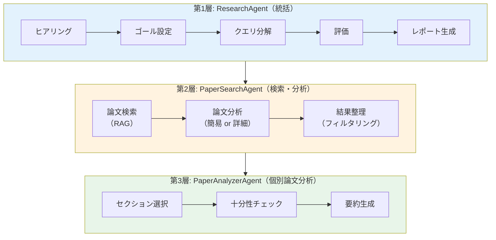

- **第 1 層（ResearchAgent）**: ユーザーとの対話からゴールを設定し、クエリ分解 → 検索 → 評価 → レポート生成の全体フローを統括します。評価で「情報不足」と判定された場合はクエリ分解に戻るリトライループを持ちます。
- **第 2 層（PaperSearchAgent）**: 分解されたサブタスクごとに RAG 検索を実行し、取得した論文を並列に分析します。分析モード（簡易 / 詳細）に応じて第 3 層を呼び出すか、簡易分析で完結するかを切り替えます。
- **第 3 層（PaperAnalyzerAgent）**: 詳細モード専用のサブグラフです。PDF 全文からセクションを選択し、十分性をチェックしながら反復的に要約を生成します。

### RAG パイプライン

このエージェントでは、論文データの取得と検索を 2 段階に分離しています。

1. **データ取得フェーズ（オフライン）**: bioRxiv API から論文メタデータを取得 → JSONL に保存 → Qdrant にベクトル化して格納
2. **検索フェーズ（オンライン）**: ユーザークエリ → LLM によるクエリ拡張 → Qdrant ベクトル検索 → OpenAI Embeddings でリランキング

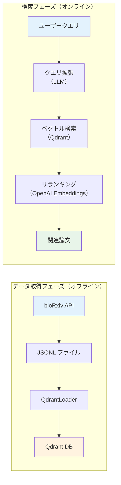

検索フェーズでは、まず LLM がユーザーのサブクエリを英語の学術的な検索クエリに拡張します（bioRxiv の論文は英語のため）。次に Qdrant でベクトル検索を行い、最大 20 件の候補論文を取得します。最後に、OpenAI Embeddings でクエリと各論文のコサイン類似度を計算し、上位の論文だけを残します（リランキング）。関連度スコアが閾値（0.3）未満の論文は除外されます。

:::tip クエリ拡張の効果

日本語で入力された検索クエリも、LLM が英語の学術用語に変換して検索します。たとえば「一細胞RNA解析の最新手法」というクエリは、「single-cell RNA-seq analysis recent methods and tools」のような英語クエリに拡張されます。これにより、言語の壁を超えたセマンティック検索が可能になります。

:::

### 簡易 / 詳細モード

論文リサーチでは、「ざっくり最新動向を把握したい」場合と「特定のテーマを深く掘り下げたい」場合で、求められる分析の深さが異なります。PDF 全文をダウンロード・分析する詳細モードは精度が高い反面、処理時間が長くかかります。

そこで、ヒアリングフェーズでユーザーが分析の深さを選択できるようにしました。

| モード | 処理内容 | 速度 | 精度 |
| --- | --- | --- | --- |
| **簡易（simple）** | タイトル＋アブストラクトのみで関連度判定と回答生成。PDF ダウンロード不要 | 高速 | 概要レベル |
| **詳細（detailed）** | PDF 全文を取得し、セクション分析 → 十分性チェック → 要約の反復処理 | 低速 | 詳細 |

簡易モードでは `SimpleAnalyzer` が 1 回の LLM コールで関連度判定と回答生成を行い、`PaperAnalyzerAgent`（3 ステップの反復処理）を完全にバイパスします。

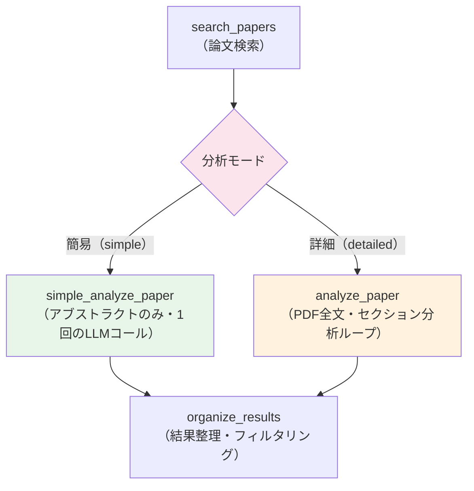

:::tip 簡易モードの活用シーン

簡易モードは以下のような場面で特に有効です。

- **広範なサーベイ**: 数十〜数百の論文を対象に、関連分野の全体像をざっくり把握したい場合
- **初期調査**: 本格的な文献レビューの前に、どのようなテーマの論文が存在するかを素早く確認したい場合
- **コスト削減**: PDF ダウンロードと全文分析の LLM コストを抑えたい場合

:::

### 全体ワークフロー

以下は `ResearchAgent` の LangGraph ワークフロー全体図です。評価で「情報不足」と判定された場合、クエリ分解に戻るリトライループが発生します。

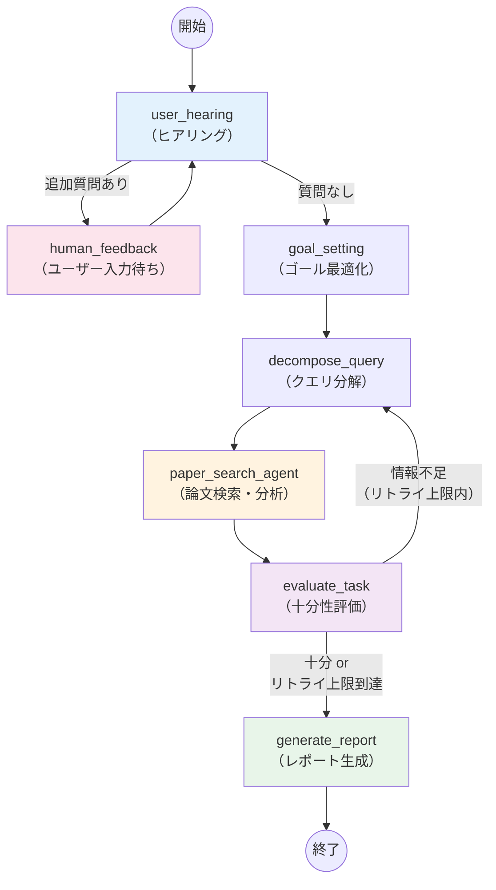

### エージェントの構成ファイル

| ファイル | 役割 |
| --- | --- |
| `chapter6-biorxiv/models.ts` | 型定義と Zod スキーマ（`BiorxivPaper`、`ReadingResult`、`Hearing` 等）、論文リストのフォーマット |
| `chapter6-biorxiv/configs.ts` | 設定読み込み（API キー、モデル名、分析モード、Qdrant 接続情報）と LLM インスタンス生成 |
| `chapter6-biorxiv/custom-logger.ts` | タイムスタンプ付きカスタムロガー |
| `chapter6-biorxiv/searcher/searcher.ts` | 検索インターフェース定義（`excludeDois` パラメータ付き） |
| `chapter6-biorxiv/rag/biorxiv-fetcher.ts` | bioRxiv API からの論文取得（レジューム・追記対応） |
| `chapter6-biorxiv/rag/qdrant-store.ts` | Qdrant ベクトル DB の操作（検索・追加・DOI フィルタ） |
| `chapter6-biorxiv/rag/qdrant-loader.ts` | JSONL → Qdrant へのバッチ投入 |
| `chapter6-biorxiv/rag/rag-searcher.ts` | クエリ拡張 → ベクトル検索 → リランキングの RAG パイプライン |
| `chapter6-biorxiv/service/pdf-to-text.ts` | PDF → テキスト変換（詳細モード用） |
| `chapter6-biorxiv/service/markdown-storage.ts` | Markdown ファイルの読み書き管理 |
| `chapter6-biorxiv/service/markdown-parser.ts` | Markdown をセクション単位にパース |
| `chapter6-biorxiv/chains/hearing-chain.ts` | ユーザーヒアリング（モード選択含む） |
| `chapter6-biorxiv/chains/goal-optimizer-chain.ts` | 検索ゴールの具体化・最適化 |
| `chapter6-biorxiv/chains/query-decomposer-chain.ts` | ゴールを 3〜5 個のサブタスクに分解（リトライコンテキスト付き） |
| `chapter6-biorxiv/chains/paper-processor-chain.ts` | 論文検索 → PDF 変換 → DOI 重複排除 → Send による並列分析 |
| `chapter6-biorxiv/chains/simple-analyzer-chain.ts` | アブストラクトのみの簡易分析（簡易モード用） |
| `chapter6-biorxiv/chains/reading-chains.ts` | セクション選択・十分性チェック・要約の 3 チェーン（詳細モード用） |
| `chapter6-biorxiv/chains/task-evaluator-chain.ts` | 調査結果の十分性評価と再検索判定（0 件リトライ対応） |
| `chapter6-biorxiv/chains/reporter-chain.ts` | 最終レポート生成（`biorxivPaperToXml` で論文メタデータを正確にシリアライズ） |
| `chapter6-biorxiv/agent/paper-analyzer-agent.ts` | 個別論文の分析エージェント（LangGraph サブグラフ） |
| `chapter6-biorxiv/agent/paper-search-agent.ts` | 論文検索・分析エージェント（簡易 / 詳細モード分岐） |
| `chapter6-biorxiv/agent/research-agent.ts` | メインエージェント（LangGraph メイングラフ） |

### 主な設定パラメータ

すべての設定は環境変数でオーバーライドできます。`configs.ts` で管理されています。

| パラメータ | 環境変数 | デフォルト値 | 説明 |
| --- | --- | --- | --- |
| `openaiSmartModel` | `OPENAI_SMART_MODEL` | `gpt-4o` | ヒアリング・ゴール設定・評価に使用する LLM |
| `openaiFastModel` | `OPENAI_FAST_MODEL` | `gpt-4o-mini` | 検索クエリ拡張・簡易分析に使用する高速 LLM |
| `openaiReporterModel` | `OPENAI_REPORTER_MODEL` | `gpt-4o` | 最終レポート生成に使用する LLM |
| `embeddingModel` | `EMBEDDING_MODEL` | `text-embedding-3-small` | ベクトル化に使用する Embedding モデル（1536 次元） |
| `analysisMode` | `ANALYSIS_MODE` | `detailed` | 分析モード（`simple` / `detailed`） |
| `maxPapers` | `MAX_PAPERS` | `3` | リランキング後に保持する論文数（タスクあたり） |
| `maxSearchResults` | `MAX_SEARCH_RESULTS` | `20` | ベクトル検索で取得する候補論文数 |
| `maxEvaluationRetryCount` | `MAX_EVALUATION_RETRY_COUNT` | `3` | 評価リトライの上限回数 |
| `maxWorkers` | `MAX_WORKERS` | `3` | 論文分析の並列ワーカー数 |
| `qdrantCollectionName` | `QDRANT_COLLECTION_NAME` | `biorxiv-bioinformatics` | Qdrant のコレクション名 |
| `qdrantUrl` | `QDRANT_URL` | `http://localhost:6333` | Qdrant サーバーの接続 URL |

:::info 前提条件

- 環境変数 `OPENAI_API_KEY` に OpenAI の API キーが設定されていること
- **Docker** で Qdrant が起動していること（`docker compose up -d`）
- `@langchain/langgraph`、`@langchain/openai`、`@qdrant/js-client-rest`、`openai` パッケージがインストールされていること（`pnpm install` で自動インストール）

:::

## データ取得と Qdrant への投入

RAG アーキテクチャでは、エージェントを使う前に論文データをベクトルデータベースに格納しておく必要があります。このデータ準備は一度だけ行えば、以降は何度でも高速に検索できます。

データ取得の流れは以下の 3 ステップです。

### Step 1: Qdrant の起動

```bash
cd packages/@ai-suburi/core/chapter6-biorxiv
docker compose up -d
```

### Step 2: bioRxiv から論文データを取得

```bash
pnpm tsx chapter6-biorxiv/rag/biorxiv-fetcher.ts \
  --start 2023-01-01 --end 2026-03-31 \
  --category bioinformatics
```

取得した論文は `storage/biorxiv-tmp/` に JSONL（1 行 1 論文の JSON）形式で保存されます。bioRxiv API はレート制限があるため、エクスポネンシャルバックオフで自動リトライします。中断した場合は `--resume` で再開できます。

:::caution bioRxiv API の取得時間

バイオインフォマティクス分野だけでも数万件の論文があるため、全期間の取得には数十分〜数時間かかる場合があります。まずは短い期間（例: `--start 2025-01-01 --end 2025-03-31`）で試すことをおすすめします。

:::

### Step 3: Qdrant にベクトルデータを投入

```bash
pnpm tsx chapter6-biorxiv/rag/qdrant-loader.ts \
  --input storage/biorxiv-tmp/biorxiv_*.jsonl
```

ローダーは JSONL を行単位でストリーム読み込みし、50 件ずつバッチで Qdrant に投入します。DOI で重複チェックを行うため、同じ JSONL を再投入しても重複は発生しません。

**実行結果の例:**

```text
[qdrant-loader] Batch 1: 50 added, 0 skipped
[qdrant-loader] Batch 2: 50 added, 0 skipped
...
[qdrant-loader] Loading complete. 1250 new papers added, 0 skipped. Total in collection: 1250
```

### Qdrant に格納されるデータ構造

Qdrant には論文 1 件につき 1 つの「ポイント」が格納されます。各ポイントは **ベクトル**（セマンティック検索用）と **ペイロード**（メタデータ）で構成されています。

#### ベクトル化の対象

論文の**タイトルとアブストラクトを結合した文字列**を OpenAI の `text-embedding-3-small`（1536 次元）でベクトル化します。

```typescript title="chapter6-biorxiv/rag/qdrant-store.ts"
// ベクトル化対象: タイトル + アブストラクト
const documents = papers.map((p) => `${p.title}\n\n${p.abstract}`);
const embeddings = await this.getEmbeddings(documents);
```

タイトルだけでなくアブストラクトも含めることで、論文の内容を反映したセマンティック検索が可能になります。

#### ポイント ID の生成

Qdrant のポイント ID には、DOI を SHA-1 ハッシュして UUID 形式に変換した値を使用します。これにより、同じ DOI の論文は必ず同じ ID になるため、`addDocuments` の `upsert` で自然に重複排除されます。

```text
DOI: "10.1101/2023.04.30.538439"
  ↓ SHA-1 ハッシュ
  ↓ UUID 形式に整形
ID: "a1b2c3d4-e5f6-7890-abcd-ef1234567890"
```

#### ペイロード（メタデータ）

各ポイントには以下のメタデータがペイロードとして格納されます。検索後にこれらの情報を復元して `BiorxivPaper` オブジェクトとして返します。

| フィールド | 型 | 内容 | 用途 |
| --- | --- | --- | --- |
| `doi` | string | 論文の DOI | 重複排除フィルタ（`must_not`） |
| `title` | string | 論文タイトル | 検索結果の表示 |
| `abstract` | string | 論文のアブストラクト | 簡易モードでの分析、リランキング |
| `authors` | string | 著者リスト（セミコロン区切り） | レポートの引用情報 |
| `published` | string | 公開日（YYYY-MM-DD） | レポートの引用情報 |
| `category` | string | bioRxiv カテゴリ | フィルタリング |
| `pdfLink` | string | PDF ダウンロード URL | 詳細モードでの PDF 取得 |
| `link` | string | 論文ページの URL | レポートの参考文献リンク |
| `version` | number | 論文のバージョン番号 | 最新版の識別 |
| `document` | string | タイトル＋アブストラクト結合テキスト | ベクトル化元テキストの保存 |

#### インデックス

`doi` フィールドにはキーワードインデックスが作成されています。これにより、サブタスク間の DOI 重複排除（`must_not` フィルタ）を高速に実行できます。

```typescript title="chapter6-biorxiv/rag/qdrant-store.ts"
// DOI でフィルタリングするためのペイロードインデックス
await this.client.createPayloadIndex(this.collectionName, {
  field_name: 'doi',
  field_schema: 'keyword',
});
```

#### 検索時のデータ復元

Qdrant から検索結果を取得した際、ペイロードのメタデータから `BiorxivPaper` オブジェクトを復元します。`relevanceScore` にはベクトル検索のコサイン類似度スコアが格納されます。

```typescript title="chapter6-biorxiv/rag/qdrant-store.ts"
return results.map((result) => {
  const p = result.payload ?? {};
  return {
    doi: (p.doi as string) ?? '',
    title: (p.title as string) ?? '',
    abstract: (p.abstract as string) ?? '',
    // ... その他のフィールド
    relevanceScore: result.score, // コサイン類似度
  };
});
```

## エージェントの実行

```bash
# 対話モード（ヒアリングでモード選択）
pnpm tsx chapter6-biorxiv/agent/research-agent.ts "生成AIを用いたゲノム解析の最新動向"

# ヒアリングスキップモード（自動続行）
pnpm tsx chapter6-biorxiv/agent/research-agent.ts "single-cell RNA-seq解析の最新手法" --skip-feedback
```

対話モードでは、エージェントがヒアリングを行い、分析モード（簡易 / 詳細）や追加の検索条件をユーザーに確認します。`--skip-feedback` を指定すると、ヒアリングをスキップしてデフォルト設定で自動実行します。

エージェントは以下の流れで処理を進めます。

1. **ヒアリング** → ユーザーの意図を確認し、分析モードを決定
2. **ゴール設定** → 検索ゴールを具体化・最適化
3. **クエリ分解** → ゴールを 3〜5 個のサブタスクに分解
4. **論文検索・分析** → 各サブタスクで RAG 検索 → 論文分析（簡易 or 詳細）
5. **評価** → 調査結果の十分性を評価（不足なら 3 に戻る）
6. **レポート生成** → 調査結果を統合してレポートを出力

**実行結果の例（一部抜粋）:**

```text
[research-agent] |--> user_hearing
[research-agent] |--> goal_setting
[research-agent] |--> decompose_query
[paper-search-agent] |--> search_papers
[rag-searcher] Searching with query: "single-cell RNA-seq analysis recent methods and tools"
[rag-searcher] After reranking: 3 papers above threshold.
[paper-search-agent] |--> simple_analyze_paper
[paper-search-agent] |--> organize_results
[paper-search-agent] 論文フィルタリング: 全9件 → 関連あり6件（除外3件）
[research-agent] |--> evaluate_task
[research-agent] |--> generate_report
```

## Chapter 6 からの主な改善点

この応用編では、Chapter 6 で見つかった課題を解決するために、4 つの主要な改善を行いました。

### DOI 重複排除

ベクトル検索では、意味的に近いサブタスク同士で同じ論文がヒットしやすいという特性があります。たとえば「single-cell RNA-seq の最新手法」と「RNA-seq データの前処理技術」のような関連するサブタスクでは、同じ論文が重複して返されることがあります。重複論文を分析するのは LLM コストと時間の無駄になるため、検索段階で排除する必要があります。

この問題を Qdrant の `must_not` フィルタで解決しました。`PaperProcessor` がタスクを順次処理する際、前のタスクで見つかった DOI を蓄積し、次のタスクの検索から除外します。

```typescript title="chapter6-biorxiv/chains/paper-processor-chain.ts"
const allFoundDois: string[] = [];
for (const task of state.tasks) {
  const searchedPapers = await this.searcher.run(state.goal, task, allFoundDois);
  for (const paper of searchedPapers) {
    uniquePapers.set(paper.doi, paper);
    allFoundDois.push(paper.doi);
  }
}
```

### リトライ時のコンテキスト強化

Chapter 6 では、`TaskEvaluator` が「情報不足」と判定した場合に `QueryDecomposer` へ戻ってサブタスクを再生成します。しかし、前回どのようなサブタスクで検索したかの情報が渡されていませんでした。そのため、リトライしても同じようなサブタスクが生成され、同じ論文ばかりヒットするという問題がありました。

この応用編では、リトライ時に以下の情報を `QueryDecomposer` のプロンプトに含めることで、この問題を解決しています。

- **前回のサブタスク一覧**: 「これらとは異なるサブタスクを生成してください」という指示とともに渡す
- **取得済み論文リスト**: 既に見つかった論文を提示し、同じ論文の再取得を避ける

これにより、リトライのたびに異なる角度からの検索が行われ、情報の網羅性が向上します。前述の DOI 重複排除と組み合わせることで、リトライ時の検索結果の多様性がさらに高まります。

### 0 件時のリトライ対応

Chapter 6 では、関連論文が 0 件の場合に即座にレポート生成に進んでいました。ベクトル検索では、クエリの表現によってはヒット数が大きく変わるため、1 回の検索で見つからなくてもクエリを変えれば見つかる可能性があります。

この応用編では、0 件の場合でもリトライ上限（デフォルト: 3 回）まで `decompose_query` に戻り、別角度で再検索を試みます。`TaskEvaluator` がフィードバックメッセージとして「より一般的な検索キーワードや異なるアプローチのサブタスクを生成してください」を含めることで、LLM が検索戦略を自動的に調整します。リトライ上限に達した場合は、それまでに取得できた情報でレポートを生成します。

### レポーターの論文メタデータ対応

Chapter 6 の `Reporter` では `dictToXmlStr()` を使って `ReadingResult` を XML に変換していました。しかし、この汎用関数ではネストされた `paper` オブジェクトが `[object Object]` として出力されてしまい、論文のタイトル・DOI・URL 等のメタデータが LLM に渡されていませんでした。その結果、生成されるレポートに具体的な論文情報や引用リンクが含まれないという問題がありました。

この応用編では、専用の `biorxivPaperToXml()` 関数を作成し、論文メタデータを正確に XML にシリアライズします。これにより、レポートに論文タイトル・DOI リンク・著者名を含む具体的な引用と参考文献リストが生成されるようになりました。

---

## 発展: ファインチューニングによる精度向上の可能性

ここまでの改善（DOI 重複排除、リトライコンテキスト強化、0 件時リトライ、レポーターのメタデータ対応）は、すべて **プロンプトエンジニアリング** と **RAG パイプラインの設計改善** によるものでした。これらの手法でカバーしきれない精度の壁にぶつかった場合、次のステップとして **ファインチューニング（Fine-tuning）** が選択肢に入ります。

### ファインチューニングとは

ファインチューニングとは、学習済みの大規模言語モデル（LLM）を **特定のタスクやドメインに合わせて追加学習させる** 手法です。プロンプトで「こう振る舞って」と指示するのではなく、モデルの重み（パラメータ）自体を更新するため、プロンプトの工夫だけでは到達できない精度向上が期待できます。

たとえば、「single-cell RNA-seq の前処理」というサブタスクに対して、プロンプトエンジニアリングでは「英語の学術用語に変換してください」と指示します。一方、ファインチューニングでは「このサブタスクには `scRNA-seq preprocessing quality control droplet-based filtering` というクエリが最適」という数百の実例をモデルに学習させます。これにより、指示がなくてもドメインに適した出力を自然に生成できるようになります。

| アプローチ | 手法 | コスト | 効果 |
| --- | --- | --- | --- |
| プロンプトエンジニアリング | 入力（指示文）を工夫する | 低い | 手軽だが限界がある |
| RAG | 外部知識を検索して補強する | 中程度 | 知識の拡張に強い |
| ファインチューニング | モデルの重みを更新する | 高い | 根本的な性能改善が可能 |

一般的に、**プロンプトエンジニアリング → RAG → ファインチューニング** の順に検討するのがセオリーです。この応用編ではすでに RAG まで導入しているため、次のステップとしてファインチューニングを検討する段階にあります。

### このエージェントで効果が見込めるポイント

現在のエージェントには 11 個のプロンプトテンプレートがありますが、すべてにファインチューニングが必要なわけではありません。**検索精度に直結する箇所** にピンポイントで適用するのが効果的です。以下の 3 つが特に効果が見込めるポイントです。

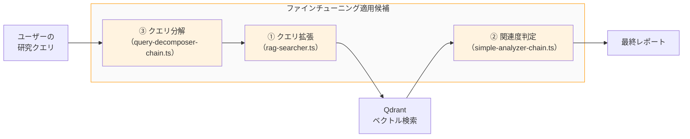

#### 1. RAG 検索クエリ拡張（rag-searcher.ts）— 効果: 最大

現在、`RagSearcher` の `expandQuery()` メソッドは、LLM にサブタスクを英語の学術的な検索クエリに変換させています。この変換精度が Qdrant のベクトル検索結果の質に直結するため、ファインチューニングの効果が最も大きい箇所です。

たとえば、「遺伝子発現の空間的パターン解析」というサブタスクに対して、汎用モデルは `gene expression spatial pattern analysis` のような一般的なクエリを生成します。一方、バイオインフォマティクスの文脈を学習したモデルであれば、`spatial transcriptomics Visium MERFISH gene expression patterning` のように、具体的な技術名（Visium、MERFISH）を含む高精度なクエリを生成できます。

**期待される改善:**

- 生物学ドメインに特化した検索クエリ生成（専門用語・技術名の適切な選択）
- クエリ拡張時の同義語・関連語の網羅性向上
- 不要なキーワードの排除による検索ノイズの削減

#### 2. 論文の関連度判定（simple-analyzer-chain.ts）— 効果: 中

簡易モードの `SimpleAnalyzer` は、タイトルとアブストラクトだけで `is_related`（関連あり / なし）を判定します。この判定はフィルタリングのゲートキーパーとして機能するため、精度が上がればノイズ論文が除外され、最終レポートの品質が向上します。

具体的には、前述の「Chapter 6 からの主な改善点」で触れた DOI 重複排除がデータ取得時の重複を防ぐのに対し、関連度判定は **内容的に無関係な論文** を排除する役割を担います。ファインチューニングにより、バイオインフォマティクス特有の文脈（手法論文と応用論文の区別、分野横断的なキーワードの解釈など）を学習させることで、判定精度の向上が見込めます。

#### 3. クエリ分解（query-decomposer-chain.ts）— 効果: 中

`QueryDecomposer` は研究テーマを 3〜5 個のサブタスクに分解します。分解の質が検索の網羅性に影響するため、バイオインフォマティクス分野特有のサブテーマの切り方（たとえば、wet 実験系と dry 解析系の分離、上流解析と下流解析の区別など）を学習させることで、より効果的なサブタスク生成が期待できます。

### 実践: OpenAI Fine-tuning API を使った手順

OpenAI は `gpt-4o-mini` などのモデルに対してファインチューニング API を提供しています。以下に、このエージェントでファインチューニングを試す場合の具体的な手順を示します。

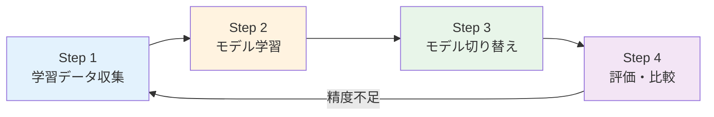

#### Step 1: 学習データの収集

最も重要かつ最も時間がかかるステップは、高品質な学習データの作成です。ファインチューニングの成否は学習データの質に大きく左右されます。

一般的なファインチューニングでは「この出力が良いかどうか」の判断が主観的になりがちですが、RAG エージェントのクエリ拡張には大きなアドバンテージがあります。**Qdrant に格納された論文データが固定されている**ため、「このクエリを投げたら良い論文が返ってくるか？」を関連度スコアで客観的に判定できます。この特性を活かすと、学習データの収集プロセスを半自動化できます。

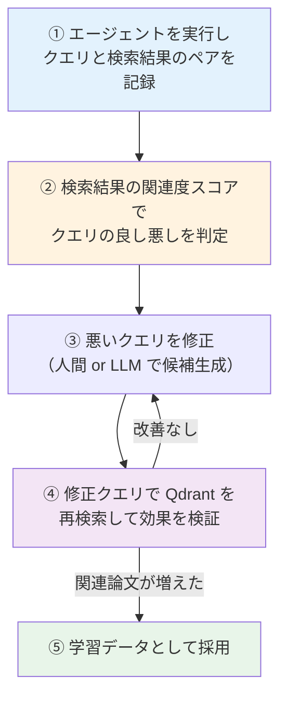

**① ログの収集**: エージェントをさまざまな研究クエリで実行し、`RagSearcher` が生成した検索クエリとその検索結果（ヒット件数・関連度スコア）のペアを記録します。

**② クエリの評価**: 検索結果の関連度スコアで客観的に判定します。関連論文が 2〜3 件以上ヒットしスコアが高い（0.4 以上）クエリは「良い」、0 件やスコアが閾値（0.3）ギリギリのクエリは「悪い」と判定します。

**③ クエリの修正**: 悪いクエリに対して、専門用語の追加や表現の改善を行います。たとえば、一般的な `single cell RNA-seq preprocessing methods` を、略語や具体的な技術名を含む `scRNA-seq quality control filtering normalization droplet-based cell barcode UMI deduplication` に修正します。

**④ 再検索による検証**: 修正したクエリを実際に Qdrant に投げ、検索結果が改善されたかを確認します。Qdrant のデータは固定されているため、同じクエリに対して常に同じ結果が返り、**再現性 100% で検証できる**のが大きな利点です。

**⑤ 学習データへの採用**: 検証で改善が確認されたペア（入力サブタスク → 修正後クエリ）を学習データとして JSONL に整形します。

:::tip 半自動化パイプラインの構築

人間がゼロからクエリを書くのではなく、**LLM にクエリ候補を複数生成させ → すべて Qdrant に投げ → 関連度スコアが最も高いクエリを正解データに採用する**というパイプラインを構築できます。

```text
サブタスク × LLM 生成のクエリ候補（5〜10パターン）
  → 全候補を Qdrant でベクトル検索
  → リランキングスコアが最も高い候補を正解クエリとして採用
  → JSONL に自動整形
```

このアプローチでは、人間の作業は「生成されたクエリ候補と検索結果の最終確認」に限定されるため、数百件の学習データも現実的な工数で収集できます。

:::

たとえば、RAG 検索クエリ拡張のファインチューニングデータは以下のような形式になります。

```jsonl
{"messages": [{"role": "system", "content": "あなたは、与えられたサブクエリからbioRxiv論文のRAG検索に最適な検索クエリを生成する専門家です。"}, {"role": "user", "content": "目標: single-cell RNA-seq解析の最新手法を調査する\nクエリ: single-cell RNA-seqの前処理手法を調べる"}, {"role": "assistant", "content": "single cell RNA sequencing preprocessing quality control droplet-based filtering normalization scRNA-seq"}]}
{"messages": [{"role": "system", "content": "あなたは、与えられたサブクエリからbioRxiv論文のRAG検索に最適な検索クエリを生成する専門家です。"}, {"role": "user", "content": "目標: ゲノムワイド関連解析の最新統計手法を調査する\nクエリ: GWASの統計的検定手法"}, {"role": "assistant", "content": "genome-wide association study GWAS statistical methods polygenic risk score linkage disequilibrium"}]}
```

OpenAI のファインチューニングには最低でも **10 件** の学習データが必要ですが、実用的な精度向上には **50〜100 件** 以上、理想的には **数百件** を用意することが推奨されています。上記の半自動化パイプラインを活用すれば、この規模のデータ収集も現実的です。

:::tip LangSmith によるログ収集の効率化

[LangSmith](https://smith.langchain.com/) を導入すると、エージェントの各 LLM 呼び出しの入出力が自動的にトレースされます。上記の ① ログ収集フェーズで、手動でログを拾う代わりに LangSmith のトレースデータをエクスポートして加工できます。LangChain / LangGraph を使用しているこのエージェントとは特に相性が良く、環境変数の設定だけでトレースを有効化できます。

:::

#### Step 2: ファインチューニングの実行

OpenAI の Fine-tuning API を使ってモデルを学習させます。

```bash
# 学習データのアップロード
openai api files.create -f training_data.jsonl -p fine-tune

# ファインチューニングジョブの作成
openai api fine_tuning.jobs.create \
  -t file-xxxxxxxx \
  -m gpt-4o-mini-2024-07-18
```

学習は OpenAI のサーバー上で実行されるため、ローカル環境に GPU は不要です。学習データの件数にもよりますが、数百件程度であれば数十分〜数時間で完了します。

#### Step 3: ファインチューニング済みモデルへの切り替え

このエージェントの `configs.ts` は環境変数でモデル名を読み込む設計のため、**コードの変更なし** でファインチューニング済みモデルに切り替えられます。

```bash
# .env でモデル名を差し替えるだけ
OPENAI_FAST_MODEL=ft:gpt-4o-mini-2024-07-18:your-org::xxxxxxxx
```

`configs.ts` の `loadSettings()` が `OPENAI_FAST_MODEL` 環境変数を読み込み、`createFastLlm()` でファインチューニング済みモデルのインスタンスが生成されます。このモデルは RAG 検索クエリ拡張（`RagSearcher`）や簡易分析（`SimpleAnalyzer`）で使用されるため、環境変数の変更だけで対象箇所に反映されます。

#### Step 4: 評価

ファインチューニングの効果を定量的に測定するため、同一の研究クエリセットを用意し、ベースモデルとファインチューニング済みモデルで比較実験を行います。

| 評価指標 | 測定方法 | 改善の判断基準（例） |
| --- | --- | --- |
| 検索ヒット論文の関連度 | 人間による 5 段階評価の平均スコア | 平均 0.5 ポイント以上の向上 |
| 最終レポートの網羅性 | 既知の重要論文がレポートに含まれているか | カバー率 80% 以上 |
| 不要論文の混入率 | `is_related: false` と判定される論文の割合 | 混入率 20% 以下 |
| コスト | LLM API の利用料金の比較 | ベースモデル以下 |

評価の結果、精度が十分でない場合は Step 1 に戻り、学習データの追加や品質改善を行います。

:::caution 評価データと学習データの分離

評価に使う研究クエリは、学習データに含まれていないものを使用してください。学習データと同じクエリで評価すると、過学習による見かけ上の精度向上を正しく検出できません。

:::

### ファインチューニングの代表的な手法

ファインチューニングの手法を選ぶ際には、**2 つの独立したレイヤー**を理解する必要があります。

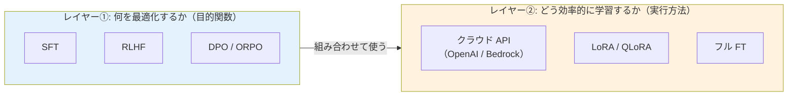

| レイヤー | 問い | 選択肢 |
| --- | --- | --- |
| **① 目的関数**（何を最適化するか） | タスクの性質に応じてどの学習手法を使うか | SFT / RLHF / DPO / ORPO |
| **② 実行方法**（どう効率的に学習するか） | どの環境・技術で学習を実行するか | クラウド API / LoRA / QLoRA / フル FT |

この 2 つは直交する概念であり、たとえば「SFT × LoRA」「DPO × QLoRA」「SFT × OpenAI API」のように自由に組み合わせられます。以下ではそれぞれのレイヤーについて、背景や仕組み、最新の研究動向を含めて解説します。

#### レイヤー①: 学習手法の選択 — 何を最適化するか

まずは「モデルに何を学習させるか」を決めます。大きく分けて、**正解を直接学習させる SFT** と、**人間の選好を学習させる RLHF 系**の 2 つのアプローチがあります。

##### SFT（Supervised Fine-Tuning）

SFT は最も基本的なファインチューニング手法です。「この入力に対してはこう出力してほしい」という正解ペア（入力 → 理想の出力）のデータセットを用意し、モデルに教師あり学習させます。機械学習における一般的な教師あり学習と同じ枠組みですが、学習対象が大規模言語モデルである点が特徴です。

SFT が広く知られるきっかけとなったのは、OpenAI の **InstructGPT**（Ouyang et al., 2022）です。この論文では、SFT → 報酬モデル学習 → RLHF の 3 段階パイプラインを提案しました。注目すべきは、1.3B パラメータの InstructGPT が 175B の GPT-3 より人間評価で好まれたことです。モデルサイズよりも学習手法が重要であることを示した画期的な研究でした。

SFT で特に重要なのは **学習データの質** です。Meta の **LIMA**（Zhou et al., 2023）は、たった 1,000 件の高品質データで SFT した 65B LLaMA が、52,000 件で訓練した Alpaca や RLHF 済みの DaVinci003 を上回ることを実証しました。この「データは量より質」という知見は、前述の Step 1 で学習データの収集コストを抑える上でも重要な示唆を与えています。つまり、数百件であっても質の高いデータを用意すれば、十分な効果が期待できます。

##### RLHF と選好最適化（DPO / ORPO）

RLHF（Reinforcement Learning from Human Feedback）は、人間のフィードバックを使ってモデルの出力品質を向上させる手法です。SFT が「正解を真似させる」のに対し、RLHF は「2 つの出力のうちどちらが良いか」という人間の選好（プリファレンス）判断を学習します。正解が 1 つに定まらないタスク（文章の自然さ、回答の有用性など）で特に効果を発揮します。

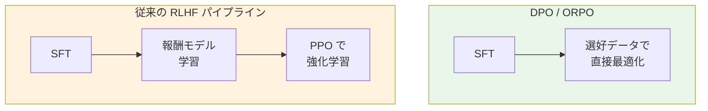

RLHF の原型は Christiano et al.（2017）の「Deep reinforcement learning from human preferences」に遡ります。この研究では、人間のペアワイズ比較（「A と B のどちらの行動が良いか」）から報酬モデルを学習し、RL エージェントを訓練する枠組みを提案しました。InstructGPT（Ouyang et al., 2022）がこれを LLM に適用し、ChatGPT の基盤技術として広く知られるようになりました。

しかし、従来の RLHF は報酬モデルの学習と PPO（Proximal Policy Optimization）による強化学習が必要で、パイプラインが複雑でした。上の図で示したように 3 段階の処理が必要であり、学習の安定性やハイパーパラメータの調整にも専門知識が求められます。

この課題を解決する手法として、近年以下の手法が提案されています。

- **DPO（Direct Preference Optimization）**（Rafailov et al., 2023）: 報酬モデルを明示的に訓練せず、選好データから直接ポリシーを最適化する手法です。「言語モデル自体が暗黙的な報酬モデルである」という理論的洞察に基づき、PPO ベースの RLHF と同等以上の性能を、はるかにシンプルなパイプラインで達成しました。
- **ORPO（Monolithic Preference Optimization）**（Hong et al., 2024）: SFT と選好最適化を 1 つの目的関数に統合し、リファレンスモデル（比較基準となるモデル）も不要にした手法です。Odds Ratio を使って不適切な出力にペナルティを与えることで、学習パイプラインをさらに簡略化しました。

このように、RLHF のパイプラインは **Christiano et al. (2017) → InstructGPT (2022) → DPO (2023) → ORPO (2024)** と進化するにつれ、よりシンプルで扱いやすくなっています。

##### レイヤー① の選び方

以下のフローチャートは、タスクの性質に応じてどの学習手法を選ぶべきかの判断基準を示しています。

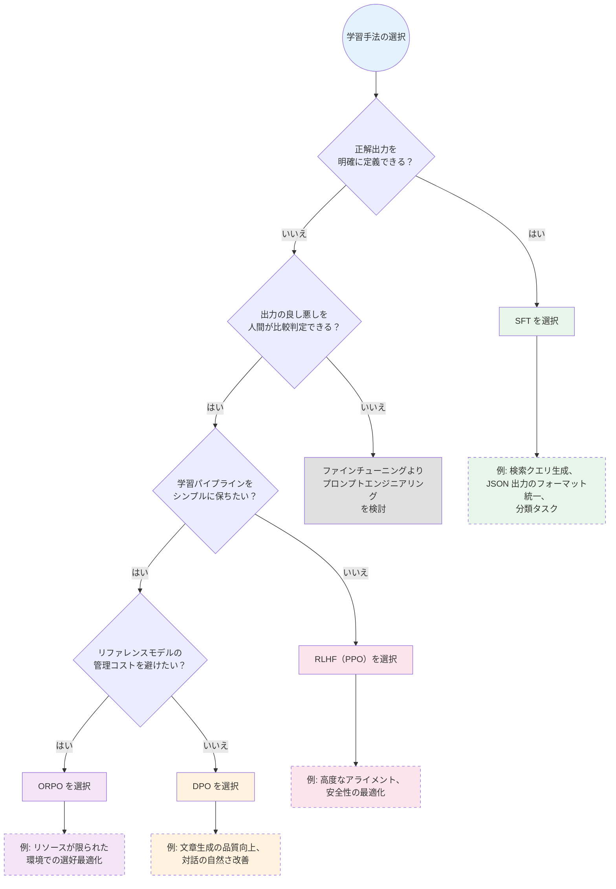

本エージェントの検索クエリ生成タスクは、最初の分岐で「正解出力を明確に定義できる」に該当します。Qdrant の関連度スコアで正解クエリを客観的に特定できるため、**SFT が最適な選択肢**です。

#### レイヤー②: 実行方法の選択 — どう効率的に学習するか

レイヤー①で学習手法（SFT など）を決めた後は、「どの環境・技術でモデルを学習させるか」を選びます。これがレイヤー②です。レイヤー①の SFT や DPO と自由に組み合わせて使えます。

##### クラウド API（OpenAI / Bedrock）

OpenAI の Fine-tuning API や Amazon Bedrock のカスタムモデルトレーニングを利用する方法です。学習はクラウド上で実行されるため、**ローカル環境に GPU や高スペックなマシンは不要**です。普段の開発に使っているマシンで十分です。

内部的にはフルファインチューニングや LoRA が使われている場合がありますが、利用者はそれを意識する必要はありません。JSONL 形式のデータをアップロードしてジョブを作成するだけです。本エージェントでは OpenAI の Fine-tuning API（内部的に SFT を実行）がこれに該当します。

##### LoRA / QLoRA（パラメータ効率的ファインチューニング）

LoRA（Low-Rank Adaptation）は、**モデル全体の重みを更新するのではなく、低ランク行列のペアだけを学習する**ことで、計算コストとメモリ使用量を大幅に削減する手法です（Hu et al., 2021）。オープンソースモデル（Llama 等）を自前の GPU で学習させる場合に特に有効です。

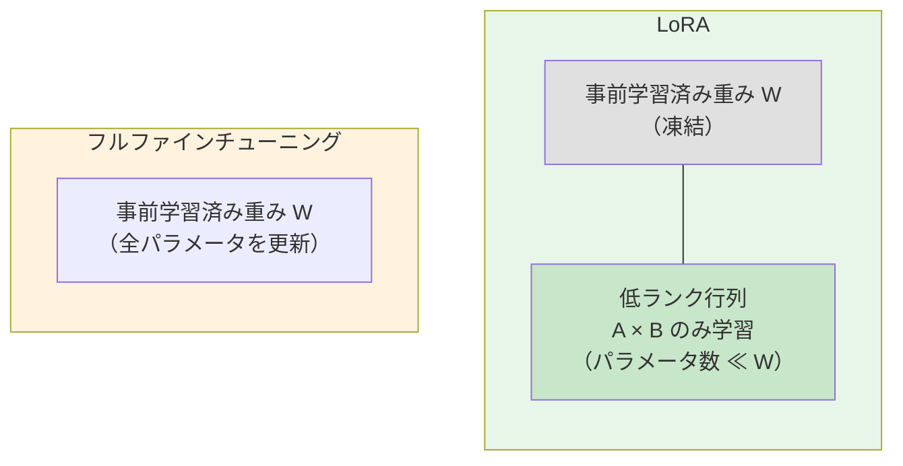

LoRA の核心的なアイデアは、ファインチューニング時の重み更新行列 ΔW が低ランクであるという仮説です。たとえば、d × d の重み行列に対して、d × r と r × d（r ≪ d）の 2 つの小さな行列の積で ΔW を近似します。これにより、学習パラメータ数がフルファインチューニングの数 % 以下に削減されます。推論時は学習した低ランク行列を元の重みに加算するだけなので、追加の計算コストは発生しません。

**QLoRA**（Dettmers et al., 2023）は、LoRA にさらに 4-bit 量子化を組み合わせた手法です。量子化とは、モデルの重みをより少ないビット数で表現することでメモリ使用量を削減する技術です。QLoRA は 4-bit NormalFloat（NF4）量子化と二重量子化を導入し、65B パラメータのモデルを **単一の 48GB GPU** でファインチューニング可能にしました。16-bit のフルファインチューニングと同等の性能を維持しつつ、メモリ使用量を劇的に削減しています。

さらに、LoRA の派生手法として以下のような改良も提案されています。

- **DoRA（Weight-Decomposed Low-Rank Adaptation）**（Liu et al., 2024）: 事前学習済み重みを「大きさ（magnitude）」と「方向（direction）」に分解し、方向成分に LoRA を適用します。学習の安定性が向上し、追加の推論コストなしで一貫して LoRA を上回る性能を達成しました。
- **rsLoRA**（Kalajdzievski, 2023）: LoRA のスケーリング係数をランクの逆数（1/r）からランクの平方根の逆数（1/√r）に変更すべきことを理論的に証明し、高ランク設定での学習停滞問題を解決しました。

##### レイヤー② の選び方

以下のフローチャートは、学習環境と制約に応じてどの実行方法を選ぶべきかの判断基準を示しています。

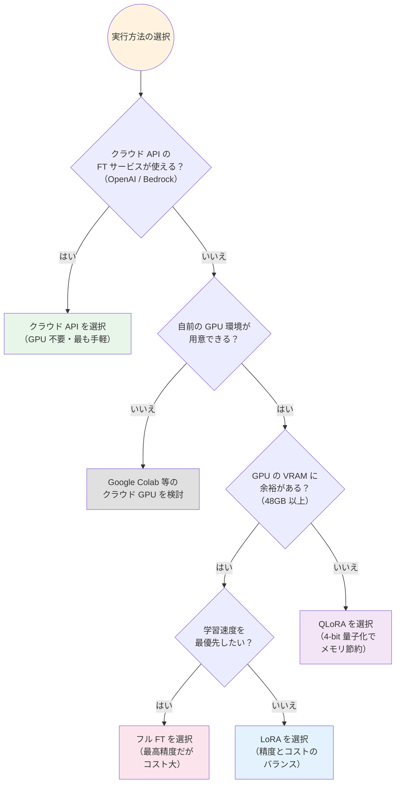

#### 本エージェントでの選択

以上の 2 つのレイヤーを踏まえると、本エージェントでの最適な組み合わせは **「SFT × OpenAI API」** です。

| レイヤー | 選択 | 理由 |
| --- | --- | --- |
| **① 学習手法** | SFT | 検索クエリの正解を Qdrant のスコアで客観的に定義できる |
| **② 実行方法** | OpenAI API | `configs.ts` の環境変数でモデルを切り替えるだけで導入可能。GPU 不要 |

### コスト試算

ファインチューニングにかかるコストは「学習コスト」と「推論コスト」の 2 つに分かれます。

#### 学習コスト

OpenAI Fine-tuning API の学習コストは、**学習データのトークン数 × エポック数**で決まります。`gpt-4o-mini` の学習料金は $0.30 / 100 万トークンです（2025 年 5 月時点）。

このエージェントのクエリ拡張データは 1 件あたり約 150〜200 トークン（system + user + assistant）のため、以下のようなコスト感になります。

| 学習データ件数 | 総トークン数（3 エポック） | 学習コスト |
| --- | --- | --- |
| 50 件 | 約 30,000 トークン | 約 $0.01 |
| 100 件 | 約 60,000 トークン | 約 $0.02 |
| 500 件 | 約 300,000 トークン | 約 $0.09 |

学習データ 100 件でも **数円程度**と、API 料金自体は非常に安価です。

#### 推論コストの比較

ファインチューニングの真のメリットは、学習コストの安さよりも **推論コストの削減** にあります。ファインチューニング済みの `gpt-4o-mini` は、推論コストが通常の `gpt-4o-mini` と同額のまま、`gpt-4o` に近い精度を実現できる可能性があります。

| モデル | Input 料金 | Output 料金 |
| --- | --- | --- |
| gpt-4o | $2.50 / 100 万トークン | $10.00 / 100 万トークン |
| gpt-4o-mini（通常） | $0.15 / 100 万トークン | $0.60 / 100 万トークン |
| gpt-4o-mini（FT 済み） | $0.15 / 100 万トークン | $0.60 / 100 万トークン |

仮に `gpt-4o` を使用している箇所（ヒアリング、ゴール設定、評価、レポート生成）を FT 済みの `gpt-4o-mini` に置き換えられれば、Output の推論コストは **約 1/17** になります。

:::info 最大のコストは人件費

API 料金は数円〜数十円と非常に安価ですが、**学習データの準備にかかる人的コスト**がファインチューニング全体の中で最も大きな投資になります。クエリの評価・修正には専門知識が必要なため、前述の半自動化パイプラインを活用して効率化することが重要です。

:::

:::caution ファインチューニングの注意点

- **学習データの質が最重要**: 不正確なデータで学習すると、かえって性能が低下します（Garbage In, Garbage Out）。特に、検索クエリ生成のデータでは、実際に Qdrant で高い関連度スコアを返したクエリを正解データにすることが重要です
- **過学習のリスク**: 学習データに特化しすぎると、未知の研究テーマへの汎用性が失われます。学習データのテーマに偏りがないよう、幅広い分野から収集してください
- **まずは既存手法の最適化を**: プロンプトの改善やリランキング閾値（現在 0.3）の調整など、ファインチューニングなしで試せる改善が残っている場合はそちらを先に検討してください

:::

### 補足: OpenAI 以外のファインチューニング選択肢

ここまで OpenAI Fine-tuning API を前提に説明しましたが、他の LLM プロバイダーでもファインチューニングは可能です。

| プロバイダー | 方法 | 特徴 |
| --- | --- | --- |
| **OpenAI** | Fine-tuning API（セルフサーブ） | 本セクションで解説した手法。API キーがあればすぐに始められる |
| **Anthropic（Claude）** | Amazon Bedrock の Custom Model Training | AWS 経由で Claude 3 Haiku のファインチューニングが GA（一般提供）。Anthropic 直接の セルフサーブ Fine-tuning API は未提供（2026 年 4 月時点）、利用希望者は Anthropic への直接問い合わせが必要 |
| **Google（Gemini）** | Vertex AI のモデルチューニング | Google Cloud 経由で Gemini モデルをファインチューニングできる。Vertex AI 上の Claude モデルは推論利用が可能だが、FT は Bedrock 経由が主要な手段 |
| **オープンソース（Llama 等）** | LoRA / QLoRA で自前学習 | 自前の GPU 環境が必要だが、モデルの自由度が高い |

#### Amazon Bedrock での Claude ファインチューニング

Anthropic は自社 API でのセルフサーブ Fine-tuning を提供していませんが、**Amazon Bedrock 経由であれば Claude 3 Haiku のファインチューニングが一般利用可能（GA）** です。Bedrock では以下の 3 つのカスタマイズ手法が提供されています。

| 手法 | 概要 |
| --- | --- |
| **Supervised Fine-Tuning** | 入出力ペアのデータセットで教師あり学習する。前述の SFT と同じアプローチで、OpenAI の Fine-tuning API と同様に JSONL 形式のデータを使用する |
| **Reinforcement Fine-Tuning** | 報酬関数を定義し、フィードバックスコアに基づいてモデルを反復学習させる。前述の RLHF に相当する手法 |
| **Distillation** | 大規模モデル（教師モデル）の出力を合成データとして使い、小規模モデル（生徒モデル）を学習させる。高性能モデルの知識を低コストなモデルに移転する手法 |

ファインチューニング済みモデルの利用には **Provisioned Throughput**（プロビジョンドスループット: 専用のスループットを確保するホスティング方式）が必要なため、OpenAI の Fine-tuning API（オンデマンド課金）と比較すると運用コストが高くなります。

このエージェントは OpenAI API（`ChatOpenAI`）ベースで構築されているため、OpenAI Fine-tuning API が最も導入コストの低い選択肢です。Claude のファインチューニングを利用する場合は、LLM クライアント部分の書き換え（`ChatOpenAI` → `ChatBedrock`）と AWS インフラの管理が追加で必要になります。

---

## 参考文献

- [Qdrant - Vector Database](https://qdrant.tech/) — ベクトルデータベースの公式サイト
- [Qdrant JavaScript Client](https://github.com/qdrant/qdrant-js) — Qdrant の TypeScript/JavaScript クライアント
- [Qdrant Filtering Documentation](https://qdrant.tech/documentation/concepts/filtering/) — `must_not` フィルタなどのフィルタリング機能
- [bioRxiv API Documentation](https://api.biorxiv.org/) — bioRxiv の論文メタデータ API
- [OpenAI Embeddings Guide](https://platform.openai.com/docs/guides/embeddings) — テキストのベクトル化 API
- [LangGraph.js Documentation](https://langchain-ai.github.io/langgraphjs/) — LangGraph の TypeScript 版ドキュメント
- [Zod Documentation](https://zod.dev/) — TypeScript のスキーマバリデーションライブラリ
- [OpenAI Fine-tuning Guide](https://platform.openai.com/docs/guides/fine-tuning) — OpenAI のファインチューニング API ガイド
- [Amazon Bedrock Custom Model Training](https://docs.aws.amazon.com/bedrock/latest/userguide/custom-models.html) — AWS Bedrock でのカスタムモデルトレーニング（Claude 等）
- [LangSmith](https://smith.langchain.com/) — LangChain のトレーシング・評価プラットフォーム

**ファインチューニング関連の論文:**

- [Christiano et al., "Deep reinforcement learning from human preferences" (2017)](https://arxiv.org/abs/1706.03741) — RLHF の原型となる研究
- [Hu et al., "LoRA: Low-Rank Adaptation of Large Language Models" (2021)](https://arxiv.org/abs/2106.09685) — パラメータ効率的 FT の標準手法 LoRA
- [Ouyang et al., "Training language models to follow instructions with human feedback" (2022)](https://arxiv.org/abs/2203.02155) — InstructGPT: SFT + RLHF パイプラインの提案
- [Zhou et al., "LIMA: Less Is More for Alignment" (2023)](https://arxiv.org/abs/2305.11206) — 1,000 件の高品質データで SFT の有効性を実証
- [Rafailov et al., "Direct Preference Optimization" (2023)](https://arxiv.org/abs/2305.18290) — 報酬モデル不要の選好最適化手法 DPO
- [Dettmers et al., "QLoRA: Efficient Finetuning of Quantized LLMs" (2023)](https://arxiv.org/abs/2305.14314) — 4-bit 量子化 + LoRA によるメモリ効率化
- [Kalajdzievski, "A Rank Stabilization Scaling Factor for Fine-Tuning with LoRA" (2023)](https://arxiv.org/abs/2312.03732) — LoRA のスケーリング係数の理論的最適化（rsLoRA）
- [Hong et al., "ORPO: Monolithic Preference Optimization without Reference Model" (2024)](https://arxiv.org/abs/2403.07691) — SFT と選好最適化を統合した ORPO
- [Liu et al., "DoRA: Weight-Decomposed Low-Rank Adaptation" (2024)](https://arxiv.org/abs/2402.09353) — 重み分解による LoRA の改良手法
