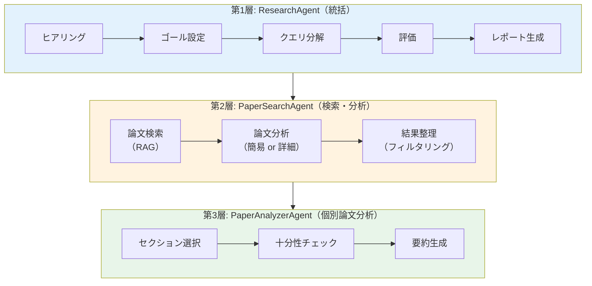
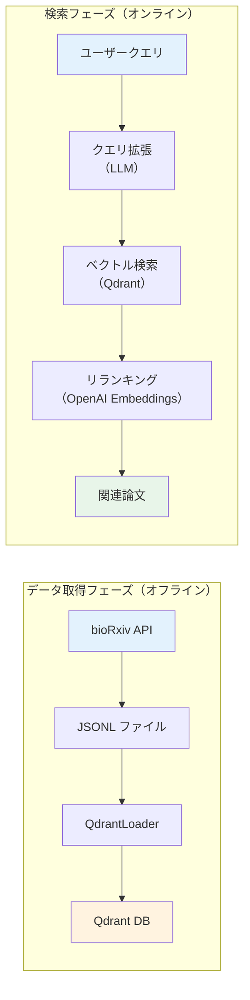
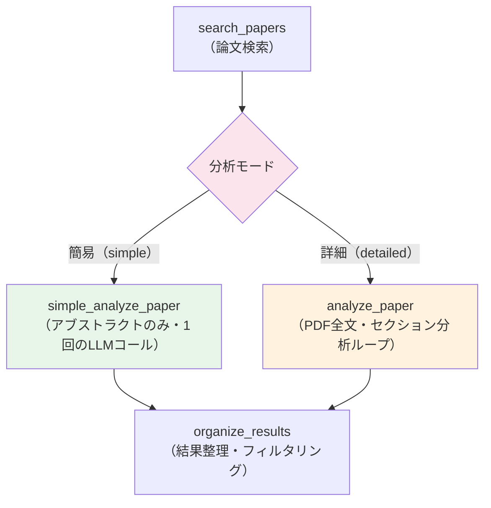
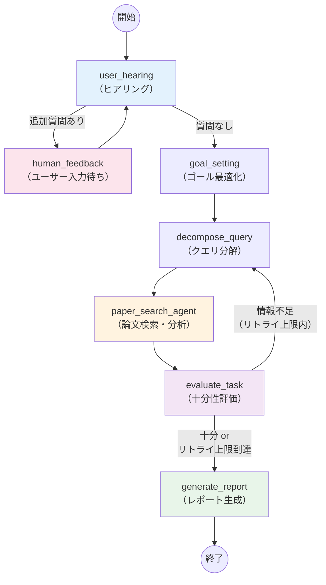

# Chapter 6 応用編: bioRxiv × RAG 論文リサーチ AI エージェント

Chapter 6 では arXiv API + Cohere Rerank を使った論文リサーチエージェントを構築しました。しかし、この方式にはいくつかの課題がありました。arXiv API はリアルタイム検索のため、検索のたびに API を叩く必要があり、大量の論文を対象にするとレスポンスが遅くなります。さらに、検索結果の質は API のクエリ構文（キーワードマッチ）に依存するため、意味的に関連する論文を見逃す可能性がありました。

この応用編では、対象を **bioRxiv（バイオインフォマティクス分野のプレプリントサーバー）** に切り替え、**RAG（Retrieval-Augmented Generation）** アーキテクチャを導入します。論文データを事前にベクトルデータベースに格納し、セマンティック検索（意味的な類似性に基づく検索）による高精度な論文検索を実現します。

具体的には、以下の技術を組み合わせて **bioRxiv 論文リサーチ AI エージェント** を実装します。

- **Qdrant（ベクトルデータベース）** — 論文のタイトル＋アブストラクトを Embedding 化して格納し、セマンティック検索を行う
- **OpenAI Embeddings** — テキストのベクトル化とコサイン類似度によるリランキング
- **bioRxiv API** — プレプリントサーバーから論文メタデータを取得し JSONL に保存
- **LangGraph マルチエージェント** — Chapter 6 と同じ三層構造を踏襲
- **簡易 / 詳細モード選択** — ヒアリング時にユーザーが分析の深さを選べる
- **DOI 重複排除** — Qdrant の `must_not` フィルタでサブタスク間の論文重複を排除

:::note Chapter 6 との主な違い

| 項目 | Chapter 6（arXiv） | Chapter 6 応用編（bioRxiv） |
| --- | --- | --- |
| 論文ソース | arXiv API（リアルタイム検索） | bioRxiv API → Qdrant（RAG） |
| 検索方式 | API 検索 + Cohere Rerank | ベクトル検索 + OpenAI Embeddings リランキング |
| データ格納 | なし（都度検索） | Qdrant ベクトル DB に事前格納 |
| 分析モード | 詳細のみ | 簡易（アブストラクトのみ）/ 詳細（PDF 全文）選択可 |
| DOI 重複排除 | なし | サブタスク間で `must_not` フィルタ適用 |
| リトライ | 評価ベース | 評価ベース + 0 件時リトライ |

:::

:::note この応用編で学ぶこと

- **RAG アーキテクチャ** によるセマンティック論文検索（Qdrant + OpenAI Embeddings）
- **bioRxiv API** からの論文メタデータ取得とベクトル DB への投入パイプライン
- **簡易 / 詳細モード** の切り替えによる分析の深さの制御
- **DOI 重複排除** による検索結果の多様性向上（Qdrant `must_not` フィルタ）
- **リトライコンテキスト強化** による再検索の有効性向上
- **0 件時リトライ** による空振り検索の自動リカバリ

:::

## アーキテクチャ

### なぜ RAG を導入するのか

Chapter 6 の arXiv 版では、検索のたびに arXiv API を叩いてリアルタイムに論文を取得していました。この方式には以下の課題があります。

- **検索速度**: API レスポンスに依存するため、大量の論文を対象にすると遅い
- **検索精度**: API のクエリ構文（キーワードマッチ）では、意味的に関連する論文を見逃す可能性がある
- **スケーラビリティ**: 独自のデータセット（社内文書、特定分野の論文集など）を検索対象に追加できない

RAG アーキテクチャでは、論文データを事前にベクトル化してデータベースに格納します。これにより、キーワードの完全一致ではなく **意味的な類似性** に基づいて論文を検索できるようになります。たとえば、「遺伝子発現解析」で検索した場合、「transcriptome profiling」や「gene expression analysis」といった英語の関連論文もヒットします。

### エージェントの三層構造

Chapter 6 と同様に、このエージェントは **3 つの階層** で構成されています。各階層が明確な責務を持ち、LangGraph のサブグラフ機能で入れ子になっています。



- **第 1 層（ResearchAgent）**: ユーザーとの対話からゴールを設定し、クエリ分解 → 検索 → 評価 → レポート生成の全体フローを統括します。評価で「情報不足」と判定された場合はクエリ分解に戻るリトライループを持ちます。
- **第 2 層（PaperSearchAgent）**: 分解されたサブタスクごとに RAG 検索を実行し、取得した論文を並列に分析します。分析モード（簡易 / 詳細）に応じて第 3 層を呼び出すか、簡易分析で完結するかを切り替えます。
- **第 3 層（PaperAnalyzerAgent）**: 詳細モード専用のサブグラフです。PDF 全文からセクションを選択し、十分性をチェックしながら反復的に要約を生成します。

### RAG パイプライン

このエージェントでは、論文データの取得と検索を 2 段階に分離しています。

1. **データ取得フェーズ（オフライン）**: bioRxiv API から論文メタデータを取得 → JSONL に保存 → Qdrant にベクトル化して格納
2. **検索フェーズ（オンライン）**: ユーザークエリ → LLM によるクエリ拡張 → Qdrant ベクトル検索 → OpenAI Embeddings でリランキング



検索フェーズでは、まず LLM がユーザーのサブクエリを英語の学術的な検索クエリに拡張します（bioRxiv の論文は英語のため）。次に Qdrant でベクトル検索を行い、最大 20 件の候補論文を取得します。最後に、OpenAI Embeddings でクエリと各論文のコサイン類似度を計算し、上位の論文だけを残します（リランキング）。関連度スコアが閾値（0.3）未満の論文は除外されます。

:::tip クエリ拡張の効果

日本語で入力された検索クエリも、LLM が英語の学術用語に変換して検索します。たとえば「一細胞RNA解析の最新手法」というクエリは、「single-cell RNA-seq analysis recent methods and tools」のような英語クエリに拡張されます。これにより、言語の壁を超えたセマンティック検索が可能になります。

:::

### 簡易 / 詳細モード

論文リサーチでは、「ざっくり最新動向を把握したい」場合と「特定のテーマを深く掘り下げたい」場合で、求められる分析の深さが異なります。PDF 全文をダウンロード・分析する詳細モードは精度が高い反面、処理時間が長くかかります。

そこで、ヒアリングフェーズでユーザーが分析の深さを選択できるようにしました。

| モード | 処理内容 | 速度 | 精度 |
| --- | --- | --- | --- |
| **簡易（simple）** | タイトル＋アブストラクトのみで関連度判定と回答生成。PDF ダウンロード不要 | 高速 | 概要レベル |
| **詳細（detailed）** | PDF 全文を取得し、セクション分析 → 十分性チェック → 要約の反復処理 | 低速 | 詳細 |

簡易モードでは `SimpleAnalyzer` が 1 回の LLM コールで関連度判定と回答生成を行い、`PaperAnalyzerAgent`（3 ステップの反復処理）を完全にバイパスします。



:::tip 簡易モードの活用シーン

簡易モードは以下のような場面で特に有効です。

- **広範なサーベイ**: 数十〜数百の論文を対象に、関連分野の全体像をざっくり把握したい場合
- **初期調査**: 本格的な文献レビューの前に、どのようなテーマの論文が存在するかを素早く確認したい場合
- **コスト削減**: PDF ダウンロードと全文分析の LLM コストを抑えたい場合

:::

### 全体ワークフロー

以下は `ResearchAgent` の LangGraph ワークフロー全体図です。評価で「情報不足」と判定された場合、クエリ分解に戻るリトライループが発生します。



### エージェントの構成ファイル

| ファイル | 役割 |
| --- | --- |
| `chapter6-biorxiv/models.ts` | 型定義と Zod スキーマ（`BiorxivPaper`、`ReadingResult`、`Hearing` 等）、論文リストのフォーマット |
| `chapter6-biorxiv/configs.ts` | 設定読み込み（API キー、モデル名、分析モード、Qdrant 接続情報）と LLM インスタンス生成 |
| `chapter6-biorxiv/custom-logger.ts` | タイムスタンプ付きカスタムロガー |
| `chapter6-biorxiv/searcher/searcher.ts` | 検索インターフェース定義（`excludeDois` パラメータ付き） |
| `chapter6-biorxiv/rag/biorxiv-fetcher.ts` | bioRxiv API からの論文取得（レジューム・追記対応） |
| `chapter6-biorxiv/rag/qdrant-store.ts` | Qdrant ベクトル DB の操作（検索・追加・DOI フィルタ） |
| `chapter6-biorxiv/rag/qdrant-loader.ts` | JSONL → Qdrant へのバッチ投入 |
| `chapter6-biorxiv/rag/rag-searcher.ts` | クエリ拡張 → ベクトル検索 → リランキングの RAG パイプライン |
| `chapter6-biorxiv/service/pdf-to-text.ts` | PDF → テキスト変換（詳細モード用） |
| `chapter6-biorxiv/service/markdown-storage.ts` | Markdown ファイルの読み書き管理 |
| `chapter6-biorxiv/service/markdown-parser.ts` | Markdown をセクション単位にパース |
| `chapter6-biorxiv/chains/hearing-chain.ts` | ユーザーヒアリング（モード選択含む） |
| `chapter6-biorxiv/chains/goal-optimizer-chain.ts` | 検索ゴールの具体化・最適化 |
| `chapter6-biorxiv/chains/query-decomposer-chain.ts` | ゴールを 3〜5 個のサブタスクに分解（リトライコンテキスト付き） |
| `chapter6-biorxiv/chains/paper-processor-chain.ts` | 論文検索 → PDF 変換 → DOI 重複排除 → Send による並列分析 |
| `chapter6-biorxiv/chains/simple-analyzer-chain.ts` | アブストラクトのみの簡易分析（簡易モード用） |
| `chapter6-biorxiv/chains/reading-chains.ts` | セクション選択・十分性チェック・要約の 3 チェーン（詳細モード用） |
| `chapter6-biorxiv/chains/task-evaluator-chain.ts` | 調査結果の十分性評価と再検索判定（0 件リトライ対応） |
| `chapter6-biorxiv/chains/reporter-chain.ts` | 最終レポート生成（`biorxivPaperToXml` で論文メタデータを正確にシリアライズ） |
| `chapter6-biorxiv/agent/paper-analyzer-agent.ts` | 個別論文の分析エージェント（LangGraph サブグラフ） |
| `chapter6-biorxiv/agent/paper-search-agent.ts` | 論文検索・分析エージェント（簡易 / 詳細モード分岐） |
| `chapter6-biorxiv/agent/research-agent.ts` | メインエージェント（LangGraph メイングラフ） |

### 主な設定パラメータ

すべての設定は環境変数でオーバーライドできます。`configs.ts` で管理されています。

| パラメータ | 環境変数 | デフォルト値 | 説明 |
| --- | --- | --- | --- |
| `openaiSmartModel` | `OPENAI_SMART_MODEL` | `gpt-4o` | ヒアリング・ゴール設定・評価に使用する LLM |
| `openaiFastModel` | `OPENAI_FAST_MODEL` | `gpt-4o-mini` | 検索クエリ拡張・簡易分析に使用する高速 LLM |
| `openaiReporterModel` | `OPENAI_REPORTER_MODEL` | `gpt-4o` | 最終レポート生成に使用する LLM |
| `embeddingModel` | `EMBEDDING_MODEL` | `text-embedding-3-small` | ベクトル化に使用する Embedding モデル（1536 次元） |
| `analysisMode` | `ANALYSIS_MODE` | `detailed` | 分析モード（`simple` / `detailed`） |
| `maxPapers` | `MAX_PAPERS` | `3` | リランキング後に保持する論文数（タスクあたり） |
| `maxSearchResults` | `MAX_SEARCH_RESULTS` | `20` | ベクトル検索で取得する候補論文数 |
| `maxEvaluationRetryCount` | `MAX_EVALUATION_RETRY_COUNT` | `3` | 評価リトライの上限回数 |
| `maxWorkers` | `MAX_WORKERS` | `3` | 論文分析の並列ワーカー数 |
| `qdrantCollectionName` | `QDRANT_COLLECTION_NAME` | `biorxiv-bioinformatics` | Qdrant のコレクション名 |
| `qdrantUrl` | `QDRANT_URL` | `http://localhost:6333` | Qdrant サーバーの接続 URL |

:::info 前提条件

- 環境変数 `OPENAI_API_KEY` に OpenAI の API キーが設定されていること
- **Docker** で Qdrant が起動していること（`docker compose up -d`）
- `@langchain/langgraph`、`@langchain/openai`、`@qdrant/js-client-rest`、`openai` パッケージがインストールされていること（`pnpm install` で自動インストール）

:::

## データ取得と Qdrant への投入

RAG アーキテクチャでは、エージェントを使う前に論文データをベクトルデータベースに格納しておく必要があります。このデータ準備は一度だけ行えば、以降は何度でも高速に検索できます。

データ取得の流れは以下の 3 ステップです。

### Step 1: Qdrant の起動

```bash
cd packages/@ai-suburi/core/chapter6-biorxiv
docker compose up -d
```

### Step 2: bioRxiv から論文データを取得

```bash
pnpm tsx chapter6-biorxiv/rag/biorxiv-fetcher.ts \
  --start 2023-01-01 --end 2026-03-31 \
  --category bioinformatics
```

取得した論文は `storage/biorxiv-tmp/` に JSONL（1 行 1 論文の JSON）形式で保存されます。bioRxiv API はレート制限があるため、エクスポネンシャルバックオフで自動リトライします。中断した場合は `--resume` で再開できます。

:::caution bioRxiv API の取得時間

バイオインフォマティクス分野だけでも数万件の論文があるため、全期間の取得には数十分〜数時間かかる場合があります。まずは短い期間（例: `--start 2025-01-01 --end 2025-03-31`）で試すことをおすすめします。

:::

### Step 3: Qdrant にベクトルデータを投入

```bash
pnpm tsx chapter6-biorxiv/rag/qdrant-loader.ts \
  --input storage/biorxiv-tmp/biorxiv_*.jsonl
```

ローダーは JSONL を行単位でストリーム読み込みし、50 件ずつバッチで Qdrant に投入します。DOI で重複チェックを行うため、同じ JSONL を再投入しても重複は発生しません。

**実行結果の例:**

```text
[qdrant-loader] Batch 1: 50 added, 0 skipped
[qdrant-loader] Batch 2: 50 added, 0 skipped
...
[qdrant-loader] Loading complete. 1250 new papers added, 0 skipped. Total in collection: 1250
```

## エージェントの実行

```bash
# 対話モード（ヒアリングでモード選択）
pnpm tsx chapter6-biorxiv/agent/research-agent.ts "生成AIを用いたゲノム解析の最新動向"

# ヒアリングスキップモード（自動続行）
pnpm tsx chapter6-biorxiv/agent/research-agent.ts "single-cell RNA-seq解析の最新手法" --skip-feedback
```

対話モードでは、エージェントがヒアリングを行い、分析モード（簡易 / 詳細）や追加の検索条件をユーザーに確認します。`--skip-feedback` を指定すると、ヒアリングをスキップしてデフォルト設定で自動実行します。

エージェントは以下の流れで処理を進めます。

1. **ヒアリング** → ユーザーの意図を確認し、分析モードを決定
2. **ゴール設定** → 検索ゴールを具体化・最適化
3. **クエリ分解** → ゴールを 3〜5 個のサブタスクに分解
4. **論文検索・分析** → 各サブタスクで RAG 検索 → 論文分析（簡易 or 詳細）
5. **評価** → 調査結果の十分性を評価（不足なら 3 に戻る）
6. **レポート生成** → 調査結果を統合してレポートを出力

**実行結果の例（一部抜粋）:**

```text
[research-agent] |--> user_hearing
[research-agent] |--> goal_setting
[research-agent] |--> decompose_query
[paper-search-agent] |--> search_papers
[rag-searcher] Searching with query: "single-cell RNA-seq analysis recent methods and tools"
[rag-searcher] After reranking: 3 papers above threshold.
[paper-search-agent] |--> simple_analyze_paper
[paper-search-agent] |--> organize_results
[paper-search-agent] 論文フィルタリング: 全9件 → 関連あり6件（除外3件）
[research-agent] |--> evaluate_task
[research-agent] |--> generate_report
```

## Chapter 6 からの主な改善点

この応用編では、Chapter 6 で見つかった課題を解決するために、4 つの主要な改善を行いました。

### DOI 重複排除

ベクトル検索では、意味的に近いサブタスク同士で同じ論文がヒットしやすいという特性があります。たとえば「single-cell RNA-seq の最新手法」と「RNA-seq データの前処理技術」のような関連するサブタスクでは、同じ論文が重複して返されることがあります。重複論文を分析するのは LLM コストと時間の無駄になるため、検索段階で排除する必要があります。

この問題を Qdrant の `must_not` フィルタで解決しました。`PaperProcessor` がタスクを順次処理する際、前のタスクで見つかった DOI を蓄積し、次のタスクの検索から除外します。

```typescript title="chapter6-biorxiv/chains/paper-processor-chain.ts"
const allFoundDois: string[] = [];
for (const task of state.tasks) {
  const searchedPapers = await this.searcher.run(state.goal, task, allFoundDois);
  for (const paper of searchedPapers) {
    uniquePapers.set(paper.doi, paper);
    allFoundDois.push(paper.doi);
  }
}
```

### リトライ時のコンテキスト強化

Chapter 6 では、`TaskEvaluator` が「情報不足」と判定した場合に `QueryDecomposer` へ戻ってサブタスクを再生成します。しかし、前回どのようなサブタスクで検索したかの情報が渡されていませんでした。そのため、リトライしても同じようなサブタスクが生成され、同じ論文ばかりヒットするという問題がありました。

この応用編では、リトライ時に以下の情報を `QueryDecomposer` のプロンプトに含めることで、この問題を解決しています。

- **前回のサブタスク一覧**: 「これらとは異なるサブタスクを生成してください」という指示とともに渡す
- **取得済み論文リスト**: 既に見つかった論文を提示し、同じ論文の再取得を避ける

これにより、リトライのたびに異なる角度からの検索が行われ、情報の網羅性が向上します。前述の DOI 重複排除と組み合わせることで、リトライ時の検索結果の多様性がさらに高まります。

### 0 件時のリトライ対応

Chapter 6 では、関連論文が 0 件の場合に即座にレポート生成に進んでいました。ベクトル検索では、クエリの表現によってはヒット数が大きく変わるため、1 回の検索で見つからなくてもクエリを変えれば見つかる可能性があります。

この応用編では、0 件の場合でもリトライ上限（デフォルト: 3 回）まで `decompose_query` に戻り、別角度で再検索を試みます。`TaskEvaluator` がフィードバックメッセージとして「より一般的な検索キーワードや異なるアプローチのサブタスクを生成してください」を含めることで、LLM が検索戦略を自動的に調整します。リトライ上限に達した場合は、それまでに取得できた情報でレポートを生成します。

### レポーターの論文メタデータ対応

Chapter 6 の `Reporter` では `dictToXmlStr()` を使って `ReadingResult` を XML に変換していました。しかし、この汎用関数ではネストされた `paper` オブジェクトが `[object Object]` として出力されてしまい、論文のタイトル・DOI・URL 等のメタデータが LLM に渡されていませんでした。その結果、生成されるレポートに具体的な論文情報や引用リンクが含まれないという問題がありました。

この応用編では、専用の `biorxivPaperToXml()` 関数を作成し、論文メタデータを正確に XML にシリアライズします。これにより、レポートに論文タイトル・DOI リンク・著者名を含む具体的な引用と参考文献リストが生成されるようになりました。

---

## 参考文献

- [Qdrant - Vector Database](https://qdrant.tech/) — ベクトルデータベースの公式サイト
- [Qdrant JavaScript Client](https://github.com/qdrant/qdrant-js) — Qdrant の TypeScript/JavaScript クライアント
- [Qdrant Filtering Documentation](https://qdrant.tech/documentation/concepts/filtering/) — `must_not` フィルタなどのフィルタリング機能
- [bioRxiv API Documentation](https://api.biorxiv.org/) — bioRxiv の論文メタデータ API
- [OpenAI Embeddings Guide](https://platform.openai.com/docs/guides/embeddings) — テキストのベクトル化 API
- [LangGraph.js Documentation](https://langchain-ai.github.io/langgraphjs/) — LangGraph の TypeScript 版ドキュメント
- [Zod Documentation](https://zod.dev/) — TypeScript のスキーマバリデーションライブラリ
