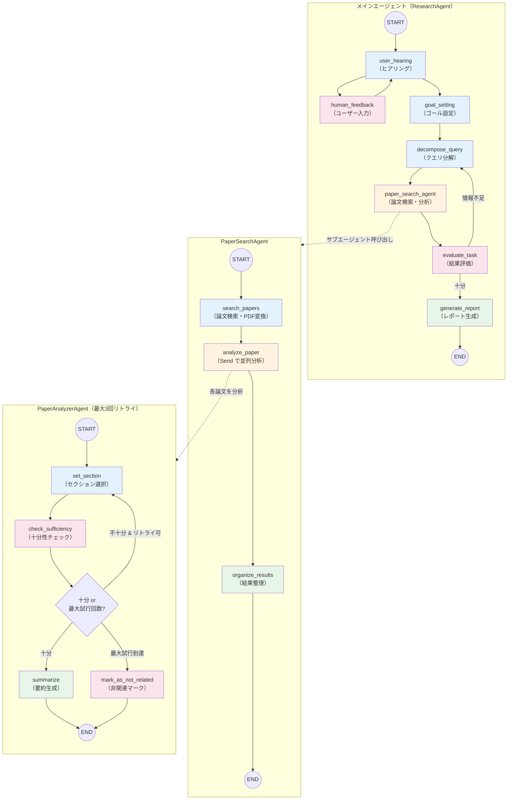
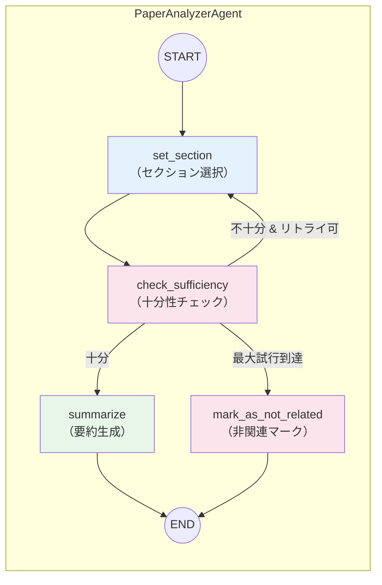

# Chapter 6: arXiv 論文リサーチ AI エージェントの実装

研究者やエンジニアが最新の研究動向を把握するためには、arXiv などの論文リポジトリから関連論文を検索し、内容を読み込み、要点をまとめるという作業が欠かせません。しかし、検索クエリの最適化、大量の論文の中から本当に関連性の高いものを選別し、PDF を読み込んで要約するという一連の作業は膨大な時間を要します。

Chapter 5 では「コード実行を伴うデータ分析」を自動化しました。この章では対象を**学術論文のリサーチ**に拡げ、ユーザーの調査目的をヒアリングし、arXiv から論文を検索・分析し、最終的に調査レポートを自動生成するマルチエージェントシステムを構築します。

具体的には、以下の技術を組み合わせて **arXiv 論文リサーチ AI エージェント**を実装します。

- **LangGraph マルチエージェント** — メインエージェント + サブエージェント 2 層の階層構造でワークフローを制御する
- **arXiv API** — 学術論文の検索・取得を行う
- **Cohere Rerank** — 検索結果をセマンティックリランキングで関連度順に並べ替える
- **Jina Reader API** — PDF を Markdown に変換して LLM が読める形式にする
- **Structured Outputs（Zod スキーマ）** — ヒアリング・タスク分解・評価などの出力を型安全に構造化する
- **Claude Sonnet 4** — 最終レポートの生成に使用する

:::note この章で学ぶこと

- LangGraph による**マルチエージェント**アーキテクチャ（メインエージェント + サブエージェント 2 層）
- **arXiv API** を使った学術論文検索と LLM によるクエリ最適化
- **Cohere Rerank** によるセマンティックリランキング
- **Jina Reader API** による PDF → Markdown 変換
- LangGraph の **Send API** による動的な並列タスク分配
- `interrupt()` による **human-in-the-loop**（ヒアリングフェーズ）
- **Structured Outputs**（Zod スキーマ）による型安全な LLM 出力
- 調査結果の自動評価と**再検索ループ**（TaskEvaluator）

:::

## 概要

### エージェントのアーキテクチャ

この論文リサーチエージェントは、**ResearchAgent（メインエージェント）**、**PaperSearchAgent**、**PaperAnalyzerAgent** の三層構造で設計されています。

なぜ三層構造にするのでしょうか？ユーザーの調査目的は「LLM エージェントの評価方法」のように抽象的であることが多く、これを具体的なサブタスクに分解し、各タスクに対して複数の論文を検索・分析する必要があります。さらに、各論文の分析ではセクション選択 → 十分性チェック → 要約という反復的な処理が必要です。これらを階層的なエージェントで分離することで、各層の責務が明確になり、並列実行による高速化も実現できます。

それぞれの役割を整理すると以下の通りです。

- **ResearchAgent（メインエージェント）**: ユーザーへのヒアリング → ゴール設定 → クエリ分解 → 論文検索・分析 → 結果評価 → レポート生成の全体フローを制御する
- **PaperSearchAgent**: タスクごとに arXiv から論文を検索し、PDF → Markdown 変換後、各論文の分析を PaperAnalyzerAgent に並列で委譲する
- **PaperAnalyzerAgent**: 個別の論文に対してセクション選択 → 十分性チェック → 要約の反復処理を行い、関連性を判定する



### 学習の流れ

| セクション | 内容 | キーワード |
| --- | --- | --- |
| 6-1 | 型定義と Zod スキーマ（ArxivPaper, ReadingResult, Hearing 等） | Zod, Structured Outputs |
| 6-2 | 設定管理と LLM インスタンス生成（OpenAI + Anthropic） | configs, マルチプロバイダ |
| 6-3 | arXiv 論文検索とクエリ最適化（フィールド選択・日付絞り込み・リトライ） | arXiv API, Cohere Rerank |
| 6-4 | PDF → Markdown 変換とストレージ管理 | Jina Reader API, キャッシュ |
| 6-5 | Markdown パーサーとセクション抽出 | MarkdownParser, XML フォーマット |
| 6-6 | ヒアリング・ゴール最適化・クエリ分解チェーン | HearingChain, GoalOptimizer, QueryDecomposer |
| 6-7 | 論文分析エージェント（セクション選択 → 十分性チェック → 要約） | PaperAnalyzerAgent, SetSection, CheckSufficiency |
| 6-8 | 論文検索エージェント（検索 → PDF 変換 → 分析の並列実行） | PaperSearchAgent, Send API, PaperProcessor |
| 6-9 | タスク評価と再検索ループ | TaskEvaluator, 再分解 |
| 6-10 | レポート生成（Claude Sonnet 4） | Reporter, ChatAnthropic |
| 6-11 | メインエージェント（ResearchAgent）と LangGraph ワークフロー全体 | StateGraph, interrupt, human-in-the-loop |

:::info 前提条件

- 環境変数 `OPENAI_API_KEY` に OpenAI の API キーが設定されていること
- 環境変数 `ANTHROPIC_API_KEY` に Anthropic の API キーが設定されていること
- 環境変数 `COHERE_API_KEY` に Cohere の API キーが設定されていること
- 環境変数 `JINA_API_KEY` に Jina Reader の API キーが設定されていること
- `@langchain/langgraph`、`@langchain/openai`、`@langchain/anthropic`、`cohere-ai`、`fast-xml-parser` パッケージがインストールされていること（`pnpm install` で自動インストール）

:::

### サンプルコードの実行方法

各サンプルは、リポジトリのルートディレクトリから以下のコマンドで実行できます。

```bash
# ルートディレクトリで実行（pnpm tsx は @ai-suburi/core パッケージ内で tsx を実行するエイリアス）
pnpm tsx chapter6/agent/research-agent.ts "LLMエージェントの評価方法について調べる"
```

### エージェントの構成ファイル

論文リサーチエージェントは、以下のモジュールで構成されています。

| ファイル | 役割 |
| --- | --- |
| `chapter6/models.ts` | 型定義と Zod スキーマ（`ArxivPaper`、`ReadingResult`、`Hearing` など） |
| `chapter6/configs.ts` | 設定読み込み（API キー、モデル名、エージェント設定） |
| `chapter6/custom-logger.ts` | タイムスタンプ付きカスタムロガー（Chapter 5 から再利用） |
| `chapter6/searcher/searcher.ts` | 検索インターフェース定義 |
| `chapter6/searcher/arxiv-searcher.ts` | arXiv API 検索 + Cohere リランキング |
| `chapter6/service/pdf-to-markdown.ts` | Jina Reader API による PDF → Markdown 変換 |
| `chapter6/service/markdown-storage.ts` | Markdown ファイルの読み書き管理 |
| `chapter6/service/markdown-parser.ts` | Markdown をセクション単位にパース・XML フォーマット |
| `chapter6/chains/utils.ts` | プロンプト読み込み・XML 変換ヘルパー |
| `chapter6/chains/hearing-chain.ts` | ユーザーヒアリング（追加質問の要否判定） |
| `chapter6/chains/goal-optimizer-chain.ts` | 検索ゴールの具体化・最適化 |
| `chapter6/chains/query-decomposer-chain.ts` | ゴールを 3〜5 個のサブタスクに分解 |
| `chapter6/chains/paper-processor-chain.ts` | 論文検索 → PDF 変換 → 重複排除 → Send による並列分析 |
| `chapter6/chains/reading-chains.ts` | セクション選択・十分性チェック・要約の 3 チェーン |
| `chapter6/chains/task-evaluator-chain.ts` | 調査結果の十分性評価と再検索判定 |
| `chapter6/chains/reporter-chain.ts` | Claude Sonnet 4 による最終レポート生成 |
| `chapter6/agent/paper-analyzer-agent.ts` | 個別論文の分析エージェント（LangGraph サブグラフ） |
| `chapter6/agent/paper-search-agent.ts` | 論文検索・分析エージェント（LangGraph サブグラフ） |
| `chapter6/agent/research-agent.ts` | メインエージェント（LangGraph メイングラフ） |

---

## 6-1. 型定義と Zod スキーマ

エージェント全体で使用するデータ型を Zod スキーマで定義します。Chapter 5 と同様に、Structured Outputs で LLM の出力を型安全に構造化するために Zod を活用します。

主な型は以下の通りです。

| 型名 | 用途 |
| --- | --- |
| `ArxivPaper` | arXiv から取得した論文データ（タイトル、著者、アブストラクト、関連度スコア等） |
| `ReadingResult` | 論文の分析結果（タスク、論文データ、回答、関連性フラグ） |
| `Section` | Markdown をパースしたセクション（ヘッダー、コンテンツ、文字数） |
| `Hearing` | ヒアリング結果（追加質問の要否と質問文） |
| `DecomposedTasks` | クエリ分解結果（サブタスクのリスト） |
| `TaskEvaluation` | タスク評価結果（追加情報の要否、理由、追加調査内容） |
| `Sufficiency` | セクション情報の十分性判定（十分かどうかと理由） |
| `ArxivFields` | arXiv カテゴリ（cs.AI、math.CO など） |
| `ArxivTimeRange` | 検索の時間範囲（開始日・終了日） |

`arxivPaperToXml()` は論文データを XML 形式に変換するヘルパー関数で、LLM のプロンプトに論文情報を渡す際に使用します。`formatTimeRange()` は日付範囲を arXiv API のクエリ形式に変換します。

```typescript title="chapter6/models.ts"
import { z } from 'zod/v4';

// --- ArxivPaper ---
export const arxivPaperSchema = z.object({
  id: z.string().describe('arXiv ID'),
  title: z.string().describe('論文タイトル'),
  link: z.string().describe('論文リンク'),
  pdfLink: z.string().describe('PDFリンク'),
  abstract: z.string().describe('論文アブストラクト'),
  published: z.string().describe('公開日 (ISO string)'),
  updated: z.string().describe('更新日 (ISO string)'),
  version: z.number().describe('バージョン'),
  authors: z.array(z.string()).describe('著者'),
  categories: z.array(z.string()).describe('カテゴリ'),
  relevanceScore: z.number().nullable().optional().describe('関連度スコア'),
});
export type ArxivPaper = z.infer<typeof arxivPaperSchema>;

export function arxivPaperToXml(paper: ArxivPaper): string {
  return `<paper>
  <id>${paper.id}</id>
  <title>${paper.title}</title>
  <link>${paper.link}</link>
  <pdf_link>${paper.pdfLink}</pdf_link>
  <abstract>${paper.abstract}</abstract>
  <published>${paper.published}</published>
  <updated>${paper.updated}</updated>
  <version>${paper.version}</version>
  <authors>${paper.authors.join(', ')}</authors>
  <categories>${paper.categories.join(', ')}</categories>
  ${paper.relevanceScore != null ? `<relevance_score>${paper.relevanceScore}</relevance_score>` : ''}
</paper>`;
}

// --- ReadingResult ---
export const readingResultSchema = z.object({
  id: z.number().describe('ID'),
  task: z.string().describe('調査タスク'),
  paper: arxivPaperSchema.describe('論文データ'),
  markdownPath: z.string().describe('論文のmarkdownファイルへの相対パス'),
  answer: z.string().default('').describe('タスクに対する回答'),
  isRelated: z.boolean().nullable().optional().describe('タスクとの関係性'),
});
export type ReadingResult = z.infer<typeof readingResultSchema>;

// --- Section ---
export const sectionSchema = z.object({
  header: z.string().describe('セクションのヘッダー'),
  content: z.string().describe('セクションの内容'),
  charCount: z.number().describe('セクションの文字数'),
});
export type Section = z.infer<typeof sectionSchema>;

// --- LLM 構造化出力用スキーマ ---

export const hearingSchema = z.object({
  is_need_human_feedback: z
    .boolean()
    .describe('追加の質問が必要かどうか'),
  additional_question: z.string().describe('追加の質問'),
});
export type Hearing = z.infer<typeof hearingSchema>;

export const decomposedTasksSchema = z.object({
  tasks: z.array(z.string()).describe('分解されたタスクのリスト'),
});
export type DecomposedTasks = z.infer<typeof decomposedTasksSchema>;

export const taskEvaluationSchema = z.object({
  need_more_information: z
    .boolean()
    .describe('必要な情報が足りている場合はfalse'),
  reason: z.string().describe('評価の理由を日本語で端的に表す'),
  content: z
    .string()
    .describe('追加の調査として必要な内容を詳細に日本語で記述'),
});
export type TaskEvaluation = z.infer<typeof taskEvaluationSchema>;

export const sufficiencySchema = z.object({
  is_sufficient: z.boolean().describe('十分かどうか'),
  reason: z.string().describe('十分性の判断理由'),
});
export type Sufficiency = z.infer<typeof sufficiencySchema>;

export const arxivFieldsSchema = z.object({
  values: z
    .array(z.string())
    .describe(
      'The arXiv categories that need to be searched based on the user\'s query.',
    ),
});
export type ArxivFields = z.infer<typeof arxivFieldsSchema>;

export const arxivTimeRangeSchema = z.object({
  start: z
    .string()
    .nullable()
    .optional()
    .describe('The start date of the time range (YYYY-MM-DD).'),
  end: z
    .string()
    .nullable()
    .optional()
    .describe('The end date of the time range (YYYY-MM-DD).'),
});
export type ArxivTimeRange = z.infer<typeof arxivTimeRangeSchema>;

export function formatTimeRange(range: ArxivTimeRange): string | null {
  const formatDate = (dateStr: string): string => {
    return dateStr.replace(/-/g, '');
  };
  if (range.start && range.end) {
    return `${formatDate(range.start)}+TO+${formatDate(range.end)}`;
  }
  if (range.start) {
    return `${formatDate(range.start)}+TO+LATEST`;
  }
  if (range.end) {
    return `EARLIEST+TO+${formatDate(range.end)}`;
  }
  return null;
}
```

---

## 6-2. 設定管理と LLM インスタンス生成

環境変数から API キーとモデル設定を読み込むモジュールです。このエージェントは **OpenAI**（推論用）、**Anthropic**（レポート生成用）、**Cohere**（リランキング用）、**Jina**（PDF 変換用）の 4 つの外部サービスを利用するため、それぞれの API キーが必須です。

LLM インスタンスは用途に応じて 3 種類を生成します。

| 関数 | モデル | 用途 |
| --- | --- | --- |
| `createLlm()` | GPT-4o（Smart） | ヒアリング、ゴール最適化、タスク評価など高品質な推論 |
| `createFastLlm()` | GPT-4o-mini（Fast） | クエリ展開、フィールド選択など高速な処理 |
| `createReporterLlm()` | Claude Sonnet 4 | 最終レポートの生成（長文出力） |

```typescript title="chapter6/configs.ts"
import { ChatAnthropic } from '@langchain/anthropic';
import { ChatOpenAI } from '@langchain/openai';

export interface Settings {
  openaiApiKey: string;
  anthropicApiKey: string;
  cohereApiKey: string;
  jinaApiKey: string;
  debug: boolean;
  // モデル設定
  openaiSmartModel: string;
  openaiFastModel: string;
  anthropicModel: string;
  cohereRerankModel: string;
  temperature: number;
  // エージェント設定
  maxEvaluationRetryCount: number;
  minDecomposedTasks: number;
  maxDecomposedTasks: number;
  maxSearchRetries: number;
  maxSearchResults: number;
  maxPapers: number;
  maxWorkers: number;
  maxRecursionLimit: number;
}

export function loadSettings(): Settings {
  const openaiApiKey = process.env.OPENAI_API_KEY;
  const anthropicApiKey = process.env.ANTHROPIC_API_KEY;
  const cohereApiKey = process.env.COHERE_API_KEY;
  const jinaApiKey = process.env.JINA_API_KEY;

  if (!openaiApiKey) {
    throw new Error('OPENAI_API_KEY environment variable is required');
  }
  if (!anthropicApiKey) {
    throw new Error('ANTHROPIC_API_KEY environment variable is required');
  }
  if (!cohereApiKey) {
    throw new Error('COHERE_API_KEY environment variable is required');
  }
  if (!jinaApiKey) {
    throw new Error('JINA_API_KEY environment variable is required');
  }

  return {
    openaiApiKey,
    anthropicApiKey,
    cohereApiKey,
    jinaApiKey,
    debug: process.env.DEBUG === 'true',
    // モデル設定
    openaiSmartModel: process.env.OPENAI_SMART_MODEL ?? 'gpt-4o',
    openaiFastModel: process.env.OPENAI_FAST_MODEL ?? 'gpt-4o-mini',
    anthropicModel:
      process.env.ANTHROPIC_MODEL ?? 'claude-sonnet-4-20250514',
    cohereRerankModel:
      process.env.COHERE_RERANK_MODEL ?? 'rerank-multilingual-v3.0',
    temperature: Number(process.env.TEMPERATURE ?? '0'),
    // エージェント設定
    maxEvaluationRetryCount: Number(
      process.env.MAX_EVALUATION_RETRY_COUNT ?? '3',
    ),
    minDecomposedTasks: Number(process.env.MIN_DECOMPOSED_TASKS ?? '3'),
    maxDecomposedTasks: Number(process.env.MAX_DECOMPOSED_TASKS ?? '5'),
    maxSearchRetries: Number(process.env.MAX_SEARCH_RETRIES ?? '3'),
    maxSearchResults: Number(process.env.MAX_SEARCH_RESULTS ?? '10'),
    maxPapers: Number(process.env.MAX_PAPERS ?? '3'),
    maxWorkers: Number(process.env.MAX_WORKERS ?? '3'),
    maxRecursionLimit: Number(process.env.MAX_RECURSION_LIMIT ?? '1000'),
  };
}

export function createLlm(settings: Settings): ChatOpenAI {
  return new ChatOpenAI({
    model: settings.openaiSmartModel,
    temperature: settings.temperature,
  });
}

export function createFastLlm(settings: Settings): ChatOpenAI {
  return new ChatOpenAI({
    model: settings.openaiFastModel,
    temperature: settings.temperature,
  });
}

export function createReporterLlm(settings: Settings): ChatAnthropic {
  return new ChatAnthropic({
    model: settings.anthropicModel,
    temperature: settings.temperature,
    maxTokens: 8192,
  });
}
```

カスタムロガーは Chapter 5 で実装したものを再利用します。

```typescript title="chapter6/custom-logger.ts"
export { setupLogger, type Logger } from '../chapter5/custom-logger.js';
```

---

## 6-3. arXiv 論文検索とクエリ最適化

arXiv API を使った論文検索の実装です。単純にキーワード検索するだけでなく、以下の 4 段階の最適化パイプラインで検索精度を高めます。

1. **フィールド選択（`fieldSelector`）**: LLM がクエリから適切な arXiv カテゴリ（cs.AI、math.CO など）を判定
2. **日付範囲選択（`dateSelector`）**: LLM がクエリから検索対象の時間範囲を推定
3. **クエリ展開（`expandQuery`）**: LLM がサブクエリから arXiv 検索に最適な検索クエリを生成（検索結果が 0 件の場合は最大 3 回リトライ）
4. **Cohere リランキング**: 検索結果を `rerank-multilingual-v3.0` でリランキングし、関連度スコア 0.7 以上の論文のみを返す

まず、検索インターフェースを定義します。

```typescript title="chapter6/searcher/searcher.ts"
import type { ArxivPaper } from '../models.js';

export interface Searcher {
  run(goalSetting: string, query: string): Promise<ArxivPaper[]>;
}
```

次に、`ArxivSearcher` の実装です。arXiv API の XML レスポンスを `fast-xml-parser` でパースし、Cohere のリランキングで関連度を評価します。

```typescript title="chapter6/searcher/arxiv-searcher.ts"
import { StringOutputParser } from '@langchain/core/output_parsers';
import { ChatPromptTemplate } from '@langchain/core/prompts';
import type { ChatOpenAI } from '@langchain/openai';
import { CohereClient } from 'cohere-ai';
import { XMLParser } from 'fast-xml-parser';

import { setupLogger } from '../custom-logger.js';
import {
  type ArxivFields,
  type ArxivPaper,
  type ArxivTimeRange,
  arxivFieldsSchema,
  arxivTimeRangeSchema,
  formatTimeRange,
} from '../models.js';
import type { Searcher } from './searcher.js';

const logger = setupLogger('arxiv-searcher');

const FIELD_SELECTOR_PROMPT = `\
Determine the arXiv categories that need to be searched based on the user's query.
Select one or more category names, separated by commas.
Reply only with the exact category names (e.g., cs.AI, math.CO).

User Query: {query}`;

const DATE_SELECTOR_PROMPT = `\
Determine the time range to be retrieved based on the user's query and the current system time.
Use the format YYMM-YYMM (e.g., 2203-2402 for March 2022 to February 2024).
If no time range is specified, reply with "NONE".

Current Date: {current_date}
User Query: {query}`;

const EXPAND_QUERY_PROMPT = `\
<system>
あなたは、与えられた単一のサブクエリから効果的なarXiv検索クエリを生成する専門家です。あなたの役割は、学術的な文脈を理解し、arXivの検索システムで直接使用できる最適な検索クエリを作成することです。

{feedback}
</system>

## 主要タスク

1. 提供されたサブクエリを分析する
2. サブクエリから重要なキーワードを抽出する
3. 抽出したキーワードを使用して、arXivで直接使用可能な効果的な検索クエリを構築する

## 詳細な指示

<instructions>
1. サブクエリを注意深く読み、主要な概念や専門用語を特定してください。
2. 学術的文脈に適した具体的なキーワードを選択してください。
3. 同義語や関連する用語も考慮に入れてください。
4. arXivの検索構文を適切に使用して、効果的な検索クエリを作成してください。
5. 検索結果が適切に絞り込まれるよう、必要に応じてフィールド指定子を使用してください。
6. 生成したクエリがarXivの検索ボックスに直接コピー＆ペーストできることを確認してください。
</instructions>

## 重要なルール

<rules>
1. クエリには1〜2つの主要なキーワードまたはフレーズを含めてください。
2. 一般的すぎる用語や非学術的な用語は避けてください。
3. 検索クエリは20文字以内に収めてください。
4. クエリの前後に余分な空白や引用符を付けないでください。
5. 説明や理由付けは含めず、純粋な検索クエリのみを出力してください。
6. 最大キーワード数は2つまでにすること。
7. OR検索はしないこと。
</rules>

## arXiv検索の構文ヒント

<arxiv_syntax>
- AND: 複数の用語を含む文書を検索（例：quantum AND computing）
- OR: いずれかの用語を含む文書を検索（例：neural OR quantum）
- 引用符: フレーズ検索（例："quantum computing"）
- フィールド指定子: ti:（タイトル）, au:（著者）, abs:（要約）
- マイナス記号: 特定の用語を除外（例：quantum -classical）
- ワイルドカード: 部分一致検索（例：neuro*）
</arxiv_syntax>

<keywords>
- 研究的なキーワードの例: RL, Optimization, LLM, etc.
- サーベイ論文について検索する場合は次のキーワードを利用する: Survey, Review
- データセットについて検索する場合は次のキーワードを利用する: Benchmark
- 論文名が分かっている場合は論文名で検索する
</keywords>

## 例

<example>
クエリ: 量子コンピューティングにおける最近の進歩に関する情報を取得する。

arXiv検索クエリ:
ti:"quantum computing"
</example>

<example>
クエリ: 深層強化学習の金融市場への応用に関する最新の研究を見つける。

arXiv検索クエリ:
"deep reinforcement learning" AND "financial markets"
</example>

## 入力フォーマット

<input_format>
目標: {goal_setting}
クエリ: {query}
</input_format>

REMEMBER: rulesタグの内容に必ず従うこと`;

interface ArxivEntry {
  id: string;
  title: string;
  link: string | { '@_href': string; '@_type'?: string }[] | { '@_href': string };
  summary: string;
  published: string;
  updated: string;
  author: { name: string }[] | { name: string };
  category: { '@_term': string }[] | { '@_term': string };
}

export class ArxivSearcher implements Searcher {
  static readonly RELEVANCE_SCORE_THRESHOLD = 0.7;

  private llm: ChatOpenAI;
  private cohereClient: CohereClient;
  private currentDate: string;
  private maxSearchResults: number;
  private maxPapers: number;
  private maxRetries: number;
  private debug: boolean;
  private cohereRerankModel: string;

  constructor(
    llm: ChatOpenAI,
    options: {
      cohereApiKey: string;
      cohereRerankModel?: string;
      maxSearchResults?: number;
      maxPapers?: number;
      maxRetries?: number;
      debug?: boolean;
    },
  ) {
    this.llm = llm;
    this.cohereClient = new CohereClient({ token: options.cohereApiKey });
    this.currentDate = new Date().toISOString().split('T')[0]!;
    this.maxSearchResults = options.maxSearchResults ?? 10;
    this.maxPapers = options.maxPapers ?? 3;
    this.maxRetries = options.maxRetries ?? 3;
    this.debug = options.debug ?? true;
    this.cohereRerankModel =
      options.cohereRerankModel ?? 'rerank-multilingual-v3.0';
  }

  private async fieldSelector(query: string): Promise<ArxivFields> {
    const prompt = ChatPromptTemplate.fromTemplate(FIELD_SELECTOR_PROMPT);
    const chain = prompt.pipe(
      this.llm.withStructuredOutput(arxivFieldsSchema),
    );
    return chain.invoke({ query });
  }

  private async dateSelector(query: string): Promise<ArxivTimeRange> {
    const prompt = ChatPromptTemplate.fromTemplate(DATE_SELECTOR_PROMPT);
    const chain = prompt.pipe(
      this.llm.withStructuredOutput(arxivTimeRangeSchema),
    );
    return chain.invoke({
      current_date: this.currentDate,
      query,
    });
  }

  private async expandQuery(
    goalSetting: string,
    query: string,
    feedback: string = '',
  ): Promise<string> {
    const prompt = ChatPromptTemplate.fromTemplate(EXPAND_QUERY_PROMPT);
    const chain = prompt.pipe(this.llm).pipe(new StringOutputParser());
    return chain.invoke({
      goal_setting: goalSetting,
      query,
      feedback,
    });
  }

  private parseArxivResponse(xmlText: string): ArxivPaper[] {
    const parser = new XMLParser({
      ignoreAttributes: false,
      attributeNamePrefix: '@_',
      isArray: (name) => name === 'entry' || name === 'author' || name === 'category' || name === 'link',
    });
    const parsed = parser.parse(xmlText);
    const entries: ArxivEntry[] = parsed?.feed?.entry ?? [];

    return entries.map((entry) => {
      const id = typeof entry.id === 'string' ? entry.id : String(entry.id);
      const arxivId = id.split('/').pop()?.split('v')[0] ?? '';
      const version = Number.parseInt(
        id.split('/').pop()?.split('v').pop() ?? '1',
        10,
      );

      // PDF リンクの抽出
      let pdfLink = '';
      if (Array.isArray(entry.link)) {
        const pdfEntry = entry.link.find(
          (l) =>
            typeof l === 'object' &&
            '@_type' in l &&
            l['@_type'] === 'application/pdf',
        );
        pdfLink =
          pdfEntry && typeof pdfEntry === 'object' && '@_href' in pdfEntry
            ? pdfEntry['@_href']
            : '';
      }

      // リンクの抽出
      let link = '';
      if (Array.isArray(entry.link)) {
        const htmlEntry = entry.link.find(
          (l) =>
            typeof l === 'object' &&
            (!('@_type' in l) || l['@_type'] !== 'application/pdf'),
        );
        link =
          htmlEntry && typeof htmlEntry === 'object' && '@_href' in htmlEntry
            ? htmlEntry['@_href']
            : '';
      } else if (typeof entry.link === 'string') {
        link = entry.link;
      }

      // 著者の抽出
      const authors = Array.isArray(entry.author)
        ? entry.author.map((a) => a.name ?? '')
        : [entry.author?.name ?? ''];

      // カテゴリの抽出
      const categories = Array.isArray(entry.category)
        ? entry.category.map((c) => c['@_term'] ?? '')
        : [entry.category?.['@_term'] ?? ''];

      return {
        id: arxivId,
        title: typeof entry.title === 'string' ? entry.title.trim() : '',
        link,
        pdfLink,
        abstract:
          typeof entry.summary === 'string'
            ? entry.summary.replace(/\n/g, ' ').trim()
            : '',
        published: entry.published ?? '',
        updated: entry.updated ?? '',
        version,
        authors,
        categories,
        relevanceScore: null,
      };
    });
  }

  async run(goalSetting: string, query: string): Promise<ArxivPaper[]> {
    const baseUrl = 'https://export.arxiv.org/api/query?search_query=';
    let retryCount = 0;
    let feedback = '';
    let papers: ArxivPaper[] = [];

    while (retryCount < this.maxRetries) {
      const arxivTimeRange = await this.dateSelector(query);
      const queryFilterDate = formatTimeRange(arxivTimeRange);

      const expandedQuery = await this.expandQuery(
        goalSetting,
        query,
        feedback,
      );

      const searchQuery = `all:${expandedQuery}`;
      const encodedSearchQuery = encodeURIComponent(searchQuery);

      let fullUrl = `${baseUrl}${encodedSearchQuery}&sortBy=relevance&max_results=${this.maxSearchResults}`;
      if (queryFilterDate) {
        fullUrl += `&submittedDate=${queryFilterDate}`;
      }
      logger.info(`Searching for papers: ${fullUrl}`);

      const response = await fetch(fullUrl);
      const xmlText = await response.text();
      papers = this.parseArxivResponse(xmlText);

      if (this.debug) {
        logger.info(`Found ${papers.length} papers.`);
      }

      if (papers.length > 0) {
        logger.info('Papers found. Exiting retry loop.');
        break;
      }

      retryCount++;
      if (retryCount < this.maxRetries) {
        feedback =
          '検索結果が0件でした。クエリをより一般的なものや関連するキーワードに調整してください。';
        logger.info(
          `No papers found. Retrying with adjusted query. Attempt ${retryCount}/${this.maxRetries}`,
        );
      } else {
        logger.info('Max retries reached. No results found.');
        break;
      }
    }

    if (papers.length > 0) {
      const reranked = await this.cohereClient.v2.rerank({
        model: this.cohereRerankModel,
        query: `${goalSetting}\n${query}`,
        documents: papers.map(
          (paper) => `${paper.title}\n${paper.abstract}`,
        ),
        topN: Math.min(this.maxPapers, papers.length),
      });

      const rerankedPapers: ArxivPaper[] = [];
      for (const result of reranked.results) {
        const paper = papers[result.index]!;
        paper.relevanceScore = result.relevanceScore;
        rerankedPapers.push(paper);
      }

      papers = rerankedPapers.filter(
        (paper) =>
          paper.relevanceScore != null &&
          paper.relevanceScore >= ArxivSearcher.RELEVANCE_SCORE_THRESHOLD,
      );
    }

    return papers;
  }
}
```

---

## 6-4. PDF → Markdown 変換とストレージ管理

arXiv から取得した論文は PDF 形式のため、LLM が読み取れるように Markdown に変換する必要があります。**Jina Reader API** を使って PDF URL から直接 Markdown テキストを取得し、ローカルにキャッシュします。

### Markdown ストレージ

変換後の Markdown ファイルを `storage/markdown/` ディレクトリに保存・読み込みするシンプルなファイル I/O クラスです。

```typescript title="chapter6/service/markdown-storage.ts"
import * as fs from 'node:fs';
import * as path from 'node:path';

export class MarkdownStorage {
  private baseDir: string;

  constructor(baseDir: string = 'storage/markdown') {
    this.baseDir = baseDir;
    fs.mkdirSync(baseDir, { recursive: true });
  }

  write(filename: string, content: string): string {
    const filepath = path.join(this.baseDir, filename);
    fs.writeFileSync(filepath, content, 'utf-8');
    return path.join(this.baseDir, filename);
  }

  read(filePath: string): string {
    const resolvedPath = path.isAbsolute(filePath)
      ? filePath
      : path.join(process.cwd(), filePath);
    return fs.readFileSync(resolvedPath, 'utf-8');
  }
}
```

### PDF → Markdown 変換

`PdfToMarkdown` クラスは Jina Reader API（`https://r.jina.ai`）を使って PDF を Markdown に変換します。一度変換した論文はキャッシュされるため、同じ論文を複数回変換する無駄を防ぎます。

```typescript title="chapter6/service/pdf-to-markdown.ts"
import { loadSettings } from '../configs.js';
import { MarkdownStorage } from './markdown-storage.js';

class JinaApiClient {
  private headers: Record<string, string>;
  private baseUrl: string;

  constructor(apiKey: string) {
    this.headers = { Authorization: `Bearer ${apiKey}` };
    this.baseUrl = 'https://r.jina.ai';
  }

  async convertPdfToMarkdown(pdfUrl: string): Promise<string> {
    const encodedUrl = encodeURIComponent(pdfUrl);
    const jinaUrl = `${this.baseUrl}/${encodedUrl}`;

    const response = await fetch(jinaUrl, { headers: this.headers });
    if (!response.ok) {
      const text = await response.text();
      throw new Error(
        `JINA API error: ${response.status} - ${text}`,
      );
    }

    return response.text();
  }
}

export class PdfToMarkdown {
  private pdfPathOrUrl: string;
  private jinaClient: JinaApiClient;
  private storage: MarkdownStorage;

  constructor(pdfPathOrUrl: string, jinaApiKey?: string) {
    this.pdfPathOrUrl = pdfPathOrUrl;
    const apiKey = jinaApiKey ?? loadSettings().jinaApiKey;
    this.jinaClient = new JinaApiClient(apiKey);
    this.storage = new MarkdownStorage();
  }

  async convert(fileName?: string): Promise<string> {
    let _fileName = fileName ?? this.pdfPathOrUrl.split('/').pop() ?? 'unknown';
    _fileName = `${_fileName}.md`;

    // 既存のmarkdownファイルがあれば、それを読み込んで返す
    try {
      return this.storage.read(_fileName);
    } catch {
      // 新規変換の場合、JINA Reader APIを使用
      const markdown = await this.jinaClient.convertPdfToMarkdown(
        this.pdfPathOrUrl,
      );
      this.storage.write(_fileName, markdown);
      return markdown;
    }
  }
}
```

---

## 6-5. Markdown パーサーとセクション抽出

変換された Markdown 論文をセクション単位にパースし、LLM が必要なセクションだけを選択できるようにするクラスです。

`MarkdownParser` は以下の 3 つの機能を提供します。

- **`parseSections()`**: Markdown テキストをヘッダー（`#`）で分割し、`Section` オブジェクトの配列に変換
- **`getSectionsOverview()`**: 全セクションのインデックス・ヘッダー・プレビュー・文字数を XML 形式で返す（LLM がセクションを選択するための一覧表示）
- **`getSelectedSections()`**: 指定されたインデックスのセクションの全文を XML 形式で返す（選択されたセクションの詳細読み込み）

```typescript title="chapter6/service/markdown-parser.ts"
import type { Section } from '../models.js';

export class MarkdownParser {
  parseSections(text: string): Section[] {
    const sections: Section[] = [];
    const lines = text.split('\n');
    let currentHeader: string | null = null;
    const sectionContent: string[] = [];

    for (const line of lines) {
      if (!line.trim()) {
        continue;
      }

      const headerMatch = line.trim().match(/^(#+)\s+(.+)$/);

      if (headerMatch) {
        if (currentHeader) {
          const sectionText = sectionContent.join('\n');
          sections.push({
            header: currentHeader,
            content: sectionText,
            charCount: sectionText.length,
          });
          sectionContent.length = 0;
        }
        currentHeader = headerMatch[2]!;
      } else if (currentHeader) {
        sectionContent.push(line);
      }
    }

    // 最後のセクションを追加
    if (currentHeader) {
      const sectionText = sectionContent.join('\n');
      sections.push({
        header: currentHeader,
        content: sectionText,
        charCount: sectionText.length,
      });
    }

    return sections;
  }

  formatAsXml(sections: Section[]): string {
    const output: string[] = [];
    output.push('<items>');
    for (let i = 0; i < sections.length; i++) {
      const section = sections[i]!;
      const firstLine = section.content.split('\n')[0]?.trim().slice(0, 200) ?? '';
      output.push('  <item>');
      output.push(`    <index>${i + 1}</index>`);
      output.push(`    <header>${section.header}</header>`);
      output.push(`    <first_line>${firstLine}</first_line>`);
      output.push(`    <char_count>${section.charCount}</char_count>`);
      output.push('  </item>');
    }
    output.push('</items>');
    return output.join('\n');
  }

  getSectionsOverview(text: string): string {
    const sections = this.parseSections(text);
    return this.formatAsXml(sections);
  }

  getSelectedSections(text: string, sectionIndices: number[]): string {
    const sections = this.parseSections(text);
    const selectedSections: string[] = [];
    for (const sectionIndex of sectionIndices) {
      if (sectionIndex >= 1 && sectionIndex <= sections.length) {
        const section = sections[sectionIndex - 1]!;
        selectedSections.push(
          `<section>\n<header>${section.header}</header>\n<content>${section.content}</content>\n</section>`,
        );
      }
    }
    return selectedSections.join('\n');
  }
}
```

---

## 6-6. ヒアリング・ゴール最適化・クエリ分解チェーン

ユーザーの入力から検索可能なサブタスクに変換するまでの 3 つのチェーンです。プロンプトテンプレートの読み込みと XML 変換のヘルパー関数も合わせて紹介します。

### ユーティリティ関数

`loadPrompt()` は `chains/prompts/` ディレクトリからプロンプトファイルを読み込み、`dictToXmlStr()` はオブジェクトを XML 文字列に変換します。

```typescript title="chapter6/chains/utils.ts"
import * as fs from 'node:fs';
import * as path from 'node:path';
import { fileURLToPath } from 'node:url';

const __dirname = path.dirname(fileURLToPath(import.meta.url));

export function loadPrompt(name: string): string {
  const promptPath = path.join(__dirname, 'prompts', `${name}.prompt`);
  return fs.readFileSync(promptPath, 'utf-8').trim();
}

export function dictToXmlStr(
  data: Record<string, unknown>,
  excludeKeys: string[] = [],
): string {
  let xmlStr = '<item>';
  for (const [key, value] of Object.entries(data)) {
    if (!excludeKeys.includes(key)) {
      xmlStr += `<${key}>${value}</${key}>`;
    }
  }
  xmlStr += '</item>';
  return xmlStr;
}
```

### ヒアリングチェーン

`HearingChain` はユーザーのクエリを分析し、追加の質問が必要かどうかを判定します。追加質問が必要な場合は `human_feedback` ノードに遷移し、`interrupt()` でユーザー入力を待ちます。十分な情報があれば `goal_setting` に進みます。

```typescript title="chapter6/chains/hearing-chain.ts"
import { ChatPromptTemplate } from '@langchain/core/prompts';
import type { ChatOpenAI } from '@langchain/openai';
import { Command } from '@langchain/langgraph';
import type { BaseMessage } from '@langchain/core/messages';

import { type Hearing, hearingSchema } from '../models.js';
import { loadPrompt } from './utils.js';

export class HearingChain {
  private llm: ChatOpenAI;
  private currentDate: string;

  constructor(llm: ChatOpenAI) {
    this.llm = llm;
    this.currentDate = new Date().toISOString().split('T')[0]!;
  }

  async invoke(state: Record<string, unknown>): Promise<Command> {
    const messages = (state.messages as BaseMessage[]) ?? [];
    const hearing = await this.run(messages);
    const message: Record<string, string>[] = [];

    if (hearing.is_need_human_feedback) {
      message.push({
        role: 'assistant',
        content: hearing.additional_question,
      });
    }

    const nextNode = hearing.is_need_human_feedback
      ? 'human_feedback'
      : 'goal_setting';

    return new Command({
      goto: nextNode,
      update: { hearing, messages: message },
    });
  }

  async run(messages: BaseMessage[]): Promise<Hearing> {
    const prompt = ChatPromptTemplate.fromTemplate(loadPrompt('hearing'));
    const chain = prompt.pipe(
      this.llm.withStructuredOutput(hearingSchema),
    );
    const hearing = await chain.invoke({
      current_date: this.currentDate,
      conversation_history: this.formatHistory(messages),
    });
    return hearing;
  }

  private formatHistory(messages: BaseMessage[]): string {
    return messages
      .map(
        (message) =>
          `${message.getType()}: ${typeof message.content === 'string' ? message.content : JSON.stringify(message.content)}`,
      )
      .join('\n');
  }
}
```

### ゴール最適化チェーン

`GoalOptimizer` はユーザーの会話履歴から具体的な検索ゴールを生成します。`conversation` モード（初回）と `search` モード（再検索時）の 2 つのプロンプトを使い分けます。

```typescript title="chapter6/chains/goal-optimizer-chain.ts"
import { StringOutputParser } from '@langchain/core/output_parsers';
import type { BaseMessage } from '@langchain/core/messages';
import { ChatPromptTemplate } from '@langchain/core/prompts';
import type { ChatOpenAI } from '@langchain/openai';
import { Command } from '@langchain/langgraph';

import { loadPrompt } from './utils.js';

export class GoalOptimizer {
  private llm: ChatOpenAI;
  private currentDate: string;

  constructor(llm: ChatOpenAI) {
    this.llm = llm;
    this.currentDate = new Date().toISOString().split('T')[0]!;
  }

  async invoke(state: Record<string, unknown>): Promise<Command> {
    const messages = (state.messages as BaseMessage[]) ?? [];
    const goal = await this.run({ messages });
    return new Command({
      goto: 'decompose_query',
      update: { goal },
    });
  }

  async run(params: {
    messages: BaseMessage[];
    mode?: 'conversation' | 'search';
    searchResults?: Record<string, string>[] | null;
    improvementHint?: string | null;
  }): Promise<string> {
    const {
      messages,
      mode = 'conversation',
      searchResults,
      improvementHint,
    } = params;

    const template =
      mode === 'search'
        ? loadPrompt('goal_optimizer_search')
        : loadPrompt('goal_optimizer_conversation');

    const prompt = ChatPromptTemplate.fromTemplate(template);
    const chain = prompt.pipe(this.llm).pipe(new StringOutputParser());

    const inputs: Record<string, string> = {
      current_date: this.currentDate,
      conversation_history: this.formatHistory(messages),
    };

    if (mode === 'search' && searchResults) {
      inputs.search_results = this.formatSearchResults(searchResults);
    }
    if (improvementHint) {
      inputs.improvement_hint = improvementHint;
    }

    return chain.invoke(inputs);
  }

  private formatHistory(messages: BaseMessage[]): string {
    return messages
      .map(
        (message) =>
          `${message.getType()}: ${typeof message.content === 'string' ? message.content : JSON.stringify(message.content)}`,
      )
      .join('\n');
  }

  private formatSearchResults(
    results: Record<string, string>[],
  ): string {
    return results
      .map(
        (result) =>
          `Title: ${result.title ?? ''}\nAbstract: ${result.abstract ?? ''}`,
      )
      .join('\n\n');
  }
}
```

### クエリ分解チェーン

`QueryDecomposer` はゴールを 3〜5 個の具体的なサブタスクに分解します。再検索時は `TaskEvaluation` の内容を基にタスクを再分解します。

```typescript title="chapter6/chains/query-decomposer-chain.ts"
import { ChatPromptTemplate } from '@langchain/core/prompts';
import type { ChatOpenAI } from '@langchain/openai';
import { Command } from '@langchain/langgraph';

import {
  type DecomposedTasks,
  type TaskEvaluation,
  decomposedTasksSchema,
} from '../models.js';
import { loadPrompt } from './utils.js';

export class QueryDecomposer {
  private llm: ChatOpenAI;
  private currentDate: string;
  private minDecomposedTasks: number;
  private maxDecomposedTasks: number;

  constructor(
    llm: ChatOpenAI,
    options: {
      minDecomposedTasks?: number;
      maxDecomposedTasks?: number;
    } = {},
  ) {
    this.llm = llm;
    this.currentDate = new Date().toISOString().split('T')[0]!;
    this.minDecomposedTasks = options.minDecomposedTasks ?? 3;
    this.maxDecomposedTasks = options.maxDecomposedTasks ?? 5;
  }

  async invoke(state: Record<string, unknown>): Promise<Command> {
    const evaluation = state.evaluation as TaskEvaluation | undefined;
    const content = evaluation?.content ?? (state.goal as string) ?? '';
    const decomposedTasks = await this.run(content);

    return new Command({
      goto: 'paper_search_agent',
      update: { tasks: decomposedTasks.tasks },
    });
  }

  async run(query: string): Promise<DecomposedTasks> {
    const prompt = ChatPromptTemplate.fromTemplate(
      loadPrompt('query_decomposer'),
    );
    const chain = prompt.pipe(
      this.llm.withStructuredOutput(decomposedTasksSchema),
    );
    return chain.invoke({
      min_decomposed_tasks: this.minDecomposedTasks,
      max_decomposed_tasks: this.maxDecomposedTasks,
      current_date: this.currentDate,
      query,
    });
  }
}
```

### プロンプトファイル

各チェーンが使用するプロンプトファイルの内容を以下に示します。プロンプトの `{変数名}` はチェーン実行時にテンプレート変数として置換されます。

<details>
<summary>chapter6/chains/prompts/hearing.prompt（クリックで展開）</summary>

```text title="chapter6/chains/prompts/hearing.prompt"
CURRENT_DATE: {current_date}
-----
<s>
あなたは文献調査のスペシャリストです。ユーザーの検索意図を明確にすることがあなたのゴールです。以下の指示に従って、ユーザーとのやり取りを行ってください。
</s>

## 主要タスク

1. ユーザーの初期クエリを分析する
2. 必要に応じて追加情報を収集する

## 詳細な指示

<instructions>
1. ユーザーの初期クエリを注意深く分析し、不明確な点や追加情報が必要な箇所を特定してください。
2. 追加情報が必要な場合、1つの簡潔な質問を作成してください。
3. ユーザーの回答を受け取ったら、追加情報が必要かどうかを判断してください。追加情報が不要な場合はヒアリング完了としてください。
</instructions>

## ヒアリング完了の判断基準

- 十分な情報が得られたと感じた場合
- 追加情報を求める質問にユーザーが答えられなかった場合（明示的に不明や未定という回答が得られたとき）
- 現時点での情報だけで検索を行うと回答された場合

## 重要なルール

<rules>
1. 対象となる学術分野や主題分野、検索対象とする期間(例:近年、過去10年、特定の期間など)を確認する必要がある。
2. 検索を絞り込むために、追加の詳細や状況説明を求る必要がある(例:特定の理論、キーワード、著名な著者など)。
3. 質問をするときは例や考え方を示してユーザーが回答しやすくする必要がある。
4. 毎回文章の最後に「これらの情報があるとより効果的に検索できますが、現時点で与えられている情報のみでそのまま検索することも可能です。」と確認する必要がある。
</rules>

## 明確にすべき主要な領域

<key_areas>
- 具体的な学術分野や主題領域
- 文献検索の時間範囲（例: 最近の年、過去10年、特定の期間）
- 検索を絞り込むための追加の文脈や詳細（例: 特定の理論、キーワード、著名な著者）
- 求められている情報の種類（例: 定義、比較、応用例、最新の研究動向）
- 期待される結果の形式（例: 要約、リスト、詳細な説明）
</key_areas>

## 例

<example>
ユーザー: PPOについて教えてください。
アシスタント: [追加情報が必要]PPO（Proximal Policy Optimization）について質問されていますが、より適切な情報を提供するために、以下のどの分野でのPPOについて知りたいですか？
a) 機械学習・強化学習
b) 人事・給与管理（Preferred Provider Organization）
c) その他の分野（具体的にお教えください）

これらの情報があるとより効果的に検索できますが、現時点で与えられている情報のみでそのまま検索することも可能です。

ユーザー: 機械学習の分野です。
アシスタント: [ヒアリング完了]
</example>

<example>
ユーザー: RAGのベンチマークについて知りたいです。
アシスタント: [追加情報が必要]RAG（Retrieval-Augmented Generation）のベンチマークについて質問されていますが、より適切な情報を提供するために、以下の点を教えていただけますか？
1. 特に興味のある応用分野（例：一般的な質問応答、専門分野の文献検索、等）
2. 評価したい特定の側面（例：検索の正確性、生成テキストの品質、処理速度、等）

これらの情報があるとより効果的に検索できますが、現時点で与えられている情報のみでそのまま検索することも可能です。

ユーザー: 一般的な質問応答の分野でのベンチマークについて知りたいです。
アシスタント: [ヒアリング完了]
</example>

## 入力フォーマット

<input_format>
会話履歴:
{conversation_history}
</input_format>
```

</details>

<details>
<summary>chapter6/chains/prompts/goal_optimizer_conversation.prompt（クリックで展開）</summary>

```text title="chapter6/chains/prompts/goal_optimizer_conversation.prompt"
CURRENT_DATE: {current_date}
-----
<system>
あなたは文献調査のスペシャリストです。ユーザーの要求を深く理解し、質の高い回答を作成するための目標を立てることがあなたのゴールです。
</system>

## 詳細な指示

<instructions>
1. ユーザーとの会話履歴を活用し、どのようなレポートを作成するべきかを定義しなさい。
2. レポートに含めるべき内容の具体的なチェックリストを作成しなさい。
3. 受け入れ条件を明確に定義しなさい。
</instructions>

## 注意事項

<attention>
1. 出力は必ず日本語で行うこと。
2. 情報源はarXivのみとすること。
3. チェックリストは表形式で表示すること。
4. 情報量が多い場合は、表形式の表現を必ず用いること。
5. チェックリストには、必ずユーザーの要求を満たすために必要な内容についての具体的な文言を含めること。
6. 改善のヒントを必ず踏まえること。
</attention>

## ヒント

<hint>
- 包括的な調査を行う場合はサーベイ論文を中心に検索すると良い結果が出ます。
- データセットに関する調査はベンチマーク論文を中心に当たりましょう。
</hint>

## 出力フォーマット

<output_format>
### 目的の定義

### チェックリスト

### 受け入れ条件
</output_format>

## 入力フォーマット

<input_format>
会話履歴:
{conversation_history}
</input_format>

REMEMBER: 注意事項を必ず守ること。
```

</details>

<details>
<summary>chapter6/chains/prompts/goal_optimizer_search.prompt（クリックで展開）</summary>

```text title="chapter6/chains/prompts/goal_optimizer_search.prompt"
CURRENT_DATE: {current_date}
-----
<system>
あなたは文献調査のスペシャリストです。検索結果と会話履歴を分析し、質の高い回答を作成するための目標を立てることがあなたのゴールです。
</system>

## 詳細な指示

<instructions>
1. 検索結果とユーザーとの会話履歴を活用し、検索結果と会話全体のコンテキストを考慮した上で、どのようなレポートを作成するべきかを定義しなさい。
2. レポートに含めるべき内容の具体的なチェックリストを作成しなさい。
5. 受け入れ条件を明確に定義しなさい。
</instructions>

## 注意事項

<attention>
1. 出力は必ず日本語で行うこと。
2. 情報源はarXivのみとすること。
3. チェックリストは表形式で表示すること。
4. 情報量が多い場合は、表形式の表現を必ず用いること。
5. チェックリストには、必ずユーザーの要求を満たすために必要な内容についての具体的な文言を含めること。
6. 改善のヒントを必ず踏まえること。
</attention>

## 出力フォーマット

<output_format>
### 目的の定義

### チェックリスト

### 受け入れ条件
</output_format>

## 入力フォーマット

<input_format>
会話履歴:
{conversation_history}

検索結果:
{search_results}

改善のヒント:
{improvement_hint}
</input_format>

REMEMBER: 注意事項を必ず守ること。
```

</details>

<details>
<summary>chapter6/chains/prompts/query_decomposer.prompt（クリックで展開）</summary>

```text title="chapter6/chains/prompts/query_decomposer.prompt"
CURRENT_DATE: {current_date}
-----
<system>
あなたは、研究調査タスクを効果的なサブタスクに分解する専門家です。ユーザーの研究クエリを理解し、体系的な調査が可能となるように適切なサブタスクに分解することが役割です。
</system>

## 主要タスク

1. 研究クエリの包括的な理解
2. 調査に必要な主要な観点の特定
3. 効果的な調査のためのサブタスクへの分解

## 詳細な指示

<instructions>
1. 研究クエリの主題と範囲を正確に把握してください
2. クエリを{min_decomposed_tasks}-{max_decomposed_tasks}個の具体的な調査サブタスクに分解してください
3. 各サブタスクは、以下の要素を含むように設計してください：
   - 調査すべき具体的なトピックまたは側面
   - 必要な情報の種類（例：定義、比較、事例、影響など）
   - 調査の深さや範囲の明確な指定
4. サブタスクは論理的な順序で配置してください
</instructions>

## 重要なルール

<rules>
1. 各サブタスクは完全に独立して調査可能である必要があります：
   - 他のサブタスクの結果に依存してはいけません
   - それぞれが独立した検索クエリとして機能する必要があります
   - 単独で完結した情報を得られる形式にしてください
2. サブタスクは具体的で明確な調査目標を持つ必要があります：
   - 一つのサブタスクで一つの明確な調査対象を扱ってください
   - 曖昧な表現や複数の観点の混在を避けてください
3. 専門用語や概念は正確に記述してください
4. 時系列や因果関係が重要な場合でも、各サブタスクは独立して調査できる形式を保ってください
5. 各サブタスクは、学術的な調査に適した具体的な形式で記述してください

## 注意事項
- サブタスク間の相互参照や依存関係を含めないでください
- 「前述の〜」「上記の結果を踏まえて」などの表現は使用しないでください
- 各サブタスクは、それ単独で意味が通り、調査可能な完結した質問となるようにしてください
</rules>

## 例

<example>
クエリ:
NLPにおける事実検証用データセットに関する以下の3つの観点からの情報を収集してください：

1. データセットの一般的な概要と事実検証への貢献
2. 代表的なデータセット（FEVER、SQuADなど）の具体的な特徴と構造
3. これらのデータセットの実際の使用事例と研究・産業界への影響

サブクエリ:
1. NLPにおける事実検証用データセットの一般的な特徴と目的に関する情報を収集する
2. FEVERデータセットの構造、特徴、および事実検証タスクにおける役割を調査する
3. SQuADデータセットの設計、特性、および質問応答タスクでの活用方法を分析する
4. 事実検証用データセットを活用した具体的な研究事例と成果を特定する
5. これらのデータセットが実際のNLPアプリケーションや産業応用にもたらした影響を調査する
</example>

## 入力フォーマット

<input_format>
クエリ:
{query}
</input_format>
```

</details>

---

## 6-7. 論文分析エージェント（PaperAnalyzerAgent）

個別の論文を分析するサブエージェントです。以下の 3 つのチェーンを組み合わせた LangGraph サブグラフとして実装されています。

1. **SetSection**: 論文のセクション一覧から、タスクに関連するセクション（最大 5 つ）を LLM が選択
2. **CheckSufficiency**: 選択されたセクションの内容がタスクに回答するのに十分かを判定（不十分なら最大 3 回まで再選択）
3. **Summarizer**: 十分な情報が集まったセクションを基に、タスクへの回答を生成



### セクション選択・十分性チェック・要約チェーン

```typescript title="chapter6/chains/reading-chains.ts"
import { StringOutputParser } from '@langchain/core/output_parsers';
import { ChatPromptTemplate } from '@langchain/core/prompts';
import type { ChatOpenAI } from '@langchain/openai';
import { Command } from '@langchain/langgraph';

import type { ReadingResult, Sufficiency } from '../models.js';
import { sufficiencySchema } from '../models.js';
import { MarkdownParser } from '../service/markdown-parser.js';
import { MarkdownStorage } from '../service/markdown-storage.js';
import { loadPrompt } from './utils.js';

export class SetSection {
  private static readonly PROMPT = loadPrompt('set_section');
  private llm: ChatOpenAI;
  private maxSections: number;
  private storage: MarkdownStorage;
  private parser: MarkdownParser;

  constructor(llm: ChatOpenAI, maxSections: number) {
    this.llm = llm;
    this.maxSections = maxSections;
    this.storage = new MarkdownStorage();
    this.parser = new MarkdownParser();
  }

  async invoke(state: Record<string, unknown>): Promise<Command> {
    const goal = (state.goal as string) ?? '';
    const readingResult = state.readingResult as ReadingResult;
    const paper = readingResult.paper;
    const selectedSectionIndices =
      (state.selectedSectionIndices as number[]) ?? [];
    const sufficiency = state.sufficiency as Sufficiency | undefined;

    const prompt = ChatPromptTemplate.fromTemplate(SetSection.PROMPT);
    const chain = prompt
      .pipe(this.llm)
      .pipe(new StringOutputParser());

    const sufficiencyCheckStr = sufficiency
      ? `十分性の判断結果: ${sufficiency.is_sufficient}\n十分性の判断理由: ${sufficiency.reason}\n`
      : '';

    const markdownText = this.storage.read(readingResult.markdownPath);
    const result = await chain.invoke({
      title: paper.title,
      authors: paper.authors.join(', '),
      abstract: paper.abstract,
      context: this.parser.getSectionsOverview(markdownText),
      goal,
      selected_section_indices: selectedSectionIndices.join(','),
      sufficiency_check: sufficiencyCheckStr,
      task: readingResult.task,
      max_sections: this.maxSections,
    });

    const sectionIndices = result
      .split(',')
      .map((s) => Number.parseInt(s.trim(), 10))
      .filter((n) => !Number.isNaN(n));

    return new Command({
      goto: 'check_sufficiency',
      update: { selectedSectionIndices: sectionIndices },
    });
  }
}

export class CheckSufficiency {
  private static readonly PROMPT = loadPrompt('check_sufficiency');
  private llm: ChatOpenAI;
  private checkCountLimit: number;
  private storage: MarkdownStorage;
  private parser: MarkdownParser;

  constructor(llm: ChatOpenAI, checkCount: number) {
    this.llm = llm;
    this.checkCountLimit = checkCount;
    this.storage = new MarkdownStorage();
    this.parser = new MarkdownParser();
  }

  async invoke(state: Record<string, unknown>): Promise<Command> {
    const goal = (state.goal as string) ?? '';
    const readingResult = state.readingResult as ReadingResult;
    const paper = readingResult.paper;
    const selectedSectionIndices =
      (state.selectedSectionIndices as number[]) ?? [];
    const checkCount = ((state.checkCount as number) ?? 0) + 1;

    const markdownText = this.storage.read(readingResult.markdownPath);

    const prompt = ChatPromptTemplate.fromTemplate(
      CheckSufficiency.PROMPT,
    );
    const chain = prompt.pipe(
      this.llm.withStructuredOutput(sufficiencySchema),
    );

    const sufficiency: Sufficiency = await chain.invoke({
      title: paper.title,
      authors: paper.authors.join(', '),
      abstract: paper.abstract,
      sections: this.parser.getSelectedSections(
        markdownText,
        selectedSectionIndices,
      ),
      goal,
      task: readingResult.task,
    });

    let nextNode: string;
    if (sufficiency.is_sufficient) {
      nextNode = 'summarize';
    } else if (checkCount >= this.checkCountLimit) {
      nextNode = 'mark_as_not_related';
    } else {
      nextNode = 'set_section';
    }

    return new Command({
      goto: nextNode,
      update: { sufficiency, checkCount },
    });
  }
}

export class Summarizer {
  private static readonly PROMPT = loadPrompt('summarize');
  private llm: ChatOpenAI;
  private storage: MarkdownStorage;
  private parser: MarkdownParser;

  constructor(llm: ChatOpenAI) {
    this.llm = llm;
    this.storage = new MarkdownStorage();
    this.parser = new MarkdownParser();
  }

  async invoke(state: Record<string, unknown>): Promise<Command> {
    const goal = (state.goal as string) ?? '';
    const selectedSectionIndices =
      (state.selectedSectionIndices as number[]) ?? [];
    const readingResult = state.readingResult as ReadingResult;
    const paper = readingResult.paper;
    const task = readingResult.task;

    const prompt = ChatPromptTemplate.fromTemplate(Summarizer.PROMPT);
    const chain = prompt.pipe(this.llm).pipe(new StringOutputParser());
    const markdownText = this.storage.read(readingResult.markdownPath);

    const answer = await chain.invoke({
      title: paper.title,
      authors: paper.authors.join(', '),
      abstract: paper.abstract,
      context: this.parser.getSelectedSections(
        markdownText,
        selectedSectionIndices,
      ),
      goal,
      task,
    });

    const updatedResult: ReadingResult = {
      ...readingResult,
      answer,
      isRelated: true,
    };

    return new Command({
      update: { readingResult: updatedResult },
    });
  }
}
```

### PaperAnalyzerAgent の実装

上記 3 つのチェーンを LangGraph の `StateGraph` で組み合わせます。`checkCount` が上限（3 回）に達した場合は `mark_as_not_related` でその論文を非関連としてマークします。

```typescript title="chapter6/agent/paper-analyzer-agent.ts"
import { Annotation, Command, StateGraph } from '@langchain/langgraph';
import type { CompiledStateGraph } from '@langchain/langgraph';
import type { ChatOpenAI } from '@langchain/openai';

import {
  CheckSufficiency,
  SetSection,
  Summarizer,
} from '../chains/reading-chains.js';
import { setupLogger } from '../custom-logger.js';
import type { ReadingResult, Sufficiency } from '../models.js';

const logger = setupLogger('paper-analyzer-agent');

// --- State 定義 ---

const PaperAnalyzerAgentAnnotation = Annotation.Root({
  // Input
  goal: Annotation<string>,
  readingResult: Annotation<ReadingResult>,
  // Processing
  selectedSectionIndices: Annotation<number[]>({
    reducer: (_prev, next) => next,
    default: () => [],
  }),
  sufficiency: Annotation<Sufficiency | undefined>({
    reducer: (_prev, next) => next,
    default: () => undefined,
  }),
  checkCount: Annotation<number>({
    reducer: (_prev, next) => next,
    default: () => 0,
  }),
});

type PaperAnalyzerAgentState = typeof PaperAnalyzerAgentAnnotation.State;

// --- Agent ---

export class PaperAnalyzerAgent {
  static readonly MAX_SECTIONS = 5;
  static readonly CHECK_COUNT = 3;

  readonly graph: CompiledStateGraph<any, any, any, any>;

  constructor(llm: ChatOpenAI) {
    const setSection = new SetSection(llm, PaperAnalyzerAgent.MAX_SECTIONS);
    const checkSufficiency = new CheckSufficiency(
      llm,
      PaperAnalyzerAgent.CHECK_COUNT,
    );
    const summarizer = new Summarizer(llm);

    this.graph = this.createGraph(setSection, checkSufficiency, summarizer);
  }

  private createGraph(
    setSection: SetSection,
    checkSufficiency: CheckSufficiency,
    summarizer: Summarizer,
  ): CompiledStateGraph<any, any, any, any> {
    const workflow = new StateGraph(PaperAnalyzerAgentAnnotation)
      .addNode('set_section', (state) => {
        logger.info('|--> set_section');
        return setSection.invoke(state);
      }, { ends: ['check_sufficiency'] })
      .addNode('check_sufficiency', (state) => {
        logger.info('|--> check_sufficiency');
        return checkSufficiency.invoke(state);
      }, { ends: ['set_section', 'summarize', 'mark_as_not_related'] })
      .addNode('mark_as_not_related', (state: PaperAnalyzerAgentState) => {
        logger.info('|--> mark_as_not_related');
        return this.markAsNotRelated(state);
      }, { ends: [] })
      .addNode('summarize', (state) => {
        logger.info('|--> summarize');
        return summarizer.invoke(state);
      }, { ends: [] })
      .addEdge('__start__', 'set_section');

    return workflow.compile();
  }

  private markAsNotRelated(state: PaperAnalyzerAgentState): Command {
    const readingResult = state.readingResult;
    if (!readingResult) {
      throw new Error('readingResult is not set');
    }
    const updatedResult: ReadingResult = {
      ...readingResult,
      isRelated: false,
    };
    return new Command({
      update: { readingResult: updatedResult },
    });
  }
}
```

### 論文分析プロンプトファイル

PaperAnalyzerAgent で使用する 3 つのプロンプトファイルの内容を以下に示します。

<details>
<summary>chapter6/chains/prompts/set_section.prompt（クリックで展開）</summary>

```text title="chapter6/chains/prompts/set_section.prompt"
<paper_information>
<title>{title}</title>
<authors>{authors}</authors>
<abstract>{abstract}</abstract>
</paper_information>

<sections>
{context}
</sections>

<goal_setting>
{goal}
</goal_setting>

<selected_section_indices>
{selected_section_indices}
</selected_section_indices>

<sufficiency_check>
{sufficiency_check}
</sufficiency_check>

<task>
goal_settingsタグで与えられている目標を達成するために、調査タスクとして「{task}」を実施します。今あなたはpaper_informationタグに含まれている論文を読んでいます。調査タスクを実行する上で、sectionsタグに含まれている内容から読むべきセクション番号を出力してください。セクション番号をカンマ区切りで出力すること。

例：
1,3,4

最大{max_sections}個のセクションまで選択可能です。
</task>

以下のrulesタグに囲まれた内容を必ず守ること。

<rules>
- selected_section_indicesタグに含まれているセクション番号は指定しないこと。
- sufficiency_checkタグに記載されている内容を参考にセクション番号を選択すること。
- カンマ区切りで複数のセクション番号を出力すること。
- スペースは絶対に含めないこと。
</rules>
```

</details>

<details>
<summary>chapter6/chains/prompts/check_sufficiency.prompt（クリックで展開）</summary>

```text title="chapter6/chains/prompts/check_sufficiency.prompt"
<paper_information>
<title>{title}</title>
<authors>{authors}</authors>
<abstract>{abstract}</abstract>
</paper_information>

<sections>
{sections}
</sections>

<goal_setting>
{goal}
</goal_setting>

<task>
goal_settingsタグで与えられている目標を達成するために、調査タスクとして「{task}」を実施します。今あなたはpaper_informationタグに含まれている論文を読んでいます。調査タスクを実行する上で、sectionsタグに含まれている内容で十分かどうかを判断してください。
</task>
```

</details>

<details>
<summary>chapter6/chains/prompts/summarize.prompt（クリックで展開）</summary>

```text title="chapter6/chains/prompts/summarize.prompt"
<context>
{context}
</context>

<goal_setting>
{goal}
</goal_setting>

以下のタスクに答えてください。情報はcontextタグ内のもののみを使用し、事前知識は使用しないでください。goal_settingsタグに含まれる目的を踏まえながら、タスクの内容に回答してください。goal_settingsタグに含まれるチェックリストを満たすようにしてください。

タスク: {task}

Please format your answer as follows:

- Answer
  - [Please quote relevant sections from the paper in detail. If quoting from multiple sections, separate each quote into paragraphs]
    - [Based on the above quotes, explain the content in an easy to understand way]
- Related Papers
  - [Please quote sections that mention related research or cited papers in detail, including specific paper titles, authors, and years when available (e.g. "GPT-3: Language Models are Few-Shot Learners" by Brown et al. 2020)]
  - For each significant paper mentioned:
    - Title and authors
    - Key contributions or findings discussed in the context
    - Why this paper is relevant to the current research
    - Whether further investigation of this paper is recommended based on its significance to the topic

Note: If no relevant content is found in the paper, please write "[NOT_RELATED]"
Note: Please ensure quotes are long enough to provide sufficient context.

Output MUST be in English.
```

</details>

---

## 6-8. 論文検索エージェント（PaperSearchAgent）

`PaperSearchAgent` は、タスクごとの論文検索 → PDF 変換 → 分析の一連の処理を管理するサブエージェントです。

ポイントは **LangGraph の `Send` API** を使った動的な並列処理です。`PaperProcessor` が検索・PDF 変換を行った後、各論文に対して `Send` で `analyze_paper` ノードを並列起動します。これにより、複数の論文を同時に分析できます。

### PaperProcessor チェーン

タスクごとに arXiv を検索し、PDF → Markdown 変換（`Promise.all` で並列）を行い、重複排除した上で `Send` による並列分析を開始します。

```typescript title="chapter6/chains/paper-processor-chain.ts"
import { Command, Send } from '@langchain/langgraph';

import type { ArxivPaper, ReadingResult } from '../models.js';
import type { ArxivSearcher } from '../searcher/arxiv-searcher.js';
import { MarkdownStorage } from '../service/markdown-storage.js';
import { PdfToMarkdown } from '../service/pdf-to-markdown.js';

interface PaperProcessorInput {
  goal: string;
  tasks: string[];
}

export class PaperProcessor {
  private searcher: ArxivSearcher;
  private maxWorkers: number;
  private markdownStorage: MarkdownStorage;

  constructor(searcher: ArxivSearcher, maxWorkers: number = 3) {
    this.searcher = searcher;
    this.maxWorkers = maxWorkers;
    this.markdownStorage = new MarkdownStorage();
  }

  async invoke(state: Record<string, unknown>): Promise<Command> {
    const input: PaperProcessorInput = {
      goal: (state.goal as string) ?? '',
      tasks: (state.tasks as string[]) ?? [],
    };

    const gotos: Send[] = [];
    const readingResults = await this.run(input);

    for (const readingResult of readingResults) {
      gotos.push(
        new Send('analyze_paper', {
          goal: input.goal,
          readingResult,
        }),
      );
    }

    return new Command({
      goto: gotos,
      update: { readingResults },
    });
  }

  async convertPdfs(papers: ArxivPaper[]): Promise<string[]> {
    // Promise.all で並列実行（Python の ThreadPoolExecutor 相当）
    const promises = papers.map(async (paper) => {
      const converter = new PdfToMarkdown(paper.pdfLink);
      const markdownText = await converter.convert();
      const filename = `${paper.id}.md`;
      return this.markdownStorage.write(filename, markdownText);
    });

    return Promise.all(promises);
  }

  async run(state: PaperProcessorInput): Promise<ReadingResult[]> {
    let resultIndex = 0;
    const readingResults: ReadingResult[] = [];
    const uniquePapers = new Map<string, ArxivPaper>();
    const taskPapers = new Map<string, string[]>();

    // タスクの処理
    for (const task of state.tasks) {
      const searchedPapers = await this.searcher.run(state.goal, task);
      taskPapers.set(
        task,
        searchedPapers.map((paper) => paper.pdfLink),
      );
      for (const paper of searchedPapers) {
        uniquePapers.set(paper.pdfLink, paper);
      }
    }

    // 重複排除後の論文リストに対してPDF変換を実行
    const uniquePapersList = Array.from(uniquePapers.values());
    const markdownPaths = await this.convertPdfs(uniquePapersList);

    // 各タスクに対して関連する論文を割り当て
    const uniqueKeys = Array.from(uniquePapers.keys());
    for (const task of state.tasks) {
      const pdfLinks = taskPapers.get(task) ?? [];
      for (const pdfLink of pdfLinks) {
        const paper = uniquePapers.get(pdfLink)!;
        const paperIndex = uniqueKeys.indexOf(pdfLink);
        readingResults.push({
          id: resultIndex,
          task,
          paper,
          markdownPath: markdownPaths[paperIndex]!,
          answer: '',
          isRelated: null,
        });
        resultIndex++;
      }
    }

    return readingResults;
  }
}
```

### PaperSearchAgent の実装

`PaperSearchAgent` のグラフは `search_papers` → `analyze_paper`（Send で並列）→ `organize_results` の 3 ノード構成です。`organize_results` では、`isRelated === true` の結果だけをフィルタリングして出力します。

`processingReadingResults` の reducer は `(prev, next) => [...prev, ...next]` で**追加蓄積**型になっており、各 `analyze_paper` の結果が順次蓄積されます。

```typescript title="chapter6/agent/paper-search-agent.ts"
import { Annotation, StateGraph } from '@langchain/langgraph';
import type { CompiledStateGraph } from '@langchain/langgraph';
import type { ChatOpenAI } from '@langchain/openai';

import { PaperProcessor } from '../chains/paper-processor-chain.js';
import { setupLogger } from '../custom-logger.js';
import type { ReadingResult } from '../models.js';
import type { ArxivSearcher } from '../searcher/arxiv-searcher.js';
import { PaperAnalyzerAgent } from './paper-analyzer-agent.js';

const logger = setupLogger('paper-search-agent');

// --- State 定義 ---

const PaperSearchAgentAnnotation = Annotation.Root({
  // Input
  goal: Annotation<string>,
  tasks: Annotation<string[]>({
    reducer: (_prev, next) => next,
    default: () => [],
  }),
  // Processing (operator.add 相当: 追加蓄積)
  processingReadingResults: Annotation<ReadingResult[]>({
    reducer: (prev, next) => [...prev, ...next],
    default: () => [],
  }),
  // Output
  readingResults: Annotation<ReadingResult[]>({
    reducer: (_prev, next) => next,
    default: () => [],
  }),
});

type PaperSearchAgentState = typeof PaperSearchAgentAnnotation.State;

// --- Agent ---

export class PaperSearchAgent {
  readonly graph: CompiledStateGraph<any, any, any, any>;
  private recursionLimit: number;
  private paperAnalyzer: PaperAnalyzerAgent;

  constructor(
    llm: ChatOpenAI,
    searcher: ArxivSearcher,
    options: {
      recursionLimit?: number;
      maxWorkers?: number;
    } = {},
  ) {
    this.recursionLimit = options.recursionLimit ?? 1000;
    const maxWorkers = options.maxWorkers ?? 3;
    const paperProcessor = new PaperProcessor(searcher, maxWorkers);
    this.paperAnalyzer = new PaperAnalyzerAgent(llm);

    this.graph = this.createGraph(paperProcessor);
  }

  private createGraph(
    paperProcessor: PaperProcessor,
  ): CompiledStateGraph<any, any, any, any> {
    const workflow = new StateGraph(PaperSearchAgentAnnotation)
      .addNode('search_papers', (state) => {
        logger.info('|--> search_papers');
        return paperProcessor.invoke(state);
      }, { ends: ['analyze_paper'] })
      .addNode('analyze_paper', (state) => {
        logger.info('|--> analyze_paper');
        return this.analyzePaper(state);
      })
      .addNode('organize_results', (state: PaperSearchAgentState) => {
        logger.info('|--> organize_results');
        return this.organizeResults(state);
      })
      .addEdge('__start__', 'search_papers')
      .addEdge('analyze_paper', 'organize_results');

    return workflow.compile();
  }

  private async analyzePaper(
    state: Record<string, unknown>,
  ): Promise<Record<string, unknown>> {
    const output = await this.paperAnalyzer.graph.invoke(state, {
      recursionLimit: this.recursionLimit,
    });
    const readingResult = output.readingResult as ReadingResult | undefined;
    return {
      processingReadingResults: readingResult ? [readingResult] : [],
    };
  }

  private organizeResults(
    state: PaperSearchAgentState,
  ): Record<string, unknown> {
    const processingReadingResults =
      state.processingReadingResults ?? [];
    const readingResults = processingReadingResults.filter(
      (result) => result && result.isRelated === true,
    );
    return { readingResults };
  }
}
```

---

## 6-9. タスク評価と再検索ループ

`TaskEvaluator` は、論文検索・分析の結果がユーザーのゴールに対して十分かどうかを評価します。情報が不足している場合は `decompose_query` に戻り、新しいサブタスクで再検索を行います。

この再検索ループにより、1 回の検索で十分な情報が得られなかった場合でも、不足分を補完して最終レポートの品質を向上させます。

```typescript title="chapter6/chains/task-evaluator-chain.ts"
import { ChatPromptTemplate } from '@langchain/core/prompts';
import type { ChatOpenAI } from '@langchain/openai';
import { Command } from '@langchain/langgraph';

import {
  type ReadingResult,
  type TaskEvaluation,
  taskEvaluationSchema,
} from '../models.js';
import { dictToXmlStr } from './utils.js';
import { loadPrompt } from './utils.js';

export class TaskEvaluator {
  private llm: ChatOpenAI;
  private currentDate: string;

  constructor(llm: ChatOpenAI) {
    this.llm = llm;
    this.currentDate = new Date().toISOString().split('T')[0]!;
  }

  async invoke(state: Record<string, unknown>): Promise<Command> {
    let currentRetryCount = (state.retryCount as number) ?? 0;
    const readingResults = (state.readingResults as ReadingResult[]) ?? [];
    const goal = (state.goal as string) ?? '';

    const context = readingResults
      .map((item) => {
        const { markdownPath: _mp, ...rest } = item;
        return dictToXmlStr(rest as unknown as Record<string, unknown>);
      })
      .join('\n');

    const evaluation = await this.run(context, goal);

    if (evaluation.need_more_information) {
      currentRetryCount++;
    }

    const nextNode = evaluation.need_more_information
      ? 'decompose_query'
      : 'generate_report';

    return new Command({
      goto: nextNode,
      update: {
        retryCount: currentRetryCount,
        evaluation,
      },
    });
  }

  async run(context: string, goalSetting: string): Promise<TaskEvaluation> {
    const prompt = ChatPromptTemplate.fromTemplate(
      loadPrompt('task_evaluator'),
    );
    const chain = prompt.pipe(
      this.llm.withStructuredOutput(taskEvaluationSchema),
    );
    return chain.invoke({
      current_date: this.currentDate,
      context,
      goal_setting: goalSetting,
    });
  }
}
```

### タスク評価プロンプトファイル

<details>
<summary>chapter6/chains/prompts/task_evaluator.prompt（クリックで展開）</summary>

```text title="chapter6/chains/prompts/task_evaluator.prompt"
CURRENT_DATE: {current_date}
-----
<context>
{context}
</context>

<goal_setting>
{goal_setting}
</goal_setting>

<task>
goal_settingタグに記述された内容を実現するため、contextタグの内容を収集しました。収集した情報を基に、goal_settingタグに記述された内容が達成可能かどうかを評価してください。
</task>

<rules>
1. 論文には参考文献があり、それらを読むことでより深く理解できる場合があります。
2. 最終レポートのためには具体的な実験結果が必要です。
</rules>
```

</details>

---

## 6-10. レポート生成（Claude Sonnet 4）

`Reporter` は、すべての調査結果を集約して最終的なマークダウンレポートを生成します。レポート生成には **Claude Sonnet 4**（`ChatAnthropic`）を使用しており、長文の高品質な出力が可能です。

調査結果は XML 形式でコンテキストとして渡され、`reporter_system.prompt` と `reporter_user.prompt` の 2 つのプロンプトで制御されます。

```typescript title="chapter6/chains/reporter-chain.ts"
import { StringOutputParser } from '@langchain/core/output_parsers';
import { ChatPromptTemplate } from '@langchain/core/prompts';
import type { ChatAnthropic } from '@langchain/anthropic';
import { Command } from '@langchain/langgraph';

import type { ReadingResult } from '../models.js';
import { dictToXmlStr, loadPrompt } from './utils.js';

export class Reporter {
  private llm: ChatAnthropic;
  private currentDate: string;

  constructor(llm: ChatAnthropic) {
    this.llm = llm;
    this.currentDate = new Date().toISOString().split('T')[0]!;
  }

  async invoke(state: Record<string, unknown>): Promise<Command> {
    const results = (state.readingResults as ReadingResult[]) ?? [];
    const query = (state.goal as string) ?? '';

    const context = results
      .map((item) => {
        const { markdownPath: _mp, ...rest } = item;
        return dictToXmlStr(rest as unknown as Record<string, unknown>);
      })
      .join('\n');

    const finalOutput = await this.run(context, query);
    return new Command({
      update: { finalOutput },
    });
  }

  async run(context: string, query: string): Promise<string> {
    const prompt = ChatPromptTemplate.fromMessages([
      ['system', loadPrompt('reporter_system')],
      ['user', loadPrompt('reporter_user')],
    ]);
    const chain = prompt.pipe(this.llm).pipe(new StringOutputParser());
    return chain.invoke({
      current_date: this.currentDate,
      context,
      query,
    });
  }
}
```

### レポート生成プロンプトファイル

Reporter が使用する 2 つのプロンプトファイルの内容を以下に示します。`reporter_system.prompt` は LLM のシステムプロンプトとして、`reporter_user.prompt` はユーザープロンプトとして使用されます。

<details>
<summary>chapter6/chains/prompts/reporter_system.prompt（クリックで展開）</summary>

```text title="chapter6/chains/prompts/reporter_system.prompt"
あなたは複雑な科学的発見を統合する専門的な研究アナリストです。あなたの専門知識には以下が含まれます：

- 複数の研究論文の包括的な分析
- 技術的概念の明確な説明
- 研究間のパターンやトレンドの特定
- 厳格な学術的引用基準の維持

<example>
例えば、特定のテーマに関する研究を分析し、主要な発見を要約し、異なる研究の結果を比較することができます。
</example>
```

</details>

<details>
<summary>chapter6/chains/prompts/reporter_user.prompt（クリックで展開）</summary>

```text title="chapter6/chains/prompts/reporter_user.prompt"
CURRENT_DATE: {current_date}
-----
<context>
{context}
</context>

## タスク定義

<task>
contextタグで提供された研究論文の分析結果を漏れなく徹底的に分析し、以下の要件を満たす詳細かつ分析的なメッセージを作成してください。

1. 指定された文脈内のすべての論文の結果を統合し、合成します。
2. すべての主張を明示的かつ明確に引用で裏付けます。
3. 研究における新たなパターンや傾向を識別し、明らかにします。
4. 適切な引用慣行と基準を通じて学術的な厳密さを維持します。
5. 分析結果に含まれる文献情報も更なる深い洞察のために提供します。
</task>

## contextのデータ構造

- item タグ: 各研究論文
  - id: 通し番号
  - task: 論文に対する分析タスクの内容
  - paper: 論文の詳細情報を含む辞書形式のデータ
    - id: arXiv論文ID
    - title: 論文タイトル
    - link: 論文へのリンク
    - pdf_link: PDF版へのリンク
    - abstract: 論文の要約
    - published: 公開日
    - updated: 更新日
    - version: バージョン
    - authors: 著者リスト
    - categories: カテゴリーリスト
    - relevance_score: 分析タスクとの関連性スコア
  - answer: 論文の分析結果
  - is_related: 関連性の有無を示すブール値

## 処理手順

<processing>
1. 初期レビュー
  - 提供されたすべての論文の要約と分析結果を徹底的に読み、理解します。
  - 研究から浮かび上がる重要なテーマや結果を特定します。
  - 分析全体で引用および参考の機会をメモします。

2. 分析フェーズ
  - 関連する結果を一貫したセクションに整理します。
  - 異なる研究で使用される方法論を比較します。
  - 分析から浮かび上がるパターンを特定します。
  - 見られる矛盾や不一致を文書化します。

3. 執筆フェーズ
  - 必要に応じて引用を組み込んだ分析のセクションをドラフトします。
  - 分析観点を明確に提示するために都度表を作成します。
  - 文書全体で包括的な引用カバレッジを確保します。

4. 品質管理
  - queality_checklistタグに示される品質条件が満たされていることを確認します。
  - evaluationsタグに示される評価項目が最大値となるように繰り返し改善します。
</processing>

## 評価項目

<evaluations>
以下の評価が最大値になるように反復して改善してください。

1. 引用されている文献が多ければ多いほど高評価です。
2. 分析結果が表形式で表現されていると高評価です。
3. 具体的な内容が多く含まれていればいるほど高評価です。
</evaluations>

## 品質条件

<quality_checklist>
提出前に、以下を確認してください。

1. 文脈内の各論文が少なくとも1回引用されていることを確認し、徹底性を確保します。
2. 要件を満たすために、最低5つの引用が含まれていることを確認します。
3. 重要な主張のそれぞれに適切な支持引用が付いていることを確認します。
4. 提示された証拠と導き出された結論との間に明確な関連性が確立されていることを確認します。
5. 分析全体で一貫した引用形式が維持されていることを確認します。
6. すべての引用された作品の完全な参考文献リストとURLが提供されていることを確認します。
</quality_checklist>

## ユーザー要件

<user_requirements>
{query}
</user_requirements>

REMEMBER: 評価項目が全て最大値となるように繰り返し改善した結果を提出すること。
出力は必ず日本語にしてください。
```

</details>

---

## 6-11. メインエージェント（ResearchAgent）と LangGraph ワークフロー

`ResearchAgent` はすべてのコンポーネントを統合するメインエージェントです。LangGraph の `StateGraph` で以下のノードを接続します。

1. **`user_hearing`** → ユーザーのクエリを分析し、追加質問が必要か判定
2. **`human_feedback`** → `interrupt()` でユーザー入力を待機（human-in-the-loop）
3. **`goal_setting`** → 会話履歴から具体的な検索ゴールを生成
4. **`decompose_query`** → ゴールを 3〜5 個のサブタスクに分解
5. **`paper_search_agent`** → PaperSearchAgent サブグラフを実行
6. **`evaluate_task`** → 結果の十分性を評価（不十分なら 4 に戻る）
7. **`generate_report`** → 最終レポートを生成

`invokeWorkflow()` 関数は、`interrupt()` による中断を検知し、ユーザーから入力を受け取って `Command({ resume })` でワークフローを再開する再帰的なヘルパーです。

```typescript title="chapter6/agent/research-agent.ts"
import type { BaseMessage } from '@langchain/core/messages';
import { messagesStateReducer } from '@langchain/langgraph';
import {
  Annotation,
  Command,
  MemorySaver,
  StateGraph,
  interrupt,
} from '@langchain/langgraph';
import type { CompiledStateGraph } from '@langchain/langgraph';
import type { ChatAnthropic } from '@langchain/anthropic';
import type { ChatOpenAI } from '@langchain/openai';
import * as readline from 'node:readline';

import { HearingChain } from '../chains/hearing-chain.js';
import { GoalOptimizer } from '../chains/goal-optimizer-chain.js';
import { QueryDecomposer } from '../chains/query-decomposer-chain.js';
import { TaskEvaluator } from '../chains/task-evaluator-chain.js';
import { Reporter } from '../chains/reporter-chain.js';
import {
  type Settings,
  createFastLlm,
  createLlm,
  createReporterLlm,
  loadSettings,
} from '../configs.js';
import { setupLogger } from '../custom-logger.js';
import type { Hearing, ReadingResult, TaskEvaluation } from '../models.js';
import { ArxivSearcher } from '../searcher/arxiv-searcher.js';
import { PaperSearchAgent } from './paper-search-agent.js';

const logger = setupLogger('research-agent');

// --- State 定義 ---

const ResearchAgentAnnotation = Annotation.Root({
  // Input
  messages: Annotation<BaseMessage[]>({
    reducer: messagesStateReducer,
    default: () => [],
  }),
  // Private
  hearing: Annotation<Hearing | undefined>({
    reducer: (_prev, next) => next,
    default: () => undefined,
  }),
  goal: Annotation<string>({
    reducer: (_prev, next) => next,
    default: () => '',
  }),
  tasks: Annotation<string[]>({
    reducer: (_prev, next) => next,
    default: () => [],
  }),
  readingResults: Annotation<ReadingResult[]>({
    reducer: (_prev, next) => next,
    default: () => [],
  }),
  evaluation: Annotation<TaskEvaluation | undefined>({
    reducer: (_prev, next) => next,
    default: () => undefined,
  }),
  retryCount: Annotation<number>({
    reducer: (_prev, next) => next,
    default: () => 0,
  }),
  // Output
  finalOutput: Annotation<string>({
    reducer: (_prev, next) => next,
    default: () => '',
  }),
});

// --- Agent ---

export class ResearchAgent {
  readonly graph: CompiledStateGraph<any, any, any, any>;
  private recursionLimit: number;
  private paperSearchAgent: PaperSearchAgent;

  constructor(
    llm?: ChatOpenAI,
    fastLlm?: ChatOpenAI,
    reporterLlm?: ChatAnthropic,
    settings?: Settings,
  ) {
    const s = settings ?? loadSettings();
    const _llm = llm ?? createLlm(s);
    const _fastLlm = fastLlm ?? createFastLlm(s);
    const _reporterLlm = reporterLlm ?? createReporterLlm(s);

    this.recursionLimit = s.maxRecursionLimit;

    const userHearing = new HearingChain(_llm);
    const goalSetting = new GoalOptimizer(_llm);
    const decomposeQuery = new QueryDecomposer(_llm, {
      minDecomposedTasks: s.minDecomposedTasks,
      maxDecomposedTasks: s.maxDecomposedTasks,
    });
    const searcher = new ArxivSearcher(_fastLlm, {
      cohereApiKey: s.cohereApiKey,
      cohereRerankModel: s.cohereRerankModel,
      maxSearchResults: s.maxSearchResults,
      maxPapers: s.maxPapers,
      maxRetries: s.maxSearchRetries,
      debug: s.debug,
    });
    this.paperSearchAgent = new PaperSearchAgent(_fastLlm, searcher, {
      recursionLimit: s.maxRecursionLimit,
      maxWorkers: s.maxWorkers,
    });
    const evaluateTask = new TaskEvaluator(_llm);
    const generateReport = new Reporter(_reporterLlm);

    this.graph = this.createGraph(
      userHearing,
      goalSetting,
      decomposeQuery,
      evaluateTask,
      generateReport,
    );
  }

  private createGraph(
    userHearing: HearingChain,
    goalSetting: GoalOptimizer,
    decomposeQuery: QueryDecomposer,
    evaluateTask: TaskEvaluator,
    generateReport: Reporter,
  ): CompiledStateGraph<any, any, any, any> {
    const checkpointer = new MemorySaver();

    const workflow = new StateGraph(ResearchAgentAnnotation)
      .addNode('user_hearing', (state) => {
        logger.info('|--> user_hearing');
        return userHearing.invoke(state);
      }, { ends: ['human_feedback', 'goal_setting'] })
      .addNode('human_feedback', (state: Record<string, unknown>) => {
        logger.info('|--> human_feedback');
        return this.humanFeedback(state);
      }, { ends: ['user_hearing'] })
      .addNode('goal_setting', (state) => {
        logger.info('|--> goal_setting');
        return goalSetting.invoke(state);
      }, { ends: ['decompose_query'] })
      .addNode('decompose_query', (state) => {
        logger.info('|--> decompose_query');
        return decomposeQuery.invoke(state);
      }, { ends: ['paper_search_agent'] })
      .addNode('paper_search_agent', (state) => {
        logger.info('|--> paper_search_agent');
        return this.invokePaperSearchAgent(state);
      }, { ends: ['evaluate_task'] })
      .addNode('evaluate_task', (state) => {
        logger.info('|--> evaluate_task');
        return evaluateTask.invoke(state);
      }, { ends: ['decompose_query', 'generate_report'] })
      .addNode('generate_report', (state) => {
        logger.info('|--> generate_report');
        return generateReport.invoke(state);
      }, { ends: [] })
      .addEdge('__start__', 'user_hearing');

    return workflow.compile({ checkpointer });
  }

  private humanFeedback(
    state: Record<string, unknown>,
  ): Command {
    const messages = (state.messages as BaseMessage[]) ?? [];
    const lastMessage = messages[messages.length - 1];
    const content =
      lastMessage && typeof lastMessage.content === 'string'
        ? lastMessage.content
        : '';
    const humanFeedback = interrupt(content);
    const feedbackText =
      typeof humanFeedback === 'string' && humanFeedback
        ? humanFeedback
        : 'そのままの条件で検索し、調査してください。';

    return new Command({
      goto: 'user_hearing',
      update: {
        messages: [{ role: 'human', content: feedbackText }],
      },
    });
  }

  private async invokePaperSearchAgent(
    state: Record<string, unknown>,
  ): Promise<Command> {
    const output = await this.paperSearchAgent.graph.invoke(state, {
      recursionLimit: this.recursionLimit,
    });
    return new Command({
      goto: 'evaluate_task',
      update: {
        readingResults: (output.readingResults as ReadingResult[]) ?? [],
      },
    });
  }
}

// --- ワークフロー実行 ---

export async function invokeWorkflow(
  workflow: CompiledStateGraph<any, any, any, any>,
  inputData: Record<string, unknown> | Command,
  config: Record<string, unknown>,
): Promise<Record<string, unknown>> {
  const result = await workflow.invoke(inputData, config);

  // human_feedback ノードで中断された場合、ユーザー入力を受け付ける
  const hearing = result.hearing as { is_need_human_feedback?: boolean } | undefined;
  if (hearing?.is_need_human_feedback) {
    const rl = readline.createInterface({
      input: process.stdin,
      output: process.stdout,
    });
    const userInput = await new Promise<string>((resolve) => {
      rl.question('User Feedback: ', (answer) => {
        rl.close();
        resolve(answer);
      });
    });
    return invokeWorkflow(
      workflow,
      new Command({ resume: userInput }),
      config,
    );
  }
  return result;
}

// --- エントリーポイント ---

async function main(): Promise<void> {
  const userQuery =
    process.argv[2] ?? 'LLMエージェントの評価方法について調べる';
  const recursionLimit = Number(process.argv[3] ?? '1000');

  const agent = new ResearchAgent();
  const result = await invokeWorkflow(
    agent.graph,
    {
      messages: [{ role: 'user', content: userQuery }],
    },
    {
      configurable: { thread_id: 'arxiv-research-001' },
      recursionLimit,
    },
  );

  console.log(result.finalOutput);
}

main();
```

**実行方法:**

```bash
pnpm tsx chapter6/agent/research-agent.ts "LLMエージェントの評価方法について調べる"
```

実行すると、まずヒアリングフェーズでユーザーに追加質問が表示されます。回答を入力するか、そのまま Enter を押すとデフォルトの条件で検索が開始されます。検索・分析が完了すると、最終的なマークダウンレポートが出力されます。

---

## 参考文献

- LangChain. [LangGraph.js](https://langchain-ai.github.io/langgraphjs/) - LangGraph の公式ドキュメント（6-7, 6-8, 6-11）
- LangChain. [State management](https://langchain-ai.github.io/langgraphjs/concepts/low_level/#state) - LangGraph の Annotation による状態管理（6-7, 6-8, 6-11）
- LangChain. [Command](https://langchain-ai.github.io/langgraphjs/concepts/low_level/#command) - LangGraph の Command によるノード遷移制御（6-6, 6-7, 6-9, 6-11）
- LangChain. [Send API](https://langchain-ai.github.io/langgraphjs/concepts/low_level/#send) - LangGraph の Send による動的並列処理（6-8）
- LangChain. [Human-in-the-loop](https://langchain-ai.github.io/langgraphjs/concepts/human_in_the_loop/) - LangGraph の interrupt / resume（6-11）
- LangChain. [Persistence](https://langchain-ai.github.io/langgraphjs/concepts/persistence/) - LangGraph の MemorySaver / チェックポインター（6-11）
- arXiv. [arXiv API User Manual](https://info.arxiv.org/help/api/user-manual.html) - arXiv API の公式ドキュメント（6-3）
- Cohere. [Rerank API](https://docs.cohere.com/reference/rerank) - Cohere Rerank API の公式リファレンス（6-3）
- Jina AI. [Jina Reader API](https://jina.ai/reader/) - Jina Reader API の公式ドキュメント（6-4）
- Zod. [Zod v4](https://zod.dev/v4) - スキーマバリデーションライブラリ Zod の公式ドキュメント（6-1）
- OpenAI. [Structured Outputs](https://platform.openai.com/docs/guides/structured-outputs) - Structured Outputs の公式ドキュメント（6-1, 6-6）
- Anthropic. [Claude API](https://docs.anthropic.com/en/api) - Anthropic API の公式ドキュメント（6-10）
