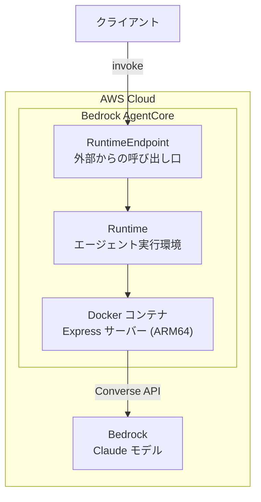
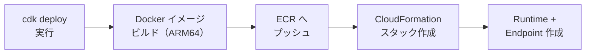

# AgentCore Runtime を CDK でデプロイする

前章では Bedrock AgentCore の全体像を学びました。この章では、実際に手を動かして **AgentCore Runtime** をデプロイしていきます。

インフラのコード化（Infrastructure as Code）には **AWS CDK** を使用します。CDK を使うことで、エージェントアプリと実行環境を同じリポジトリで管理でき、再現性のあるデプロイが可能になります。

:::note この章で学ぶこと

- Express で AgentCore Runtime 用のエージェントアプリを実装する方法
- Docker コンテナ（ARM64）でエージェントをパッケージングする方法
- AWS CDK で Runtime + Endpoint をデプロイする方法
- `@aws-cdk/aws-bedrock-agentcore-alpha` の L2 コンストラクトの使い方
- デプロイから動作確認・クリーンアップまでの一連のワークフロー
:::

---

## 前提条件

以下のツールがインストールされている必要があります。

| ツール | バージョン | 用途 |
|--------|-----------|------|
| Node.js | >= 20.x | ランタイム |
| AWS CLI | v2 | AWS 認証・操作 |
| AWS CDK CLI | >= 2.238.0 | CDK デプロイ |
| Docker | 最新安定版 | コンテナイメージのビルド |

```bash
# CDK CLI のインストール
npm install -g aws-cdk

# AWS 認証の確認
aws sts get-caller-identity
```

:::caution Bedrock モデルアクセスの有効化
デプロイ先のリージョンで **Claude** モデルへのアクセスが有効になっている必要があります。AWS コンソールの Bedrock > Model access から、Anthropic Claude モデルを有効化してください。
:::

---

## アーキテクチャ概要

このサンプルでデプロイする構成は以下の通りです。



- **RuntimeEndpoint** — 外部から Runtime を呼び出すためのエントリポイント
- **Runtime** — Docker コンテナ（ARM64）でエージェントアプリを実行する環境
- **エージェントアプリ** — Express サーバーが `/ping`（ヘルスチェック）と `/invocations`（推論）の 2 つのエンドポイントを公開

---

## プロジェクト構成

プロジェクトは **CDK 側**（`bin/`、`lib/`）と**エージェントアプリ側**（`agent/`）の 2 つの領域に分かれています。CDK 側はインフラ定義を、`agent/` はコンテナ内で動作するアプリケーション本体を管理します。

```
packages/@ai-suburi/bedrock-agentcore-cdk/
├── bin/
│   └── app.ts                       # CDK アプリエントリポイント
├── lib/
│   └── agentcore-runtime-stack.ts   # CDK スタック定義
├── agent/
│   ├── index.ts                     # エージェントアプリ（Express サーバー）
│   ├── package.json                 # エージェント側の依存関係
│   ├── tsconfig.json                # エージェント側の TS 設定
│   └── Dockerfile                   # コンテナイメージ定義
├── package.json                     # CDK プロジェクトの依存関係
├── tsconfig.json                    # CDK 側の TS 設定
└── cdk.json                         # CDK 設定ファイル
```

---

## エージェントアプリの実装

AgentCore Runtime は HTTP サーバーとして動作するコンテナを要求します。具体的には以下の仕様に準拠する必要があります。

| 項目 | 要件 |
|------|------|
| ホスト | `0.0.0.0` |
| ポート | `8080` |
| アーキテクチャ | ARM64 |
| ヘルスチェック | `GET /ping` → `{ "status": "Healthy" }` |
| 推論 | `POST /invocations` → JSON レスポンス |

:::tip なぜ ARM64 なのか？
AgentCore Runtime は Graviton ベースのインフラで動作するため、コンテナは ARM64 アーキテクチャでビルドする必要があります。Dockerfile の `FROM` で `--platform=linux/arm64` を必ず指定してください。
:::

:::info agent/ ディレクトリの TypeScript 設定
`agent/` は CDK プロジェクトとは独立した TypeScript 設定（`module: "commonjs"`）を使用しています。CDK 側は ESM（`"type": "module"`）ですが、Docker コンテナ内では `tsc` でビルドした CommonJS の JavaScript を `node` で直接実行するため、シンプルな CommonJS 構成が適しています。
:::

### agent/index.ts

```typescript title="agent/index.ts"
import express from 'express';
import {
  BedrockRuntimeClient,
  ConverseCommand,
} from '@aws-sdk/client-bedrock-runtime';

// --- 設定 ---
const PORT = 8080;
const MODEL_ID =
  process.env.MODEL_ID ?? 'anthropic.claude-sonnet-4-20250514';

// --- Bedrock クライアント ---
const bedrockClient = new BedrockRuntimeClient({});

// --- Express アプリ ---
const app = express();
app.use(express.json());

/**
 * ヘルスチェックエンドポイント
 * AgentCore Runtime はこのエンドポイントでコンテナの状態を監視する
 */
app.get('/ping', (_req, res) => {
  res.json({ status: 'Healthy' });
});

/**
 * メインの推論エンドポイント
 * AgentCore Runtime からのリクエストを受け取り、Bedrock モデルで処理して応答を返す
 */
app.post('/invocations', async (req, res) => {
  try {
    const { prompt } = req.body as { prompt?: string };

    if (!prompt) {
      res.status(400).json({
        response: 'prompt field is required',
        status: 'error',
      });
      return;
    }

    // Bedrock Converse API でモデルを呼び出す
    const command = new ConverseCommand({
      modelId: MODEL_ID,
      messages: [
        {
          role: 'user',
          content: [{ text: prompt }],
        },
      ],
    });

    const result = await bedrockClient.send(command);

    // レスポンスからテキストを抽出
    const outputMessage = result.output?.message;
    const responseText =
      outputMessage?.content
        ?.map((block) => ('text' in block ? block.text : ''))
        .join('') ?? '';

    res.json({
      response: responseText,
      status: 'success',
    });
  } catch (error) {
    console.error('Invocation error:', error);
    res.status(500).json({
      response: error instanceof Error ? error.message : 'Unknown error',
      status: 'error',
    });
  }
});

// --- サーバー起動 ---
app.listen(PORT, '0.0.0.0', () => {
  console.log(
    `Agent server running on http://0.0.0.0:${PORT} (model: ${MODEL_ID})`,
  );
});
```

実装のポイントは以下の通りです。

- **Converse API** を使用しています。`InvokeModel` はモデルごとにリクエスト/レスポンスの形式が異なりますが、Converse API は統一的なインターフェースを提供するため、モデルの切り替えが容易です
- **環境変数 `MODEL_ID`** で使用するモデルを外部から指定できます。CDK スタック側の `environmentVariables` でこの値を設定します
- エラーハンドリングでは、クライアントに対して適切な HTTP ステータスコード（400 / 500）とエラーメッセージを返します

### Dockerfile

```dockerfile title="agent/Dockerfile"
FROM --platform=linux/arm64 node:20-slim

WORKDIR /app

# 依存関係を先にコピーしてキャッシュを活用
COPY package*.json ./
RUN npm install --production

# ソースコードをコピーしてビルド
COPY . .
RUN npx tsc

EXPOSE 8080

CMD ["node", "dist/index.js"]
```

Dockerfile のポイントは以下の通りです。

- `--platform=linux/arm64` で ARM64 イメージを指定しています。AgentCore Runtime は Graviton ベースで動作するため、必須の設定です
- **依存関係のインストールとソースコードのコピーを分離**しています。`package*.json` を先にコピーして `npm install` を実行することで、ソースコードを変更しても依存関係のレイヤーキャッシュが再利用されます。これにより再ビルドが高速になります
- `npm install --production` で本番依存のみをインストールし、イメージサイズを削減しています

---

## CDK アプリの実装

ここからは CDK 側のコードを実装していきます。CDK アプリのエントリポイントとスタック定義の 2 ファイルで構成されます。

### bin/app.ts

CDK アプリのエントリポイントです。ここでスタックをインスタンス化し、デプロイ先のアカウント・リージョンを設定します。

```typescript title="bin/app.ts"
#!/usr/bin/env npx tsx
import 'source-map-support/register.js';
import * as cdk from 'aws-cdk-lib';
import { AgentCoreRuntimeStack } from '../lib/agentcore-runtime-stack.js';

const app = new cdk.App();

new AgentCoreRuntimeStack(app, 'AgentCoreRuntimeStack', {
  // CDK_DEFAULT_ACCOUNT / CDK_DEFAULT_REGION が設定されていればそれを使用
  // 未設定の場合は CDK が AWS CLI のプロファイルから自動検出する
  ...(process.env.CDK_DEFAULT_ACCOUNT && process.env.CDK_DEFAULT_REGION
    ? {
        env: {
          account: process.env.CDK_DEFAULT_ACCOUNT,
          region: process.env.CDK_DEFAULT_REGION,
        },
      }
    : {}),
});
```

- `source-map-support/register.js` を読み込むことで、エラー発生時のスタックトレースが TypeScript のソース位置を指すようになります
- `CDK_DEFAULT_ACCOUNT` と `CDK_DEFAULT_REGION` は `cdk deploy` 実行時に CDK CLI が自動的に設定する環境変数です。明示的に `env` を指定することで、`cdk diff` や `cdk synth` でもアカウント・リージョン依存のリソース（ARN など）が正しく解決されます

### lib/agentcore-runtime-stack.ts

CDK スタックでは `@aws-cdk/aws-bedrock-agentcore-alpha` パッケージの L2 コンストラクトを使って、Runtime と Endpoint を作成します。

```typescript title="lib/agentcore-runtime-stack.ts"
import * as cdk from 'aws-cdk-lib';
import * as agentcore from '@aws-cdk/aws-bedrock-agentcore-alpha';
import * as path from 'path';
import { fileURLToPath } from 'url';
import type { Construct } from 'constructs';

// ESM 環境での __dirname 相当
const __filename = fileURLToPath(import.meta.url);
const __dirname = path.dirname(__filename);

export class AgentCoreRuntimeStack extends cdk.Stack {
  constructor(scope: Construct, id: string, props?: cdk.StackProps) {
    super(scope, id, props);

    // --- 1. ローカル Dockerfile からアーティファクト作成 ---
    const artifact = agentcore.AgentRuntimeArtifact.fromAsset(
      path.join(__dirname, '../agent'),
    );

    // --- 2. Runtime 作成 ---
    const runtime = new agentcore.Runtime(this, 'AgentRuntime', {
      agentRuntimeArtifact: artifact,
      environmentVariables: {
        MODEL_ID: 'anthropic.claude-sonnet-4-20250514',
      },
    });

    // --- 3. Bedrock モデルへのアクセス権限を付与 ---
    runtime.grant(['bedrock:InvokeModel'], [
      'arn:aws:bedrock:*::foundation-model/anthropic.claude-*',
    ]);

    // --- 4. Endpoint 作成 ---
    runtime.addEndpoint('AgentRuntimeEndpoint');
  }
}
```

:::info ESM 環境での __dirname
CDK プロジェクトは `"type": "module"`（ESM）で構成しているため、CommonJS の `__dirname` が使えません。`import.meta.url` と `fileURLToPath` を組み合わせて同等の値を取得しています。このパターンは ESM ベースの CDK プロジェクトでは定番です。
:::

スタックは 4 つのステップで構成されています。各ステップの詳細を見ていきます。

### 1. AgentRuntimeArtifact の作成

```typescript
const artifact = agentcore.AgentRuntimeArtifact.fromAsset(
  path.join(__dirname, '../agent'),
);
```

`fromAsset()` は、指定したディレクトリの Dockerfile を使ってコンテナイメージをビルドし、ECR にプッシュするところまで自動で行います。`cdk deploy` を実行するだけで、ローカルの Docker ファイルからクラウド上の実行可能なイメージが作成されます。

:::info アーティファクトの指定方法と言語サポート

`AgentRuntimeArtifact` には 4 つのファクトリメソッドがあります。

| メソッド | 用途 | 対応言語 |
|----------|------|----------|
| `fromAsset()` | ローカルの Dockerfile からビルド | **制限なし**（Docker で動けば何でも OK） |
| `fromEcrRepository()` | 既存の ECR リポジトリを参照 | **制限なし** |
| `fromImageUri()` | ECR イメージ URI を直接指定 | **制限なし** |
| `fromS3()` | S3 上の ZIP パッケージ + マネージドランタイム | **Python のみ**（3.10〜3.13） |

**Node.js / TypeScript を使う場合は Docker イメージ（`fromAsset()` または `fromEcrRepository()`）が必須です。** `fromS3()` のマネージドランタイムは現時点では Python しかサポートしていないため、Lambda の `NodejsFunction` のように esbuild でバンドルしてデプロイする方法は利用できません。

ローカル開発には `fromAsset()` が最も手軽です。本番環境では CI/CD パイプラインで ECR にプッシュしたイメージを `fromEcrRepository()` で参照するのがおすすめです。
:::

### 2. Runtime の構成

```typescript
const runtime = new agentcore.Runtime(this, 'AgentRuntime', {
  agentRuntimeArtifact: artifact,
  environmentVariables: {
    MODEL_ID: 'anthropic.claude-sonnet-4-20250514',
  },
});
```

`Runtime` コンストラクトは、AgentCore Runtime リソースを作成します。`environmentVariables` でエージェントアプリに渡す環境変数を設定できます（最大 50 個）。

### 3. IAM 権限の付与

```typescript
runtime.grant(['bedrock:InvokeModel'], [
  'arn:aws:bedrock:*::foundation-model/anthropic.claude-*',
]);
```

`grant()` メソッドで、Runtime の実行ロールに必要な IAM 権限を追加します。ここでは Bedrock の `InvokeModel` アクションを Claude モデルに対して許可しています。

### 4. RuntimeEndpoint の作成

```typescript
runtime.addEndpoint('AgentRuntimeEndpoint');
```

`addEndpoint()` は RuntimeEndpoint リソースを作成する便利メソッドです。これにより、外部から Runtime を invoke できるようになります。Endpoint がないと Runtime にリクエストを送れないため、必ず作成してください。

---

## デプロイ手順

### 1. 依存関係のインストール

```bash
# CDK プロジェクトの依存関係（pnpm workspace で管理）
pnpm install

# エージェントアプリの依存関係（Docker ビルド時にも使用）
cd packages/@ai-suburi/bedrock-agentcore-cdk/agent
npm install
cd ..
```

### 2. CDK Bootstrap（初回のみ）

CDK を初めて使用するリージョン・アカウントでは、Bootstrap が必要です。

```bash
# プロジェクトルートから実行可能
pnpm cdk bootstrap
```

:::info Bootstrap で作成されるリソース
Bootstrap は、CDK がデプロイに必要とする S3 バケット（テンプレート・アセット格納用）、ECR リポジトリ（Docker イメージ格納用）、IAM ロールなどを含む `CDKToolkit` スタックを作成します。アカウント・リージョンごとに一度だけ実行すれば OK です。
:::

### 3. CloudFormation テンプレートの確認（任意）

デプロイ前にどんなリソースが作成されるか確認したい場合は `synth` を実行します。

```bash
pnpm cdk:synth
```

### 4. デプロイ

```bash
pnpm cdk:deploy
```

`cdk deploy` を実行すると、以下の処理が自動で行われます。



:::tip 初回デプロイの所要時間
初回は Docker イメージのビルドと ECR へのプッシュがあるため、数分〜十数分かかります。2 回目以降は Docker のレイヤーキャッシュが効くため、変更がなければ高速にデプロイできます。
:::

---

## 動作確認

デプロイが完了したら、AWS CLI でエージェントを呼び出して動作を確認します。

```bash
# Runtime の一覧を確認
aws bedrock-agentcore list-agent-runtimes

# Endpoint 経由で invoke
aws bedrock-agentcore invoke-agent-runtime-endpoint \
  --endpoint-name <your-endpoint-name> \
  --payload '{"prompt": "Hello! What is Amazon Bedrock AgentCore?"}' \
  output.json

cat output.json
```

**実行結果の例:**

```json
{
  "response": "Amazon Bedrock AgentCore is a fully managed service that provides the infrastructure and tools needed to deploy, manage, and scale AI agents in production environments...",
  "status": "success"
}
```

上記のように `status: "success"` とレスポンスが返ってくれば、デプロイ成功です。

---

## クリーンアップ

動作確認が済んだら、リソースを削除して不要な課金を防ぎます。

```bash
pnpm cdk:destroy
```

:::caution ECR リポジトリの削除
`cdk destroy` で ECR リポジトリが残る場合があります。不要な場合は AWS コンソールから手動で削除してください。
:::

---

## 参考資料

- [Amazon Bedrock AgentCore 公式ドキュメント](https://docs.aws.amazon.com/bedrock-agentcore/latest/devguide/)
- [AgentCore Runtime HTTP Protocol Contract](https://docs.aws.amazon.com/bedrock-agentcore/latest/devguide/runtime-http-protocol-contract.html)
- [@aws-cdk/aws-bedrock-agentcore-alpha API リファレンス](https://docs.aws.amazon.com/cdk/api/v2/docs/aws-bedrock-agentcore-alpha-readme.html)
- [Bedrock Converse API ガイド](https://docs.aws.amazon.com/bedrock/latest/userguide/conversation-inference-call.html)
- [AgentCore サンプルコード（GitHub）](https://github.com/awslabs/amazon-bedrock-agentcore-samples)
