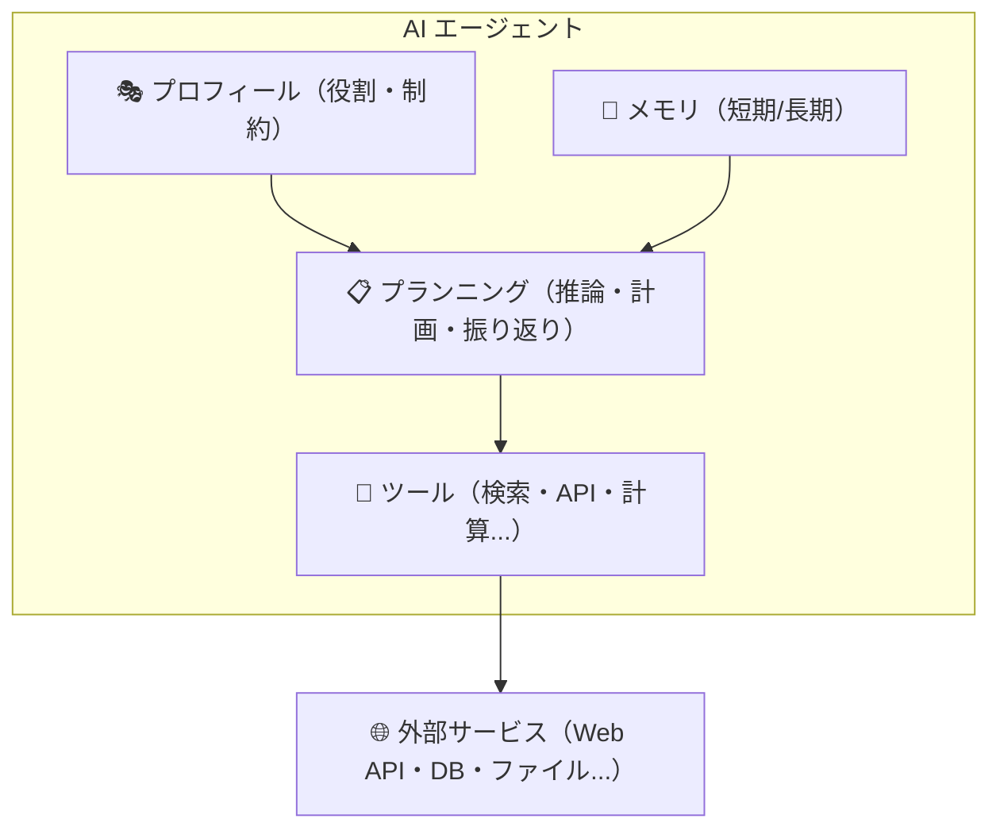

# Chapter 2: AIエージェントの構成

この章では、AI エージェントの内部構成について解説します。
「AI エージェント」と聞くと高度な仕組みを想像するかもしれませんが、その内部は明確な役割を持ったコンポーネントの組み合わせで成り立っています。各コンポーネントの役割を理解することで、目的に応じたエージェントを設計・実装できるようになります。

:::note この章で学ぶこと

- AI エージェントを構成する 4 つのコンポーネントの役割と関係性
- **プロフィール**（システムプロンプト）によるエージェントの人格設計
- **メモリ**（短期 / 長期）の仕組みと実装パターン
- **ツール**（Function Calling）の定義方法と設計指針
- **プランニング**によるタスク分解と、ReAct パターンを用いた自律的な実行サイクル

:::

AI エージェントは一般的に以下の 4 つの主要コンポーネントで構成されます。



プロフィールがエージェントの「人格」を定め、メモリが「記憶」を担い、プランニングが「思考」を司り、ツールが「行動」を実行する——この 4 つが連携することで、エージェントは複雑なタスクを自律的に遂行します。

| コンポーネント | 説明 |
| --- | --- |
| **プロフィール** | エージェントの役割・人格・行動指針を定義する |
| **メモリ** | 過去の対話や情報を記憶・参照する仕組み |
| **ツール** | 外部 API やデータベースなど、エージェントが利用できる機能 |
| **プランニング** | タスクを分解し、実行計画を立てる能力 |

## プロフィール

**プロフィール**は、AI エージェントに「何者であるか」を定義するコンポーネントです。
LLM に対するシステムプロンプトとして実装されることが多く、エージェントの振る舞いの土台となります。

### プロフィールの構成要素

プロフィールは主に以下の 3 つの要素で構成されます。

| 要素 | 説明 | 例 |
| --- | --- | --- |
| **役割（Role）** | エージェントが担う職務や専門性 | 「あなたはシニアソフトウェアエンジニアです」 |
| **目標（Goal）** | エージェントが達成すべき目的 | 「ユーザーのコードレビューを支援すること」 |
| **制約（Constraints）** | 行動の境界線やルール | 「機密情報を外部に漏らさないこと」 |

### なぜプロフィールが重要なのか？

プロフィールを適切に設計することで、以下のメリットが得られます。

- **一貫性のある応答** - 役割が明確なため、文脈に応じたブレのない回答を生成できる
- **専門性の発揮** - 特定ドメインの知識やトーンに特化した応答が可能になる
- **安全性の確保** - 制約を設けることで、不適切な応答や危険な行動を抑制できる

### 実装例

以下は、コードレビューを行う AI エージェントのプロフィール定義の例です。

```typescript
import OpenAI from "openai";

const client = new OpenAI({ apiKey: process.env.OPENAI_API_KEY });

const systemPrompt = `あなたはシニアソフトウェアエンジニアです。

## 役割
- ユーザーから提示されたコードをレビューし、改善点を提案します
- バグの可能性がある箇所を指摘します
- ベストプラクティスに基づいたアドバイスを提供します

## 制約
- コードの全面的な書き換えではなく、具体的な改善ポイントに絞って指摘してください
- セキュリティ上の懸念がある場合は、最優先で報告してください
- 推測ではなく、根拠に基づいたレビューを行ってください`;

const response = await client.chat.completions.create({
  model: "gpt-4o",
  messages: [
    { role: "system", content: systemPrompt },
    { role: "user", content: "以下のコードをレビューしてください:\n..." },
  ],
});

console.log(response.choices[0]?.message.content);
```

:::tip
プロフィールの設計は**プロンプトエンジニアリング**の一部です。役割・目標・制約を明確に記述することで、エージェントの出力品質が大幅に向上します。曖昧な指示よりも、具体的で構造化された指示の方が効果的です。
:::

---

## メモリ

**メモリ**は、AI エージェントが過去の情報を保持・参照するためのコンポーネントです。
LLM は本来ステートレス（状態を持たない）であり、API コールごとに過去の会話を忘れてしまいます。メモリを導入することで、文脈を踏まえた一貫性のある対話や、過去の経験を活かした意思決定が可能になります。

### メモリの種類

エージェントのメモリは、人間の記憶モデルになぞらえて大きく 2 種類に分類されます。

| 種類 | 説明 | 人間の記憶との対応 |
| --- | --- | --- |
| **短期メモリ（Short-term Memory）** | 現在の会話セッション内の情報を保持する | 作業記憶（ワーキングメモリ） |
| **長期メモリ（Long-term Memory）** | セッションをまたいで永続的に情報を保持する | 長期記憶 |

### 短期メモリ

短期メモリは、現在進行中の会話の履歴そのものです。
Chat Completions API では `messages` 配列に過去のやりとりを含めることで実現します。

```typescript
import type OpenAI from "openai";

const messages: OpenAI.ChatCompletionMessageParam[] = [
  { role: "system", content: "あなたは旅行プランナーです。" },
  { role: "user", content: "来月、京都に旅行したいです。" },
  { role: "assistant", content: "京都旅行いいですね！何泊の予定ですか？" },
  { role: "user", content: "2泊3日で考えています。" },
  // ↑ これまでの会話をすべて含めることで、文脈を維持する
];
```

ただし、LLM にはコンテキストウィンドウ（入力トークン数の上限）があるため、会話が長くなると過去のメッセージを全て含めることができなくなります。

#### コンテキストウィンドウの管理手法

長い会話を扱うための代表的な手法を紹介します。

| 手法 | 説明 | メリット / デメリット |
| --- | --- | --- |
| **スライディングウィンドウ** | 直近の N 件のメッセージのみを保持する | 実装が簡単だが、古い情報が失われる |
| **要約（Summarization）** | 過去の会話を LLM で要約し、圧縮して保持する | 情報を圧縮できるが、要約時に詳細が失われる可能性がある |
| **トークンカウント** | トークン数を計算し、上限に収まるように古いメッセージを削除する | 精密な制御が可能だが、トークン計算のコストがかかる |

```typescript
import type OpenAI from "openai";

// スライディングウィンドウの簡易実装例
function trimMessages(
  messages: OpenAI.ChatCompletionMessageParam[],
  maxMessages: number,
): OpenAI.ChatCompletionMessageParam[] {
  // システムメッセージは常に保持
  const systemMessage = messages.find((m) => m.role === "system");
  const nonSystemMessages = messages.filter((m) => m.role !== "system");

  // 直近の maxMessages 件のみ残す
  const trimmed = nonSystemMessages.slice(-maxMessages);

  return systemMessage ? [systemMessage, ...trimmed] : trimmed;
}
```

### 長期メモリ

長期メモリは、会話セッションを超えて情報を永続化する仕組みです。
ユーザーの好みや過去のタスク結果などを保存しておくことで、パーソナライズされた体験を提供できます。

#### 長期メモリの実装方式

| 方式 | 説明 | ユースケース |
| --- | --- | --- |
| **キーバリューストア** | キーと値のペアでシンプルに保存する | ユーザー設定、環境情報の保存 |
| **ベクトルデータベース** | テキストを埋め込みベクトルに変換し、類似検索で関連情報を取得する | 過去の会話からの知識検索、FAQ 検索 |
| **ナレッジグラフ** | エンティティとリレーションの関係をグラフ構造で保存する | 複雑な関係性の管理、推論 |

```typescript
// ベクトルデータベースを用いた長期メモリの概念例
import OpenAI from "openai";

const client = new OpenAI({ apiKey: process.env.OPENAI_API_KEY });

// テキストを埋め込みベクトルに変換
async function createEmbedding(text: string): Promise<number[]> {
  const response = await client.embeddings.create({
    model: "text-embedding-3-small",
    input: text,
  });
  return response.data[0]!.embedding;
}

// メモリの保存（実際にはベクトル DB に保存する）
async function saveMemory(content: string): Promise<void> {
  const embedding = await createEmbedding(content);
  // ベクトル DB に embedding と content を保存
  console.log(`メモリを保存: ${content}（次元数: ${embedding.length}）`);
}

// メモリの検索（実際にはベクトル DB で類似検索する）
async function searchMemory(query: string): Promise<void> {
  const queryEmbedding = await createEmbedding(query);
  // ベクトル DB で queryEmbedding に近いベクトルを検索
  console.log(`クエリ "${query}" で関連メモリを検索（次元数: ${queryEmbedding.length}）`);
}
```

:::info メモリ設計のポイント

- **短期メモリだけでも十分なケースは多い** - シンプルな Q&A や単発タスクでは、長期メモリは不要な場合がほとんど
- **長期メモリはコストとのトレードオフ** - 埋め込みの生成やベクトル DB の運用にはコストがかかるため、本当に必要な情報だけを保存する
- **プライバシーに配慮する** - ユーザーの個人情報を長期メモリに保存する場合は、適切なアクセス制御と削除機能を実装する

:::

---

## ツール

**ツール**は、AI エージェントが外部の機能やサービスを呼び出すためのコンポーネントです。
LLM 単体では「テキストの生成」しかできませんが、ツールを組み合わせることで、Web 検索・データベース操作・ファイル操作・API 呼び出しなど、現実世界に作用するアクションが可能になります。

### ツールの分類

エージェントが利用するツールは、大きく以下の 3 種類に分類できます。

| 種類 | 説明 | 例 |
| --- | --- | --- |
| **情報取得（Retrieval）** | 外部から情報を取得する | Web 検索、データベースクエリ、ファイル読み込み |
| **アクション実行（Action）** | 外部システムに対して変更を加える | メール送信、ファイル書き込み、API へのリクエスト |
| **計算・変換（Computation）** | データの加工や演算を行う | 数値計算、フォーマット変換、コード実行 |

### ツールの定義方法

OpenAI の Function Calling を利用する場合、ツールは JSON Schema 形式で定義します。
モデルに「どんなツールが使えるか」「どんな引数を受け取るか」を伝えることで、モデルが適切なタイミングでツールを選択・呼び出します。

```typescript
import type OpenAI from "openai";

const tools: OpenAI.ChatCompletionTool[] = [
  {
    type: "function",
    function: {
      name: "search_web",
      description: "指定されたクエリでWeb検索を行い、結果を返します",
      parameters: {
        type: "object",
        properties: {
          query: {
            type: "string",
            description: "検索クエリ",
          },
          maxResults: {
            type: "number",
            description: "取得する検索結果の最大件数",
          },
        },
        required: ["query"],
      },
    },
  },
];
```

### ツール呼び出しのフロー

エージェントにおけるツール呼び出しは、以下のサイクルで行われます。

```plaintext
ユーザーの入力
    ↓
LLM が応答を生成（ツールを呼ぶべきか判断）
    ↓
ツール呼び出しが必要な場合 → 関数名と引数を返す
    ↓
アプリケーション側でツールを実行
    ↓
実行結果を LLM に返す
    ↓
LLM が最終的な応答を生成
```

このサイクルは 1 回で終わるとは限りません。複雑なタスクでは、LLM がツールを複数回呼び出し、それぞれの結果を踏まえて次のアクションを決定する**マルチステップ推論**が行われます。この「推論 → ツール実行 → 結果の観察 → 次の推論」という繰り返しを体系化したものが、後述する[プランニング](#プランニング)の **ReAct パターン**です。

### ツール設計のポイント

ツールの定義はエージェントの能力を大きく左右します。以下のポイントを意識して設計しましょう。

- **`description` を具体的に書く** - モデルがツールを選択する際の判断材料になる。「いつ」「何のために」使うかを明記する
- **パラメータを最小限にする** - 必須パラメータは本当に必要なものだけに絞り、オプショナルなものは `required` に含めない
- **1 つのツールに 1 つの責務** - 複数の機能を 1 つのツールに詰め込まず、単一責務の原則を守る
- **エラーハンドリングを考慮する** - ツール実行が失敗した場合の挙動を想定しておく

:::caution
ツールにアクション実行系（メール送信、データ削除など）を含める場合は、**人間による確認ステップ（Human-in-the-Loop）** を組み込むことを強く推奨します。エージェントが意図しない操作を行うリスクを軽減できます。
:::

:::note 次の章との関連
ツールの具体的な実装（Function Calling や Tavily Search）については、[Chapter 3: AIエージェントの開発準備](../chapter3/index.md) で詳しく解説しています。
:::

---

## プランニング

**プランニング**は、AI エージェントが複雑なタスクを小さなステップに分解し、実行計画を立てるコンポーネントです。
人間が大きな仕事に取り組むときに「まず何をして、次に何をするか」を考えるように、エージェントもタスクを構造化して順序立てて実行する能力を持ちます。

プランニングは、前述の**メモリ**と**ツール**を活用して動作します。メモリに蓄積された文脈をもとに、ツールを「いつ・どの順番で」呼び出すかを判断し、次のアクションを決定します。

### なぜプランニングが必要なのか？

LLM に複雑なタスクを一度に処理させると、以下の問題が発生しやすくなります。

- **手順の抜け漏れ** - 必要なステップを飛ばしてしまう
- **順序の誤り** - 前提条件を満たさないまま次のステップに進んでしまう
- **全体像の見失い** - 途中で目的からずれた行動を取ってしまう

プランニングを導入することで、エージェントはタスクを体系的に処理し、各ステップの結果を踏まえて次のアクションを判断できるようになります。

### プランニングの手法

代表的なプランニング手法を紹介します。

| 手法 | 説明 |
| --- | --- |
| **Chain of Thought（CoT）** | 「ステップバイステップで考えて」と指示し、推論過程を明示的に出力させる |
| **Tree of Thoughts（ToT）** | 複数の推論パスを並列に探索し、最も有望なものを選択する |
| **ReAct** | Reasoning（推論）と Action（行動）を交互に繰り返し、観察結果を次の推論に反映する |

この中でも **ReAct** は、ツール呼び出しと組み合わせることでエージェントの「自律的な行動」を実現するパターンとして最も実用的です。CoT は主にプロンプト設計のテクニックとして、ToT は探索的な問題解決に適していますが、外部ツールと連携して現実世界のタスクを遂行するエージェントには ReAct が最もフィットします。以降ではこの ReAct パターンを詳しく解説します。

### ReAct パターン

ReAct は、エージェントの実装で最も広く使われるパターンの一つです。
**Thought（思考）→ Action（行動）→ Observation（観察）** のサイクルを繰り返すことで、エージェントが段階的にタスクを遂行します。

```plaintext
Thought: ユーザーは東京の明日の天気を知りたい。天気APIを呼び出す必要がある。
Action:  get_weather({ location: "Tokyo", date: "tomorrow" })
Observation: 晴れ、最高気温28度、最低気温20度、降水確率10%

Thought: 天気情報が取得できた。ユーザーにわかりやすく伝えよう。
Action:  ユーザーに応答を返す
```

### 実装例：ReAct パターンによるエージェントループ

ReAct パターンの核となるのは、LLM の応答に基づいてツール呼び出しと応答生成を繰り返す**エージェントループ**です。

```typescript
import OpenAI from "openai";

const client = new OpenAI({ apiKey: process.env.OPENAI_API_KEY });

// ツールの実行結果を返す関数（実際にはツールごとに実装する）
function executeTool(name: string, args: Record<string, unknown>): string {
  console.log(`ツール実行: ${name}(${JSON.stringify(args)})`);
  return `${name} の実行結果`;
}

async function agentLoop(userMessage: string): Promise<string> {
  const messages: OpenAI.ChatCompletionMessageParam[] = [
    {
      role: "system",
      content:
        "あなたはタスクを段階的に解決するAIアシスタントです。必要に応じてツールを使用してください。",
    },
    { role: "user", content: userMessage },
  ];

  const tools: OpenAI.ChatCompletionTool[] = [
    /* ツール定義 */
  ];

  // エージェントループ: ツール呼び出しがなくなるまで繰り返す
  const MAX_ITERATIONS = 10;
  for (let i = 0; i < MAX_ITERATIONS; i++) {
    const response = await client.chat.completions.create({
      model: "gpt-4o",
      messages,
      tools,
    });

    const message = response.choices[0]!.message;
    messages.push(message);

    // ツール呼び出しがなければ、最終応答として返す
    if (!message.tool_calls || message.tool_calls.length === 0) {
      return message.content ?? "";
    }

    // ツール呼び出しを実行し、結果をメッセージに追加
    for (const toolCall of message.tool_calls) {
      const args = JSON.parse(toolCall.function.arguments);
      const result = executeTool(toolCall.function.name, args);
      messages.push({
        role: "tool",
        tool_call_id: toolCall.id,
        content: result,
      });
    }
  }

  return "最大反復回数に達しました。";
}
```

### リフレクション（振り返り）

プランニングにはもう一つ重要な要素として**リフレクション**があります。
エージェントが自身の行動結果を評価し、計画を修正する仕組みです。

| 手法 | 説明 |
| --- | --- |
| **自己評価（Self-Evaluation）** | LLM に自分の出力を評価させ、不十分であれば再生成する |
| **Reflexion** | 過去の失敗を言語的フィードバックとしてメモリに保存し、次の試行に活かす |
| **外部フィードバック** | ツールの実行結果やユーザーからのフィードバックを次の計画に反映する |

```typescript
import OpenAI from "openai";

const client = new OpenAI({ apiKey: process.env.OPENAI_API_KEY });

// 自己評価の簡易実装例
async function selfEvaluate(
  task: string,
  result: string,
): Promise<{ isAcceptable: boolean; feedback: string }> {
  const response = await client.chat.completions.create({
    model: "gpt-4o",
    temperature: 0,
    messages: [
      {
        role: "system",
        content:
          "あなたはAIアシスタントの出力を評価する品質管理担当です。",
      },
      {
        role: "user",
        content: `以下のタスクに対する回答を評価してください。

## タスク
${task}

## 回答
${result}

## 評価基準
- タスクの要件を満たしているか
- 情報に誤りがないか
- 回答が十分に具体的か

JSON形式で回答してください: { "isAcceptable": boolean, "feedback": "改善点があれば記述" }`,
      },
    ],
    response_format: { type: "json_object" },
  });

  return JSON.parse(response.choices[0]?.message.content ?? "{}");
}
```

:::tip
プランニングの複雑さは、タスクの性質に応じて調整すべきです。単純な質問応答には ReAct のようなループは不要であり、逆に複数のツールを組み合わせる必要があるタスクにはエージェントループが不可欠です。**まずはシンプルに始めて、必要に応じて複雑さを加える**のが実践的なアプローチです。
:::

---

## まとめ

この章では、AI エージェントを構成する 4 つのコンポーネントを解説しました。

| コンポーネント | キーワード | この章で学んだこと |
| --- | --- | --- |
| **プロフィール** | 役割・目標・制約 | システムプロンプトでエージェントの人格を定義する方法 |
| **メモリ** | 短期（会話履歴）・長期（ベクトル DB） | コンテキストウィンドウの管理と永続化の手法 |
| **ツール** | Function Calling・ツール設計・Human-in-the-Loop | 外部機能をツールとして定義し、LLM から呼び出す仕組み |
| **プランニング** | ReAct・エージェントループ・リフレクション | タスク分解と自律的な実行サイクルの実装方法 |

これらのコンポーネントは独立して存在するのではなく、互いに連携して動作します。プロフィールが定めた役割に従い、メモリから文脈を取得し、プランニングで計画を立て、ツールで実行する——この一連の流れが AI エージェントの基本動作です。

実際にエージェントを構築する際には、すべてのコンポーネントを一度に実装する必要はありません。まずはプロフィール（システムプロンプト）とツール（Function Calling）から始め、必要に応じてメモリやプランニングの仕組みを追加していくのが現実的なアプローチです。

次の [Chapter 3](../chapter3/index.md) では、これらの概念を踏まえて OpenAI API を使った開発準備と基本的な実装に進みます。

---

## 参考文献

- Wang, L. et al. (2023). [A Survey on Large Language Model based Autonomous Agents](https://arxiv.org/abs/2308.11432) - AI エージェントの構成要素（プロフィール・メモリ・プランニング・アクション）を体系的に整理したサーベイ論文。本章の 4 コンポーネント分類はこの論文に基づいています
- Yao, S. et al. (2023). [ReAct: Synergizing Reasoning and Acting in Language Models](https://arxiv.org/abs/2210.03629) - Reasoning と Acting を交互に行う ReAct パターンを提案した論文
- Wei, J. et al. (2022). [Chain-of-Thought Prompting Elicits Reasoning in Large Language Models](https://arxiv.org/abs/2201.11903) - 「ステップバイステップで考えて」と指示する Chain of Thought プロンプティングの原論文
- Yao, S. et al. (2023). [Tree of Thoughts: Deliberate Problem Solving with Large Language Models](https://arxiv.org/abs/2305.10601) - 複数の推論パスを木構造で探索する Tree of Thoughts の原論文
- Shinn, N. et al. (2023). [Reflexion: Language Agents with Verbal Reinforcement Learning](https://arxiv.org/abs/2303.11366) - 過去の失敗を言語的フィードバックとして活用する Reflexion の原論文
- OpenAI. [Function Calling](https://platform.openai.com/docs/guides/function-calling) - OpenAI API における Function Calling の公式ドキュメント
