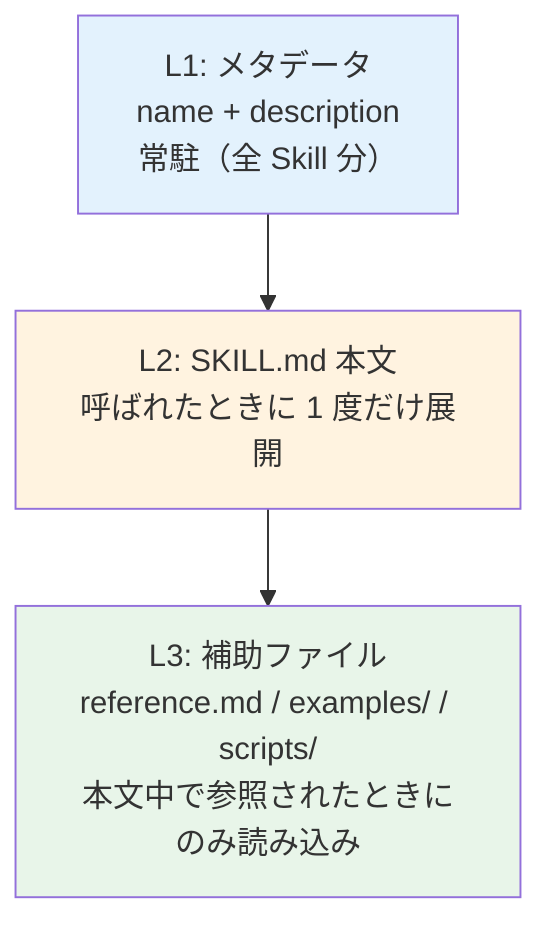
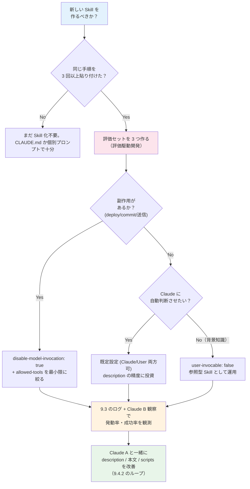

# Chapter 1: Agent Skills のベストプラクティス

Claude Code には、よく使う手順や独自ルールをファイルにまとめておき、Claude に **「必要なときだけ」** ロードさせる **Agent Skills** という仕組みがあります。CLAUDE.md がセッションの先頭で常に読み込まれる「常駐知識」だとすれば、Skill は **「呼ばれた瞬間にだけ展開される拡張モジュール」** にあたります。本章では Anthropic 公式の 2 つの一次情報、

- [Extend Claude with skills (Claude Code)](https://code.claude.com/docs/en/skills) ― Claude Code 固有の機能仕様
- [Skill authoring best practices (Claude API platform)](https://platform.claude.com/docs/en/agents-and-tools/agent-skills/best-practices) ― Skill 著者向けの公式ベストプラクティス

を一次ソースとして、本書 9.4.2「ツールやプロンプトの改善」で論じた継続改善の考え方と接続する形で、Skill の設計・運用ベストプラクティスを整理します。

:::note この章で学ぶこと

- Agent Skill の位置づけと CLAUDE.md・スラッシュコマンドとの使い分け
- 公式 3 原則：Concise is key / 自由度の設計 / 全モデルでのテスト
- `SKILL.md` の構造、命名規則（gerund form）、フロントマター仕様
- description 設計の鉄則（必ず三人称・トリガー語彙・進歩的開示）
- Progressive disclosure の 3 パターンと、ネスト深さ・TOC のルール
- ワークフロー化・バリデーションループによる品質確保
- 評価駆動開発と Claude A / Claude B 二段構えのイテレーション
- スクリプト同梱 Skill での「Solve, don't punt」原則と plan-validate-execute
- 公開前チェックリストと、本書 9.4.2 との接続点

:::

## 概要

### Skill とは何か

Skill は **`SKILL.md` を中核とした 1 つのディレクトリ** です。フロントマター（YAML）でメタデータを宣言し、本文（Markdown）に「何を・どう実行するか」を書きます。Claude は description を見て自動起動するか、ユーザーが `/skill-name` で明示的に呼び出します。

```text title="skill のディレクトリ構造"
processing-pdfs/
├── SKILL.md           # 必須。フロントマター + 本文
├── reference.md       # 任意。詳細リファレンス（必要時のみ読み込み）
├── examples/
│   └── sample.md      # 任意。出力フォーマットの例
└── scripts/
    └── helper.py      # 任意。実行用スクリプト（本文には読み込まれない）
```

### CLAUDE.md・スラッシュコマンドとの違い

3 者は「Claude にどうやって追加情報を渡すか」という共通テーマを別の角度から解いた仕組みで、ロード時点と用途が異なります。

| 仕組み | ロード時点 | 主な用途 | コスト感 |
| --- | --- | --- | --- |
| **CLAUDE.md** | セッション開始時に常駐 | プロジェクト固有の事実・コーディング規約など、毎ターン使う前提知識 | 行を増やすほど毎ターンのトークン消費が増える |
| **スラッシュコマンド** (`.claude/commands/*.md`) | `/cmd` 実行時 | 単発で呼ぶ手順テンプレート | 呼ばれない限りゼロ |
| **Agent Skill** (`.claude/skills/*/SKILL.md`) | description が一致したとき or ユーザーが `/skill` 実行時 | 手順 + 補助ファイル + スクリプトの一体提供、Claude が自律判断で起動 | description だけが常駐、本文は呼ばれた時のみ |

:::tip Skill が CLAUDE.md より優れる典型ケース

「同じ指示を毎回貼り付けている」「CLAUDE.md の特定セクションが事実ではなく **手順** になってきた」と感じたら Skill 化のサインです。Skill なら本文は呼ばれない限りトークンを消費しないため、長大なリファレンス資料を抱えてもコストが膨らみません。これは 9.4.2 で扱った **「ツール記述を精緻化しつつ、コンテキストを圧迫しない」** 設計理念と完全に一致します。

:::

なお Claude Code ではかつて分離していた **カスタムスラッシュコマンドが Skill に統合** され、`.claude/commands/deploy.md` と `.claude/skills/deploy/SKILL.md` のどちらでも `/deploy` として動作します（既存 `commands/` も後方互換で残ります）。新規作成は補助ファイル・自動起動・トリガー条件などフル機能が使える Skill 形式が推奨です。

## Skill 本文を書く 3 つの原則

公式ベストプラクティスが「Core principles」として最初に提示する 3 つは、SKILL.md の中身を書き始める前に必ず内面化しておきたい指針です。

### 原則 1：Concise is key（簡潔さが王道）

> _The context window is a public good._（コンテキスト窓は公共財である）

これは公式ガイドの冒頭にある一節で、Skill 著者の心構えを最も的確に表しています。Skill のメタデータは全 Skill 分が常駐するため、起動されなくても常にコストがかかります。本文も一度ロードされれば、会話履歴や他のコンテキストとトークンを取り合います。

**既定の前提：Claude はすでに十分賢い**。書く前に各文に問いかけてください。

- 「これは Claude が知らないことか？」
- 「ここまで説明する必要があるか？」
- 「この段落はトークンコストに見合うか？」

```markdown title="Good: 約 50 トークン"
## Extract PDF text

Use pdfplumber for text extraction:

​```python
import pdfplumber

with pdfplumber.open("file.pdf") as pdf:
    text = pdf.pages[0].extract_text()
​```
```

```markdown title="Bad: 約 150 トークン（PDF とは／ライブラリとは／pip とは…と書きすぎ）"
## Extract PDF text

PDF (Portable Document Format) files are a common file format that contains
text, images, and other content. To extract text from a PDF, you'll need to
use a library. There are many libraries available for PDF processing, but
pdfplumber is recommended because it's easy to use and handles most cases well.
First, you'll need to install it using pip. Then you can use the code below...
```

「PDF とは何か」「ライブラリとは何か」を Claude は当然知っています。**Claude が知らないこと（このプロジェクトの方針・固有のスキーマ・社内規約）だけ** を書くのが Skill 著者の仕事です。

### 原則 2：タスクの脆さに応じた自由度（degrees of freedom）を設定する

公式ガイドはタスクを「**崖に挟まれた狭い橋**」と「**何もない開けた草原**」に例えます。崖の橋では誤差ゼロの手順が必要、草原ではゴールだけ伝えて経路は任せるのが最適です。

| 自由度 | 使い所 | 表現形式 |
| --- | --- | --- |
| **High freedom** | 複数のアプローチが妥当／文脈で判断したい／ヒューリスティクスで進めたい | テキスト指示で大まかな方針を示す |
| **Medium freedom** | 推奨パターンはあるがバリエーション可／パラメータで挙動が変わる | 擬似コードや引数付きスクリプトテンプレート |
| **Low freedom** | 操作が脆くてミスが致命的／一貫性が最重要／決まった順序が必須 | 実行する具体コマンドを「変えるな」と固定指定 |

```markdown title="High freedom: コードレビューの方針だけ"
## Code review process

1. Analyze the code structure and organization
2. Check for potential bugs or edge cases
3. Suggest improvements for readability and maintainability
4. Verify adherence to project conventions
```

```markdown title="Low freedom: DB マイグレーションは順序固定・改変禁止"
## Database migration

Run exactly this script:

​```bash
python scripts/migrate.py --verify --backup
​```

Do not modify the command or add additional flags.
```

:::tip 自由度の使い分けが効く理由

副作用ゼロのテキスト整形なら高自由度で十分ですが、決済・本番デプロイ・スキーマ変更などは低自由度に倒すと事故が激減します。9.2 で扱った agentic AI のリスク観点（Tool 誤用・順序ミス）への防御策として、自由度設計は最も実装コストが安い手段です。

:::

### 原則 3：使うすべてのモデルでテストする

Skill は単独では動かず、ベースモデルへの「追加指示」として機能します。同じ Skill でもモデルが変われば挙動が変わります。

| モデル | 検証観点 |
| --- | --- |
| **Claude Haiku** | 速い・安いが、Skill が十分なガイドを与えられているか？ 暗黙の文脈頼みになっていないか？ |
| **Claude Sonnet** | 指示が明瞭で効率的か？ 冗長すぎる解説で速度を落としていないか？ |
| **Claude Opus** | 説明過多になっていないか？ Opus が当然できることをわざわざ書いていないか？ |

Opus で完璧に動く Skill が、Haiku に渡すと急に動かなくなることはよくあります。複数モデルにまたがる Skill では、**最も能力が低いモデルを基準** に書くか、`model:` フロントマターで動かすモデルを固定するのが現実解です。

## Skill の構造

### SKILL.md の最小例

```yaml title="~/.claude/skills/summarizing-changes/SKILL.md"
---
name: summarizing-changes
description: Summarizes uncommitted changes and flags anything risky. Use when the user asks what changed, wants a commit message, or asks to review their diff.
---

## Current changes

!`git diff HEAD`

## Instructions

Summarize the changes above in two or three bullet points, then list any risks you notice such as missing error handling, hardcoded values, or tests that need updating. If the diff is empty, say there are no uncommitted changes.
```

`` !`git diff HEAD` `` は **動的コンテキスト注入** です。Claude が SKILL.md を読む前にシェルコマンドが実行され、出力が本文に差し込まれた状態で渡されます（後述）。

ユーザーが「いま何変えた？」と聞くか `/summarizing-changes` と打つだけで、次のような応答が得られます。

```text title="実行結果の例"
変更内容:
- src/auth/login.ts に JWT 検証ミドルウェアを追加
- src/utils/jwt.ts でトークン検証ヘルパーを実装
- tests/auth.test.ts に正常系のテストを 1 件追加

リスク:
- ⚠️ JWT_SECRET が環境変数からだけ読まれているが、未設定時のフォールバック処理がない
- ⚠️ 異常系（期限切れ・改ざん）のテストケースがまだ無い
- 💡 commit メッセージ案: feat(auth): add JWT validation middleware
```

### YAML フロントマター仕様

`name` と `description` には公式の文字数・文字種制約があります。これを破ると Skill が登録されません。

| フィールド | 必須 | 制約 | 補足 |
| --- | --- | --- | --- |
| `name` | ✅ | 最大 64 文字、英小文字・数字・ハイフンのみ、XML タグ不可、予約語 `anthropic` / `claude` を含めない | 省略時はディレクトリ名が使われる |
| `description` | ✅ | 最大 1,024 文字（platform 仕様）、空不可、XML タグ不可 | Claude Code では `when_to_use` と合算で **1,536 文字** で表示が打ち切られるため、実質これがハードリミット |

:::caution surface ごとに上限が違うことに注意

Claude API 側の仕様は「description 単体で 1,024 文字」ですが、Claude Code の表示時カットは「`description` + `when_to_use` 合算 1,536 文字」と異なります。両 surface で使い回す Skill は **より厳しい 1,024 文字に合わせる** のが安全です。

:::

その他、設計判断に影響する Claude Code 側の主要フィールドは次のとおりです。

| フィールド | 役割 | 設計上の勘所 |
| --- | --- | --- |
| `when_to_use` | トリガー条件・例文の追記 | description と合算でキャップに当たることに注意 |
| `disable-model-invocation` | `true` で Claude による自動起動を禁止 | `/deploy` `/commit` のような副作用持ちは必ず `true` |
| `user-invocable` | `false` で `/` メニューから隠す | 背景知識用 Skill（例: `legacy-system-context`）に使う |
| `allowed-tools` | アクティブ時に承認なしで使えるツール群 | スコープを絞ること。`Bash(git *)` のようにパターン指定可 |
| `model` / `effort` | 起動中のモデル・推論努力 | Haiku 縛り・Opus 縛りなど多モデル運用時の事故防止に |
| `context` | `fork` でサブエージェントとして実行 | 別コンテキストで隔離したい重い調査などに |
| `agent` | `fork` 時に使うサブエージェント種別 | `Explore` / `Plan` / `general-purpose` など |
| `paths` | 特定ファイル編集時のみ自動有効化 | モノレポで言語・領域別の Skill を切り分けるのに有効 |
| `arguments` | 名前付き位置引数の宣言 | `$0/$1` ではなく `$issue` のように意味を持たせられる |

### 命名規則：動名詞形（gerund form）が公式推奨

公式ガイドは **動詞 + -ing の動名詞形** を Skill 名の標準として推奨しています。「この Skill が提供する活動」を一目で表せるためです。

| 良い例（gerund） | 許容される代替 | 避けるべき例 |
| --- | --- | --- |
| `processing-pdfs` | `pdf-processing` / `process-pdfs` | `helper` / `utils` / `tools`（曖昧） |
| `analyzing-spreadsheets` | `spreadsheet-analysis` | `documents` / `data` / `files`（一般語すぎ） |
| `managing-databases` | `database-management` | `anthropic-helper` / `claude-tools`（予約語含む） |
| `testing-code` | `code-testing` | コレクション内で命名規則がバラバラ |
| `writing-documentation` | `documentation-writing` | |

ライブラリ全体で命名規則を揃えると、複数 Skill を扱うとき「呼びたい名前を推測しやすい」という地味だが大きな効用があります。

### 補助ファイルと progressive disclosure（基本）

公式の指針は **「`SKILL.md` 本文は 500 行未満に保ち、詳細は別ファイルに切り出す」** です。これは Anthropic Engineering ブログでも繰り返し語られている **progressive disclosure（段階的開示）** という設計原則で、コンテキスト窓を圧迫しないために情報を 3 階層に分けます。



具体的なパターンは後述「Progressive Disclosure：3 つのパターン」で詳説します。

## 配置場所と優先度

Skill は 4 つの階層に置けます。優先度は **Enterprise > Personal > Project > Plugin**（Plugin だけは `plugin-name:skill-name` という名前空間で衝突回避）。

| 階層 | パス | 適用範囲 |
| --- | --- | --- |
| Enterprise | managed settings 経由 | 組織全体 |
| Personal | `~/.claude/skills/<name>/SKILL.md` | 自分の全プロジェクト |
| Project | `<repo>/.claude/skills/<name>/SKILL.md` | 当該リポジトリのみ |
| Plugin | `<plugin>/skills/<name>/SKILL.md` | プラグインを有効化したスコープ |

実運用での使い分け指針は次のとおりです。

- **個人の作業効率化** → Personal。`/summarizing-changes` のような汎用コマンドや、自分用のメモ整形 Skill を置く。
- **チーム共有のワークフロー** → Project。`.claude/skills/` を Git に commit すれば、リポジトリを開いた全員に同じ Skill が配られる。
- **公開・配布** → Plugin。複数の Skill / hook / subagent をパッケージ化したいときに選ぶ。

:::caution Project Skill には `allowed-tools` の信頼境界がある

Project Skill は **ワークスペース信頼ダイアログを承認した時点** で `allowed-tools` の権限が有効になります。リポジトリを clone した直後に Skill 内へ広範な `Bash(*)` を含む Skill が忍ばせてあると、無条件で実行権限が通ってしまう恐れがあります。**新しいリポジトリを開く前に `.claude/skills/` を必ず目視レビュー** しましょう。これは 9.2 で扱った agentic AI のサプライチェーン観点でも重要です。

:::

### ライブ更新とモノレポ対応

Claude Code は Skill ディレクトリを監視しており、**セッション中の追加・編集・削除がそのまま即時反映** されます（再起動不要）。ただし、セッション開始時にトップレベルディレクトリが存在しなかった場合、新規作成後は再起動が必要です。

モノレポでは、作業ファイルのある階層から上方向にネストした `.claude/skills/` を自動探索します。`packages/frontend/.claude/skills/` のようにパッケージ単位で Skill を分割でき、`paths` フロントマターと組み合わせれば「フロント編集中だけ有効な Skill」も簡単に作れます。

## description 設計のベストプラクティス

description は **Claude が「この場面で Skill を起動すべきか」を判断する唯一の手がかり** です。100 個以上の Skill から選ばれるためには、description だけで「何をするか・いつ使うか」を明確に伝えられなければなりません。

### 鉄則：必ず三人称で書く

公式ガイドが Warning 扱いで強調する最重要ルールです。description はシステムプロンプトに注入されるため、視点が揺れると Skill 選定が誤動作します。

| 種別 | 例 |
| --- | --- |
| ✅ 三人称（必ずこう書く） | _Processes Excel files and generates reports_ |
| ❌ 一人称 | _I can help you process Excel files_ |
| ❌ 二人称 | _You can use this to process Excel files_ |

「私が〜できます」「あなたは〜に使えます」は人間向け説明文では自然ですが、Skill description としては誤った形式です。**「Skill は〜する」** という主体・客体の関係で淡々と書きます。

### 5 つの実践指針

1. **「何をするか」と「いつ使うか」を両方書く**：description には機能（What）とトリガー条件（When）の両面を含めます。
2. **キーユースケースを先頭に置く**：1,024 / 1,536 文字で切られても伝わるよう、最重要情報を冒頭に。
3. **ユーザーの自然な発話に出る語彙を入れる**：「what changed」「review my diff」「commit message」のように、実際に呼ばれそうな表現を盛り込みます。
4. **「いつ使わないか」も明記する**：誤起動を抑える Negative example が効きます。
5. **複数 Skill が似てきたら統合・分離を見直す**：description が似通うと Claude が選択ミスを起こしやすくなります。9.4.2 で論じた「ツール数を増やしすぎない」原則がここでも効きます。

```yaml title="Good: What と When が明確、固有の語彙で具体的"
description: Extract text and tables from PDF files, fill forms, merge documents. Use when working with PDF files or when the user mentions PDFs, forms, or document extraction.
```

```yaml title="Good: 別 Skill との切り分けまで書く"
description: |
  Summarizes uncommitted changes and flags risks like missing error handling,
  hardcoded secrets, or tests that need updating. Use when the user asks
  "what changed", wants a commit message, or asks to review their diff.
  Do not use for committed history — see /pr-summary for that.
```

```yaml title="Bad: 抽象的・一人称・トリガー語彙ゼロ"
description: I can help with documents and stuff like that.
```

:::tip 9.4.2 とつなげて読む

description の改善は、9.4.2 で扱った **「ツールスキーマの精緻化」** と **「観測 → プロンプト改善」** が交差する地点です。9.3 のログから「呼ばれてほしかったのに呼ばれなかった Skill」を抽出して、その失敗事例の自然な発話を description に追記する、というショートサイクルが Skill 育成の現実的な進め方です。

:::

### よくある失敗：description 切れ

Skill が増えてくると、Claude のシステムプロンプトに渡す description 一覧の文字予算（コンテキスト窓の 1% / 最低 8,000 文字）を超えて、各 description の末尾が切られることがあります。これを防ぐには、

- **キーユースケースを先頭に置く**（前述）
- 不要になった Skill は削除する（`disable-model-invocation: true` で隠すだけでも可）
- どうしても多くの Skill を維持したい場合は環境変数 `SLASH_COMMAND_TOOL_CHAR_BUDGET` で予算を引き上げる

の 3 段で対処します。

## Progressive Disclosure：3 つのパターン

`SKILL.md` を「目次」、補助ファイルを「章」と捉えると、Skill は **必要な章だけを動的に開くオンボーディング資料** に近い構造を取れます。公式ガイドが提示する 3 パターンを、ユースケースとともに紹介します。

### パターン 1：High-level guide with references（標準形）

メイン操作の概要を `SKILL.md` に書き、応用機能・API リファレンス・例集を別ファイルに切り出すパターン。最も使用頻度が高い構成です。

````markdown title="SKILL.md"
---
name: processing-pdfs
description: Extracts text and tables from PDF files, fills forms, and merges documents. Use when working with PDF files or when the user mentions PDFs, forms, or document extraction.
---

# PDF Processing

## Quick start

Extract text with pdfplumber:
```python
import pdfplumber
with pdfplumber.open("file.pdf") as pdf:
    text = pdf.pages[0].extract_text()
```

## Advanced features

**Form filling**: See [FORMS.md](FORMS.md) for complete guide
**API reference**: See [REFERENCE.md](REFERENCE.md) for all methods
**Examples**: See [EXAMPLES.md](EXAMPLES.md) for common patterns
````

Claude は質問内容に応じて FORMS.md / REFERENCE.md / EXAMPLES.md のうち必要なファイルだけを読みます。

### パターン 2：Domain-specific organization（ドメインで分割）

複数ドメインを横断する Skill は、ドメインごとに reference を切ると関係ないコンテキストの読み込みを完全回避できます。BigQuery などデータ分析系で特に有効です。

```text
bigquery-skill/
├── SKILL.md (overview and navigation)
└── reference/
    ├── finance.md (revenue, billing metrics)
    ├── sales.md (opportunities, pipeline)
    ├── product.md (API usage, features)
    └── marketing.md (campaigns, attribution)
```

````markdown title="SKILL.md（テーブル横断ナビゲーションだけを置く）"
# BigQuery Data Analysis

## Available datasets

**Finance**: Revenue, ARR, billing → See [reference/finance.md](reference/finance.md)
**Sales**: Opportunities, pipeline, accounts → See [reference/sales.md](reference/sales.md)
**Product**: API usage, features, adoption → See [reference/product.md](reference/product.md)
**Marketing**: Campaigns, attribution, email → See [reference/marketing.md](reference/marketing.md)

## Quick search

Find specific metrics using grep:

```bash
grep -i "revenue" reference/finance.md
grep -i "pipeline" reference/sales.md
```
````

「売上を集計したい」と言われたら finance.md だけが読まれ、sales.md / product.md / marketing.md はファイルシステム上にあってもトークンを 1 文字も消費しません。

### パターン 3：Conditional details（条件付きで詳細へ）

基本機能は本文に書き、踏み込んだ機能だけ別ファイルへ誘導するパターン。「9 割の利用は SKILL.md だけで完結、1 割の高度ケースで深く潜る」ようなときに使います。

```markdown title="SKILL.md"
# DOCX Processing

## Creating documents

Use docx-js for new documents. See [DOCX-JS.md](DOCX-JS.md).

## Editing documents

For simple edits, modify the XML directly.

**For tracked changes**: See [REDLINING.md](REDLINING.md)
**For OOXML details**: See [OOXML.md](OOXML.md)
```

### 注意 1：参照は SKILL.md から「1 階層」までに留める

公式が明確に警告するアンチパターンです。`SKILL.md → advanced.md → details.md → ...` のように **多段ネストした参照は Claude が `head -100` などで部分プレビューしてしまい、情報が欠落します**。すべての reference は SKILL.md から直接リンクしてください。

```markdown title="Bad: 多段ネスト（情報欠落の温床）"
# SKILL.md
See [advanced.md](advanced.md)...

# advanced.md
See [details.md](details.md)...

# details.md
Here's the actual information...
```

```markdown title="Good: SKILL.md から 1 階層"
# SKILL.md
**Basic usage**: [本文に書く]
**Advanced features**: See [advanced.md](advanced.md)
**API reference**: See [reference.md](reference.md)
**Examples**: See [examples.md](examples.md)
```

### 注意 2：100 行を超える reference には目次を置く

Claude が部分読み（プレビュー）したときでも全体像を掴めるよう、長い reference には冒頭に **目次（Contents）** を置きます。

```markdown title="reference.md"
# API Reference

## Contents
- Authentication and setup
- Core methods (create, read, update, delete)
- Advanced features (batch operations, webhooks)
- Error handling patterns
- Code examples

## Authentication and setup
...

## Core methods
...
```

これにより Claude は「全体構造を把握した上で必要な節だけ読む」という効率的な走査ができます。

## 起動制御マトリクス

`disable-model-invocation` と `user-invocable` の組合せで、起動主体を細かく制御できます。

| `disable-model-invocation` | `user-invocable` | ユーザーが呼べる | Claude が呼べる | 典型ユースケース |
| --- | --- | --- | --- | --- |
| `false`（既定） | `true`（既定） | ✅ | ✅ | 汎用 Skill。`/summarizing-changes` のような「どっちが呼んでも自然」なもの |
| `true` | `true` | ✅ | ❌ | 副作用付きアクション。`/deploy` `/commit` `/send-slack-message` |
| `false` | `false` | ❌ | ✅ | 背景知識。`legacy-system-context` のように「Claude が自律的に参照すべき資料」 |
| `true` | `false` | ❌ | ❌ | 通常使わない（事実上の無効化） |

```yaml title=".claude/skills/deploy/SKILL.md（副作用ありのため自動起動禁止）"
---
name: deploy
description: Deploys the application to production. Use only when the user explicitly types /deploy.
disable-model-invocation: true
allowed-tools: Bash(./scripts/deploy.sh *) Bash(git status *)
---

Deploy $ARGUMENTS to production:

1. Run the test suite
2. Build the application
3. Push to the deployment target
4. Verify the deployment succeeded
```

:::caution `allowed-tools` を広げすぎない

`allowed-tools` は当該 Skill がアクティブな間、**指定したツールを承認なしで** 実行できる権限を Claude に与えます。便利なぶん、`Bash(*)` のように何でも書くと、悪意ある PR が同名 Skill を後から追加するだけで任意コード実行が可能になりかねません。**コマンドプレフィックスまで限定する**（`Bash(git add *)` `Bash(npm test)` 等）のが鉄則で、9.2 のリスク観点とも整合します。

:::

## 動的コンテキスト注入と引数

### `` !`<command>` `` でリアルタイムデータを差し込む

SKILL.md 内の `` !`<command>` `` は **Claude に渡る前にシェル実行** され、出力で置換されます。Claude にコマンドを実行させているのではなく、プロンプト生成時の **プリプロセス** です。

複数行のコマンドはフェンス付きブロックで書きます。

````markdown title="複数行のシェル注入"
## Environment
```!
node --version
npm --version
git status --short
```
````

これにより、Skill が「常に最新の作業ツリー状態を踏まえて回答する」ことが保証されます。9.3 の「観測されたコンテキストを Skill に組み込む」発想を、最小コストで実装できる仕組みです。

### 文字列置換と引数

| 変数 | 意味 |
| --- | --- |
| `$ARGUMENTS` | 全引数文字列。プレースホルダがなければ末尾に `ARGUMENTS: <value>` として追記される |
| `$ARGUMENTS[N]` / `$N` | 0 始まりの位置引数（シェル風クォーティング対応） |
| `$<name>` | フロントマターの `arguments:` で宣言した名前付き引数 |
| `${CLAUDE_SKILL_DIR}` | この Skill の SKILL.md があるディレクトリ。Plugin/Personal どこに置かれても解決可能 |
| `${CLAUDE_SESSION_ID}` | 現在のセッション ID。ログ書き出しに便利 |
| `${CLAUDE_EFFORT}` | 現在の effort レベル（`low` 〜 `max`） |

スクリプト同梱 Skill では `${CLAUDE_SKILL_DIR}` を必ず使ってパスを解決します。これがないと、Personal に置かれた Skill が Project でコピー利用されたときにスクリプトを見失います。

```yaml title="GitHub PR を要約する pr-summary Skill"
---
name: summarizing-pull-requests
description: Summarizes an open pull request including diff, comments, and changed files. Use when the user asks to review or summarize a PR.
context: fork
agent: Explore
allowed-tools: Bash(gh *)
---

## Pull request context
- PR diff: !`gh pr diff`
- PR comments: !`gh pr view --comments`
- Changed files: !`gh pr diff --name-only`

## Your task
Summarize the pull request in 3〜5 bullet points, then list anything that
deserves reviewer attention (security, performance regressions, missing tests).
```

## `context: fork` とサブエージェント連携

`context: fork` を付けると、Skill 本文が **フォークされたサブエージェントへのプロンプト** として使われ、結果だけが親会話に戻ってきます。重い調査を独立コンテキストで走らせ、メインの履歴を汚さないのに有効です。

| 起動方法 | システムプロンプト | タスク本体 | 同時にロードされるもの |
| --- | --- | --- | --- |
| `context: fork` 付き Skill | `agent` フィールドのサブエージェント定義 | SKILL.md 本文 | CLAUDE.md |
| `skills:` を持つカスタム Subagent | サブエージェントの本文 | Claude からの委譲メッセージ | プリロード Skill 群 + CLAUDE.md |

:::caution タスクのない Skill を fork してはいけない

公式ドキュメントが警告するとおり、`context: fork` は **明確な指示を持つ Skill 専用** です。`description` と「使うべき API 規約」だけが書かれている参照型 Skill を fork すると、サブエージェントは「ガイドラインだけ受け取って何もすることがない」状態になり、空の出力で戻ります。fork するなら本文に「具体的なタスク手順」を書きましょう。

:::

## ワークフローとフィードバックループ

複雑な Skill では、本文を **手順に分解 + 進捗チェックリスト + バリデーションループ** の 3 点セットで構造化すると、Claude が手順を飛ばしたり順序を入れ替えたりするミスを大きく抑えられます。

### チェックリストパターン：手順を飛ばさせない

公式ガイドの推奨は **「Claude が応答内にコピペして 1 つずつ消し込めるチェックリスト」** を Skill 本文に置く形です。コード不要のリサーチ系 Skill にも、スクリプト連携 Skill にも同じパターンが効きます。

````markdown title="リサーチ系 Skill のワークフロー例"
## Research synthesis workflow

Copy this checklist and track your progress:

```
Research Progress:
- [ ] Step 1: Read all source documents
- [ ] Step 2: Identify key themes
- [ ] Step 3: Cross-reference claims
- [ ] Step 4: Create structured summary
- [ ] Step 5: Verify citations
```

**Step 1: Read all source documents**

Review each document in the `sources/` directory. Note the main arguments and supporting evidence.

**Step 2: Identify key themes**

Look for patterns across sources. What themes appear repeatedly? Where do sources agree or disagree?
...
````

「コピペして使うチェックリスト」という形式は、Claude に **「この手順は省略禁止である」** という強いシグナルを送れます。

### バリデーションループ：Validator → Fix → Repeat

品質が重要な処理は、「実行 → 検証 → 失敗ならやり直し」を本文で明示的にループ化します。Validator はスクリプトでも、参照ドキュメント（STYLE_GUIDE.md など）でも構いません。

```markdown title="DOCX 編集の検証ループ例"
## Document editing process

1. Make your edits to `word/document.xml`
2. **Validate immediately**: `python ooxml/scripts/validate.py unpacked_dir/`
3. If validation fails:
   - Review the error message carefully
   - Fix the issues in the XML
   - Run validation again
4. **Only proceed when validation passes**
5. Rebuild: `python ooxml/scripts/pack.py unpacked_dir/ output.docx`
6. Test the output document
```

このループは 9.4.2 で扱った「観測 → 修正 → 再評価」の最小実装です。Skill 本文に組み込んでおけば、Claude が **自分で気づき、自分で直す** サイクルを回せるようになります。

## コンテンツガイドライン

### 時間に依存する記述を避ける

Skill 本文は「いつ書かれたか」が分からないまま長く使われます。日付や「Q4 まで」のような時間軸は **すぐに嘘になる** ため避けます。歴史的経緯が必要なら「Old patterns」節に折りたたんで隔離します。

```markdown title="Bad: 時間が経つと誤情報になる"
If you're doing this before August 2025, use the old API.
After August 2025, use the new API.
```

```markdown title="Good: 現行を主、レガシーを副に分離"
## Current method

Use the v2 API endpoint: `api.example.com/v2/messages`

## Old patterns

<details>
<summary>Legacy v1 API (deprecated 2025-08)</summary>

The v1 API used: `api.example.com/v1/messages`

This endpoint is no longer supported.
</details>
```

### 用語を統一する

「フィールド」と「ボックス」と「要素」を混在させると Claude が混乱します。**1 概念 1 用語** を貫きましょう。

| 良い例 | 悪い例 |
| --- | --- |
| 常に「API endpoint」 | API endpoint / URL / API route / path を混用 |
| 常に「field」 | field / box / element / control を混用 |
| 常に「extract」 | extract / pull / get / retrieve を混用 |

### テンプレートパターン：厳格 vs 柔軟

出力フォーマットを固定したい場合は **テンプレートを Skill 本文に直書き** します。厳格度に応じて言葉を変えます。

```markdown title="厳格（API 応答のような決め打ち）"
## Report structure

ALWAYS use this exact template structure:

​```markdown
# [Analysis Title]

## Executive summary
...
​```
```

```markdown title="柔軟（状況に応じて section を増減してよい）"
## Report structure

Here is a sensible default format, but use your best judgment based on the analysis:
...
Adjust sections as needed for the specific analysis type.
```

### Examples パターン：input/output ペアを示す

説明だけで伝わらない出力スタイルは、**入力例と出力例のペア** を 2〜3 個並べるのが最短です。コミットメッセージ生成のような「文体・トーン」が要る Skill で特に有効です。

```markdown title="Examples による文体指定"
## Commit message format

**Example 1:**
Input: Added user authentication with JWT tokens
Output:
​```
feat(auth): implement JWT-based authentication

Add login endpoint and token validation middleware
​```

**Example 2:**
Input: Fixed bug where dates displayed incorrectly in reports
Output:
​```
fix(reports): correct date formatting in timezone conversion

Use UTC timestamps consistently across report generation
​```

Follow this style: type(scope): brief description, then detailed explanation.
```

### 条件分岐ワークフロー

タスクによって手順が分かれるときは、**最初に分岐ポイントを宣言** し、各分岐の手順を別節にします。

```markdown title="作成 vs 編集で分岐する DOCX Skill"
## Document modification workflow

1. Determine the modification type:

   **Creating new content?** → Follow "Creation workflow" below
   **Editing existing content?** → Follow "Editing workflow" below

2. Creation workflow:
   - Use docx-js library
   - Build document from scratch
   - Export to .docx format

3. Editing workflow:
   - Unpack existing document
   - Modify XML directly
   - Validate after each change
   - Repack when complete
```

ワークフローが大きくなりすぎたら **別ファイルに切り出して、本文では「タスクに応じて適切なファイルを読め」と指示** するのが公式の推奨です（Progressive Disclosure と同じ原則）。

## 評価駆動開発：Skill を Claude と一緒に育てる

「思いついたことを Skill に書き連ねる」のは典型的な失敗パターンです。公式ガイドが提唱する開発フローは、**評価セットを先に作り、それを通すのに必要な最小限だけ書く** というものです。

### 評価セットを「先に」作る

```text
1. ギャップ特定: Skill なしで Claude に代表タスクをやらせ、失敗・不足を記録する
2. 評価セット作成: ギャップを突く 3 シナリオ以上を作成する
3. ベースライン測定: Skill なしの成功率を記録する
4. 最小限の Skill 執筆: 評価を通すのに必要なだけ書く（先回りで盛り込まない）
5. 反復: 評価を回し、ベースラインと比較しながら洗練する
```

評価フォーマットの一例（公式の最小スキーマ）。

```json title="評価サンプル"
{
  "skills": ["processing-pdfs"],
  "query": "Extract all text from this PDF file and save it to output.txt",
  "files": ["test-files/document.pdf"],
  "expected_behavior": [
    "Successfully reads the PDF file using an appropriate PDF processing library or command-line tool",
    "Extracts text content from all pages in the document without missing any pages",
    "Saves the extracted text to a file named output.txt in a clear, readable format"
  ]
}
```

組み込みの実行基盤はないので、評価ハーネスは自作になります。それでも「**評価が真実の唯一の源**」と腹を括ることが、9.4.2 の継続改善ループを現実のものにします。

### Claude A / Claude B 二段構えのイテレーション

公式ガイドが繰り返し勧めているのが、**Skill を作る Claude（Claude A）** と **Skill を使う Claude（Claude B）** を分けるアプローチです。Claude A は「エージェント向け指示の書き方」のメタな知識を持ち、Claude B は実利用での挙動を露出させます。


具体的なフロー：

1. **Skill なしでタスクを完遂**：通常の対話で進める。何度も繰り返し提供している文脈・規約・嗜好に気づく
2. **再利用可能なパターンを抽出**：たとえば BigQuery 分析なら「常にテストアカウントを除外する」というルール
3. **Claude A に Skill を作らせる**：「いま使ったパターンを Skill にして。テーブルスキーマ・命名規則・テストアカウント除外ルールを含めて」と頼む
4. **冗長を削る**：「win rate の説明は不要、Claude は知ってる」と指示して圧縮
5. **情報設計を改善**：「テーブルスキーマは別ファイルに分離。今後増えても良いように」
6. **Claude B でテスト**：別セッションで Skill を実利用し、観察する
7. **観察結果を Claude A にフィードバック**：「Q4 で日付フィルタを忘れた。日付フィルタの節を追加すべき？」

このフローは、9.4.2 で論じた **「観測 → 改善」のループを Claude 自身に回させる** という構図そのものです。

### Claude が Skill をどう辿っているかを観察する

イテレーション中は「Claude B がどう Skill を読み歩いたか」を観察し、構造の問題を特定します。

- **想定外の探索順**：自分が想定した順番で読んでいないなら、構造が直感的でない
- **見逃したリンク**：重要な reference を踏まないなら、リンクが目立っていない
- **同じファイルを何度も読む**：本来 SKILL.md 本体に置くべき内容かもしれない
- **一度も触らないファイル**：不要か、シグナルが弱い

これらは **思い込みではなく観察** から決めるべき改善点です。9.3 の Tracing と組み合わせれば、定量的にも追えます。

## スクリプト同梱 Skill のベストプラクティス

`scripts/` を持つ Skill では、Claude が読むのではなく **実行する** ことが前提のコードを書きます。著者として守りたい原則は次のとおりです。

### Solve, don't punt — エラーをスクリプトで吸収する

スクリプトは「失敗したら Claude が考えてくれるだろう」と諦めず、想定外を **明示的に** ハンドリングします。

```python title="Good: 想定外を吸収して既定値で進む"
def process_file(path):
    """Process a file, creating it if it doesn't exist."""
    try:
        with open(path) as f:
            return f.read()
    except FileNotFoundError:
        print(f"File {path} not found, creating default")
        with open(path, "w") as f:
            f.write("")
        return ""
    except PermissionError:
        print(f"Cannot access {path}, using default")
        return ""
```

```python title="Bad: Claude に丸投げ"
def process_file(path):
    return open(path).read()  # Just fail and let Claude figure it out
```

### Voodoo constants（出所不明の定数）を避ける

`TIMEOUT = 47` のようなマジックナンバーは、後で読む人（Claude も人間も）が値の妥当性を判断できません。**コメントで根拠を書く**（Ousterhout の法則）のが鉄則です。

```python title="Good: 定数の意味と根拠が読める"
# HTTP requests typically complete within 30 seconds
# Longer timeout accounts for slow connections
REQUEST_TIMEOUT = 30

# Three retries balances reliability vs speed
# Most intermittent failures resolve by the second retry
MAX_RETRIES = 3
```

```python title="Bad: なぜ 47 / 5 なのか誰も分からない"
TIMEOUT = 47
RETRIES = 5
```

> 著者がその値を選べないなら、Claude が選べるはずがない。

### 検証可能な中間成果物（plan-validate-execute）

複雑・破壊的・大量バッチの操作では、**いきなり実行せずに「計画ファイルを書く → 計画を検証する → 適用する」** の 3 段に分割します。中間に検証可能な JSON / YAML を挟むと、誤った計画を実行する前に止められます。


検証スクリプトは **エラーメッセージを冗長かつ具体的に** 書きます。たとえば `Field 'signature_date' not found. Available fields: customer_name, order_total, signature_date_signed` のように、Claude が次の修正を即座に決められる粒度まで落としましょう。

### MCP ツールは fully qualified name で参照する

Skill 本文中で MCP ツールを呼び出すときは、**`ServerName:tool_name`** の形式を必ず使います。サーバー名を省略すると、複数 MCP サーバーが有効なときに「ツールが見つからない」エラーになります。

```markdown title="Good"
Use the BigQuery:bigquery_schema tool to retrieve table schemas.
Use the GitHub:create_issue tool to create issues.
```

### 依存パッケージは明示する

`pip install` 済み前提で書かない。Claude API 環境ではネット非接続でランタイムインストール不可、Claude.ai でも明示が安全です。

```markdown title="Good: 何が必要かを書く"
Install required package: `pip install pypdf`

Then use it:

​```python
from pypdf import PdfReader
reader = PdfReader("file.pdf")
​```
```

### Windows パスは書かない

すべてのパスを **forward slash** に統一します。`scripts\helper.py` は Unix で動きません。

| ✅ | ❌ |
| --- | --- |
| `scripts/helper.py` | `scripts\helper.py` |
| `reference/guide.md` | `reference\guide.md` |

## アンチパターン総まとめ

これまで触れたものに加え、公式ガイドが繰り返し警告するアンチパターンをひとまとめにします。

### 起動・選択にまつわるもの

| 症状 | 原因の典型 | 対処 |
| --- | --- | --- |
| 期待した場面で Skill が呼ばれない | description にユーザー発話の語彙がない | 自然なフレーズを `when_to_use` に追記 |
| 関係ない場面でも呼ばれる | description が抽象的 | 「いつ使わないか」を明記、Negative example を書く |
| `/skill-name` で出てこない | `user-invocable: false` になっている | 背景知識用ならそのままでよい |
| description の末尾が切れているように見える | Skill 数が多く文字予算超過 | 不要 Skill を削除、または `SLASH_COMMAND_TOOL_CHAR_BUDGET` を引き上げ |

### 本文の書き方にまつわるもの

- **選択肢を増やしすぎない**：「pypdf でも pdfplumber でも PyMuPDF でも…」と並べると Claude は迷います。**既定を 1 つ示し、必要なら脱出弁** にする
- **時間に依存する記述**：日付や四半期で書かれた「いま正しい」情報は、いずれ嘘になります（前述）
- **三人称以外の description**：「I can…」「You can…」は Skill discovery の精度を落とします（前述）
- **多段ネスト参照**：SKILL.md → A → B → C と辿らせない（前述）
- **冗長な前置き**：「PDF とは何か」など Claude が知っていることを書かない

### 運用・セキュリティにまつわるもの

- **`allowed-tools` の過剰権限**：`Bash(*)` などのワイルドカードはサプライチェーン攻撃の温床
- **auto-compaction 後の挙動**：長時間セッションで auto-compaction が走ると、Skill 本文も再アタッチされますが **各 Skill 5,000 トークン上限・全 Skill 合計 25,000 トークン上限** で詰め直されます。明らかに挙動が変わったら **同じセッションで Skill を再起動** する
- **動的注入結果へのプロンプトインジェクション**：`!`gh pr view`` で取得した外部テキストにインジェクション文字列が混じり、Skill 経由で `Bash` を叩かせられる（9.2 の IPI と同型のリスク）
- **Skill 数の増やしすぎ**：DSPy / GEPA の研究と同様、ツール候補が増えれば Claude の選択精度は落ちます。**増やすより整理** する

## コミュニティ知見：実運用から見えたベストプラクティス

公式ドキュメントは仕様の正確性を優先する性格上、実運用で初めて見えてくる「肌感覚」のベストプラクティスは外部記事のほうが豊富です。ここでは、本章執筆時点で参照価値の高いコミュニティ記事から、**公式に明記されていないか、控えめにしか触れられていない知見** をまとめます。

### Skill の二分法：Capability Uplift と Encoded Preference

実運用では Skill は大きく 2 種類に分けられます。それぞれ作り方の力点が違います。

| 種別 | 目的 | 例 |
| --- | --- | --- |
| **Capability Uplift（能力拡張）** | Claude が単独ではできないことを実行可能にする | DOCX 編集、PDF フォーム填め、Playwright テスト、MCP 連携、社内 CLI 連携 |
| **Encoded Preference（嗜好の埋め込み）** | Claude が「自分たちの流儀」で動くように制約する | フロントデザイン規約、コミット規約、トーン・オブ・ボイス、AI slop 防止 |

複数のコミュニティ著者が一致して指摘するのは、「**最大の効果は、汎用タスクの自動化ではなく、自分の環境・チーム規約・社内ツールをエンコードしたとき** に得られる」という点です。Datadog 用 CLI ラッパー、社内デザインシステム、ドキュメントのトーンなど、**「自分たちにしか書けない」もの** こそが Skill の本領です。

### Single Responsibility Principle：1 Skill 1 責務に分割せよ

ある執筆支援 Skill の事例（Zenn / gixo）では、当初「全工程入りの巨大 Skill」を作ったところ次の問題に直面しました。

- 「検証は不要だが書きたい」記事に対応できない
- 「自分で書いたドラフトをレビューだけしてほしい」を単独実行できない

最終的に **6 つの責務分離 Skill**（ideation / research / verification / drafting / review / publication）に分割して解決しています。Skill 設計時は **「これを単独で呼びたいシナリオは何か？」** を常に問い、複数あれば分割を検討するのが安全です。これは Progressive Disclosure（情報のロード順）に対し、**Skill 単位の境界線をどこで引くか** というメタな粒度の議論です。

### Skill と Instructions（CLAUDE.md）の責務を分離する

実運用では、

- **CLAUDE.md（Instructions）** は **恒久的なルール**（命名規則、スタイル、プロジェクト固有の事実）
- **Skill** は **条件付きワークフロー**（複数ステップ、分岐あり、副作用あり）

として分けるのが保守コスト最小だと、コミュニティでは経験則的に共有されています（Qiita / aktsmm）。本章冒頭で述べた「CLAUDE.md の特定セクションが事実ではなく手順になってきたら Skill 化のサイン」と同じ視点を、運用側から再定義したものと言えます。

### Skill 選定はアルゴリズムではなく純粋な LLM の言語理解

ある first-principles 解析記事（Lee Hanchung）では、Claude Code の skill 選定が **キーワードマッチでも埋め込み検索でもなく、LLM が description を読んで選ぶ** だけの設計だと指摘されています。

> _There is no algorithmic skill selection or AI-powered intent detection at the code level._

実装上の含意は明快で、description は **「自然な日本語／英語の説明として読み下せる文章」** にすべきで、SEO 的なキーワード羅列は逆効果です。本章「description 設計のベストプラクティス」で示した「ユーザーの自然な発話に出る語彙を入れる」「三人称で書く」指針は、この実装事実に支えられています。

### Skill 起動のトークンコスト：1 回 1,500+ トークン

同じ first-principles 解析の計測によれば、Skill 本文は 1 回の起動で **1,500 トークン超** を消費することも珍しくありません。従来の tool 呼び出しが ~100 トークンであることと比べると、**Skill はかなり重い拡張機能** です。

実用上の指針は次のとおりです。

- 「3 行のプロンプトで済む処理」を Skill 化しない
- 1 セッションで何度も同じ Skill が起動するなら、その内容を CLAUDE.md に格上げするか、本文を圧縮する
- auto-compaction 後の再アタッチ予算（5,000/Skill, 25,000 合計）を超えないよう、本文サイズを意識する

:::caution Concurrency-safe ではない

公式に明記されていないものの運用上重要な事実として、**Skill はネスト・並列での呼び出しが安全ではない** と報告されています。1 つの Skill から別の Skill を再帰的に呼ぶような設計は避け、必要なら `context: fork` でサブエージェントに切り出すか、ワークフローを SKILL.md 内に書ききるのが無難です。

:::

### 出力スタイルそのものを Skill にする（Caveman パターン）

Jonathan Fulton が紹介する **Caveman Skill** は、Claude の冗長な前置きを削り、要点だけ短文で返させる Skill です。本人の計測で **約 75% のトークン削減** を達成しており、「Skill は機能だけでなく **出力フォーマット・文体** も制御できる」典型例です。

トーン・冗長度・許容語彙といった「文体」を Skill 化するアプローチは、前述の Blog Writing 事例でも採用されており、共通する設計思想です。9.4.2 で論じた「ツール記述の精緻化」を **出力側** に拡張した応用例と捉えられます。

### Adversarial Review の二段構え

通常のコードレビューに加えて、**「壊そうと試みる」敵対的レビュー**（adversarial review）を別 Skill として用意すると、レース条件・暗黙の前提・アーキテクチャ判断の妥当性チェックなど、人間レビュアーが見落としがちな問題を捉えやすくなります（Jonathan Fulton）。

`/review` と `/adversarial-review` の 2 系統を持つことで、PR の重要度に応じて使い分けられます。これは「同一ドメインに対する複数視点の Skill を並走させる」設計の好例です。

### コミュニティ Skill のセキュリティ実態

ある日本語入門記事（Qiita / aktsmm）では、コミュニティ marketplace の Skill を調査した結果として **「約 26% に脆弱性、約 5% に明らかな悪意ある挙動が含まれていた」** という数値が紹介されています（一次ソースの追検証は推奨）。

外部 Skill を導入するときの実運用ルールは、

- **公式 [anthropics/skills](https://github.com/anthropics/skills)** か、検証済み・著名な著者のリポジトリに限定
- 社内では Plugin / Project Skill として Git で集中管理し、CODEOWNERS で必須レビュー
- `allowed-tools` は最小権限、コマンドプレフィックスまで限定（前述）

の 3 点を最低ラインとし、9.2 で扱った agentic AI のサプライチェーン観点で運用してください。

### ハイスター Skill の構造的傾向

GitHub のスター数上位 Skill リポジトリを観察すると、成功パターンは大きく 2 つに分かれます（claudefa.st）。

- **強い 1 つの意見**：TDD を強制する `superpowers`、Karpathy 流の calibration prompt など、「これだけやれば良い」という尖った設計
- **総合ライブラリ**：1,000+ Skill を網羅する `awesome-agent-skills` のような探索ハブ

中途半端な汎用 pack は **「Skills soup」** と呼ばれ、hook / agent / routing を自前で繋ぎ込む手間で価値が相殺されてしまうと指摘されています。

> _Most teams overspend on assembly and underspend on the work the assembly was supposed to enable._

自社用の Skill ライブラリを作る場合も、**「主張のある 1 軸」を決めて他を剥がす** ほうが、結果的に使われやすいライブラリになります。

### 参考にしたコミュニティ記事

- [Claude Agent Skills: A First Principles Deep Dive (Lee Hanchung)](https://leehanchung.github.io/blogs/2025/10/26/claude-skills-deep-dive/) — トークンコスト計測・concurrency 警告など実装解析
- [Agent Skills: The Cheat Codes for Claude Code (Jonathan Fulton)](https://medium.com/jonathans-musings/agent-skills-the-cheat-codes-for-claude-code-b8679f0c3c4d) — Caveman / Adversarial Review / Datadog 連携の体験談
- [How I Streamlined Blog Writing with Claude Code Agent Skills (Zenn / gixo)](https://zenn.dev/gixo/articles/claude-skills-blog-writing-assistant) — Single Responsibility での 6 Skill 分割の失敗→改善
- [はじめての Agent Skills 12 選＆リポジトリ一覧 (Qiita / aktsmm)](https://qiita.com/aktsmm/items/08eef2cdeeb0a32b69a2) — Skill vs Instructions の整理、コミュニティ Skill のセキュリティ実態
- [9 Best Claude Code Skills (claudefa.st)](https://claudefa.st/blog/tools/skills/best-claude-code-skills) — ハイスター Skill の構造分析と Skills soup 警告
- [10 Must-Have Skills for Claude in 2026 (Medium / unicodeveloper)](https://medium.com/@unicodeveloper/10-must-have-skills-for-claude-and-any-coding-agent-in-2026-b5451b013051) — Capability Uplift と Encoded Preference の二分法
- [VoltAgent/awesome-agent-skills](https://github.com/VoltAgent/awesome-agent-skills) — 1,000+ Skill のカタログ
- [anthropics/skills](https://github.com/anthropics/skills) — 公式リファレンス Skill 集

## Skill 公開前チェックリスト

公式ガイド末尾のチェックリストを和訳・整理したものです。共有前に必ず一巡してください。

### コア品質

- [ ] description が具体的で、固有のキーワードを含んでいる
- [ ] description が「何をするか（What）」と「いつ使うか（When）」両方をカバーしている
- [ ] description は **三人称** で書かれている
- [ ] SKILL.md 本文が 500 行未満
- [ ] 詳細は補助ファイルに分離している
- [ ] 時間依存情報がない（あるなら "Old patterns" 節に隔離）
- [ ] 用語が一貫している
- [ ] 例は抽象論ではなく具体的（input/output ペアなど）
- [ ] 参照は SKILL.md から 1 階層以内
- [ ] Progressive disclosure を適切に使っている
- [ ] ワークフローのステップが明確で、必要ならチェックリスト形式

### コードとスクリプト

- [ ] スクリプトはエラーを Claude に丸投げせず吸収する
- [ ] エラーハンドリングが明示的で意味のあるメッセージを返す
- [ ] Voodoo constants がない（全ての値に根拠コメント）
- [ ] 必要パッケージを本文で宣言し、稼働環境で利用可能と確認済
- [ ] スクリプトに用途・引数のドキュメントがある
- [ ] Windows 形式のパス（バックスラッシュ）を使っていない
- [ ] クリティカル操作には検証ステップ（plan-validate-execute）がある
- [ ] 品質重要タスクにフィードバックループがある

### テスト

- [ ] 評価シナリオを最低 3 つ作成し、運用している
- [ ] Haiku / Sonnet / Opus でテストした
- [ ] 実利用シナリオでテストした
- [ ] チームメンバーのフィードバックを反映した（共有 Skill の場合）

## まとめ：最初に作るべき Skill を選ぶ

「とりあえず作ってみる」段階の判断は、次のフローで絞り込めます。



Skill は **書くこと自体がゴール** ではなく、**評価セットを通すために最小限を書き → 動かして → ログを見て → Claude と一緒に直す** という日々の改善サイクルの単位です。本書 9.4.2 の理論を、最も短いフィードバックループで実践できる場が Claude Code Skill である、と言えるでしょう。

### さらに読む

#### 公式一次情報

- Claude Code: [Extend Claude with skills](https://code.claude.com/docs/en/skills)
- Claude Platform: [Skill authoring best practices](https://platform.claude.com/docs/en/agents-and-tools/agent-skills/best-practices)
- Claude Platform: [Skills overview](https://platform.claude.com/docs/en/agents-and-tools/agent-skills/overview)
- Claude Platform: [Skills guide (API 経由でのアップロード・利用)](https://platform.claude.com/docs/en/build-with-claude/skills-guide)
- Anthropic Engineering: [Equipping agents for the real world with Agent Skills](https://www.anthropic.com/engineering/equipping-agents-for-the-real-world-with-agent-skills)
- Open Standard: [agentskills.io](https://agentskills.io)

#### Skill と組み合わせる Claude Code 機能

- [Subagents](https://code.claude.com/docs/en/sub-agents) — `context: fork` で連携、別コンテキストで重い処理を逃がす
- [Hooks](https://code.claude.com/docs/en/hooks) — Skill 起動前後にフック処理を差し込む
- [Plugins](https://code.claude.com/docs/en/plugins) — Skill / hook / subagent をまとめて配布
- [Permissions](https://code.claude.com/docs/en/permissions) — `allowed-tools` の挙動と deny ルールの基礎

#### 本書内の関連箇所

- [Chapter 9 §9.4.2 ツールやプロンプトの改善](../ai-agent-practice/chapter9.md) — Skill 改善ループの理論的背景
- [Chapter 9 §9.2 AIエージェントのリスク](../ai-agent-practice/chapter9.md) — `allowed-tools` 設計時に踏まえたい IPI / サプライチェーンの観点
- [Chapter 9 §9.3 AIエージェントのモニタリング](../ai-agent-practice/chapter9.md) — Skill の発動率・成功率を計測する基盤としての AgentOps
